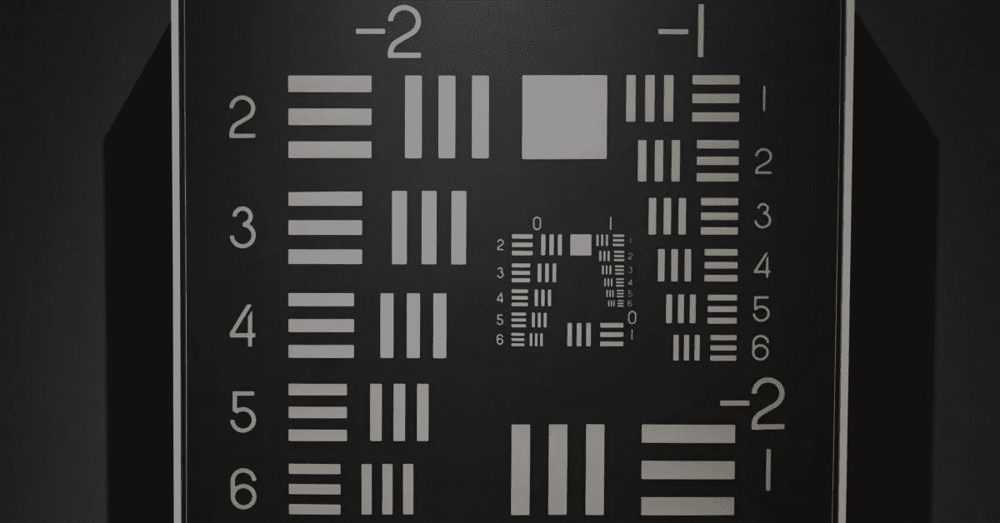
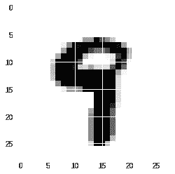
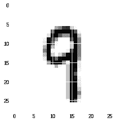
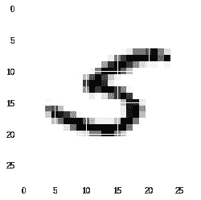

# 图像处理简介:构建一个简单的数字识别器

> 原文：<https://towardsdatascience.com/introduction-to-image-processing-building-a-simple-digit-recognizer-b0c74d70d85d?source=collection_archive---------11----------------------->



Photo by [Toa Heftiba](https://unsplash.com/photos/MK4QKBqG_lA?utm_source=unsplash&utm_medium=referral&utm_content=creditCopyText) on [Unsplash](https://unsplash.com/search/photos/numbers?utm_source=unsplash&utm_medium=referral&utm_content=creditCopyText)

## 它必须从某个地方开始

数字识别并不是什么困难或高级的事情。有点像“你好，世界！”程序——不是很酷，但是你可以从这里开始。所以我决定分享我的工作，同时更新知识——这是我很久以前玩的图像。

# 数据导入和探索

我们从导入所有必需的包开始。

```
import pandas as pd
import random
import numpy as np
import matplotlib.pyplot as plt
from tqdm import tqdm%matplotlib inline
```

包含 2 万个手写数字的 MNIST 数据集是这项任务的“Hello World”数据集，它已经预加载在 Colaboratory(基于云的 Python 笔记本，奇妙的东西 BTW)中，所以我们将使用它。这里不需要发明轮子。

```
# load data
df = pd.read_csv('sample_data/mnist_train_small.csv', header=None)df.head()Out[7]: 
   0    1    2    3    4    5    6   ...   778  779  780  781  782  
0    6    0    0    0    0    0    0 ...     0    0    0    0    0    
1    5    0    0    0    0    0    0 ...     0    0    0    0    0    
2    7    0    0    0    0    0    0 ...     0    0    0    0    0    
3    9    0    0    0    0    0    0 ...     0    0    0    0    0    
4    5    0    0    0    0    0    0 ...     0    0    0    0    0 
len(df)
Out[9]: 20000
```

正如我们从 head()方法中看到的，数据集中的第一列包含标签和图像的其余像素 28×28——这就是为什么我们多了 784 列。每次修改后检查数据集的长度也是有用的，以确保我们做的一切都是正确的。

接下来，让我们可视化我们的像素，并观看我们的图像。每次运行下面的代码时，我们都使用 randint()来选择随机图像。此外，我们必须将我们的像素转换为 numpy 数组(现在它的类型是 Series ),并将其调整为 28×28 的大小，以便能够绘制它们。

```
ix = random.randint(0, len(df)-1)
label, pixels = df.loc[ix][0], df.loc[ix][1:]
img = np.array(pixels).reshape((28,28))
print('label: ' + str(label))
plt.imshow(img)label: 9
<matplotlib.image.AxesImage at 0x7ff9ac6fda20>
```



# 数据预处理

现在，为了让我们的生活稍微轻松一点，我们将把我们的数据帧转换成只有两列——标签和图像，其中图像是一个像素的 *numpy* 数组。此外，我们将减少数据帧的大小，以加快计算速度(首先，我们要确保一切正常，然后我们开始玩模型)

```
# transforming df for easier manipulation
labels, imgs = [], []
for index, row in df.iterrows():
    label, pixels = row[0], row[1:]
    img = np.array(pixels)
    labels.append(label)
    imgs.append(img)

df2 = pd.DataFrame({'label': labels, 'img': imgs})
df2 = df2[:1000] # checking images using new df structure
ix = random.randint(0, len(df2)-1)
img = df2.loc[ix].img.reshape((28,28))
label = df2.loc[ix].label
print('label: ' + str(label))
plt.imshow(img)label: 9
<matplotlib.image.AxesImage at 0x7ff9a9b997f0>
```



当我们准备好数据后，我们想把它分成两个数据集:一个用来训练我们的模型，另一个用来测试它的性能。最好的方法是使用 *sklearn* 。我们设置了一个 *test_size=0.2* ，这是该操作的标准值(通常对于测试，我们会留下 20–30%的数据)，这意味着对于训练，仍然是 80%。设置 *shuffle=True* 也是一个很好的做法，因为一些数据集可能有有序的数据，所以模型将学习识别 0 和 1，但不会知道例如 8 的存在。

```
from sklearn.model_selection import train_test_split
train_df, test_df = train_test_split(df2, test_size=0.2, shuffle=True)print(len(train_df), len(test_df))
800 200train_df.head()Out[12]: 
     label                                                img
296      9  [0, 0, 0, 0, 0, 0, 0, 0, 0, 0, 0, 0, 0, 0, 0, ...
488      2  [0, 0, 0, 0, 0, 0, 0, 0, 0, 0, 0, 0, 0, 0, 0, ...
124      7  [0, 0, 0, 0, 0, 0, 0, 0, 0, 0, 0, 0, 0, 0, 0, ...
862      7  [0, 0, 0, 0, 0, 0, 0, 0, 0, 0, 0, 0, 0, 0, 0, ...
421      9  [0, 0, 0, 0, 0, 0, 0, 0, 0, 0, 0, 0, 0, 0, 0, ...
```

# 建立模型

我们检查了数据集的长度和头部——都很好，我们可以开始构建我们的模型了。为此，我们需要安装 *pytorch* 。如果我们转到“代码片段”并开始在那里键入*“pyt”*，它将显示“安装[pytorch]”，因此我们可以将其插入到我们的笔记本中。如果有人已经安装了 *pytorch* ，可以跳过这一步。

```
# http://pytorch.org/
from os.path import exists
from wheel.pep425tags import get_abbr_impl, get_impl_ver, get_abi_tag
platform = '{}{}-{}'.format(get_abbr_impl(), get_impl_ver(), get_abi_tag())
cuda_output = !ldconfig -p|grep cudart.so|sed -e 's/.*\.\([0-9]*\)\.\([0-9]*\)$/cu\1\2/'
accelerator = cuda_output[0] if exists('/dev/nvidia0') else 'cpu'

!pip install -q http://download.pytorch.org/whl/{accelerator}/torch-0.4.1-{platform}-linux_x86_64.whl torchvision# importing torch and setting up the device
import torch
device = torch.device("cuda:0" if torch.cuda.is_available() else "cpu")print(device)
```

接下来，我们必须将数据转换成 pytorch 数据集。`torch.utils.data.Dataset`是表示数据集的抽象类。自定义数据集应继承数据集并重写以下方法:

*   `__len__`以便`len(dataset)`返回数据集的大小。
*   `__getitem__`支持索引，以便`dataset[i]`可用于获取其样本

```
# create torch dataset
from torch.utils.data import Dataset

class MNISTDataset(Dataset):
    def __init__(self, imgs, labels):
        super(MNISTDataset, self).__init__()
        self.imgs = imgs
        self.labels = labels

    def __len__(self):
        return len(self.imgs)

    def __getitem__(self, ix):
        img = self.imgs[ix]
        label = self.labels[ix]
        return torch.from_numpy(img).float(), labeldataset = {
    'train': MNISTDataset(train_df.img.values, train_df.label.values),
    'test': MNISTDataset(test_df.img.values, test_df.label.values)
} 

len(dataset['train'])
800# again checking image, now based on torch dataset
ix = random.randint(0, len(dataset['train'])-1)
img, label = dataset['train'][ix]
print(img.shape, img.dtype)
print(label)
plt.imshow(img.reshape((28,28)))torch.Size([784]) torch.float32
6
<matplotlib.image.AxesImage at 0x7ff99eeeed30>
```


pytorch 的美妙之处在于它定义模型的简单性。我们用输入和输出定义我们的层，我们添加一些批量标准化来改进我们的模型(这是一种向神经网络中的任何层提供零均值/单位方差输入的技术)和激活函数，在这种情况下 ReLU。

对于第一个输入，我们有 784 个神经元(每个像素一个神经元)和 512 个输出(这个几乎是随机的——我尝试了几个不同的值，这个表现得很好，所以我离开了)。下一层将有 512 个输入(*input _ layer[n+1]= = output _ layer[n]*)和 256 个输出，接下来有 256 个输入和 128 个输出，最后一层有 128 个输入和 10 个输出(每个神经元代表 10 个数字中的一个)

```
# create model
import torch.nn as nn

def block(in_f, out_f):
  return nn.Sequential(
      nn.Linear(in_f, out_f),
      nn.BatchNorm1d(out_f),
      nn.ReLU(inplace=True),
      #nn.Dropout(),
  )

model = nn.Sequential(
  block(784,512),
  block(512,256),
  block(256,128),
  nn.Linear(128, 10)
)

model.to(device)
```

现在我们需要为我们的模型创建一些额外的参数:

*   标准—计算损失函数，在我们的例子中是 [CrossEntropyLoss](https://pytorch.org/docs/stable/nn.html#torch.nn.CrossEntropyLoss)
*   优化器—设置学习率
*   调度器——如果模型没有随时间改进，更新学习率(非常强大的技术，允许我们随时调整系统)
*   data loader——py torch 的类，为数据集提供单进程或多进程迭代器

```
from torch.utils.data import DataLoader
import torch.optim as optim
from torch.optim.lr_scheduler import StepLR, ReduceLROnPlateau

criterion = nn.CrossEntropyLoss()
optimizer = optim.Adam(model.parameters(), lr=0.1)
scheduler = ReduceLROnPlateau(optimizer, 'max', factor=0.1, patience=3, min_lr=0.0001, verbose=True)

dataloader = {
    'train': DataLoader(dataset['train'], batch_size=32, shuffle=True, num_workers=4),
    'test': DataLoader(dataset['test'], batch_size=32, shuffle=False, num_workers=4),
}
```

# 训练和评估模型

有了这些，我们就可以开始训练和评估我们的模型了。虽然我们定义了 100 个时期，但是如果模型没有随着时间的推移而改进，那么停止循环也是有用的。这里我们已经设置了`early_stop = 10`，所以如果模型连续 10 个纪元没有改变，我们将停止训练过程。

训练过程:我们通过将每个图像和标签分配给先前定义的设备来迭代我们的训练数据，我们给我们的模型一个图像，它试图找到正确的类(`preds`)，我们清除所有梯度(`zero_grad()`)并计算损失函数和梯度(`loss`)，执行优化步骤并将新值附加到`total_loss`数组。

测试过程:我们迭代测试数据，进行预测，计算模型的损失和准确性。在`torch.max()`中，我们寻找最大值的索引，因为它将代表一个数字的类别，在我们的例子中，它将匹配标签。然后，通过比较标签和预测，我们计算我们的模型的准确性。

每当我们找到最佳模型时，我们就保存它，如果我们点击`early_stop`，我们就退出并报告结果。通常它不需要所有的 100 个纪元。

```
# train
best_acc, stop, early_stop = 0, 0, 10
for e in range(100):

    model.train()
    total_loss = []
    for imgs, labels in tqdm(dataloader['train']):
        imgs, labels = imgs.to(device), labels.to(device)
        preds = model(imgs)
        optimizer.zero_grad()
        loss = criterion(preds, labels)
        loss.backward()
        optimizer.step()
        total_loss.append(loss.data)

    model.eval()
    val_loss, acc = [], 0.
    with torch.no_grad():
        for imgs, labels in tqdm(dataloader['test']):
            imgs, labels = imgs.to(device), labels.to(device)
            preds = model(imgs)
            loss = criterion(preds, labels)
            val_loss.append(loss.data)
            _, preds = torch.max(preds, 1)
            acc += (preds == labels).sum().item()

    acc /= len(dataset['test'])
    if acc > best_acc:
        print('\n Best model ! saved.')
        torch.save(model.state_dict(), 'best_model.pt')
        best_acc = acc
        stop = -1

    stop += 1
    if stop >= early_stop:
        break

    scheduler.step(acc)

    print('\n Epoch {}, Training loss: {:4f}, Val loss: {:4f}, Val acc: {:4f}'.format(
        e + 1, np.array(total_loss).mean(), np.array(val_loss).mean(), acc))

print('\n Best model with acc: {}'.format(best_acc)) Out[n]:
Epoch 30, Training loss: 0.015759, Val loss: 0.397337, Val acc: 0.910000
100%|██████████| 25/25 [00:01<00:00, 22.10it/s]
100%|██████████| 7/7 [00:00<00:00, 73.41it/s]Best model with acc: 0.91
```

当我们找到我们的最佳模型并保存它时，我们可以通过向它输入新数据来玩它，并观察它的表现。

```
# test
model.load_state_dict(torch.load('best_model.pt'))
model.to(device)
model.eval()

ix = random.randint(0, len(dataset['test'])-1)
img, label = dataset['test'][ix]
pred = model(img.unsqueeze(0).to(device)).cpu()
pred_label = torch.argmax(pred)
print('Ground Truth: {}, Prediction: {}'.format(label, pred_label))
plt.imshow(img.reshape((28,28)))Ground Truth: 5, Prediction: 5
<matplotlib.image.AxesImage at 0x7ff9a9ced748>
```



就像一开始说的，这是一个图像识别的“Hello World ”,我们没有使用卷积神经网络，它通常用于这样的任务，只是入门级别的理解流程。我通常不处理图像，所以如果有错误，请告诉我。对我来说，这是一次很好的复习，希望对其他人也有帮助。

你可以在 [GitHub](https://github.com/slehkyi/notebooks-for-articles/blob/master/digit-recognizer-colab.ipynb) 上找到 Python 笔记本的代码

*原载于 2018 年 11 月 14 日*[*【sergilehkyi.com】*](http://sergilehkyi.com/introduction-to-image-recognition-building-a-simple-digit-detector/)*。*