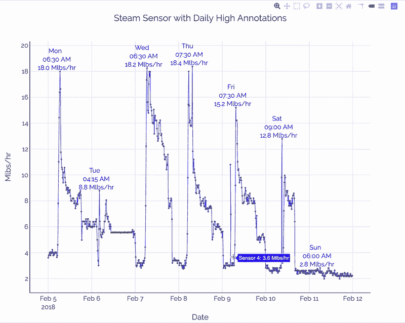
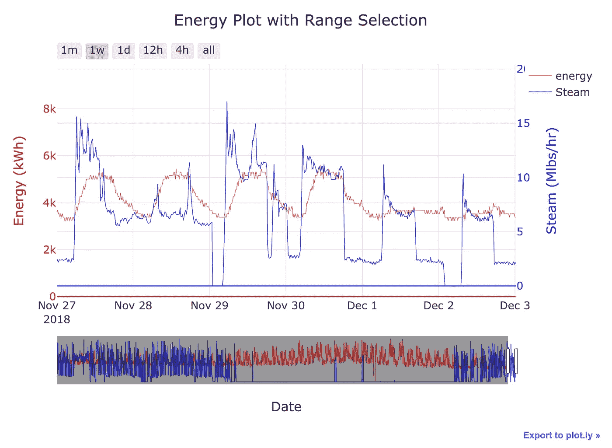
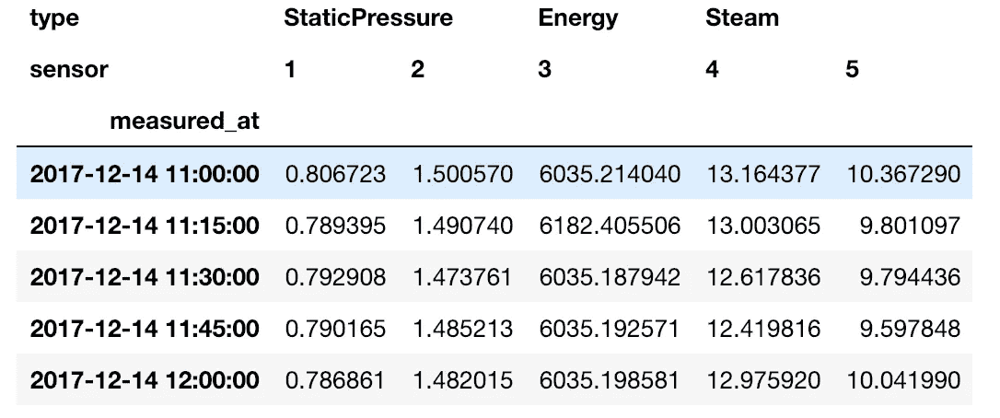
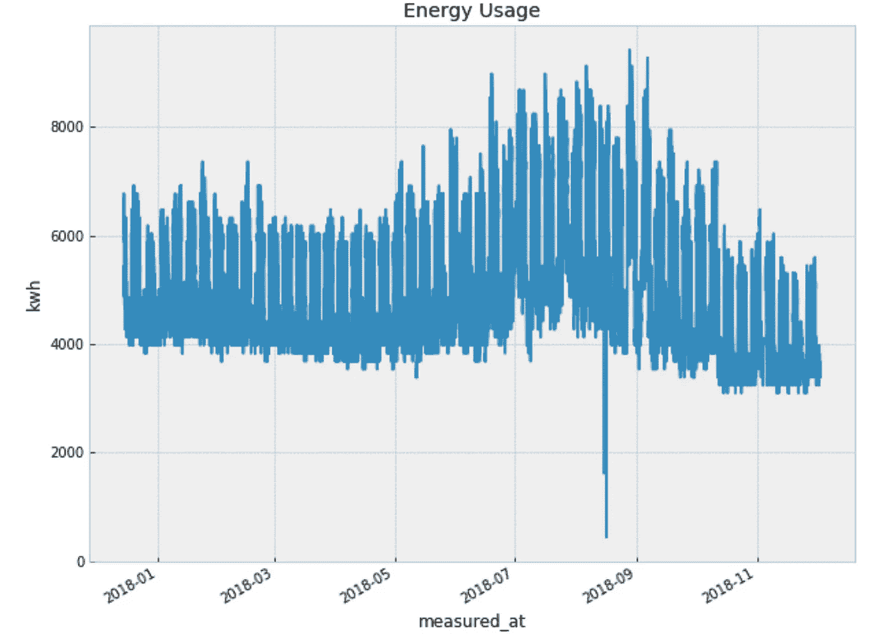
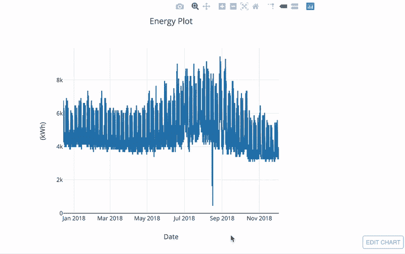
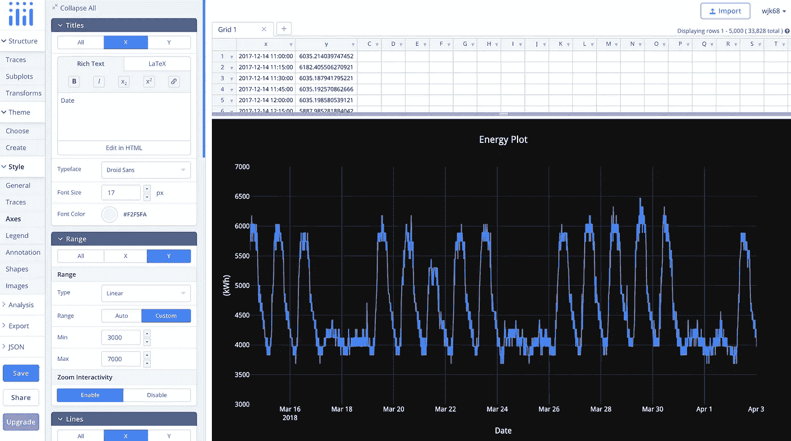
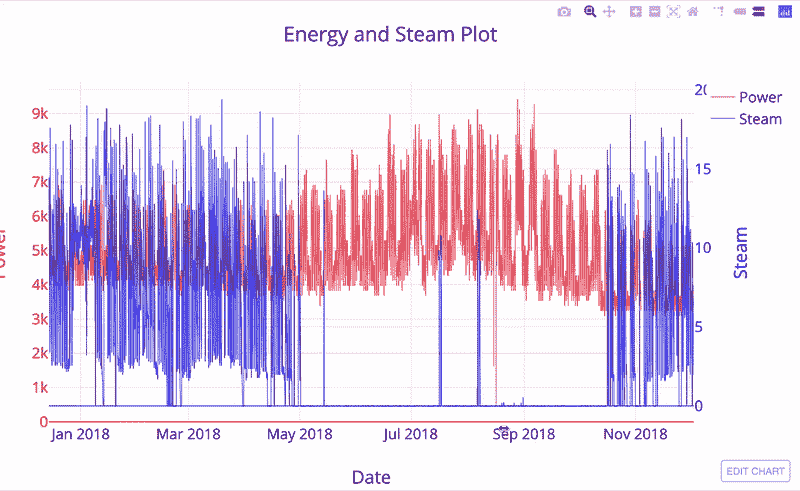
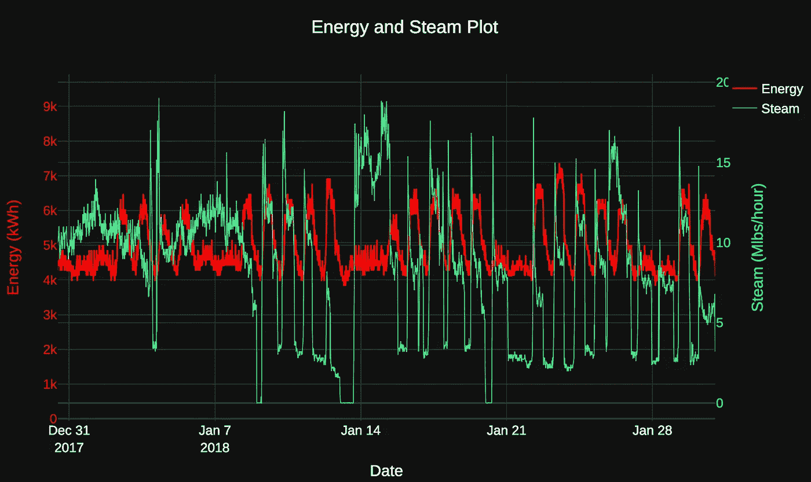
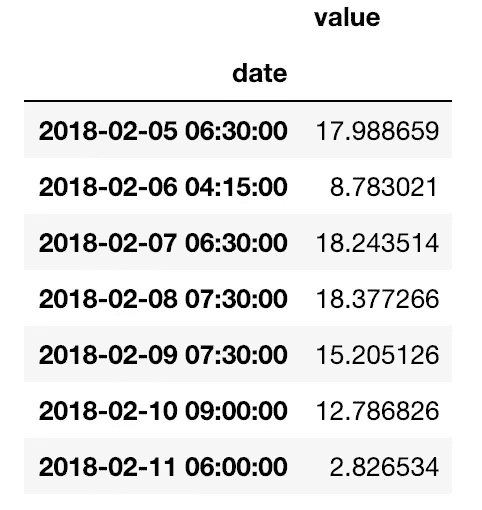
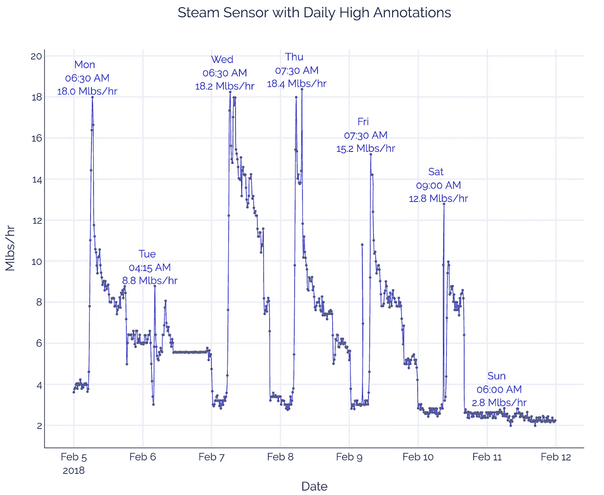

# Python 中使用 Plotly 的交互式时间序列可视化简介

> 原文：<https://towardsdatascience.com/introduction-to-interactive-time-series-visualizations-with-plotly-in-python-d3219eb7a7af?source=collection_archive---------3----------------------->


([Source](https://www.pexels.com/photo/scenic-view-of-agricultural-field-against-sky-during-sunset-325944/))

## 使用强大的 plotly 可视化库启动和运行

总有一天，即使是最喜爱的工具，也有必要放弃。Matplotlib 实现了快速创建简单图表的目的，但我对定制图表或做一些看似简单的事情(如让 x 轴正确显示日期)所需的代码量感到沮丧。

有一段时间，我一直在寻找一个替代方案——不是完全的替代方案，因为 Matplotlib 对探索仍然有用——理想情况下，一个具有交互元素的库，让我专注于我想展示的内容，而不是陷入如何展示它的细节中。进入 [plotly](https://plot.ly/#/) ，一个声明式可视化工具，带有一个[易于使用的 Python 库](https://plot.ly/python/)用于交互式图形。

在本文中，我们将通过创建基本的时间序列可视化来介绍 plotly 库。这些图表虽然很容易制作，但将是完全交互式的图表，随时可供展示。在这个过程中，我们将学习该库的基本思想，这将使我们能够快速构建令人惊叹的可视化效果。如果你一直在寻找 matplotlib 的替代品，那么正如我们将看到的，plotly 是一个有效的选择。



Interactive Visualization made with a few lines of Plotly code

本文的完整代码在 GitHub 上有[。您还可以在 nbviewer](https://github.com/WillKoehrsen/Data-Analysis/blob/master/plotly/plotly-time-series.ipynb) 上查看带有[交互元素的笔记本。本文中使用的数据是我在 Cortex Building Intelligence 工作时获得的匿名建筑能源时间序列数据。如果你想用你的网络开发技能来帮助建筑节能，那么](http://nbviewer.jupyter.org/github/WillKoehrsen/Data-Analysis/blob/master/plotly/plotly-time-series.ipynb)[联系我们，因为我们正在招聘](https://angel.co/cortex-2/jobs/383105-software-engineer)！

# Plotly 简介

[Plotly](https://plot.ly/) 是一家制作可视化工具的公司，包括一个 [Python API 库](https://plot.ly/python/)。(Plotly 还制作了 [Dash](https://plot.ly/products/dash/) ，一个用 Python 代码构建交互式网络应用的框架)。对于本文，我们将坚持在 Jupyter 笔记本中使用`plotly` Python 库，并在[在线 plotly 编辑器中润色图像。当我们制作一个 plotly 图形时，默认情况下会在网上发布，这使得分享可视化变得容易。](https://plot.ly/create/#/)

你需要创建一个免费的 plotly 帐户，给你 25 个公共图表和 1 个私人图表。一旦达到配额，您必须删除一些旧图表来制作新图表(或者您可以在离线模式下运行，图像只出现在笔记本中)。安装 plotly ( `pip install plotly`)并运行以下命令来验证库，替换用户名和 API 密钥:

```
import plotly# Authenticate with your account
plotly.tools.set_credentials_file(username='########',                                              
                                  api_key='******')
```

标准 plotly 导入以及离线运行的设置如下:

```
import plotly.plotly as py
import plotly.graph_objs as go# Offline mode
from plotly.offline import init_notebook_mode, iplot
init_notebook_mode(connected=True)
```

当我们在离线模式下制作图时，我们会在图像的右下角获得一个链接，以导出到 plotly 在线编辑器进行润色和共享。



Example of image in the notebook with link to edit in plotly.

## Plotly 的优势

plotly(Python 库)使用[声明式编程](https://en.wikipedia.org/wiki/Declarative_programming)，这意味着我们编写代码描述*我们想要做什么*而不是*如何做*。我们提供基本框架和最终目标，并让 plotly 指出实现细节。在实践中，这意味着构建一个形象花费的精力更少，使我们能够专注于呈现什么以及如何解释它。

如果你不相信这种方法的好处，那么去看看[几十个例子](https://plot.ly/python/)，比如下面的[用 50 行代码做的。](https://plot.ly/python/bubble-maps/)


US City Populations ([Source](https://plot.ly/python/bubble-maps/))

## 时间序列数据

对于这个项目，我们将使用来自我在[Cortex Building Intelligence](https://cortexintel.com)工作的[真实世界建筑数据](https://github.com/WillKoehrsen/Data-Analysis/blob/master/plotly/building_one.csv)(数据已经匿名)。由于季节性、每日和每周模式以及天气条件的剧烈影响，建筑能源数据对时间序列分析提出了有趣的挑战。有效地可视化这些数据可以帮助我们了解建筑的反应以及哪里有节能的机会。

(注意，我交替使用术语“功率”和“能量”，尽管[能量是做功的能力，而功率是能量消耗的*比率*](https://cleantechnica.com/2015/02/02/power-vs-energy-explanation/)。从技术上讲，功率以千瓦(KW)为单位，电能以千瓦时(KWh)为单位。你知道的越多！)

我们的数据在数据帧中，在列上有一个*多索引，用于跟踪传感器类型和传感器编号。该索引是一个日期时间:*



Time Series Building Data

使用多索引数据框架是完全不同的另一篇文章(这里有[文档](https://pandas.pydata.org/pandas-docs/stable/advanced.html))，但是我们不会做任何太复杂的事情。要访问单个列并绘制它，我们可以执行以下操作。

```
import pandas as pd # Read in data with two headers
df = pd.read_csv('building_one.csv', header=[0,1], index_col=0)# Extract energy series from multi-index
energy_series = df.loc[:, ('Energy', '3')]# Plot
energy_series.plot()
```

默认绘图(由 matplotlib 提供)如下所示:



这并不可怕，尤其是对于一行代码来说。但是，没有交互性，视觉上也不够吸引人。是时候进入剧情了。

## 基本时间序列图

就像散景一样，制作一个基本的情节需要在 plotly 中做更多的工作，但作为回报，我们得到了更多，比如内置的交互性。

我们从一个数据对象开始构建一个图。即使我们想要一个折线图，我们也使用`go.Scatter()`。Plotly 足够聪明，如果我们超过 20 个点，它会自动给我们一个线图！对于最基本的图形，我们只需要 x 和 y 值:

```
energy_data = go.Scatter(x=energy_series.index,
                         y=energy_series.values)
```

然后，我们使用默认设置和一些标题创建一个布局:

```
layout = go.Layout(title='Energy Plot', xaxis=dict(title='Date'),
                   yaxis=dict(title='(kWh)'))
```

(我们使用与`{'x': 'value'}`相同的`dict(x = 'value')`语法)。

最后，我们可以创建我们的图形，并在笔记本中交互显示它:

```
fig = go.Figure(data=[energy_data], layout=layout)
py.iplot(fig, sharing='public')
```



Basic time series plot in plotly

马上，我们有了一个完全交互式的图表。我们可以探索模式，检查单个点，并将绘图下载为图像。请注意，我们甚至不需要指定轴的类型或范围，plotly 为我们做了完全正确的事情。我们甚至不需要额外的工作就可以得到格式良好的悬停消息。

此外，该图会自动导出到 plotly，这意味着我们可以与任何人共享该图表。我们还可以单击“编辑图表”,在在线编辑器中打开它，在一个易于使用的界面中进行我们想要的任何更改:



Online editor interface

如果您在在线编辑器中编辑图表，那么您可以为您创建的精确图表和样式自动生成 Python 代码！

# 改善情节

即使是 Plotly 中一个基本的时间序列图也令人印象深刻，但我们可以用多几行代码来改进它。例如，假设我们想要比较建筑物的蒸汽使用量和能源。这两个量有非常不同的单位，所以如果我们把它们放在同样的尺度上，就不会有结果。在这种情况下，我们必须使用第二个 y 轴。在 matplotlib 中，这需要大量的格式化工作，但是在 Plotly 中我们可以很容易地做到。

第一步是添加另一个数据源，但是这次指定`yaxis='y2'`。

```
# Get the steam data
steam_series = df.loc[:, ("Steam", "4")]# Create the steam data object
steam_data = go.Scatter(x=steam_series.index,
                        y=steam_series.values,
                        # Specify axis
                        yaxis='y2')
```

(我们还添加了一些其他参数来改进样式，这可以在笔记本[中看到)。](http://nbviewer.jupyter.org/github/WillKoehrsen/Data-Analysis/blob/master/plotly/plotly-time-series.ipynb)

然后，当我们创建布局时，我们需要添加第二个 y 轴。

```
layout = go.Layout(height=600, width=800,
                   title='Energy and Steam Plot',
                   # Same x and first y
                   xaxis=dict(title='Date'),
                   yaxis=dict(title='Energy', color='red'),
                   # Add a second yaxis to the right of the plot
                   yaxis2=dict(title='Steam', color='blue',
                               overlaying='y', side='right')
                   )fig = go.Figure(data=[energy_data, steam_data], layout=layout)
py.iplot(fig, sharing='public')
```

当我们显示图表时，我们在同一张图表上得到蒸汽和能量，轴的比例适当。



通过一点在线编辑，我们得到了一个成品:



Finished plot of energy and steam.

# 绘图注释

绘图注释用于调出可视化的各个方面以引起注意。例如，我们可以在查看一周的数据时，突出显示每天的高蒸汽消耗量。首先，我们将蒸汽传感器划分为一周(称为`steam_series_four`)并创建一个格式化的数据对象:

```
# Data object
steam_data_four = go.Scatter(
                     x=steam_series_four.index,
                     y=steam_series_four.values,
                     line=dict(color='blue', width=1.1),
                     opacity=0.8,
                     name='Steam: Sensor 4',
                     hoverinfo = 'text',
                     text = [f'Sensor 4: {x:.1f} Mlbs/hr' for x in
                             steam_series_four.values])
```

然后，我们将找到该传感器的每日最大值(代码见笔记本):



为了构建注释，我们将使用 list comprehension 为每个日最大值添加一个注释(`four_highs`就是上面的系列)。每个注释需要一个位置(`x`、`y`和`text`):

```
# Create a list of annotations
four_annotations = [dict(x = date, y = value, 
           xref = 'x', yref = 'y', 
           font=dict(color = 'blue'),
           text = f'{format_date(date)}<br> {value[0]:.1f} Mlbs/hr')
                    for date, value in zip(four_highs.index, 
                                           four_highs.values)]four_annotations[:1]**{'x': Timestamp('2018-02-05 06:30:00'),
  'y': 17.98865890412107,
  'xref': 'x',
  'yref': 'y',
  'font': {'color': 'blue'},
  'text': 'Mon <br> 06:30 AM<br> 18.0 Mlbs/hr'}}**
```

(文本中的`<br>`为 html，由 plotly 读取并显示)。

我们可以修改注释的其他[参数，但是我们会让 plotly 处理细节。向绘图添加注释就像将它们传递给`layout`一样简单:](https://plot.ly/python/text-and-annotations/)

```
layout = go.Layout(height=800, width=1000, 
                   title='Steam Sensor with Daily High Annotations',
                   annotations=four_annotations)
```

在在线编辑器中稍作后期处理后，我们最终的剧情是:



Final plot with steam sensor annotations

额外的注释可以通过显示蒸汽使用的每日峰值出现的时间，让我们深入了解我们的数据。反过来，这将允许我们向建筑工程师提出蒸汽启动时间建议。

> 关于 plotly 最好的部分是，我们可以快速获得一个基本的绘图，并通过多一点代码来扩展功能。当我们想要添加更多的功能时，对基本情节的前期投资是有回报的。

## 结论

我们只是触及了我们[在《T4》中能做的事情的表面。我将在以后的文章中探索其中的一些功能，而](https://moderndata.plot.ly/15-python-and-r-charts-with-interactive-controls-buttons-dropdowns-and-sliders/)[参考笔记本](https://github.com/WillKoehrsen/Data-Analysis/blob/master/plotly/plotly-time-series.ipynb)了解如何添加更多的交互性，比如选择菜单。最终，我们可以用 Python 代码在 Dash 中构建可部署的 [web 应用程序。目前，我们知道如何在 plotly 中创建基本但有效的时间序列可视化。](https://dash.plot.ly/deployment)

> 这些图表为我们的小代码投资提供了很多，通过修改和在线分享这些图表，我们可以构建一个完整的、像样的产品。

尽管我并不是要放弃 matplotlib——单线条形图和折线图很难被击败——但很明显，将 matplotlib 用于自定义图表并不是一个好的时间投资。相反，我们可以使用其他库，包括 plotly，来有效地构建全功能的交互式可视化。在图表中查看数据是数据科学的乐趣之一，但编写代码通常是痛苦的。幸运的是，使用 plotly，Python 中的可视化非常直观，甚至可以愉快地创建和实现图形的目标:直观地理解我们的数据。

一如既往，我欢迎反馈和建设性的批评。可以通过 Twitter [@koehrsen_will](http://twitter.com/@koehrsen_will) 或者通过我的个人网站 [willk.online](https://willk.online) 找到我。