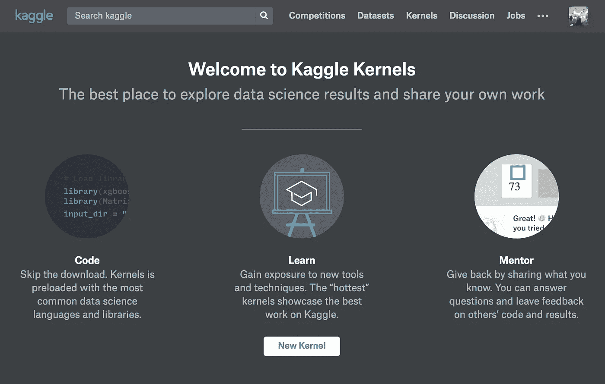
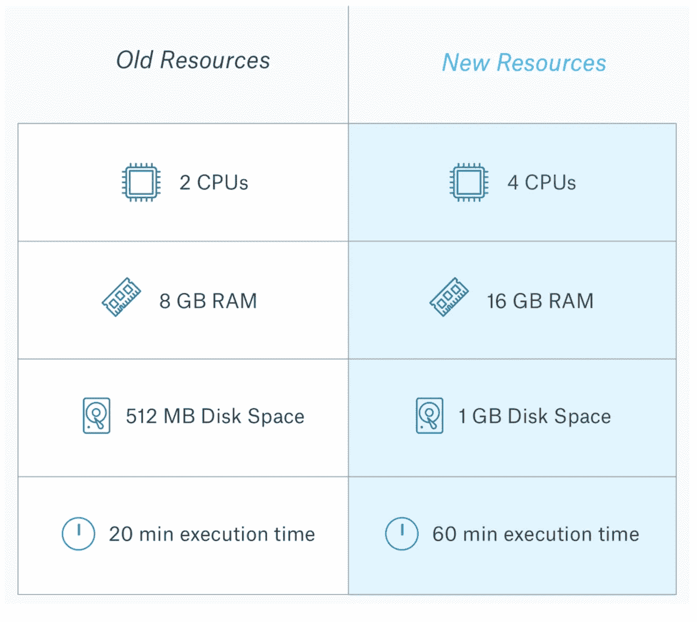
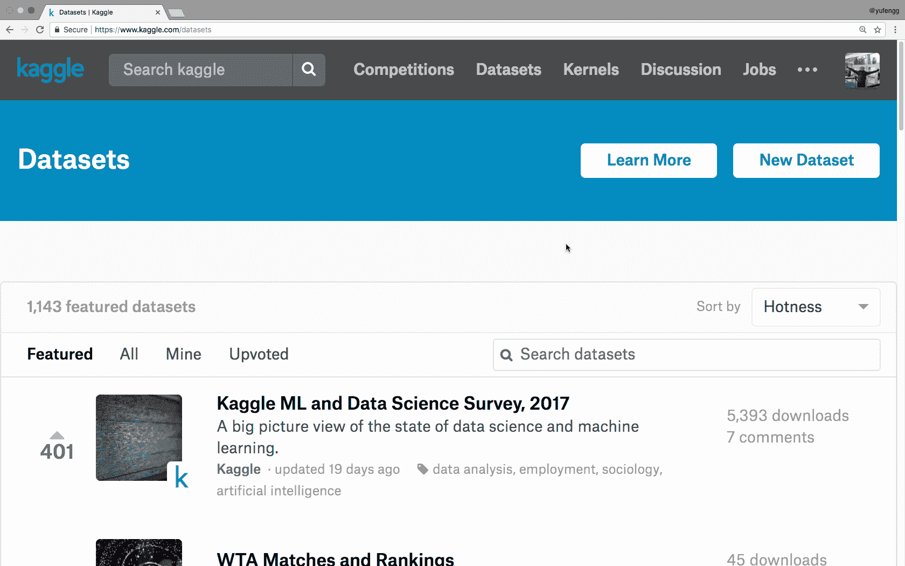
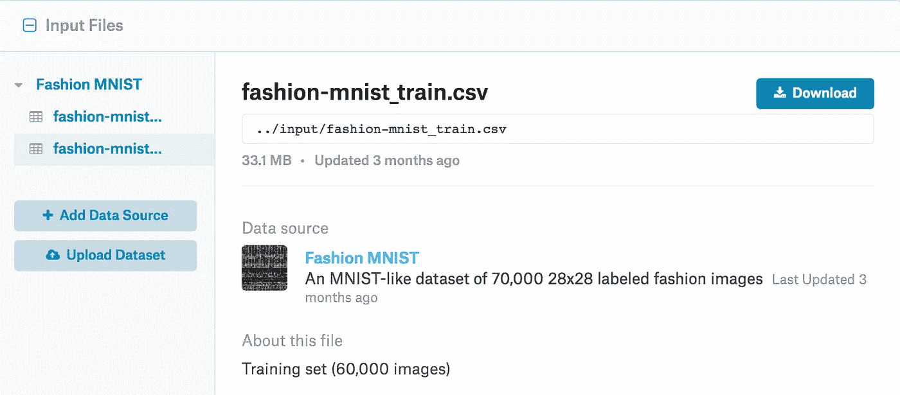
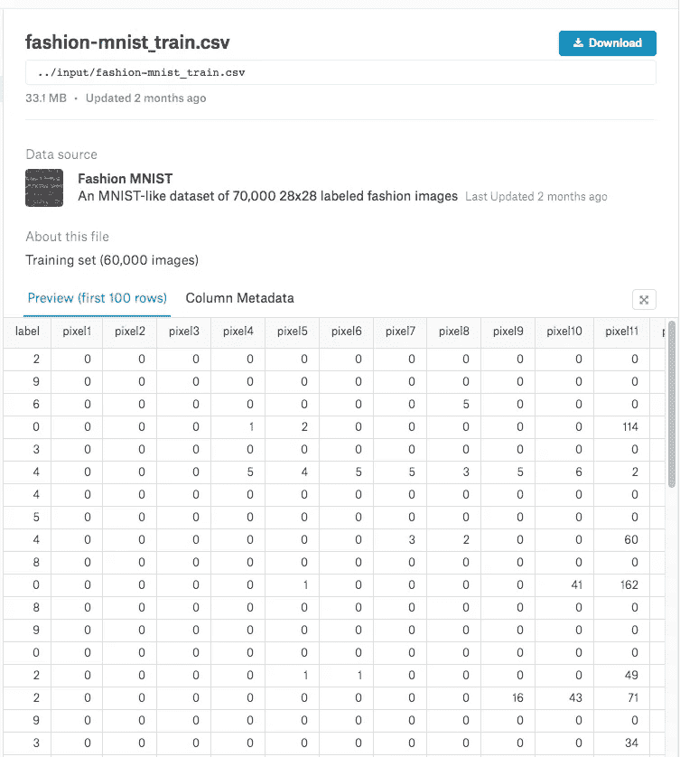
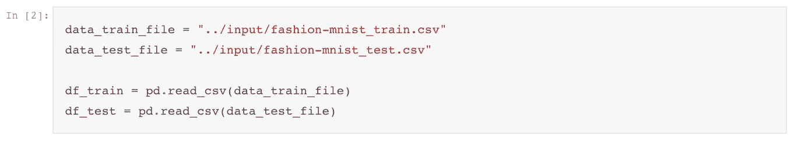
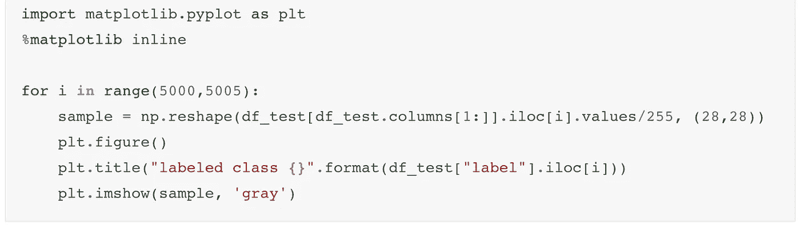
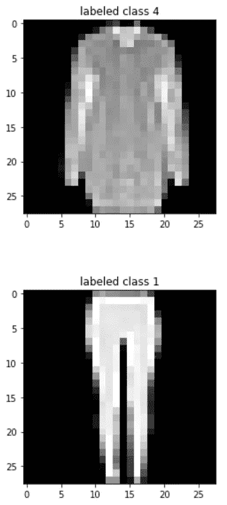
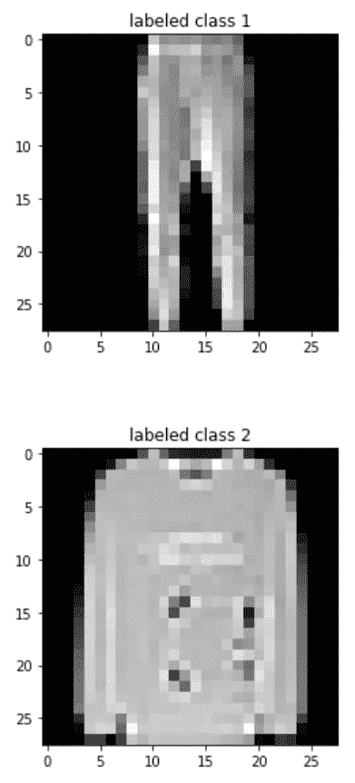

# Kaggle 内核简介

> 原文：<https://towardsdatascience.com/introduction-to-kaggle-kernels-2ad754ebf77?source=collection_archive---------1----------------------->

在《人工智能历险记》的这一集里，你会发现什么是 Kaggle 内核，以及如何开始使用它们。虽然这一集没有爆米花，但我可以保证 Kaggle 内核正在爆开！

Kaggle 是一个进行和分享数据科学的平台。你可能听说过他们的一些比赛，经常有现金奖励。这也是实践数据科学和向社区学习的好地方。

## 什么是 Kaggle 内核？

Kaggle *内核*本质上是浏览器中的 Jupyter 笔记本，可以在你眼前运行，全部免费！让我再说一遍，以防你错过，因为这太神奇了:

> Kaggle Kernels 是一个在浏览器中运行 Jupyter 笔记本的免费平台！

这意味着您可以省去设置本地环境的麻烦，并且在世界上任何有互联网连接的地方，您的浏览器中都有一个 Jupyter 笔记本环境。

不仅如此，笔记本电脑的处理能力来自云中的服务器，而不是您的本地机器，因此您可以进行大量的**数据科学和机器学习**而不会耗尽笔记本电脑的电池！

[http://blog.kaggle.com/2017/09/21/product-launch-amped-up-kernels-resources-code-tips-hidden-cells/](http://blog.kaggle.com/2017/09/21/product-launch-amped-up-kernels-resources-code-tips-hidden-cells/)

Kaggle [最近升级了](http://blog.kaggle.com/2017/09/21/product-launch-amped-up-kernels-resources-code-tips-hidden-cells/)所有的内核，以拥有更强的计算能力和内存，并将运行一个进程的时间延长到 60 分钟！

好了，我已经滔滔不绝地说了够了。让我们看看它实际上是什么样子。

# 运行中的内核

一旦我们在[kaggle.com](http://kaggle.com)创建了一个账户，我们就可以选择一个数据集来玩，并且只需点击几下鼠标就可以运行一个新的内核或笔记本。

我们在中开始的数据集是预加载在该内核的环境中的，因此不需要将数据集推送到机器中，并等待大型数据集通过网络进行复制。

当然，如果您愿意，您仍然可以将额外的文件(最多 1GB)加载到内核中。

在我们的例子中，我们将继续使用`fashion-mnist`数据集。这是一个包含 10 类服装和配饰的数据集，比如裤子、包、高跟鞋、衬衫等等。有 50k 训练样本，10k 评估样本。让我们探索一下我们的 [Kaggle 内核中的数据集。](https://www.kaggle.com/yufengg/fashion-mnist/notebook)

查看数据集，它以 csv 文件的形式在 Kaggle 上提供。原始数据是 28x28 像素的灰度图像，它们在 csv 文件中被展平为 784 个不同的列。该文件还包含一个表示时尚项目的索引(从 0 到 9)的列。

## 数据加载

由于数据集已经在环境中，并且 pandas 已经加载，让我们用它来读取这些。csv 文件转换成`pandas`数据帧，一个用于训练，一个用于预测。

Notice that the data is stored in the ‘input’ directory, one level up.

如果你想跟随，我的 Kaggle 内核在这里:[https://www.kaggle.com/yufengg/fashion-mnist/](https://www.kaggle.com/yufengg/fashion-mnist/)

 [## 时尚-MNIST

### Kaggle 内核使用来自时尚 MNIST 的数据

www.kaggle.com](https://www.kaggle.com/yufengg/fashion-mnist/) 

## 数据探索

既然我们已经将数据加载到 DataFrame 中，我们就可以利用它带来的所有特性，这些特性我们在前面的章节中已经介绍过了。我们将使用`head()`显示前 5 行，并运行`describe()`来了解数据集结构的更多信息。

Looks like the dataset is shuffled already

## 数据可视化

此外，最好将这些图像可视化，这样它们对我们来说就不仅仅是一排排的数字了。让我们用`matplotlib`来看看这些图片是什么样子的。

这里我们将使用`matplotlib.pyplot`库，通常导入为`plt`，将像素值数组显示为图像。

我们可以看到，这些图像虽然模糊，但仍然可以识别出它们所声称的服装和配饰。

Kaggle Kernels 允许我们在一个完全交互式的笔记本环境中工作，几乎不需要任何设置，我想强调的是，我们不需要进行任何 python 环境配置或安装库，这真的很酷！

你可以在这里看到完整的内核:[https://www.kaggle.com/yufengg/fashion-mnist/](https://www.kaggle.com/yufengg/fashion-mnist/)

 [## 时尚-MNIST

### Kaggle 内核使用来自时尚 MNIST 的数据

www.kaggle.com](https://www.kaggle.com/yufengg/fashion-mnist/) 

你已经使用 Kaggle 内核了吗？你最喜欢的功能、技巧和诀窍是什么？

感谢阅读本集[云 AI 冒险](https://goo.gl/UC5usG)。如果你喜欢这个系列，请为这篇文章鼓掌让我知道。如果你想要更多的机器学习动作，一定要关注 Medium 上的[me](https://medium.com/@yufengg)或订阅 YouTube 频道来观看未来的剧集。更多剧集即将推出！