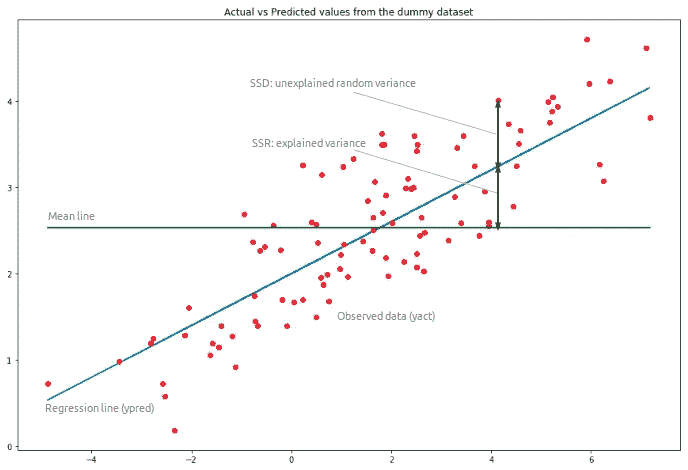
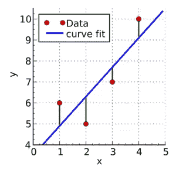
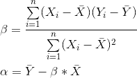
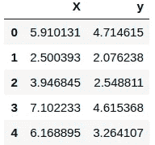
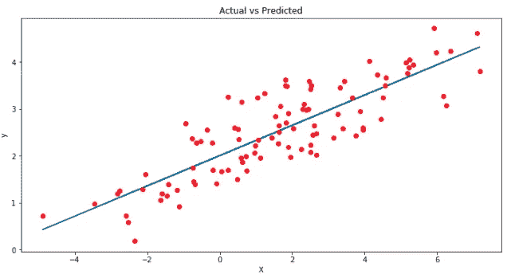
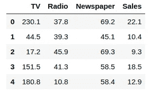
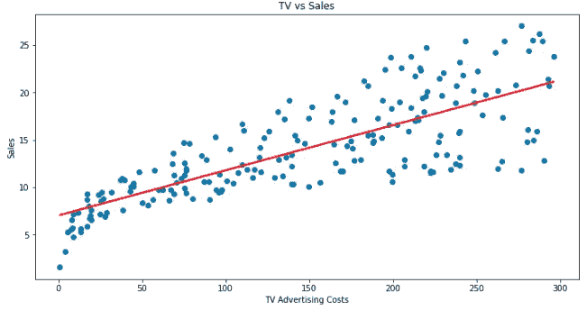

# Python 中的线性回归简介

> 原文：<https://towardsdatascience.com/introduction-to-linear-regression-in-python-c12a072bedf0?source=collection_archive---------0----------------------->

## 如何用 Python `statsmodels` & `scikit-learn libraries.`实现线性回归的快速教程



Example linear regression model using simulated data

**线性回归**是一种基本的预测分析技术，使用历史数据来预测输出变量。它在预测建模中很受欢迎，因为它容易理解，可以用简单的英语解释。

线性回归模型在一系列行业中有许多实际应用，例如经济学(例如预测增长)、商业(例如预测产品销售、员工绩效)、社会科学(例如从性别或种族预测政治倾向)、医疗保健(例如从体重预测血压水平、从生物因素预测疾病发作)等等。

了解如何实现线性回归模型可以挖掘数据中的故事来解决重要问题。我们将使用 Python，因为它是处理和建模数据的强大工具。它有一系列用于线性回归建模的软件包。

基本的想法是，如果我们可以用一个线性回归模型来拟合观察到的数据，那么我们就可以用这个模型来预测任何未来的值。例如，假设我们从历史数据中发现，房子的价格( ***P*** )与房子的大小( ***S*** )呈线性相关——事实上，我们发现房子的价格正好是其大小的 90 倍。该等式将如下所示:

*P = 90*S*

有了这个模型，我们就可以预测任何房子的价格。如果我们有一栋 1500 平方英尺的房子，我们可以计算出它的价格:

*P = 90 * 1500 = 135000 美元*

在这篇博文中，我们涵盖了:

1.  模型背后的基本概念和数学
2.  如何使用模拟数据从头实现线性回归
3.  如何用`statsmodels`实现线性回归
4.  如何使用`scikit-learn`实现线性回归

## 这篇简短的教程改编自下一期 XYZ[Python 线性回归](https://c.next.tech/2G9Hlzn)课程，其中包括浏览器内沙盒环境、要完成的任务以及使用公共数据集的项目。

# 基本概念和数学

线性回归模型中有两种变量:

*   **输入**或**预测变量**是帮助预测输出变量值的变量。就是俗称的 ***X*** 。
*   **输出变量**是我们想要预测的变量。俗称 ***Y*** 。

为了使用线性回归估计 *Y* ，我们假设等式:

> ***Yₑ = α + β X***

其中 *Y* ₑ是基于我们的线性方程的 *Y* 的估计值或预测值。

我们的目标是找到使 *Y* 和 *Y* ₑ.之间的差异最小化的**参数 *α*** 和 ***β*** 的统计显著值

如果我们能够确定这两个参数的最佳值，那么我们将有最佳拟合的**线**，我们可以用它来预测 *Y* 的值，给定 *X* 的值。

那么，我们如何估算 *α* 和 *β* ？我们可以用一种叫做 [**普通最小二乘法**](https://en.wikipedia.org/wiki/Ordinary_least_squares) 的方法。

## 普通最小二乘法



Green lines show the difference between actual values Y and estimate values *Y*ₑ

最小二乘法的目的是找到使 *Y* 和 *Y* ₑ.之间的平方差之和最小的 *α* 和 *β* 的值这里我们不进行推导，但是使用微积分我们可以表明未知参数的值如下:



其中 *X̄* 是 *X* 值的平均值，而*ȳ*是 *Y* 值的平均值。

如果你熟悉统计学，你可能会把 *β* 简单地理解为
*Cov(X，Y) / Var(X)。*

# 从头开始线性回归

在本文中，我们将使用两个 Python 模块:

*   `[statsmodels](https://www.statsmodels.org/stable/index.html)` —一个模块，为许多不同的统计模型的估计，以及进行统计测试和统计数据探索提供类和函数。
*   `[scikit-learn](http://scikit-learn.org/stable/)` —为数据挖掘和数据分析提供简单高效工具的模块。

在我们开始之前，了解如何从头开始实现这个模型是很有用的。了解包在幕后是如何工作的是很重要的，所以你不能只是盲目地实现模型。

首先，让我们模拟一些数据，看看预测值( *Y* ₑ)与实际值( *Y* )有何不同:

如果运行上述代码(例如，在 Jupyter 笔记本中)，将会输出如下内容:



为了使用 OLS 方法估计 *y* ，我们需要计算`xmean`和`ymean`、 *X* 和 *y* ( `xycov`)的协方差以及 *X* ( `xvar`)的方差，然后才能确定`alpha`和`beta`的值。

```
**Out:**
alpha = 2.0031670124623426
beta = 0.32293968670927636
```

太好了，我们现在有了对`alpha`和`beta`的估计！我们的模型可以写成 *Yₑ = 2.003 + 0.323 X，*我们可以做出预测:

```
**Out:**
array([3.91178282, 2.81064315, 3.27775989, 4.29675991, 3.99534802,
       1.69857201, 3.25462968, 2.36537842, 2.40424288, 2.81907292,
       ...
       2.16207195, 3.47451661, 2.65572718, 3.2760653 , 2.77528867,
       3.05802784, 2.49605373, 3.92939769, 2.59003892, 2.81212234])
```

让我们对照`y`的实际值绘制我们的预测`ypred`，以便更好地直观理解我们的模型。



蓝线是我们的最佳拟合线， *Yₑ = 2.003 + 0.323 X.* 从这个图中我们可以看出， *X* 和 *y* 之间存在正的线性关系。使用我们的模型，我们可以从 *X* 的任何值预测 *y* ！

例如，如果我们有一个值 *X = 10* ，我们可以预测:
*yₑ= 2.003+0.323(10)= 5.233。*

# 用`statsmodels`进行线性回归

既然我们已经从头开始学习了如何实现线性回归模型，我们将讨论如何使用`statsmodels`库中的`ols`方法。

为了演示这种方法，我们将使用一个非常受欢迎的`advertising`数据集，该数据集是关于不同媒体的广告费用以及特定产品的销售额。你可以在这里下载这个数据集[。](http://www-bcf.usc.edu/~gareth/ISL/Advertising.csv)

在本例中，我们将只关注`TV`变量——我们将探究电视广告支出是否能预测产品的销售数量。让我们从使用`read_csv()`将这个 csv 文件作为`pandas`数据帧导入开始:



首先，我们使用`statsmodels` ' `ols`函数初始化我们的简单线性回归模型。这采用公式`y ~ X`，其中`X`是预测变量(`TV`广告成本)`y`是输出变量(`Sales`)。然后，我们通过调用 OLS 对象的`fit()`方法来拟合模型。

我们不再需要自己计算`alpha`和`beta`，因为这种方法会自动为我们计算！调用`model.params`会显示模型的参数:

```
**Out:**
Intercept    7.032594
TV           0.047537
dtype: float64
```

在我们一直使用的符号中， *α* 是截距， *β* 是斜率，即 *α* = 7.032， *β* = 0.047。

因此，模型的等式将是: ***销售= 7.032+0.047 *电视***

简单地说，这意味着平均来说，如果我们在电视广告上花了 100 美元，我们应该可以卖出 11.73 台。

现在我们已经拟合了一个简单的回归模型，我们可以尝试使用`.predict`方法根据我们刚刚推导出的公式来预测销售额。

我们还可以通过绘制`sales_pred`与电视广告成本的对比图来可视化我们的回归模型，以找到最佳拟合线:



我们可以看到，电视广告成本和销售额之间存在正线性关系——换句话说，在电视广告上花费更多预测了更高的销售额！

有了这个模型，我们可以从电视广告的任何花费中预测销售额。例如，如果我们将电视广告费用增加到 400 美元，我们可以预测销售量将增加到 26 台:

```
**Out:**
0    26.04725
dtype: float64
```

# 用`scikit-learn`进行线性回归

我们已经学会了使用`statsmodels`实现线性回归模型…现在让我们学习使用`scikit-learn`来实现它！

对于这个模型，我们将继续使用`advertising`数据集，但这次我们将使用两个预测变量来创建一个**多元线性回归模型**。这是一个简单的线性回归模型，有一个以上的预测值，建模如下:

***Yₑ = α + β₁X₁ + β₂X₂ + … + βₚXₚ，*** 其中 *p* 为预测数。

在我们的例子中，我们将使用变量`TV`和`Radio`预测`Sales`，即我们的模型可以写成:

*销售额= α + β₁*TV + β₂*Radio.*

首先，我们初始化我们的线性回归模型，然后将模型拟合到我们的预测值和输出变量:

同样，我们不需要自己计算`alpha`和`betas`的值——我们只需要为`alpha`调用`.intercept_`,为带有系数`beta1`和`beta2`的数组调用`.coef_`:

```
**Out:**
alpha = 2.921099912405138
betas = [0.04575482 0.18799423]
```

因此，我们的模型可以写成:

*销量= 2.921+0.046 *电视+0.1880 *收音机。*

我们可以通过简单地使用`.predict()`来预测值:

```
**Out:**
array([20.555464, 12.345362, 12.337017, 17.617115, 13.223908,
       12.512084, 11.718212, 12.105515,  3.709379, 12.551696,
       ...
       12.454977,  8.405926,  4.478859, 18.448760, 16.4631902,
        5.364512,  8.152375, 12.768048, 23.792922, 15.15754285])
```

既然我们已经将多元线性回归模型拟合到我们的数据中，我们就可以根据电视和广播广告成本的任何组合来预测销售额了！例如，如果我们想知道，如果我们在电视广告上投资 300 美元，在广播广告上投资 200 美元，我们会取得多少销售额……我们所要做的就是输入这些数值！

```
**Out:**
[54.24638977]
```

这意味着，如果我们在电视广告上花 300 美元，在广播广告上花 200 美元，我们预计平均会卖出 54 台。

我希望你喜欢这个关于线性回归基础的简短教程！

我们讲述了如何在 Python 中使用`statsmodels`和`scikit-learn`来实现线性回归。在实践中，您必须知道如何验证您的模型和测量功效，如何为您的模型选择重要变量，如何处理分类变量，以及何时以及如何执行非线性转换。

## 我们有涵盖所有这些主题的完整课程(甚至更多！)[这里](https://c.next.tech/2G9Hlzn)在下一届 XYZ，如果你有兴趣学习更多关于 Python 线性回归的知识！