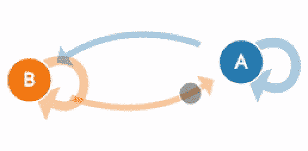
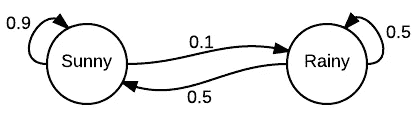
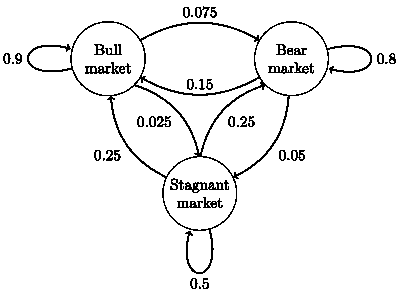
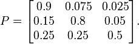
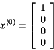

# 马尔可夫链简介

> 原文：<https://towardsdatascience.com/introduction-to-markov-chains-50da3645a50d?source=collection_archive---------0----------------------->

## 什么是马尔可夫链，什么时候使用，它们是如何工作的



(Generated from [http://setosa.io/ev/markov-chains/](http://setosa.io/ev/markov-chains/))

马尔可夫链是统计建模随机过程的一种相当常见且相对简单的方法。它们已经被用于许多不同的领域，从文本生成到金融建模。一个流行的例子是 [r/SubredditSimulator](https://www.reddit.com/r/SubredditSimulator/) ，它使用马尔可夫链来自动创建整个 subreddit 的内容。总的来说，马尔可夫链在概念上非常直观，并且非常容易理解，因为它们可以在不使用任何高级统计或数学概念的情况下实现。它们是开始学习概率建模和数据科学技术的好方法。

## 方案

首先，我将用一个非常常见的例子来描述它们:

```
Imagine that there were two possible states for weather: sunny or cloudy. **You can always directly observe the current weather state, and it is guaranteed to always be one of the two aforementioned states.**Now, you decide you want to be able to predict what the weather will be like tomorrow. Intuitively, you assume that there is an inherent ***transition*** in this process, in that the current weather has some bearing on what the next day’s weather will be. So, being the dedicated person that you are, you collect weather data over several years, and calculate that the chance of a sunny day occurring after a cloudy day is 0.25\. You also note that, by extension, the chance of a cloudy day occurring after a cloudy day must be 0.75, since there are only two possible states.You can now use this ***distribution*** to predict weather for days to come, based on what the current weather state is at the time.
```

这个例子说明了马尔可夫链的许多关键概念。马尔可夫链本质上由一组满足 ***马尔可夫性质*** *的转移所组成，这些转移由某种概率分布决定。*

观察在这个例子中，概率分布是如何仅通过观察从当天到第二天的转变而获得的。这说明了马尔科夫属性，马尔科夫过程的独特特征，使得它们 ***无记忆*** 。这通常使他们无法成功地产生序列，其中一些潜在的趋势预计会发生。例如，虽然马尔可夫链可能能够基于词频模仿作者的写作风格，但是它将不能产生包含深层含义或主题意义的文本，因为这些是在长得多的文本序列上开发的。**由于它们不能考虑先前状态的完整链，因此它们缺乏产生依赖于上下文的内容的能力。**



A visualization of the weather example

## 模型

形式上，马尔可夫链是一个概率自动机。状态转移的概率分布通常表示为马尔可夫链的 ***转移矩阵*** *。*如果马尔可夫链有 **N 个**可能状态，那么矩阵将是一个**N×N**矩阵，这样条目 **(I，J)** 就是从状态 **I** 转移到状态 **J** 的概率。此外，转移矩阵必须是一个**随机矩阵**，该矩阵的每一行的元素相加必须正好为 1。这完全有意义，因为每一行代表它自己的概率分布。



General view of a sample Markov chain, with states as circles, and edges as transitions



Sample transition matrix with 3 possible states

此外，马尔可夫链还有一个 ***初始状态向量*** ，表示为一个**N×1**矩阵(一个向量)，它描述了在 **N** 个可能状态中的每一个状态开始的概率分布。向量的条目 **I** 描述了链从状态 **I** 开始的概率。



Initial State Vector with 4 possible states

**这两个实体通常是表示马尔可夫链所需的全部。**

我们现在知道了如何获得从一个状态转换到另一个状态的机会，但是如何找到在多个步骤中发生转换的机会呢？为了形式化这一点，**我们现在想要确定在 M 个步骤上从状态 I 移动到状态 J 的概率**。事实证明，这其实很容易发现。给定一个转移矩阵 **P** ，这可以通过计算通过将 **P** 提升到 **M** 的幂而获得的矩阵的条目 **(I，J)** 的值来确定。对于小数值的 M(T25)，这可以通过手动重复乘法很容易地完成。但是对于 **M** 的大值，如果你熟悉简单的线性代数，一个更高效的矩阵的幂次提升方法是先对角化矩阵。

## 结论

既然您已经了解了马尔可夫链的基础知识，现在您应该能够轻松地用自己选择的语言实现它们。如果编码不是你的专长，还有许多更高级的马尔可夫链和马尔可夫过程的特性可以研究。在我看来，沿着理论路线的自然进展将是走向隐马尔可夫过程或 MCMC。简单的马尔可夫链是其他更复杂的建模技术的构建模块，因此有了这些知识，您现在可以转移到诸如信念建模和抽样等主题中的各种技术。