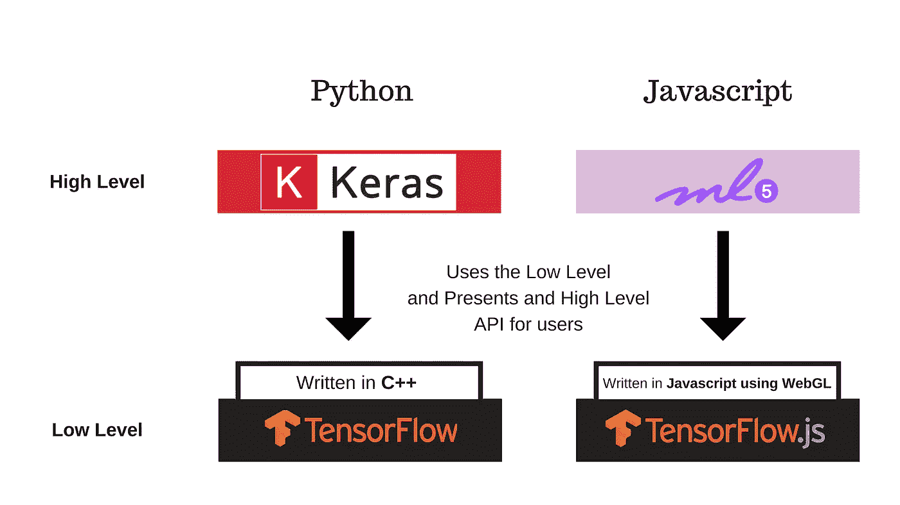
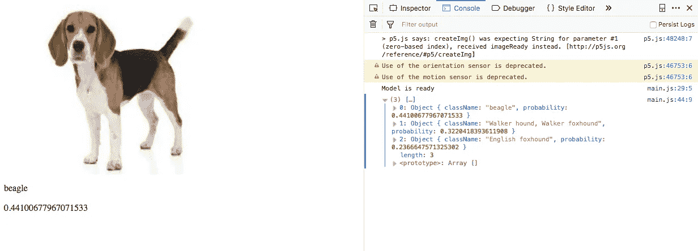

# ML⁵.简介射流研究…

> 原文：<https://towardsdatascience.com/introduction-to-ml5-js-3fe51d6a4661?source=collection_archive---------6----------------------->


Photo by [Christopher Robin Ebbinghaus](https://unsplash.com/@cebbbinghaus?utm_source=medium&utm_medium=referral) on [Unsplash](https://unsplash.com?utm_source=medium&utm_medium=referral)

## 初学者友好的网络机器学习。

> 本文是关于 **ML⁵.的第一部分 js** 学习系列，完整系列将在[媒体](https://medium.com/@iamadl)上以文本可读形式提供，并在 YouTube 上的[我的频道上以视频解释形式提供。](https://www.youtube.com/channel/UCRkxhh51YKqpn2gaUI3MXjg)[正在更新完整的视图播放列表。](https://www.youtube.com/playlist?list=PL1jmMFbLDfgVw9U2Nl0WIu1AoF9weHV1c)

[**ML⁵.js** 该库由纽约大学开发，**于 2018 年 7 月**公开发布。**该库在浏览器中提供对机器学习算法、任务和模型的访问，构建在**](https://ml5js.org/)**`[TensorFlow.js](https://js.tensorflow.org/)`之上，没有其他外部依赖性。所以，可以和 Keras 比。[**ML⁵.js**](https://ml5js.org/)**



[**ML⁵.js** 我们可以把这个比作](https://ml5js.org/) [Keras](https://keras.io) 。Keras 背后的动机是让 python 中的 ML/DL 简单到初学者也能使用。ML⁵.的情况也类似射流研究…..

这可以通过对 Tensorflow.js 库进行包装并在后端使用所有功能来实现。所以直观来说，对于 TensorFlow.js 来说是一个很好用的 API。

# **ML⁵.入门 js**

我们可以用[ml⁵.**js**](https://ml5js.org/) 通过引用我们项目中它的[最新版本](https://unpkg.com/ml5@0.1.1/dist/ml5.min.js)，通过在 HTML 文件中使用如下脚本标签:

```
 <html>
    <head>
      <title>Getting Started</title>
      **<script src="https://unpkg.com/ml5@0.1.1/dist/ml5.min.js"></script>**
    </head> <body>
      <script> // Your code will go here </script>
    </body>
  </html>
```

仅此而已！💥

你已经准备好了..

请考虑在 ML5.js 上观看这个视频的详细解释:-

[Source](https://youtu.be/D1jxmyQwM1A)

# 承诺和回访

[**ML⁵.js**](https://ml5js.org/) 支持**错误优先回调**和所有方法中的承诺。

## 使用回调

**ML⁵.js** 使用一种被称为**错误优先回调**的模式:

**例如——**如果你使用的是`imageClassifier()`方法，你将需要以如下方式构建它:

错误优先回调是许多 JavaScript 库共有的约定，在 **ML⁵.中实现 js** 。JavaScript 语言本身并不强制这种模式。在实施之前，我们最需要了解的是 **ML⁵.js** 方法和函数是异步的(*因为机器学习模型可能会花费大量的时间来处理输入和生成输出！).*

# 利用承诺

[**ML⁵.js**也支持](https://ml5js.org/)[承诺](https://developer.mozilla.org/en-US/docs/Web/JavaScript/Reference/Global_Objects/Promise)。如果没有向任何异步函数提供回调，则返回一个承诺。

有了承诺，图像分类示例可以按以下方式使用:

# 使用 **ML⁵.进行图像分类 js**

## 图像分类器()

ML⁵.js 可以用神经网络来识别图像的内容。`ml5.imageClassifier()`是创建对象的默认方法，使用预先训练的模型(如 MobileNet 等)对图像进行分类。

**ML⁵.js** 库从云中访问这些模型。

**让我们构建一个具体的例子:-**

我们将使用 p5 库和 **ML⁵.js.** p5 是一个强大而简单的 Javascript 库。你可以在这里找到更多细节[。](https://p5js.org/)你可以随时用 [**ML⁵.js.**](https://ml5js.org/) 使用普通的 JavaScript 或者你选择的其他框架作品

在开始 Javascript 部分之前，我们需要使用 NodeJS 托管一个本地服务器。

下面是代码:-

本地服务器成功启动并运行后，我们可以开始编写 HTML 和 JS 文件。

Index.html

**Index.html**

****main.js****

**好了..我们已经使用 **ML⁵.js.** 成功实现了一个图像分类器**

**可以去[http://localhost:8081/index . html](http://localhost:8081/main.html)查看结果。截图如下:-**

****

**Screenshot of the App.**

**下面是上面代码的 Github Repo**

**[](https://github.com/ADLsourceCode/ml5) [## ADLsourceCode/ml5

### GitHub 是人们构建软件的地方。超过 2800 万人使用 GitHub 来发现、分享和贡献超过…

github.com](https://github.com/ADLsourceCode/ml5) 

> 注意:这个教程不是集中在用户界面上，而是集中在获得 **ML⁵.的基础上 js** 清零**。UI 可以改进，UI 没有限制。**

使用 **ML⁵.js** 对于图像分类来说很简单，在我的下一篇文章中，我们将关注网络摄像头视频分类&其他使用 **ML⁵.js.** 的 NLP 工作

请考虑观看此视频，了解使用 **ML⁵.进行图像分类的详细说明 js** :-

[Source](https://youtu.be/NbGdBp7Dccs)

# 我对 ML⁵.的看法射流研究…

这对熟悉 JavaScript 和 HTML 并试图在 ML/DL 世界中找到出路的程序员来说是极好的！

对于没有 ML/DL 背景，但希望了解这个领域的人来说，这让事情变得简单多了。它使得机器学习对于艺术家、创意编码者和学生等广大受众来说变得触手可及。

这方面的用例很多，我个人认为这是我们目前需要的。

如果你觉得我的文章有用，你也会觉得我在 AI 上的 You Tube 频道有用而且有趣。请考虑订阅我的频道

享受 AI。😉** 

**如果你喜欢我的文章，请点击👏下面的跟我上**中的**和&:**

**[](https://www.instagram.com/cool_adl/)****[](https://twitter.com/I_AM_ADL)****[](https://www.youtube.com/channel/UCRkxhh51YKqpn2gaUI3MXjg)**

**如果你有任何问题，请在下面的评论里或者 [**推特**](https://twitter.com/I_AM_ADL) 告诉我。订阅我的 YouTube 频道获取更多科技视频: [**ADL**](https://goo.gl/u72j6u) 。**