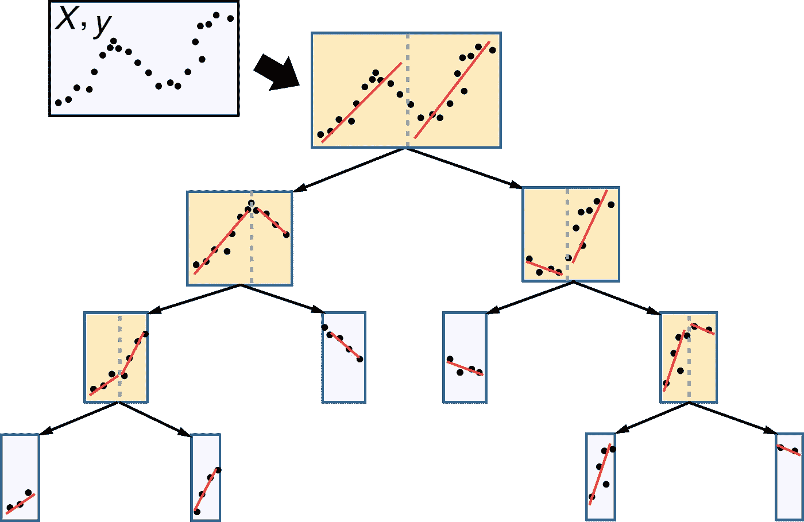
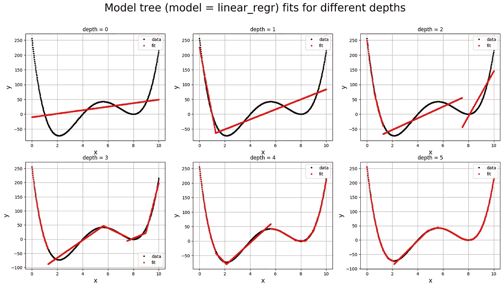
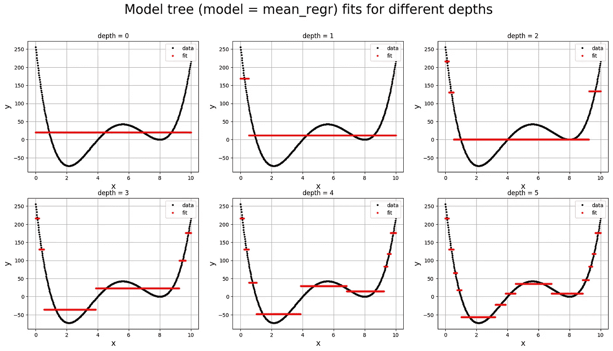

# 从头开始介绍模型树

> 原文：<https://towardsdatascience.com/introduction-to-model-trees-6e396259379a?source=collection_archive---------4----------------------->

决策树是机器学习中一种强大的监督学习工具，用于递归地(通过特征分割)将数据分割成单独的“孤岛”，以减少您对训练集的拟合的整体加权损失。决策树分类中常用的*是基尼指数损失的模态分类器，以及决策树回归的 L2 损失均值回归。然而应该另外观察的*是，在树分裂过程*中，决策树原则上可以采用**任何** **模型**，即* *线性回归、逻辑回归、神经网络*。本文的目的是向您介绍这种更一般化的方法，名为模型树，它将允许您从您选择的任何模型中构建决策树(而不是依赖于标准的 CART 方法)！**

**

*Fig 1) A schematic of using a linear regression model tree to fit a 1D training set to find segments of the training set that are well fit by a straight line.*

*在深入探讨为什么模型树有用和重要之前，我们在我的 Github 上提供了一个从头开始的模型树 Python 代码实现:*

> *[https://github . com/ankonzoid/learning x/tree/master/advanced _ ML/model _ tree](https://github.com/ankonzoid/LearningX/tree/master/advanced_ML/model_tree)*

*关于机器学习、深度学习和强化学习的更多博客、教程和项目，请查看我的 [**中**](https://medium.com/@ankonzoid) 和我的 [**Github**](https://github.com/ankonzoid) **。***

# *模型树的目的是什么？*

*假设你有一些复杂的训练数据，你天真地想到了一个简单的模型来拟合这个训练集(比如线性回归或者逻辑回归)。尤其是如果您猜测的简单模型的复杂性如此之低，那么您的模型本身很有可能会不足以满足您的训练数据。然而，希望并没有在这一点上失去！模型树的目的是在你的简单模型之外建立一个决策树层次结构，试图适应你的训练集(通过特征切片创建)的几个较小部分，这样整个模型树*确实*很好地适应完整的训练集。*

*为了明确演示在常规决策树上构建模型树的有用性，考虑 4 阶一维多项式以及训练低深度线性回归模型树回归器(图 2.a)和默认 scikit-learn 默认决策树回归器(图 2.b)之间的差异。您将会注意到，在这个例子中，模型树轻松胜过 scikit-learn 决策树回归器。*

*在下面的图 2.a 中，我们绘制了线性回归模型树与数据的拟合度，并增加了树的深度，以找到深度为 5 的拟合度良好的数据。正如你所看到的，即使拟合在极低的树深度(即 0，1，2)下并不出色，但拟合具有直观的意义，因为它们都贪婪地试图通过覆盖多项式的大部分来减少损失，从远处看*就像*直线。当我们到达深度 4 和 5 时，模型树将已经很好地捕捉到数据的 x 相关性，正如从 4 阶多项式所预期的。*

**

*Fig 2.a) Linear regression model tree fit on a 4th-order polynomial*

*另一方面，在下面的图 2.b 中，我们绘制了 scikit-learn 的默认决策树回归器的拟合度，发现即使在较高的树深度，拟合度仍然很差，这主要是因为它不能有效地捕捉数据的 x 相关性，因为 scikit-learn 的决策树使用均值回归(不考虑 x 变量，只关心 y 值)！因此，解决方案(不使用集合方法)将是迫使树更深以更接近近似值。希望这是一个强有力的视觉提醒，无论何时你有一点点奢侈去理解你的训练数据的本质，模型树都可以极大地改善你的结果。*

**

*Fig 2.b) Decision tree regressor (scikit-learn default implementation) fit on a 4th-order polynomial*

*最后一点，请记住，模型树在概念上的构建方式与常规决策树相同，这意味着模型树也可能遭受与决策树相同的缺陷，这通常涉及容易过度拟合的问题，尤其是当您使用复杂的模型时。*