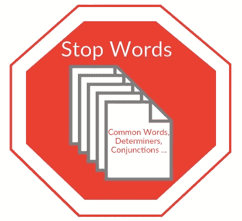
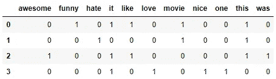
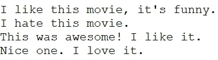
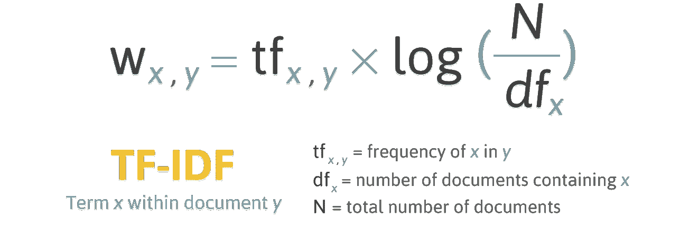
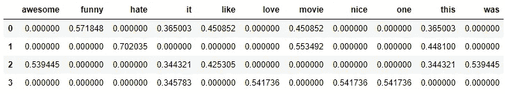

# 文本自然语言处理导论

> 原文：<https://towardsdatascience.com/introduction-to-natural-language-processing-for-text-df845750fb63?source=collection_archive---------0----------------------->


Icons source: [https://iconfinder.com](https://iconfinder.com)

看完这篇博文，你会知道一些从一些**文本**中**提取特征的基本技术，所以你可以把这些特征作为**机器学习模型**的**输入**。**

# 什么是 NLP(自然语言处理)？

NLP 是计算机科学和人工智能的一个子领域，涉及计算机和人类(自然)语言之间的交互。用于将**机器学习**算法应用于**文本**和**语音**。

例如，我们可以使用 NLP 创建类似于**语音识别**、**文档摘要**、**机器翻译**、**垃圾邮件检测**、**命名实体识别**、**问题回答、自动完成、预测打字**等系统。

如今，我们大多数人的智能手机都有语音识别功能。这些智能手机使用 NLP 来理解所说的内容。此外，许多人使用操作系统内置语音识别的笔记本电脑。

## 一些例子

**Cortana**


Source: [https://blogs.technet.microsoft.com/microsoft_presse/auf-diesen-4-saeulen-basiert-cortanas-persoenlichkeit/](https://blogs.technet.microsoft.com/microsoft_presse/auf-diesen-4-saeulen-basiert-cortanas-persoenlichkeit/)

微软 OS 有一个名为 [**Cortana**](https://support.microsoft.com/en-us/help/17214/windows-10-what-is) 的虚拟助手，可以识别一个**自然语音**。你可以用它来设置提醒、打开应用程序、发送电子邮件、玩游戏、跟踪航班和包裹、查看天气等等。

你可以从[这里](https://www.howtogeek.com/225458/15-things-you-can-do-with-cortana-on-windows-10/)阅读更多关于 Cortana 命令的内容。

**Siri**


Source: [https://www.analyticsindiamag.com/behind-hello-siri-how-apples-ai-powered-personal-assistant-uses-dnn/](https://www.analyticsindiamag.com/behind-hello-siri-how-apples-ai-powered-personal-assistant-uses-dnn/)

Siri 是苹果公司 iOS、watchOS、macOS、HomePod 和 tvOS 操作系统的虚拟助手。同样，你可以用**语音** **命令**做很多事情:开始通话、给某人发短信、发送电子邮件、设置定时器、拍照、打开应用程序、设置闹钟、使用导航等等。

[这里的](https://www.cnet.com/how-to/the-complete-list-of-siri-commands/)是所有 Siri 命令的完整列表。

**Gmail**


Source: [https://i.gifer.com/Ou1t.gif](https://i.gifer.com/Ou1t.gif)

谷歌开发的著名电子邮件服务 **Gmail** 正在使用**垃圾邮件检测**过滤掉一些垃圾邮件。

# Python 的 NLTK 库简介

NLTK ( **自然语言工具包**)是一个**领先的平台**，用于构建 Python 程序来处理**人类语言数据**。它为众多的 [**语料库**](https://en.wikipedia.org/wiki/Text_corpus) 和**词汇资源**提供了易用的接口。此外，它还包含一套**文本处理库**，用于分类、标记化、词干化、标记、解析和语义推理。最棒的是，NLTK 是一个免费、开源、社区驱动的项目。

我们将使用这个工具包来展示自然语言处理领域的一些基础知识。对于下面的例子，我假设我们已经导入了 NLTK 工具包。我们可以这样做:`import nltk`。

# 文本的自然语言处理基础

在本文中，我们将讨论以下主题:

1.  句子标记化
2.  单词标记化
3.  文本词汇化和词干化
4.  停止言语
5.  正则表达式
6.  词汇袋
7.  TF-IDF

## 1.句子标记化

句子标记化(也叫**句子切分**就是**把书面语**的一串**分割成**其成分**句子**的问题。这里的想法看起来很简单。在英语和其他一些语言中，每当我们看到标点符号时，我们就可以把句子分开。

然而，即使在英语中，由于缩写使用句号字符，这个问题也不是微不足道的。当处理纯文本时，包含句点的缩写表可以帮助我们防止错误分配**句子边界**。在很多情况下，我们使用库来完成这项工作，所以现在不要太担心细节。

**例子**:

让我们来看一段关于一个著名的棋盘游戏叫做双陆棋的课文。

> 双陆棋是已知最古老的棋盘游戏之一。它的历史可以追溯到近 5000 年前中东的考古发现。这是一个两人游戏，每个人有 15 个跳棋，根据两个骰子的滚动在 24 个点之间移动。

要用 NLTK 应用句子标记化，我们可以使用`nltk.sent_tokenize`函数。

作为输出，我们分别得到 3 个组成句子。

```
Backgammon is one of the oldest known board games.

Its history can be traced back nearly 5,000 years to archeological discoveries in the Middle East.

It is a two player game where each player has fifteen checkers which move between twenty-four points according to the roll of two dice.
```

## 2.单词标记化

分词(也叫**分词**)就是**把书面语**的一串**分割成**它的成分**词**的问题。在英语和许多其他使用某种形式拉丁字母的语言中，空格是单词分隔符的一个很好的近似。

然而，如果我们仅仅通过空间分割来实现想要的结果，我们仍然会有问题。一些英语复合名词有不同的写法，有时它们包含一个空格。在大多数情况下，我们使用一个库来实现想要的结果，所以不要太担心细节。

**举例**:

让我们使用上一步中的句子，看看如何对它们应用单词标记化。我们可以使用`nltk.word_tokenize`函数。

输出:

```
['Backgammon', 'is', 'one', 'of', 'the', 'oldest', 'known', 'board', 'games', '.']

['Its', 'history', 'can', 'be', 'traced', 'back', 'nearly', '5,000', 'years', 'to', 'archeological', 'discoveries', 'in', 'the', 'Middle', 'East', '.']

['It', 'is', 'a', 'two', 'player', 'game', 'where', 'each', 'player', 'has', 'fifteen', 'checkers', 'which', 'move', 'between', 'twenty-four', 'points', 'according', 'to', 'the', 'roll', 'of', 'two', 'dice', '.']
```

## 文本词汇化和词干化

出于语法原因，文档可以包含单词的**不同形式，例如*驱动*、*驱动*、*驱动*。还有，有时候我们会用**相关的词**来表达类似的意思，比如*民族*、*国家*、*民族*。**

> **词干化**和**词汇化**的目的都是为了**将** [**屈折**](https://en.wikipedia.org/wiki/Inflection) **形式**以及有时将**单词的衍生相关形式缩减为****公共基础形式**。

来源:[https://NLP . Stanford . edu/IR-book/html/html edition/stemming-and-lemma tization-1 . html](https://nlp.stanford.edu/IR-book/html/htmledition/stemming-and-lemmatization-1.html)

**例句**:

*   是，是，是`=>`是
*   狗，狗，狗的，狗的`=>`狗

应用于文本的这种映射的结果将如下所示:

*   男孩的狗大小不同

词干化和词汇化是**规范化**的特例。然而，它们彼此不同。

> **词干**通常指的是一种**粗糙的** [**启发式**](https://en.wikipedia.org/wiki/Heuristic) **过程**，它砍掉单词的词尾，希望在大多数时候都能正确实现这一目标，通常还包括去除派生词缀。
> 
> **词汇化**通常是指**使用**词汇**和**单词的形态分析**正确地做事情**，通常旨在只去除屈折词尾并返回单词的基本或词典形式，这就是所谓的**引理**。

来源:[https://NLP . Stanford . edu/IR-book/html/html edition/stemming-and-lemma tization-1 . html](https://nlp.stanford.edu/IR-book/html/htmledition/stemming-and-lemmatization-1.html)

不同之处在于**词干分析器**在不了解上下文的情况下操作**，因此无法理解根据词性而具有不同含义的单词之间的差异。但是词干分析器也有一些优点，它们更容易实现，通常 T21 运行得更快。此外，降低的“精度”对于某些应用来说可能无关紧要。**

**例子:**

1.  “更好”这个词的引理是“好”。这一环节被词干遗漏了，因为它需要查字典。
2.  单词“play”是单词“playing”的基本形式，因此它在词干和词汇化上都是匹配的。
3.  单词“meeting”可以是名词的基本形式，也可以是动词的形式(“to meet”)，这取决于上下文；例如，“在我们最后一次见面时”或“我们明天还会见面”。与词干提取不同，词汇化试图根据上下文选择正确的词汇。

在我们知道区别之后，让我们看一些使用 NLTK 工具的例子。

输出:

```
Stemmer: seen
Lemmatizer: see

Stemmer: drove
Lemmatizer: drive
```

## 停止言语



Source: [http://www.nepalinlp.com/detail/stop-words-removal_nepali/](http://www.nepalinlp.com/detail/stop-words-removal_nepali/)

停用词是在文本处理之前或之后从中过滤掉的词。在对文本应用机器学习时，这些词可以添加很多**噪音**。这就是为什么我们要去掉这些**无关词**。

停用词**通常是指**中最常见的词**如“**、**”、**、**、**、**”，但在一种语言中没有**没有单一的停用词通用列表**。停用字词的列表可以根据您的应用而改变。**

NLTK 工具有一个预定义的停用词列表，它引用最常用的词。如果是第一次使用，需要使用这个代码下载停用词:`nltk.download(“stopwords”)`。一旦我们完成了下载，我们就可以从`nltk.corpus`加载`stopwords`包，并用它来加载停用词。

输出:

```
['i', 'me', 'my', 'myself', 'we', 'our', 'ours', 'ourselves', 'you', "you're", "you've", "you'll", "you'd", 'your', 'yours', 'yourself', 'yourselves', 'he', 'him', 'his', 'himself', 'she', "she's", 'her', 'hers', 'herself', 'it', "it's", 'its', 'itself', 'they', 'them', 'their', 'theirs', 'themselves', 'what', 'which', 'who', 'whom', 'this', 'that', "that'll", 'these', 'those', 'am', 'is', 'are', 'was', 'were', 'be', 'been', 'being', 'have', 'has', 'had', 'having', 'do', 'does', 'did', 'doing', 'a', 'an', 'the', 'and', 'but', 'if', 'or', 'because', 'as', 'until', 'while', 'of', 'at', 'by', 'for', 'with', 'about', 'against', 'between', 'into', 'through', 'during', 'before', 'after', 'above', 'below', 'to', 'from', 'up', 'down', 'in', 'out', 'on', 'off', 'over', 'under', 'again', 'further', 'then', 'once', 'here', 'there', 'when', 'where', 'why', 'how', 'all', 'any', 'both', 'each', 'few', 'more', 'most', 'other', 'some', 'such', 'no', 'nor', 'not', 'only', 'own', 'same', 'so', 'than', 'too', 'very', 's', 't', 'can', 'will', 'just', 'don', "don't", 'should', "should've", 'now', 'd', 'll', 'm', 'o', 're', 've', 'y', 'ain', 'aren', "aren't", 'couldn', "couldn't", 'didn', "didn't", 'doesn', "doesn't", 'hadn', "hadn't", 'hasn', "hasn't", 'haven', "haven't", 'isn', "isn't", 'ma', 'mightn', "mightn't", 'mustn', "mustn't", 'needn', "needn't", 'shan', "shan't", 'shouldn', "shouldn't", 'wasn', "wasn't", 'weren', "weren't", 'won', "won't", 'wouldn', "wouldn't"]
```

让我们看看如何从句子中去掉停用词。

输出:

```
['Backgammon', 'one', 'oldest', 'known', 'board', 'games', '.']
```

如果你不熟悉 Python 中的 [**列表理解**。这里有另一种方法可以达到同样的效果。](/python-basics-list-comprehensions-631278f22c40)

然而，请记住**列表理解**比**更快**，因为它们已经过**优化**，以便 Python 解释器在循环过程中发现可预测的模式。

你可能想知道为什么我们把我们的列表转换成一个 [**集合**](https://docs.python.org/3/tutorial/datastructures.html#sets) 。Set 是一种抽象数据类型，可以存储唯一的值，没有任何特定的顺序。集合中的**搜索操作** **比列表**中的搜索操作**快得多****。对于少量的单词，没有太大的区别，但是如果你有大量的单词，强烈建议使用 set 类型。******

**如果你想了解更多关于不同数据结构的不同操作之间的时间消耗，你可以看看这个很棒的[备忘单](http://bigocheatsheet.com/)。**

## **正则表达式**

****

**Source: [https://digitalfortress.tech/tricks/top-15-commonly-used-regex/](https://digitalfortress.tech/tricks/top-15-commonly-used-regex/)**

****正则表达式**、 **regex** 或 **regexp** 是定义**搜索模式**的字符序列。让我们看看一些基本的。**

*   **`.` -匹配除换行符之外的任意字符**
*   ****`\w` -匹配**字******
*   ****`\d` -匹配**数字******
*   ****`\s` -匹配**空格******
*   ****`\W`——配**不字******
*   ****`\D` -匹配**而非数字******
*   ****`\S` -匹配**而不是空白******
*   ****`[abc]` -匹配 a、b 或 c 中的任意一个****
*   ****`[**^**abc]` - **不**匹配 a、b 或 c****
*   ****`[a**-**g]` -在和& g 之间匹配一个字符****

> ******正则表达式使用**反斜杠字符** ( `'\'`)来表示特殊形式，或者允许使用特殊字符而不调用它们的特殊含义。这个**与 Python 在字符串文字中出于相同目的使用相同字符的用法**相冲突；例如，要匹配一个文字反斜杠，可能必须将`'\\\\'`写成模式字符串，因为正则表达式必须是`\\`，并且每个反斜杠必须在一个常规 Python 字符串文字中表示为`\\`。******
> 
> ****解决方案是将 Python 的**原始字符串符号**用于正则表达式模式；以 `**'r'**`为前缀的字符串文字**中的反斜杠没有任何特殊的处理方式。所以`r"\n"`是包含`'\'`和`'n'`的双字符字符串，而`"\n"`是包含换行符的单字符字符串。通常，模式将使用这种原始字符串符号在 Python 代码中表示。******

****来源:[https://docs.python.org/3/library/re.html?highlight=regex](https://docs.python.org/3/library/re.html?highlight=regex)****

****我们可以使用正则表达式将**附加过滤**应用到我们的文本中。例如，我们可以删除所有非单词字符。在许多情况下，我们不需要标点符号，用正则表达式很容易删除它们。****

****在 Python 中，`**re**`模块提供了类似于 Perl 中的正则表达式匹配操作。我们可以使用`**re.sub**`函数用替换字符串替换模式的匹配。让我们看一个用空格字符替换所有非单词的例子。****

****输出:****

```
**'The development of snowboarding was inspired by skateboarding  sledding  surfing and skiing '**
```

****正则表达式是一个强大的工具，我们可以创建更复杂的模式。如果你想了解更多关于 regex 的知识，我可以推荐你试试这两个 web 应用: [regex](https://regexr.com/) r， [regex101](https://regex101.com/) 。****

## ****词汇袋****

********

****Source: [https://www.iconfinder.com/icons/299088/bag_icon](https://www.iconfinder.com/icons/299088/bag_icon)****

****机器学习算法不能直接处理原始文本，我们需要将文本转换成数字向量。这叫做 [**特征提取**](https://en.wikipedia.org/wiki/Feature_extraction) 。****

******词袋**模型是一种**流行的**和**简单的** **特征提取技术**在我们处理文本时使用。它描述了文档中每个单词的出现。****

****要使用该模型，我们需要:****

1.  ****设计一个已知单词的**词汇表**(也叫**记号**)****
2.  ****选择已知单词存在的**度量******

****任何关于单词**的顺序**或**结构**的信息都被丢弃。这就是为什么它被称为单词的**袋**。该模型试图理解一个已知单词是否出现在文档中，但不知道该单词在文档中的位置。****

****直觉是**相似文档**有**相似内容**。同样，从一个内容中，我们可以了解一些关于文档的含义。****

## ******例子******

****我们来看看创建词袋模型有哪些步骤。在这个例子中，我们将用四个句子来看看这个模型是如何工作的。在现实世界的问题中，您将处理大量的数据。****

******1。加载数据******

********

****Source: [https://www.iconfinder.com/icons/315166/note_text_icon](https://www.iconfinder.com/icons/315166/note_text_icon)****

****假设这是我们的数据，我们想把它作为一个数组加载。****

****要做到这一点，我们可以简单地读取文件，并按行分割。****

****输出:****

```
**["I like this movie, it's funny.", 'I hate this movie.', 'This was awesome! I like it.', 'Nice one. I love it.']**
```

******2。** **设计词汇******

********

****Source: [https://www.iconfinder.com/icons/2109153/book_contact_dairy_google_service_icon](https://www.iconfinder.com/icons/2109153/book_contact_dairy_google_service_icon)****

****让我们从四个加载的句子中获取所有独特的单词，忽略大小写、标点和单字符标记。这些单词将成为我们的词汇(已知单词)。****

****我们可以使用 sklearn 库中的 [**计数矢量器**](https://scikit-learn.org/stable/modules/generated/sklearn.feature_extraction.text.CountVectorizer.html) 类来设计我们的词汇表。我们也将在阅读下一步后看看如何使用它。****

******3。创建文档向量******

********

****Source: [https://www.iconfinder.com/icons/1574/binary_icon](https://www.iconfinder.com/icons/1574/binary_icon)****

****接下来，我们需要对每个文档中的单词进行评分。这里的任务是将每个原始文本转换成一个数字向量。之后，我们可以使用这些向量作为机器学习模型的输入。最简单的评分方法是用 1 代表存在，0 代表不存在来标记单词的存在。****

****现在，让我们看看如何使用上面提到的 CountVectorizer 类创建一个单词袋模型。****

******输出**:****

********

****这是我们的句子。现在我们可以看到单词袋模型是如何工作的。****

********

## ****关于单词袋模型的补充说明****

********

****Source: [https://www.iconfinder.com/icons/1118207/clipboard_notes_pen_pencil_icon](https://www.iconfinder.com/icons/1118207/clipboard_notes_pen_pencil_icon)****

****单词袋模型的**复杂性**来自于决定如何**设计已知单词(记号)的词汇表**以及如何**对已知单词的存在**进行评分。****

******设计词汇**
当词汇**大小增加**时，文档的向量表示也增加。在上面的例子中，文档向量的长度等于已知单词的数量。****

****在某些情况下，我们可能有**大量的数据**，在这种情况下，表示文档的向量的长度可能是**数千或数百万个**元素。此外，每个文档可能只包含词汇表中的几个已知单词。****

****因此，矢量表示将有**个零**。这些有很多零的向量被称为**稀疏向量**。它们需要更多的内存和计算资源。****

****当使用单词袋模型来减少所需的内存和计算资源时，我们可以减少已知单词的数量。在创建我们的单词袋模型之前，我们可以使用我们已经在本文中看到的**文本清理技术**:****

*   ******忽略大小写**的字样****
*   ******忽略标点符号******
*   ******从我们的文档中删除**和**停用词******
*   ****将单词简化为基本形式(**文本词条化和词干化**)****
*   ******修复拼错的单词******

****另一种更复杂的创建词汇表的方法是使用**分组单词**。这改变了词汇表的**范围**，并允许单词袋模型获得关于文档的更多细节。这种方法被称为 **n-grams** 。****

****一个 n-gram 是一个由若干**项**(单词、字母、数字、数位等)组成的**序列。).在 [**文本语料库**](https://en.wikipedia.org/wiki/Text_corpus) 的上下文中，n-grams 一般是指一个单词序列。一个**一元词**是一个词，一个**二元词**是两个词的序列，一个**三元词**是三个词的序列，等等。“n-gram”中的“n”是指分组单词的数量。仅对语料库中出现的 n 元文法进行建模，而不是所有可能的 n 元文法。******

****例句**
让我们看看下面这个句子的所有二元模型:
`The office building is open today`**

**所有的二元模型是:**

*   **办公室**
*   **办公楼**
*   **建筑是**
*   **已打开**
*   **今天开门**

****二元模型袋**比词汇袋方法更强大。**

****给单词打分** 一旦我们创建了已知单词的词汇表，我们就需要给这些单词在我们的数据中的出现次数打分。我们看到了一种非常简单的方法——二元方法(1 代表存在，0 代表不存在)。**

**一些额外的评分方法是:**

*   ****伯爵**。计算每个单词在文档中出现的次数。**
*   ****频率**。计算文档中所有单词中每个单词出现的频率。**

## **TF-IDF**

****评分词频**的一个问题是，文档中最频繁出现的词开始有最高的分数。与一些更罕见和特定领域的单词相比，这些频繁出现的单词可能不包含太多的"**信息增益**"。解决这个问题的一个方法是**惩罚在所有文档**中**频繁出现的**单词。这种方法被称为 TF-IDF。**

**TF-IDF，简称**词频-逆文档频数**是一种**统计量**，用于评估一个词在集合或[语料库](https://en.wikipedia.org/wiki/Text_corpus)中对一个文档的重要性。**

**TF-IDF 得分值与单词在文档中出现的次数成比例地增加，但是它被语料库中包含该单词的文档的数量所抵消。**

**让我们看看用于计算文档 **y** 中给定术语 **x** 的 TF-IDF 得分的公式。**

****

**TF-IDF Formula. Source: [http://filotechnologia.blogspot.com/2014/01/a-simple-java-class-for-tfidf-scoring.html](http://filotechnologia.blogspot.com/2014/01/a-simple-java-class-for-tfidf-scoring.html)**

**现在，让我们把这个公式拆分一下，看看公式的不同部分是如何工作的。**

*   ****词频(TF)** :该词在当前文档中出现频率的得分。**

****

**Term Frequency Formula**

*   ****逆词频(ITF)** :对单词在文档中的稀有程度进行评分。**

****

**Inverse Document Frequency Formula**

*   **最后，我们可以使用前面的公式来计算给定术语的 **TF-IDF 得分**，如下所示:**

****

**TF-IDF Formula**

****示例** 在 Python 中，我们可以使用 sklearn 库中的**tfidf 矢量器**类来计算给定文档的 TF-IDF 分数。让我们使用和单词袋例子中相同的句子。**

**输出:**

****

**同样，我将在这里添加句子，以便于比较和更好地理解这种方法是如何工作的。**

****

# **摘要**

**在这篇博文中，您将学习文本的 NLP 基础知识。更具体地说，您已经学习了以下概念以及其他详细信息:**

*   ****NLP** 用于将**机器学习算法**应用于**文本**和**语音**。**
*   **NLTK ( **自然语言工具包**)是一个**领先的平台**，用于构建 Python 程序来处理**人类语言数据****
*   ****句子标记化**就是**把书面语**的一串**分割成**它的成分**句子**的问题**
*   ****分词**就是**将书面语**中的一串**拆分成**其成分**单词**的问题**
*   ****词干化**和**词汇化**的目的都是为了**将** [**屈折**](https://en.wikipedia.org/wiki/Inflection) **形式**以及有时将**单词的衍生相关形式缩减为****公共基础形式**。**
*   ****停用词**是在文本处理之前或之后过滤掉的词。他们**通常**指的是**语言中最常见的单词**。**
*   ****正则表达式是**定义**搜索模式**的一系列字符。**
*   ****词袋**模型是一种**流行的**和**简单的** **特征提取技术**在我们处理文本时使用。它描述了文档中每个单词的出现。**
*   ****TF-IDF** 是一个**统计量**，用于**评估**一个**单词**对集合中的一个文档或者[语料库](https://en.wikipedia.org/wiki/Text_corpus)的重要性。**

**厉害！现在我们知道了如何从文本中提取特征的基本知识。然后，我们可以使用这些特征作为机器学习算法的输入。**

**要不要看**所有**用在**的概念再来一个大例子**？
- [给您](https://github.com/Ventsislav-Yordanov/Blog-Examples/blob/master/Intro%20to%20NLP%20-%20Cleaning%20Review%20Texts%20Example/Cleaning%20Review%20Texts%20Example.ipynb)！如果你在手机上阅读，请向下滚动到最后，点击“*桌面版*”链接。**

# **资源**

*   **[https://en.wikipedia.org/wiki/Natural_language_processing](https://en.wikipedia.org/wiki/Natural_language_processing)**
*   **http://www.nltk.org/**
*   **【https://en.wikipedia.org/wiki/Text_segmentation **
*   **[https://en.wikipedia.org/wiki/Lemmatisation](https://en.wikipedia.org/wiki/Lemmatisation)**
*   **[https://en.wikipedia.org/wiki/Stemming](https://en.wikipedia.org/wiki/Stemming)**
*   **[https://NLP . Stanford . edu/IR-book/html/html edition/stemming-and-lemma tization-1 . html](https://nlp.stanford.edu/IR-book/html/htmledition/stemming-and-lemmatization-1.html)**
*   **[https://en.wikipedia.org/wiki/Stop_words](https://en.wikipedia.org/wiki/Stop_words)**
*   **[https://en.wikipedia.org/wiki/Regular_expression](https://en.wikipedia.org/wiki/Regular_expression)**
*   **[https://docs.python.org/3/library/re.html?highlight=regex](https://docs.python.org/3/library/re.html?highlight=regex)**
*   **[https://machine learning mastery . com/gentle-introduction-bag-words-model/](https://machinelearningmastery.com/gentle-introduction-bag-words-model/)**
*   **[https://chrisalbon . com/machine _ learning/preprocessing _ text/bag _ of _ words/](https://chrisalbon.com/machine_learning/preprocessing_text/bag_of_words/)**
*   **[https://en.wikipedia.org/wiki/Tf%E2%80%93idf](https://en.wikipedia.org/wiki/Tf%E2%80%93idf)**

# **互动版**

**[这里的](https://beta.deepnote.com/launch?template=deepnote&url=https%3A%2F%2Fstorage.googleapis.com%2Fdeepnote-public-templates%2Fvyordanov%2Fintro2nlp.tar.gz&name=Introduction%20to%20Natural%20Language%20Processing%20for%20Text)是在 [Deepnote](https://deepnote.com/) (云托管 Jupyter 笔记本平台)上传的这篇文章的**交互版本**。请随意查看并使用示例。**

# **我的其他博客文章**

**你也可以看看我以前的博文。**

*   **[Jupyter 笔记本快捷键](https://medium.com/@ventsislav94/jypyter-notebook-shortcuts-bf0101a98330)**
*   **[数据科学的 Python 基础知识](/python-basics-for-data-science-6a6c987f2755)**
*   **[Python 数据科学:Matplotlib 数据可视化简介](/data-science-with-python-intro-to-data-visualization-and-matplotlib-5f799b7c6d82)**
*   **[Python 数据科学:pandas 加载、子集化和过滤数据简介](/data-science-with-python-intro-to-loading-and-subsetting-data-with-pandas-9f26895ddd7f)**

# **时事通讯**

**如果你想在我发表新的博客文章时得到通知，你可以订阅[我的最新时事通讯](https://buttondown.email/Ventsislav)。**

# **商务化人际关系网**

**这是我在 LinkedIn 上的简介，如果你想和我联系的话。我将很高兴与你联系在一起。**

# **最后的话**

**谢谢你的阅读。我希望你喜欢这篇文章。如果你喜欢，请按住拍手键，分享给你的朋友。我很高兴听到你的反馈。如果你有什么问题，尽管问。😉**