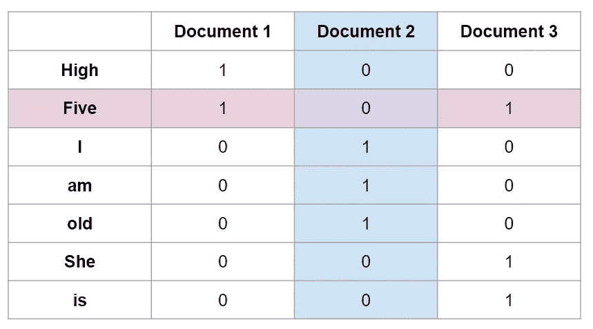
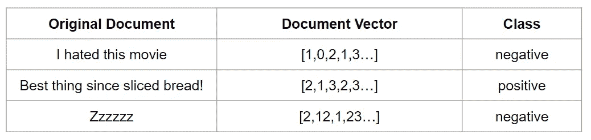

# 自然语言处理导论

> 原文：<https://towardsdatascience.com/introduction-to-natural-language-processing-part-1-777f972cc7b3?source=collection_archive---------6----------------------->

## 用数学破译语言

Photo by [Franki Chamaki](https://unsplash.com/@franki?utm_source=unsplash&utm_medium=referral&utm_content=creditCopyText) on [Unsplash](https://unsplash.com/s/photos/data-has-a-better-idea?utm_source=unsplash&utm_medium=referral&utm_content=creditCopyText)

自然语言处理(NLP)是人工智能领域，涉及人类语言的处理和理解。自 20 世纪 50 年代问世以来，机器对语言的理解已经在翻译、主题建模、文档索引、信息检索和实体抽取中发挥了关键作用。

如今，它被用来驱动搜索引擎，过滤垃圾邮件，并以快速和可扩展的方式获得分析。随着计算效率和机器学习的新发展，这些系统的性能呈指数增长。今天的几个 NLP 系统甚至可以夸耀接近人类水平的对等性。

有了专门用于 NLP 的剩余工具和技术，现在是*所以*很容易开始。我的目标是涵盖自然语言处理的基本理论，并向您展示如何构建简单的工具来展示它们的*魔力*。查看这些后续文章，获取更多 NLP 阅读资料。

*   [*垃圾邮件还是火腿——一个简单的文本分类问题*](/spam-or-ham-introduction-to-natural-language-processing-part-2-a0093185aebd)
*   [*探索单词嵌入的神经网络*](https://medium.com/analytics-vidhya/neural-networks-for-word-embeddings-4b49e0e9c955)

顺便提一下:*这篇文章以及后续的文章主要关注文本处理环境中的 NLP。*

# 我们到底是如何对语言建模的？

语言是流动的。语言充满了抽象和歧义。成年后学习第二语言很难，那么机器到底是怎么做到的呢？

事实是，大多数自然语言理解系统都是非常结构化的。他们将文本数据转换成数字表示，并使用复杂的数学模型来学习每个单词、短语和文档之间的依赖关系。最终用户所看到的对语言的智能理解实际上是一个大型语料库中的数百万个参数。

把文字变成数字的过程俗称*矢量化*或者*嵌入*。这些技术是将单词映射到实数向量的函数。向量形成了向量空间，这是一个代数模型，其中应用了向量加法的所有规则和相似性度量。

Using the word embedding technique word2vec, researchers at Google are able to quantify word relationships in an algebraic model

向量空间中两个单词之间的距离度量了它们之间的某种相似性。还可以使用向量加法来量化单词关系。上图展示了国王和王后的关系就像男人和女人的关系一样。理论上，这将意味着`King Vector — Queen Vector = Man Vector - Woman Vector`

## 每个向量的粒度不限于单词，我们也可以将字符、短语或文档映射到向量

“文档”是指与问题相关的完整的文本实体。例如，垃圾邮件分类系统会将每封邮件视为一个文档。

文档可以映射到向量的向量，其中每个向量对应一个单词。在这种情况下，向量的向量被算法摄取，其中单词关系和单个向量的连接被用于导出含义。或者，可以将整个文档映射到一个向量。这创建了对语言的更简化的理解，但是更少依赖于数据量和计算资源。

文档级嵌入通常通过检查每个单词的频率来创建。这些嵌入技术依赖于**分布假设**，假设:

> 分布假设:在相同语境中使用和出现的词倾向于表达相似的意思

让我们来看看最简单的嵌入技术之一——单词包，它用于将每个文档映射到它自己的向量上。

# 一袋单词

由于语言过于简单，这种技术在实践中并不常用。它的使用案例主要是作为一种教育工具，旨在使 NLP 的学生轻松地进入该主题。

让我们考虑以下文件。如果有帮助的话，你可以想象它们是朋友之间分享的荒谬简单的短信。

**文件一:击掌**

**文件二:我老了。**

文件 3:她五岁了。

我们从这组文档中获得的词汇是(高，五，我，我，老，她，是)。我们现在将忽略标点符号，尽管根据我们的使用情况，将它们纳入我们的词汇表也很有意义。

我们可以创建一个矩阵来表示词汇表中的每个术语和文档之间的关系。矩阵中的每个元素表示该术语在特定文档中出现的次数。

使用这个矩阵，我们可以获得每个单词以及文档的向量。我们可以将“五”矢量化为[1，0，1]，将“文档 2”矢量化为[0，0，1，1，1，0，0]。

单词袋并不能很好地代表语言，尤其是当你的词汇量很小的时候。它忽略了词序和词的关系，产生了稀疏向量，其中大部分是零。从这个小例子中我们还可以看到，单词“我”、“am”、“old”被映射到同一个向量。这暗示这几个字差不多，其实没什么意义。

这里有一些关于 NLP 阅读的文章。 *Spam 或 Ham* 引入了一种新的文档嵌入类型，它考虑了每个术语的相对重要性。*探索单词嵌入的神经网络*介绍了使用神经网络创建的嵌入，这两种方法都是单词袋的更实用的替代方法。

*   [*垃圾邮件还是火腿—一个简单的文本分类问题*](/spam-or-ham-introduction-to-natural-language-processing-part-2-a0093185aebd)
*   [*探索单词嵌入的神经网络*](https://medium.com/analytics-vidhya/neural-networks-for-word-embeddings-4b49e0e9c955)

# 在我矢量化/嵌入我的文本后，现在该怎么办？

数字表示允许我们使用数学模型来分析我们的文本。下一步是将这些嵌入作为分类问题中的特征。

By one hot encoding the classes, we can plug this data into any type of classifier

文本数据丰富且维数高，这使得更复杂的分类器(如神经网络)成为 NLP 的理想选择。

# 感谢您的阅读！

如果你喜欢这篇文章，可以看看我关于数据科学、数学和编程的其他文章。[通过 Medium](https://medium.com/@mandygu) 关注我的最新更新。😃

作为一个业余爱好项目，我还在[www.dscrashcourse.com](http://www.dscrashcourse.com/)建立了一套全面的**免费**数据科学课程和练习题。

如果你想支持我的写作，下次你报名参加 Coursera 课程时，可以考虑使用我的会员链接。完全公开—我从每一次注册中获得佣金，但不会对您产生额外费用。

再次感谢您的阅读！📕