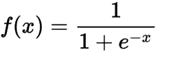
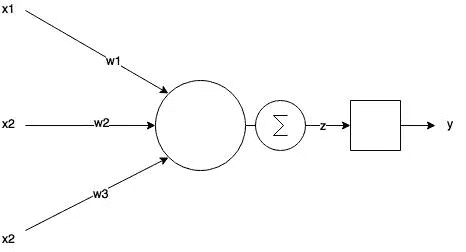
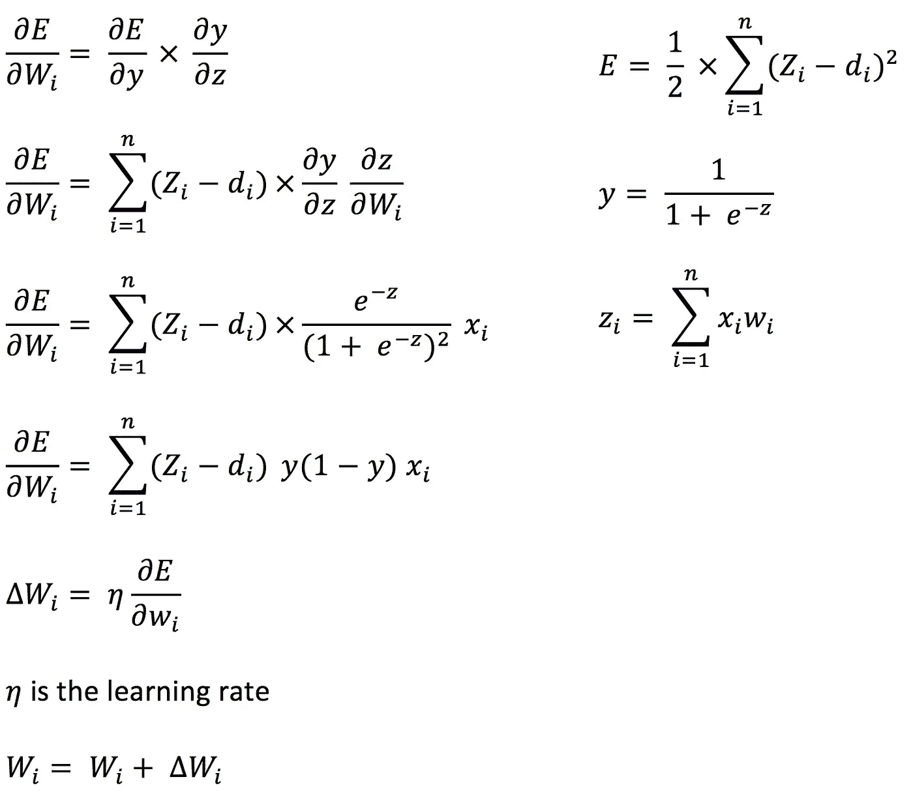
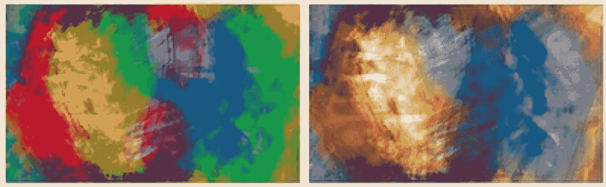

# 神经网络导论

> 原文：<https://towardsdatascience.com/introduction-to-neural-networks-ead8ec1dc4dd?source=collection_archive---------2----------------------->

## 神经网络基础

## 什么是神经网络

神经网络，通常称为人工神经网络(ANN ),是机器学习(ML)问题中对人脑功能的模拟。人工神经网络不能解决所有出现的问题，但可以和其他技术一起为各种 ML 任务提供更好的结果。人工神经网络最常见的用途是聚类和分类，它们也可用于回归任务，但在这方面还有更好的方法。

# 人工神经网络的构建模块和功能

## 神经元

这是神经网络的构建单元，它模仿人类神经元的功能。典型的神经网络使用 sigmoid 函数，如下所示。使用这个函数主要是因为它能够根据 *f(x)* 本身写出导数，这在最小化误差时很方便。



sigmoid function



Neuron

```
*z* =  ∑ *w*×*x
y = sigmoid(z)**w* = weights
*x* = inputs
```

神经元按层连接，因此一层可以与其他层通信，形成神经网络。除了输入和输出层之外的内层称为隐藏层。一层的输出被馈送到另一层的输入。

## 调整重量

人工神经网络的学习任务是调整权重以最小化误差。这是通过误差反向传播实现的。对于使用 Sigmoid 函数作为激活函数的简单神经元，误差可以如下所示。让我们考虑一种一般情况，其中权重称为向量 W，输入称为向量 x。



Error calculation and weight adjustment

从上面的等式中，我们可以概括出权重调整，令人惊讶的是，您会注意到这仅需要相邻神经元级别的细节。因此，这是一种稳健的学习机制，称为反向传播算法。从输出节点开始反向传播，更新前一个神经元的权重。

# 带有简单 javascript 库的演示应用程序

让我们编写一个简单的应用程序，它将使用两个图像进行训练，并对给定的图像应用过滤器。以下是训练过程的源图像和目标图像。



Source image(left) and target image(right)

我使用了一个人工神经网络，它使用反向传播来调整误差。训练的意图是找到一个函数 *f(红、绿、蓝、阿尔法)*来匹配目标颜色变换。使用源图像的几种颜色调整来制作目标图像。让我们看看代码。

## Package.json

## Index.ts

```
$ npm install
$ npm start
```

源图像应为`input_image_train.jpg`，目标图像名称应为`output_image_train.jpg`。要应用滤镜的图像文件应该是`test.jpg`，新的图像文件将保存为`out.jpg`。以下是我用训练好的模型过滤的一些示例图像。

## 样本输出


Input images (left) and output images(right)

> 酷吧？训练需要几秒钟，但过滤是即时的。如果需要，您可以保存模型以供将来使用。这在现实世界的应用中是非常智能的。