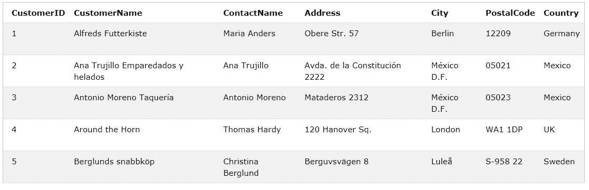
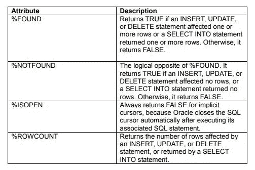
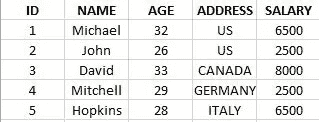
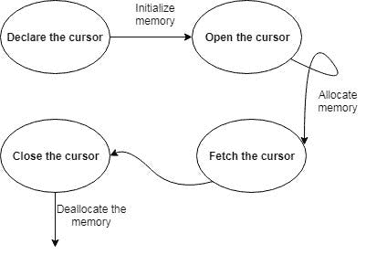
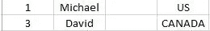

# SQL 中的过程和游标介绍

> 原文：<https://towardsdatascience.com/introduction-to-procedures-and-cursors-in-sql-f9d9b9ea1fe7?source=collection_archive---------6----------------------->


Photo by [Caspar Rubin](https://unsplash.com/@casparrubin?utm_source=medium&utm_medium=referral) on [Unsplash](https://unsplash.com?utm_source=medium&utm_medium=referral)

**学习如何为一个** [**RDBMS**](https://en.wikipedia.org/wiki/Relational_database_management_system) **编写程序和游标。**

如果你想从数据科学的角度了解更多关于 SQL 的知识，你可以参加 DataCamp 的免费课程[“数据科学的 SQL 介绍”](https://www.datacamp.com/courses/intro-to-sql-for-data-science)。

SQL 是任何现代软件工程师的必备技能。因为大多数软件依赖于某种类型的数据，并且与 RDBMS(关系数据库管理系统)集成得很好。无论是 web 应用程序、API 还是内部应用程序，RDBMS 都在那里。SQL 是查询 RDBMS 的语言。

作为一名数据科学家，了解 SQL 及其相关技术是非常初级的。为了能够查询 RDBMS 并获得关于您正在处理的数据的特定问题的答案，SQL 是最低要求。

在他与 DataCamp 的最新视频中，[大卫·罗宾逊](http://varianceexplained.org/about/)(首席数据科学家@ DataCamp) [向我们展示了他如何在一个数据科学问题中使用 SQL](https://www.youtube.com/watch?v=6M0W-zmau8I)。请检查一下，他的工作流程非常有趣。

在本教程中，您将学习编写过程和游标；SQL 的另一个重要方面。您是否曾经希望 RDBMS 在执行特定操作时自动执行某些操作？例如，假设您已经在名为`Employees`的表中创建了一个新的雇员记录，并且您希望它反映在其他相关的表中，如`Departments`。好吧，你将选择正确的教程。

在本教程中，您将学习:

*   RDBMS 中的过程是什么？
*   如何编写一个过程呢？
*   不同类型的程序
*   RDBMS 中的游标是什么？
*   如何编写不同类型的游标？
*   不同类型的光标

听起来很刺激？让我们开始吧。

# RDBMS 中的过程是什么？

在继续学习过程和游标之前，您需要了解一些关于`PL/SQL`的知识，它是一种块结构语言，使像您这样的开发人员能够将 SQL 的强大功能与过程语句结合起来。但是你不会以传统的方式学习，你会随着你的前进和需要而学习。

所以如果你有一个 SQL 查询，你想多次执行它。程序是解决方法之一。通常在这种情况下调用过程，因为它们保持存储状态，并在特定操作或一系列操作时被触发。程序也被称为`Procs`。

现在您将看到如何编写一个过程。

# 写作程序:

编写过程的一般语法如下:

```
**CREATE** **PROCEDURE** procedure_name
**AS**
sql_statement
**GO**;
```

请注意，这些语法适用于几乎所有 RDBMS，无论是 Oracle、PostgreSQL 还是 MySQL。

创建过程后，您必须执行它。下面是它的语法。

```
**EXEC** procedure_name;
```

现在让我们写一个简单的程序。考虑下面来自 RDBMS 的快照，它包含一个名为`Customers`的表。



**Source**: [W3Schools](https://www.w3schools.com/)

您将编写一个名为`SelectAllCustomers`的程序，它将从`Customers`中选择所有的客户。

```
**CREATE** **PROCEDURE** SelectAllCustomers
**AS**
**SELECT** * **FROM** Customers
**GO**;
```

执行`SelectAllCustomers`的人:

```
**EXEC** SelectAllCustomers;
```

过程也可以是独立的语句块，这使得它们独立于任何表，不像前面的表。下面的示例创建了一个显示字符串“Hello World！”的简单过程作为执行时的输出。

```
**CREATE** **PROCEDURE** welcome
**AS**
**BEGIN**
dbms_output.put_line('Hello World!');
**END**;
```

有两种执行独立过程的方法。

*   使用`EXEC`关键字
*   从 PL/SQL 块调用过程名

可以使用关键字`EXEC`调用上述名为“welcome”的过程，如下所示:

```
**EXEC** welcome;
```

现在您将看到下一个方法，即从另一个 PL/SQL 块调用过程。

```
**BEGIN**
welcome;
**END**;
```

程序也可以被替换。你只需要在创建程序时添加`REPLACE`关键字。这将替换已经存在的过程(如果),否则将创建一个新的过程。

```
**CREATE** **OR** **REPLACE** **PROCEDURE** welcome
**AS**
**BEGIN**
dbms_output.put_line('Hello World!');
**END**;
```

删除存储过程没什么大不了的:

```
**DROP** **PROCEDURE** **procedure**-name;
```

根据参数的不同，程序也会有所不同。可以有单参数过程，也可以有多参数过程。现在你将研究这些变体。

为此，您将使用同一个表`Customers`。为了方便起见，下面的部分再次给出了快照。


**Source**: [W3Schools](https://www.w3schools.com/)

您将编写一个存储过程，从表中选择特定城市的客户:

```
**CREATE** **PROCEDURE** SelectAllCustomers @City nvarchar(30)
**AS**
**SELECT** * **FROM** Customers **WHERE** City = @City
**GO**;
```

让我们在这里剖析一下共同的原则:

*   您编写了第一个`@City`，并将其类型和大小定义为程序执行时将给出的参数之一。
*   第二个`@City`被分配给条件变量`City`，它只是`Customers`表中的一列。

该过程执行如下:

```
**EXEC** SelectAllCustomers City = "London";
```

现在让我们看看另一个变体。

*多参数*的编写程序与前面的完全相同。你只需要添加它们。

```
**CREATE** **PROCEDURE** SelectAllCustomers @City nvarchar(30), @PostalCode nvarchar(10)
**AS**
**SELECT** * **FROM** Customers **WHERE** City = @City **AND** PostalCode = @PostalCode
**GO**;
```

按照以下方式执行程序:

```
**EXEC** SelectAllCustomers City = "London", PostalCode = "WA1 1DP";
```

上面的代码可读性不是很好吗？当代码可读时，做起来更有趣。手续到此为止。现在您将学习光标。

# RDBMS 中的游标是什么？

Oracle 等数据库创建了一个内存区域，称为*上下文区域*，用于处理 SQL 语句，其中包含处理该语句所需的所有信息，例如处理的行数。

光标是指向该上下文区域的指针。PL/SQL 通过一个*光标*控制上下文区域。游标是执行 SQL 语句时在系统内存中创建的临时工作区。游标包含有关 select 语句及其所访问的数据行的信息。因此，游标用于加快大型数据库中查询的处理时间。您可能需要使用数据库游标的原因是，您需要对单独的行执行操作。

光标有两种类型:

*   隐式光标
*   显式光标

现在您将看到如何编写不同类型的游标。

# 写入光标:

您将从理解什么是隐式游标开始这一部分。

**当没有为 SQL 语句定义显式游标时，每当执行该语句时，Oracle 都会自动创建隐式游标**。程序员不能控制隐式光标和其中的信息。每当发出 DML(数据操作语言)语句(INSERT、UPDATE 和 DELETE)时，都会有一个隐式游标与该语句相关联。对于插入操作，光标保存需要插入的数据。对于更新和删除操作，光标标识将受影响的行。

您可以将最近的隐式游标称为 SQL 游标，它始终具有如下属性:

*   找到%个，
*   %ISOPEN，
*   %未找到，
*   %ROWCOUNT

下图简要描述了这些属性:



**Source**: [TutorialsPoint](https://www.tutorialspoint.com/plsql/plsql_cursors.htm)

让我们考虑一个数据库的快照，它包含一个名为`Employee`的表:



现在，您将编写一个游标，将年龄小于 30 岁的人的薪水增加 1000 英镑。

```
**DECLARE**
total_rows number(2);**BEGIN**
**UPDATE** Employee
**SET** salary = salary + 1000
**where** age < 30;
**IF** **sql**%notfound **THEN**
    dbms_output.put_line('No employees found for under 30 age');
**ELSIF** **sql**%**found** **THEN**
    total_rows := **sql**%rowcount;
    dbms_output.put_line( total_rows || ' employees updated ');
**END** **IF**;
**END**;
```

现在让我们回顾一下你所写的一切:

*   您定义了一个名为`total_rows`的变量，用于存储将受光标操作影响的雇员数量。
*   您用`BEGIN`开始了 cursors 块，并编写了一个简单的 SQL 查询来更新那些年龄小于 30 岁的人的工资。
*   如果数据库中没有雇员年龄小于 30 岁的条目，您可以处理输出。您为此使用了`%notfound`属性。注意，这里的隐式光标`sql`存储了所有相关信息。
*   最后，您使用`%rowcount`属性打印出受游标影响的记录数。

太好了！你做得很好！

当在 SQL 提示符下执行上述代码时，它会产生以下结果:

> **更新了 2 名员工(假设有 2 条记录，其中年龄< 30)**

现在，您将学习显式游标。

**显式光标**对上下文区域进行更多定义的控制。它是在返回多行的 SELECT 语句上创建的。

创建显式游标的语法是

```
**CURSOR** **cursor_name** **IS** select_statement;
```

如果您正在使用显式游标，您需要遵循如下一系列步骤:

*   在内存中声明用于初始化的光标
*   打开光标分配内存区域
*   获取用于检索数据的光标
*   关闭光标以释放内存

下图表示典型显式游标的生命周期:



现在，您将进一步了解这些步骤。

# 声明光标:

您声明了一个游标和一个`SELECT`语句。例如:

```
**CURSOR** **C** **IS** **SELECT** id, name, address **FROM** Employee **where** age > 30;
```

# 打开光标:

当您打开游标时，CPU 会为游标分配内存，并准备好获取 SQL 语句返回的行。例如，我们将打开上面定义的光标，如下所示:

```
**OPEN** **C**;
```

# 获取光标:

获取游标涉及到从游标所需的 SQL 中的关联表中一次访问一行。

```
**FETCH** **C** **INTO** C_id, C_name, C_address;
```

# 关闭光标:

关闭游标意味着释放分配的内存。您将关闭上面打开的光标，如下所示:

```
**CLOSE** **C**;
```

你现在要以一种有意义的方式把所有这些部分组合在一起。

# 组装这些零件:

```
**DECLARE**
C_id Employee.ID%**type**;
C_name Employee.NAME%**type**;
C_address Employee.ADDRESS%**type**;
**CURSOR** **C** **is**
**SELECT** id, name, address **FROM** Employee **where** age > 30;
**BEGIN**
**OPEN** **C**;
LOOP
**FETCH** **C** **INTO** C_id, C_name, C_address; 
dbms_output.put_line(ID || ' ' || NAME || ' ' || ADDRESS); 
EXIT **WHEN** **C**%notfound;
**END** LOOP;
**CLOSE** **C**;
**END**;
```

您还学习了声明游标变量 C_id、C_name 和 C_address。`C_id Employee.ID%type;` -这确保了创建 C_id 的数据类型与在`Employee`表中 id 的数据类型相同。

通过使用`LOOP`,您可以通过光标循环读取记录并显示出来。如果光标没有找到记录，您也可以处理这种情况。

当在 SQL 提示符下执行代码时，它会产生



# 结论:

恭喜你。你已经坚持到最后了。您讨论了数据库世界中最流行的两个主题——过程和游标。这些在处理大量事务的应用程序中很常见。是的，你猜对了！银行自古以来就在使用这些。您学习了如何编写一个过程，它有哪些不同的类型以及为什么会这样。您还学习了游标及其几种变体，以及如何编写它们。

太神奇了！

以下是撰写本教程的一些参考资料:

*   [Oracle PL/SQL 编程](https://www.amazon.com/Oracle-SQL-Programming-Steven-Feuerstein/dp/1565923359)
*   [光标上的 TutorialsPoint 博客](https://www.tutorialspoint.com/plsql/plsql_cursors.htm)
*   [SQL 存储过程— W3Schools](https://www.w3schools.com/sql/sql_stored_procedures.asp)