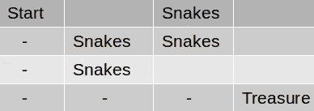
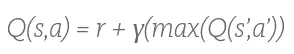
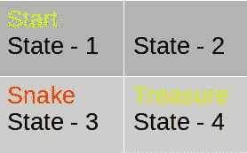
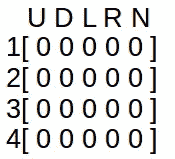
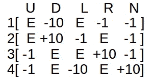
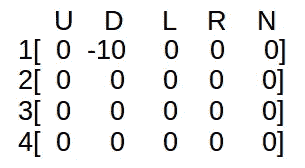
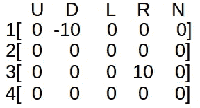
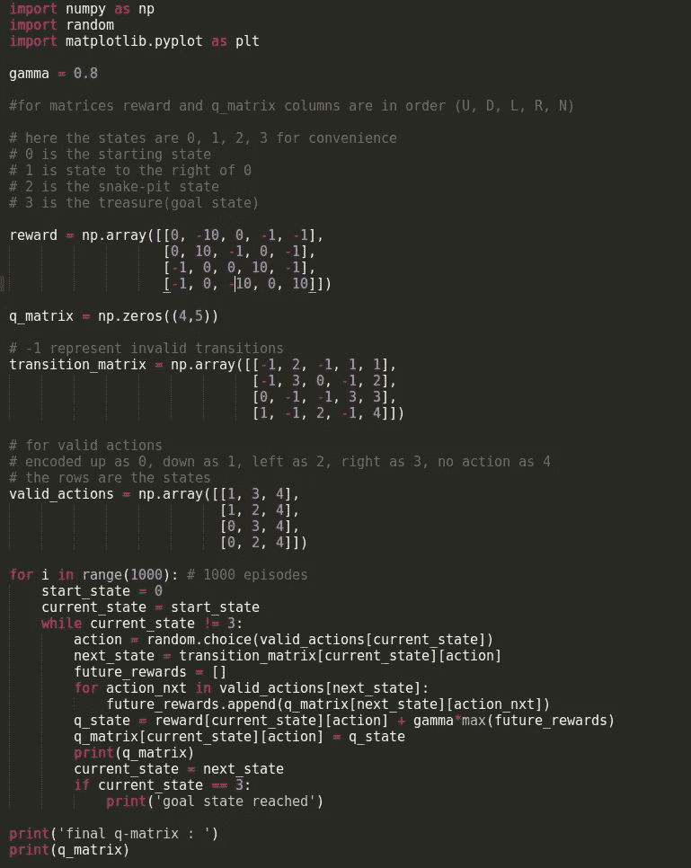
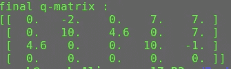

# Q 学习简介

> 原文：<https://towardsdatascience.com/introduction-to-q-learning-88d1c4f2b49c?source=collection_archive---------1----------------------->

想象自己在迷宫中寻宝。游戏如下:

你从一个给定的位置开始，起始状态。从任何状态你都可以向左、向右、向上或向下走，或者停留在同一个地方，只要你不穿过迷宫的前提。每个动作将带你到网格的一个单元(不同的状态)。现在，在其中一个州(目标州)有一个宝箱。此外，迷宫在某些位置/状态有一个蛇坑。您的目标是沿着一条没有蛇的路径从起始状态行进到目标状态。

Grid outline of the maze

当您将一个代理放入网格(我们称之为我们的环境)时，它将首先探索。它不知道什么是蛇，也不知道宝藏在哪里。所以，为了给它蛇和宝箱的概念，我们会在它完成每个动作后给它一些奖励。它每踏上一个蛇穴，我们将给予它-10 的奖励。对于宝藏，我们将给予+10 的奖励。现在我们希望我们的代理尽快完成任务(走最短的路线)。为此，我们将给予其他州-1 的奖励。然后我们会告诉它最大化分数。现在，随着代理探索，它了解到蛇对它是有害的，宝藏对它是有益的，它必须尽快得到宝藏。图中的'-'路径表示奖励最大的最短路径。

## Q-Learning 试图了解处于特定状态的价值，并在那里采取特定的行动。

我们要做的是开发一个表格。其中行是状态，列是它可以采取的动作。因此，我们有一个 16x5 (80 个可能的状态-动作)对，其中每个状态是迷宫网格的一个单元。

我们首先将该表初始化为统一的(全零)，然后当我们观察到我们从各种行为中获得的奖励时，我们相应地更新该表。我们将使用 ***贝尔曼方程*来更新表格。**

eqn.1

“s”代表当前状态。‘a’表示代理从当前状态采取的动作。s”表示该操作产生的状态。“r”是你采取行动得到的奖励，“γ”是折扣系数。所以，采取行动 a 的状态的 Q 值是即时奖励和未来奖励的折扣之和(结果状态的值)。折扣系数‘γ’决定了你对未来奖励的重视程度。比方说，你去了一个离目标州更远的州，但是从那个州开始，遇到有蛇的州的机会就更少了，所以，这里未来的奖励更多，尽管即时奖励更少。

我们将每次迭代(代理所做的尝试)称为一个情节。对于每一集，代理将试图达到目标状态，并且对于每个转换，它将继续更新 Q 表的值。

让我们看看如何计算 Q 表:

为此，为了方便起见，我们将采用一个较小的迷宫网格。

最初的 Q 表看起来像这样(状态沿着行，动作沿着列) :

Q Matrix

上、下、左、右

奖励表应该是这样的:

R Matrix

这里，E 表示零，即，不可能有这样的转变。

算法:

1.  用全零初始化 Q 矩阵。设置“γ”的值。填写奖励矩阵。
2.  每集。选择一个随机的起始状态(这里我们将起始状态限制为 state-1)。
3.  从当前状态的所有可能操作中选择一个。
4.  作为动作(a)的结果，移动到下一个状态(S’)。
5.  对于状态中所有可能的动作，选择具有最高 Q 值的一个。
6.  使用公式 1 更新 Q 表。
7.  将下一个状态设置为当前状态。
8.  如果达到目标状态，则结束。

例如:假设我们从状态 1 开始。我们可以选择 D 或 r。比如说，我们选择了 D。然后我们将到达 3(蛇坑)。因此，我们可以选择 U 或 R，取γ = 0.8，我们有:

Q(1，D) = R(1，D) + γ*[max(Q(3，U) & Q(3，R))]

Q(1，D) = -10 + 0.8*0 = -10

这里，max(Q(3，U) & Q(3，R)) = 0，因为 Q 矩阵尚未更新。-10 代表踩蛇。因此，新的 Q 表看起来像:

现在，3 是起始状态。从 3 开始，假设我们去 r。所以，我们去 4。从 4 开始，我们可以去 U 或 L。

Q(3，R) = R(3，R) + 0.8*[max(Q(4，U) & Q(4，L))]

Q(3，R) = 10 + 0.8*0 = 10

所以，现在我们已经达到了目标状态 4。所以，我们终止和更多的传递，让我们的代理理解每个状态和动作的值。继续传递，直到值保持不变。这意味着您的代理已经尝试了所有可能的状态-动作对。

python 中的实现:

最后一个 q_matrix 的输出:

在下一篇文章中，我将介绍使用神经网络进行 Q 学习，以及使用表格方法的缺点。此外，我们将致力于开放人工智能健身房的游戏测试。在那之前，再见。