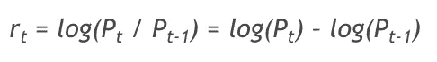
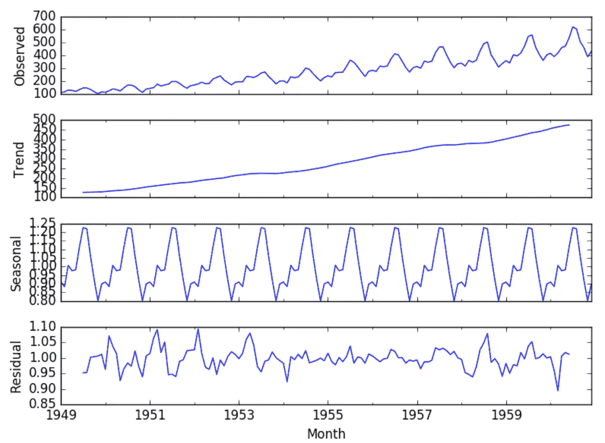
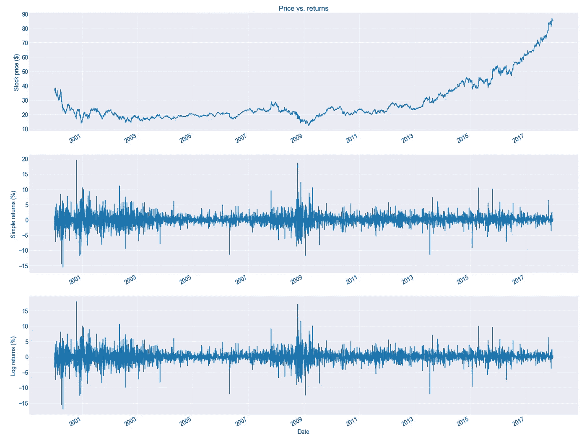
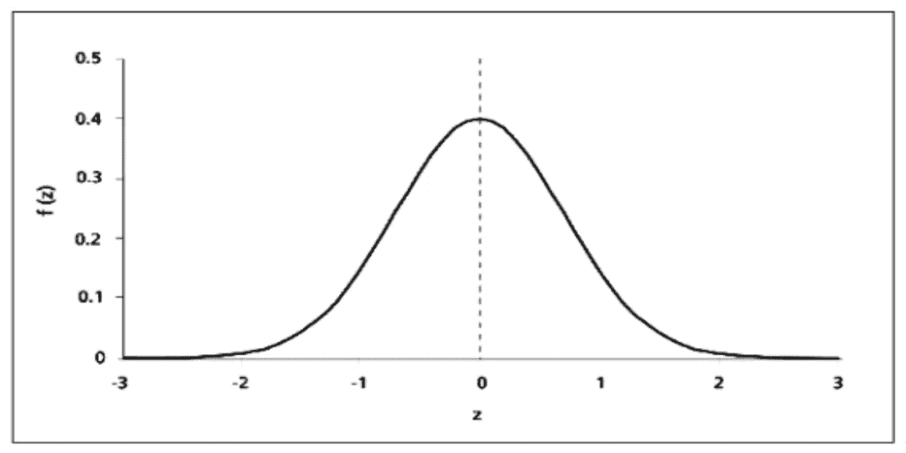
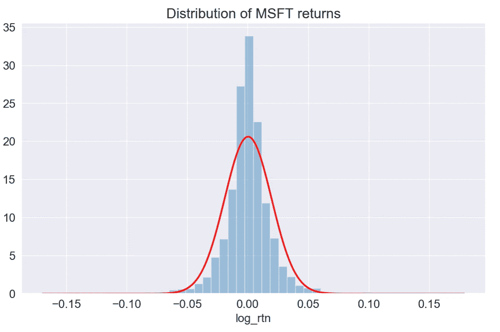
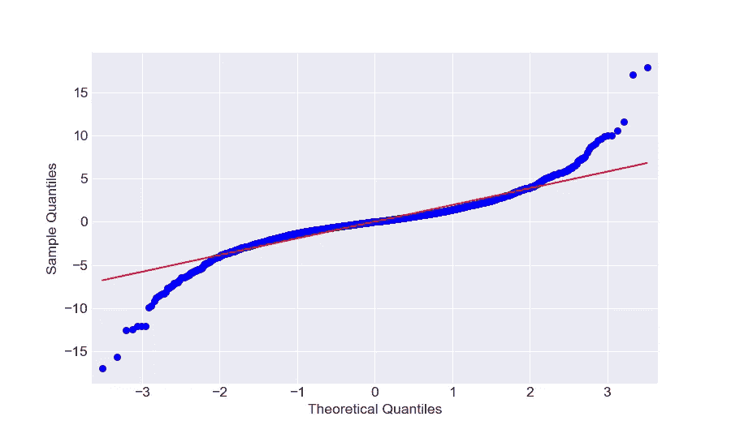
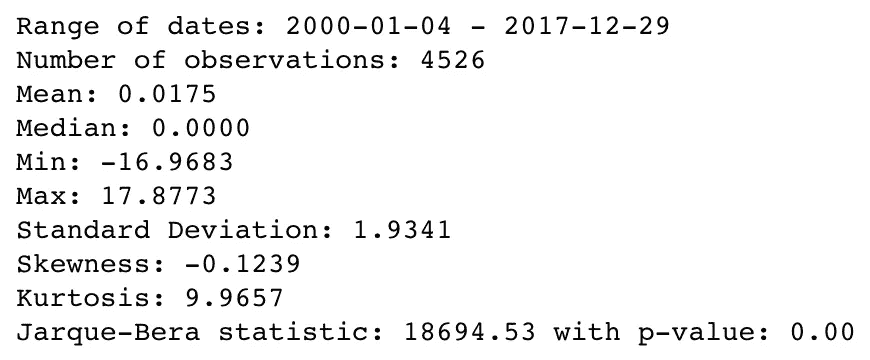
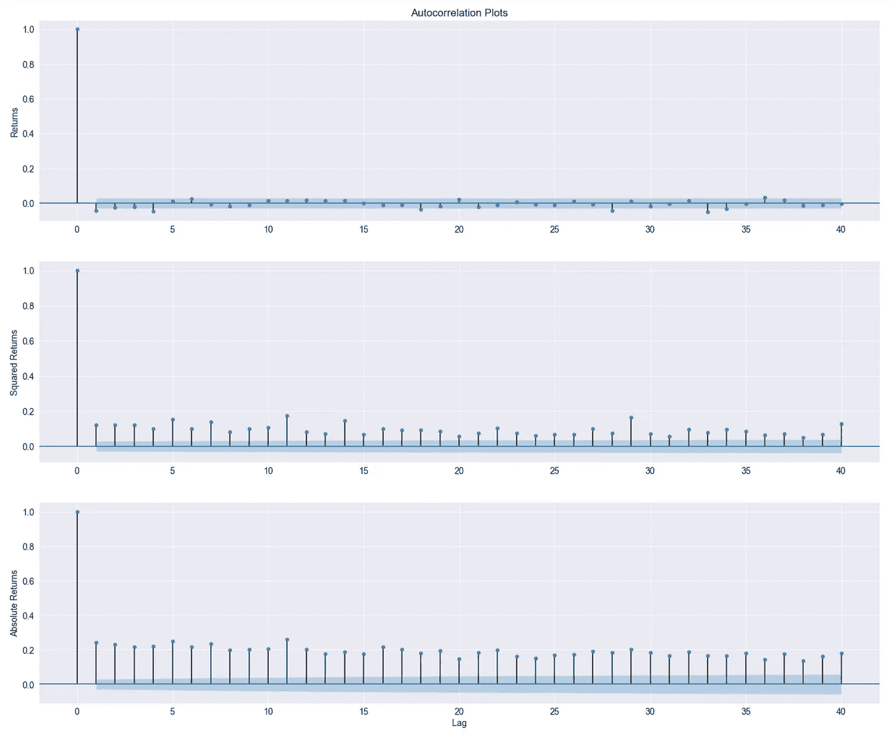

# 量化金融导论:资产回报的程式化事实

> 原文：<https://towardsdatascience.com/introduction-to-quantitative-finance-part-i-stylised-facts-of-asset-returns-5190581e40ea?source=collection_archive---------6----------------------->

作为一名具有定量金融背景的数据科学家，我一直对探索两个领域结合的可能性感兴趣。我认为这是一个令人着迷的探索领域，这就是为什么我想开始一系列的文章来描述量化金融的基础知识。

在本系列的最后，我打算提出一个简单的分配策略，并希望表明，通过使用数据科学/量化金融知识，有可能超越基本的基准策略。当然，没有人在谈论建立一个完美的模型，准确预测未来的股票价格，并使我们——潜在的投资者——赚取数百万美元。

有一个理论解释了为什么这是不可能的，即有效市场假说(EMH)。它指出，资产价格充分反映了所有可用的信息。这意味着持续跑赢市场是不可能的，因为市场价格只会对新信息做出反应。你可以在这里了解更多关于[的信息。但是我们仍然可以尝试一下，看看短期内是否有可能赚到一些钱，至少在理论上是这样的:)](https://en.wikipedia.org/wiki/Efficient-market_hypothesis)

在直接进入机器学习和建立资产配置策略之前，我认为花一些时间在基础知识上并理解我们试图建模的过程是至关重要的。在本文中，我研究了资产回报的程式化事实，并展示了如何使用 Python 来验证它们的存在。一些统计学的基础知识会有所帮助，但是当我试图直观地解释正在发生的事情时，不要气馁。

**回报以及我们为什么与他们合作**

我首先使用 Python 的`quandl`库下载历史股票价格。这非常简单，你只需要创建一个免费账户来获得 API 密匙。

在本文中，我使用调整后的收盘价，因为它们说明了可能的公司行为，如股票分割等。

我选择微软(股票代码:MSFT)作为例子，以数据帧的形式下载时间序列。然后，我将价格转换成对数回报，以便进一步分析:

其中 P_t 表示资产在时间 *t* 的价格，log 函数代表自然对数(有时也称为 *ln* )。

有一篇很棒的[文章](https://www.portfolioprobe.com/2010/10/04/a-tale-of-two-returns/)描述了简单返回和日志返回之间的区别，因此您可以在那里找到使用这两种方法的优缺点。

但是当我们已经有了价格，为什么还要处理退货呢？原因是价格通常是非平稳的，即均值和方差(数学矩)等统计数据随时间变化。这也可能意味着在我们的价格序列中观察一些趋势或季节性。正如你所想象的，通过处理回报率，我们使时间序列稳定，这是统计建模中的一个期望属性。现在，就让它这样吧。

[Decomposition](https://en.wikipedia.org/wiki/Decomposition_of_time_series) of a time series into trend/seasonal components.

下面我展示了微软价格和回报随时间的演变。

在图中可以直接观察到的一个重要事实是“波动聚集”的存在——大回报周期与小回报周期交替出现，表明波动不是恒定的。我稍后会回来。

一般来说，程式化的事实是出现在许多经验资产回报(跨时间和市场)中的统计属性。了解它们是很重要的，因为在构建代表资产价格动态的模型时，模型必须能够捕捉/复制这些属性。

# 事实 1:收益分布不正常

Standard Normal (Gaussian) distribution

据观察，回报表现为:

*   负偏度(三阶矩)——大的负回报比大的正回报更常见。目测:左尾较长；分布的质量集中在分布图的右侧。
*   超额峰度(四阶矩)——大(和小)回报比预期的更经常发生。目测:厚尾、尖峰分布。

下面，我展示了一个直方图，直观地显示了微软的对数回报的分布，以及一条代表正态概率密度曲线的线(平均值和标准偏差等于样本平均值)。我们看到，回报确实呈现出更高的峰值，而且更多的质量位于尾部(比正常情况下预期的要多)。

为了进一步检验，我还看了 Q-Q 图。红线代表标准的正态分布。在收益服从高斯分布的情况下，这两条线会对齐。然而，我们看到有差异，主要是在尾部。这进一步证实了上述发现。

关于如何创建和解释 Q-Q 图的更多细节，你可以阅读本文。

最后，我查看了所考虑的回报的描述性统计数据(它们以日价值表示，实际上，通常以年价值表示)。 [Jarque-Bera 正态性检验](https://en.wikipedia.org/wiki/Jarque%E2%80%93Bera_test)证实了我们的怀疑，p 值小到足以拒绝声称数据遵循高斯分布的零假设。

Descriptive statistics of MSFT’s log returns

# 事实 2:回报没有(或几乎没有)显著的自相关性

自相关测量给定时间序列与连续时间间隔内同一序列的滞后版本之间的相似程度。这类似于两个时间序列之间的相关性:第一个是原始形式，另一个滞后了 *n* 个周期。

例如:当某种资产的回报表现出历史上的正自相关性，并且在过去几天里价格正在上涨，人们可能会合理地预期进一步的正运动(当然，预测股票价格并不那么简单，否则成为百万富翁将是一件相当容易的事情……EMH 再次出击)。

# 事实 3:平方收益和绝对收益的自相关性小且缓慢下降

在对回报建模时，考虑波动性在决策(买/卖)过程中可能是至关重要的。波动性通常被理解为回报的标准差(方差的平方根)。

现在，让我们考虑误差，而不是回报，即实际值——由某个模型预测/解释的值。方差基本上是误差平方的平均值，而绝对偏差是绝对误差的平均值。通过绘制随时间变化的平方/绝对误差，我们可以看到方差(或绝对偏差，也是波动性的一种度量)是否随时间保持不变。在资产回报的情况下，情况并非如此，我们可以观察到高/低波动的时期。这被称为“波动聚类”，可以在对数收益的时间序列图上观察到。

另一方面，长期短期(每日)平均回报预计为零(EMH)。这就是为什么通过查看平方和绝对回报，我们可以有效地测量与预期均值的偏差，而不用查看误差的方向——平方和绝对函数都会抵消误差的方向。

下面我展示了 MSFT 对数收益的自相关图，以及平方值和绝对值(检验事实 2 和 3)。蓝色区域表示 95%的置信区间，超出该区间的点具有统计学意义。我们看到，对于对数回报，只有几个重要的点(这与事实 2 一致)。至于事实 3，我们看到相关性是显著的，平方收益比绝对收益更容易观察到相关性的下降。总之，这让我们相信，我们可以尝试利用自相关结构来进行波动建模。

ACF Plots of returns, squared and absolute returns

# 结论

在本文中，我简要介绍了资产回报的程式化事实。当然，这仅仅是触及了话题的表面。还有更多的东西需要学习，不同的资源也增加了更多的程式化事实。如果你感兴趣，我在参考资料中添加了一些额外的资源。

需要注意的一件重要事情是，不能保证所有的事实在每个收益序列中都清晰可见。这很容易受到分析中考虑的时间范围的影响。在这种情况下，我从 2000 年开始收集数据。但是没有严格的规定。使用提供的代码，您可以轻松地调查不同的时间范围和资产。

介绍完之后，在下一篇文章中，我将介绍一些预测资产回报的常用方法(也许还有它们的波动性)。在最后一篇文章中，我将试图说明，通过(或多或少准确的)预测，我们可以尝试建立资产配置策略，并调查我们是否在历史上赚了一些钱！

一如既往，我们欢迎任何建设性的反馈。你可以在推特上或评论中联系我。用于调查程式化事实的代码可以在我的 [GitHub](https://github.com/erykml/medium_articles/blob/master/Quantitative%20Finance/stylized_facts.ipynb) 上找到。

我最近出版了一本关于使用 Python 解决金融领域实际任务的书。如果你感兴趣，我在[贴了一篇文章](/introducing-my-book-python-for-finance-cookbook-de219ca0d612)介绍这本书的内容。你可以在亚马逊或者 Packt 的网站上买到这本书。

## 参考资料:

[1][https://orfe.princeton.edu/~jqfan/fan/FinEcon/chap1.pdf](https://orfe.princeton.edu/~jqfan/fan/FinEcon/chap1.pdf)

[2]资产回报的经验属性:程式化的事实和统计问题—[http://finance . martinse well . com/typed-facts/dependency/cont 2001 . pdf](http://finance.martinsewell.com/stylized-facts/dependence/Cont2001.pdf)