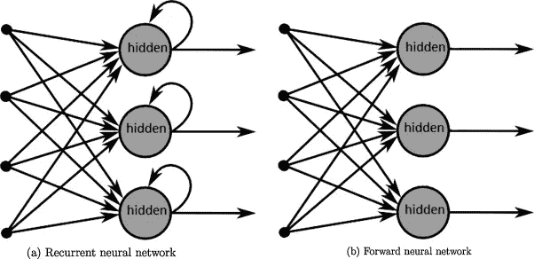

# 递归神经网络导论

> 原文：<https://towardsdatascience.com/introduction-to-recurrent-neural-network-27202c3945f3?source=collection_archive---------2----------------------->

有许多专门解决许多任务的深度学习模型。这里我们讨论深度学习模型处理序列的能力。

## **什么是顺序数据？**

如果相关事物之间有特定的顺序，我们称之为**序列。**

**《我是个好孩子》****《我是个好孩子吗》**。

你认为两个句子意思相同吗？**不！也就是说单词的位置很重要！它们是一系列单词。**

想象一个正在播放的视频。如果你已经看过了，你可以很容易地预测下一个场景。但是考虑到你困了，不记得框架的位置了(脑子里全是冗杂的框架)。那你能预测下一个场景吗？？？当然不是！！！

# **递归神经网络**

他们和我们一样！！！他们能记住序列。如果你让 RNN 预测下一个场景，它会告诉你。

**当前馈神经网络仅基于当前输入做出决策时，RNN 基于当前和先前输入做出决策。**

Recurrent Neural Network

**绿框**代表一个**神经网络**。箭头表示记忆或简单地反馈到下一个输入。

第一张图显示了 RNN。第二幅图展示了同一幅 RNN 在时间中的展开。考虑一个序列**【我是个好孩子】**。我们可以说序列是按时间排列的。**t = 0 时，X0 =“I”作为输入给出。t=1 时，X1 =“am”作为输入给出。**第一时间步的状态被记忆，并作为第二时间步的输入，与该时间步的当前输入一起给出。

在前向神经网络中，网络每个样本仅向前传播一次。但是在 RNN，网络正向传播等于每个样本的时间步数。

## **与 RNN 解决了不同的问题**

## 生成文本

给定一个单词序列，我们希望在给定前一个单词的情况下预测每个单词的概率。

## 机器翻译

机器翻译类似于语言建模，因为我们的输入是源语言(例如德语)中的单词序列。我们希望输出目标语言(例如英语)的单词序列。

## 语音识别

给定来自声波的声学信号的输入序列，我们可以预测语音片段序列及其概率。

## 生成图像描述

与卷积神经网络一起，RNNs 已经被用作模型的一部分来为未标记的图像生成描述。

## **聊天机器人**

聊天机器人可以回答你的问题。当给定一个单词序列作为输入时，将在输出端生成单词序列。