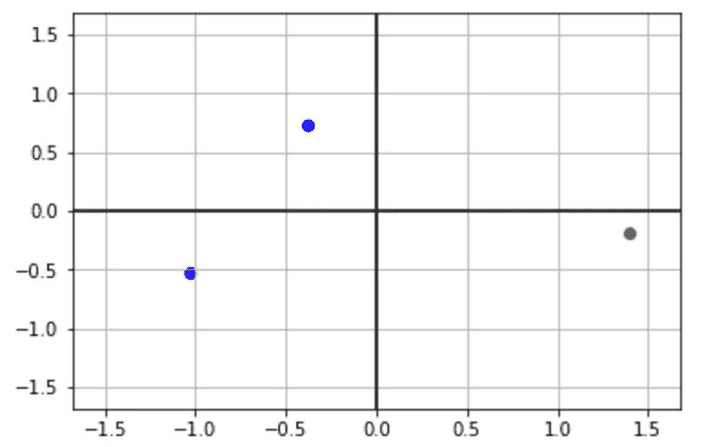
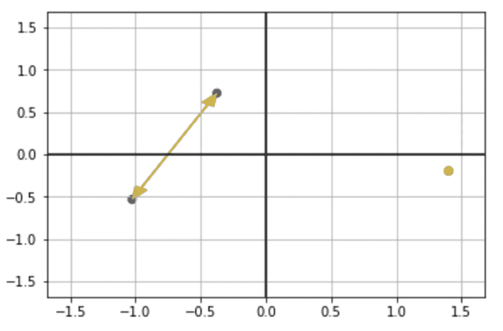
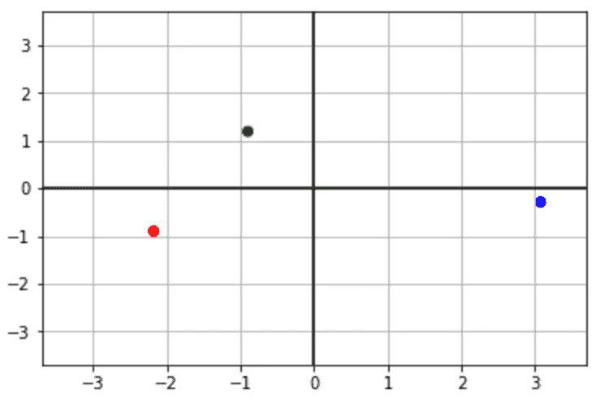
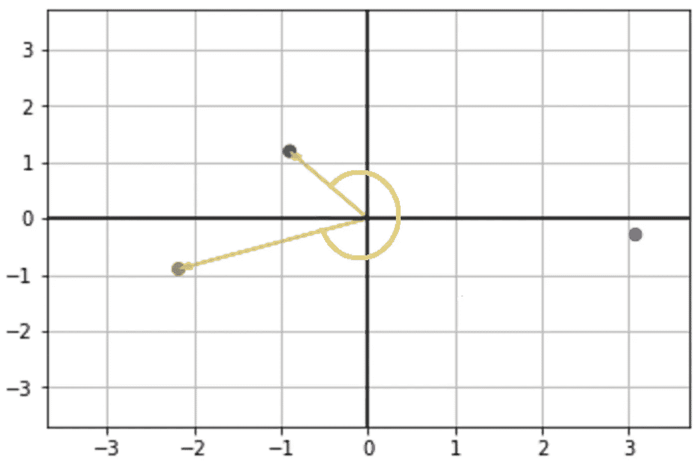

# 文本表示和相似性介绍

> 原文：<https://towardsdatascience.com/introduction-to-text-representation-and-similarity-b5dd3fd71737?source=collection_archive---------0----------------------->

机器学习和数据挖掘任务中最基本的就是比较对象的能力。我们必须在聚类、分类、查询和其他方面比较(有时是平均)对象。文本也不例外，在这篇文章中，我想探索文本的不同表示/嵌入以及一些最流行的距离/相似度函数。

首先，我想谈谈我们希望文本表示和距离/相似性函数具有什么样的属性:

1.  相同的文本必须具有相同的表示和零距离(最大相似度)。
2.  当我们有多个文本 t1、t2 和 t3 时，我们希望能够说 t1 比 t3 更类似于 t2。
3.  相似度/距离应该表达文本之间的语义比较，文本长度应该影响不大。

那么让我们开始，考虑这三句话:

```
s1 = “David loves dogs”
s2 = “Dogs are ok with David”
s3 = “Cats love rain”
```

现在假设我们想把这些句子分成两组。很明显，句子 1 和句子 2 属于同一组。但是我们如何通过编程来比较它们呢？

为此，我们将定义 2 个函数:1)向量函数，它获取某个句子并返回表示该句子的向量。以及 2)距离函数，其接收两个向量并返回它们如何远离或相似。

最基本的表达句子的方式是使用一组单词。在大多数情况下，我们会希望预处理我们的文本，以减少噪音。预处理可能包括小写、词干、删除停用词等。在我们的例子中，我们将把单词转换成它的基本形式，并去掉无用的单词。所以句子是:

```
s1 = (“david”, “love”, “dog”)
s2 = (“dog”,”ok”,”david”)
s3 = (“cat”,”love”,”rain”)
```

比较这些句子，我们可以用 [Jaccard 相似度](https://en.wikipedia.org/wiki/Jaccard_index)。Jaccard 相似度是两个句子的常用词数量(交集)和总词数量(并集)之间的比例。句子 1 和 2 的并集是(“大卫”、“爱”、“狗”、“好”)，交集是(“大卫”、“狗”)，所以 Jaccard 相似度将是 2/4 = 0.5。

另一方面，句子 1 和 3 之间的 Jaccard 相似度是 1/6 = 0.166，句子 2 和 3 之间的相似度是 0/6 = 0。

虽然这种方法解决了我们的问题，但也有一些缺点。概括这些缺点的最佳方式是表示和距离函数都不是“数学的”，即我们不能进行句子平均，例如，使用其他数学函数操纵距离函数(如求导)。

为了解决这个问题，我们必须用一种更科学的方式来表达我们的句子:[向量](https://en.wikipedia.org/wiki/Vector_space)。

这非常简单:我们将使用语料库中的所有单词(所有句子)构建一个词汇表，每个单词都有一个索引。在我们的示例中，它看起来像这样:

```
{'cat': 0, 'david': 1, 'dog': 2, 'love': 3, 'ok': 4, 'rain': 5}
```

我们将把每个句子表示为一个 6 维向量，并在索引中为每个单词存储 1，在其他地方存储 0。以下是我们的句子:

```
s1 = [0, 1, 1, 1, 0, 0]     
s2 = [0, 1, 1, 0, 1, 0]    
s3 = [1, 0, 0, 1, 0, 1] 
```

现在，每个句子只是 6 维空间中的一个点(或一个向量)。以下是我们使用主成分分析法在二维空间中将其可视化后的效果:



Sentence 1 and 2 — Blue, Sentence 3 — Red

你可以看到第一句和第二句的观点都比第三句更接近。有很多种方式来表达他们之间的距离。最直观的是“[欧几里德距离](https://en.wikipedia.org/wiki/Euclidean_distance)”(也叫 L2 范数)其中计算这条线:



当然，没必要自己实现；有很多实现(例如 python 中的 numpy.linalg.norm)。

这是欧几里德距离的值:

```
 ╔══════╦════════╦════════╦════════╗
                 ║      ║   **S1**   ║   **S2**   ║   **S3**   ║  
                 ╠══════╬════════╬════════╬════════╣
                 ║ **S1**   ║    0   ║  1.41  ║    2   ║
                 ╠══════╬════════╬════════╬════════╣
                 ║ **S2**   ║  1.41  ║   0    ║  2.44  ║
                 ╠══════╬════════╬════════╬════════╣
                 ║ **S2**   ║    2   ║  2.44  ║    0   ║
                 ╚══════╩════════╩════════╩════════╝
```

它看起来不错，但还是有一些缺点。很多时候，文本语义是由某个词出现的次数决定的。例如，如果我们阅读一篇关于“向量”的文章，那么“向量”这个术语会出现很多次。在这种情况下，在我们的文本向量中只使用二进制值将忽略文本的真正语义。最简单的解决方案是将单词出现的次数存储在向量的正确位置。

考虑这些句子:

```
s1 = “David loves dogs dogs dogs dogs”
s2 = “Dogs are ok with David”
s3 = “Cats love rain”
```

当然，第一句话在语法上是不正确的，但是我们可以说它是关于狗的。让我们看看相应的向量:

```
s1 = [0, 1, 5, 1, 0, 0]     
s2 = [0, 1, 1, 0, 1, 0]    
s3 = [1, 0, 0, 1, 0, 1]
```

这几个向量和前面的唯一区别是，这一次，我们在第一个句子向量的“狗”位置存储 5。

让我们再次使用 PCA 绘制这些向量:



Sentence 1 — Blue, Sentence 2 — Green, Sentence 3 — Red

看看发生了什么；现在，句子 2(绿色)和 3(红色)比 1(蓝色)和 2(绿色)更接近。这对我们非常不利，因为我们不能表达句子的语义。

这个问题最典型的解决方案是，我们可以比较两个向量之间的角度，而不是计算两点之间的距离，例如，这些值:



你可以看到句子 1 和 2 的角度比 1 和 3 或者 2 和 3 更近。实际的相似性度量被称为“[余弦相似性](https://en.wikipedia.org/wiki/Cosine_similarity)，它是两个向量之间角度的余弦。0 的余弦是 1(最相似)，180 的余弦是 0(最不相似)。

这样，我们能够更好地表示文本的语义，以及比较文本对象。

**结论**

我们看到了表示文本和比较文本对象的不同方法。没有更好或最好的方法，在文本机器学习和数据挖掘相关任务中有许多类型的问题和挑战，我们应该了解并选择适合我们的选项。

还有许多其他的表示和距离/相似性函数，包括 TfIdf 和 Word2Vec，它们是非常常见的文本表示(我希望我会再写一篇文章)。