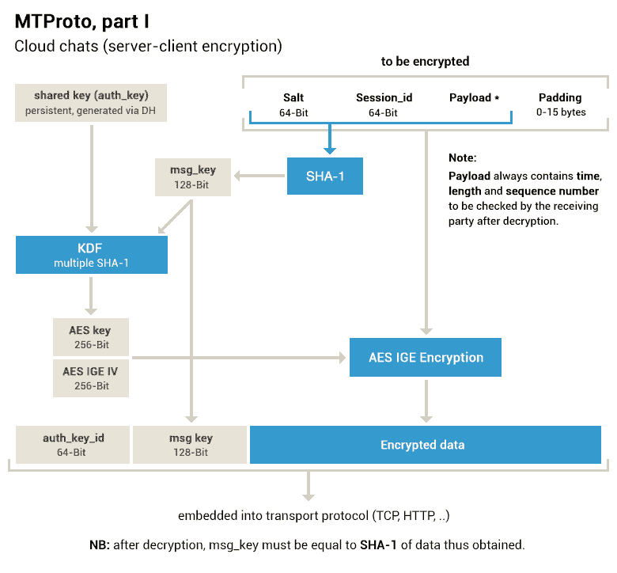
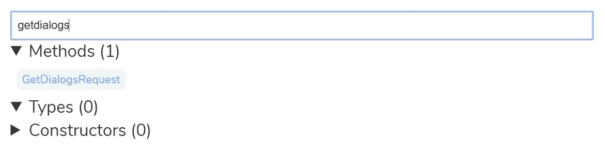
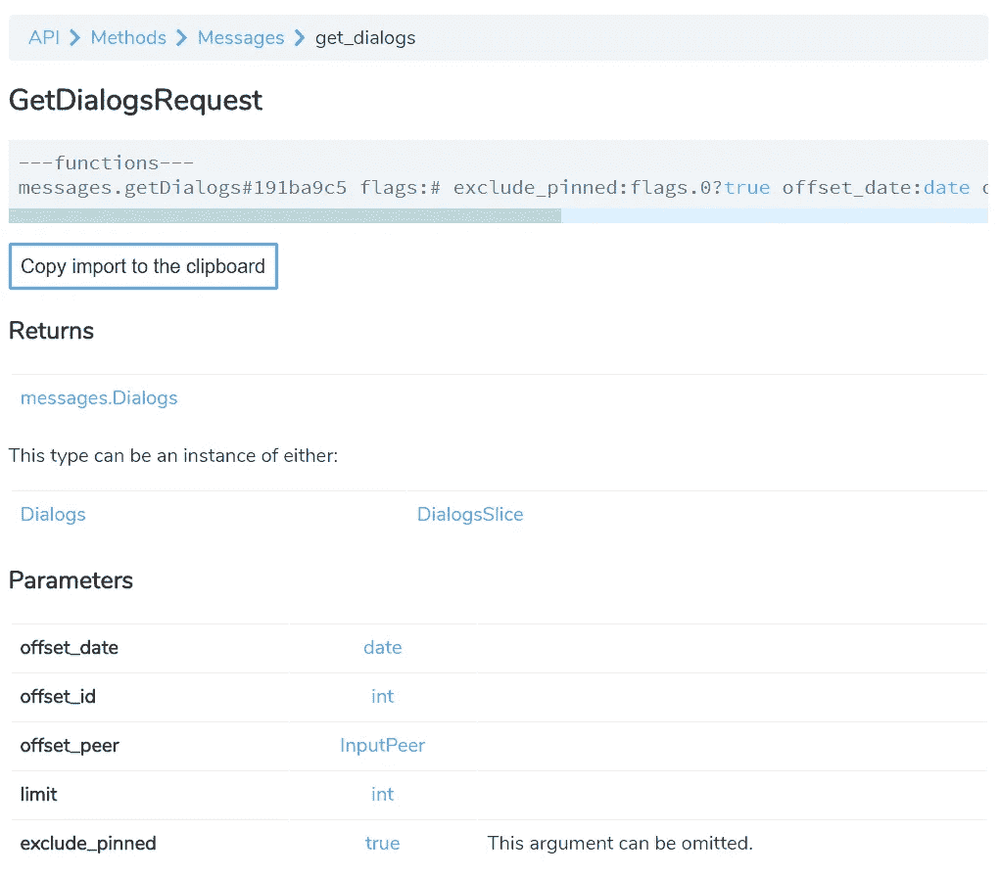
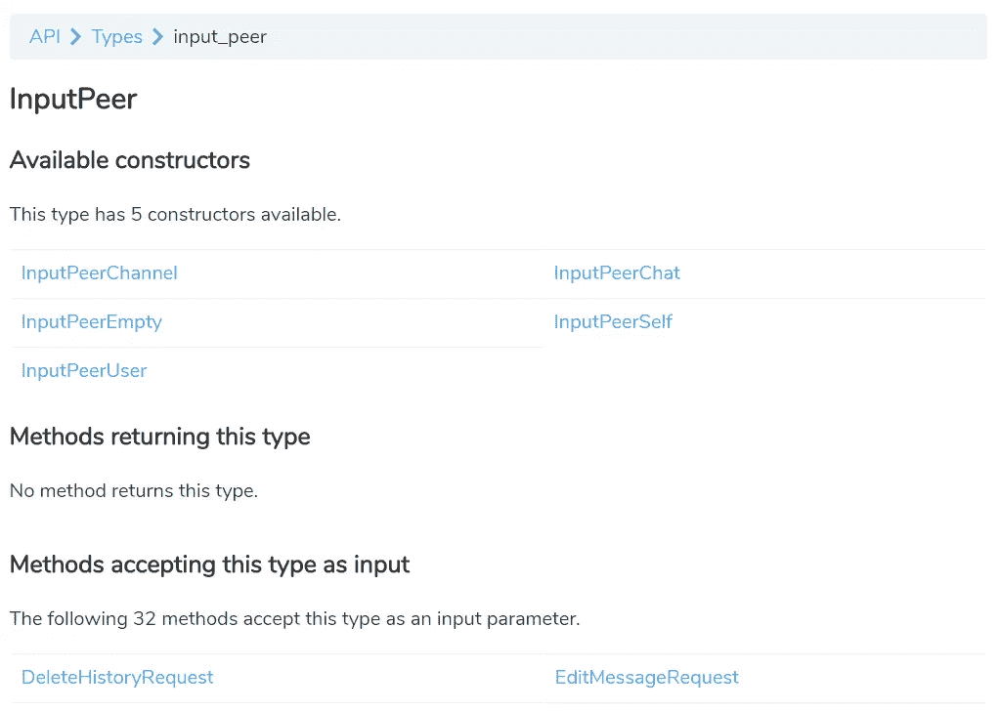

# 电报 API 简介

> 原文：<https://towardsdatascience.com/introduction-to-the-telegram-api-b0cd220dbed2?source=collection_archive---------0----------------------->

## 用程序分析你的电报通话记录

T [elegram](https://telegram.org/) 是一种即时通讯服务，就像 WhatsApp、Facebook Messenger 和微信一样。近年来，它因为各种原因而广受欢迎:它的非盈利性质、跨平台支持、安全承诺 [](#ed69) ，以及它的[开放 API](https://core.telegram.org/api)。

在这篇文章中，我们将使用 [Telethon](https://github.com/LonamiWebs/Telethon) ，一个用于 Telegram API 的 Python 客户端库，来统计我们每个 Telegram 聊天中的消息数量。

# 电报 API


“ **Telegram** has an open [API](https://core.telegram.org/api) and [protocol](https://core.telegram.org/mtproto) free for everyone.” — Telegram homepage

Telegram 的 API 中最著名的是它的 Bot API，这是一个基于 HTTP 的 API，供开发人员与 Bot 平台进行交互。Bot API 允许开发者控制电报机器人，例如接收消息和回复其他用户。

除了 Bot API，还有 Telegram API 本身。这是 Telegram 应用程序使用的 API，用于您在 Telegram 上的所有操作。仅举几个例子:查看您的聊天记录、发送和接收消息、更改您的显示图片或创建新群组。通过 Telegram API，你可以用编程的方式做你在 Telegram 应用程序中能做的任何事情。

Telegram API 比 Bot API 复杂得多。您可以使用标准 JSON、表单或查询字符串有效负载通过 HTTP 请求访问 Bot API，而 Telegram API 使用自己的自定义有效负载格式和加密协议。

# 电报 API



Diagram for MTProto server-client flow

MTProto 是定制的加密方案，支持 Telegram 的安全承诺。它是一种应用层协议，直接写入底层传输流，如 TCP 或 UDP，以及 HTTP。幸运的是，在使用客户端库时，我们不需要直接关心它。另一方面，为了进行 API 调用，我们确实需要理解有效载荷的格式。

## 类型语言

Telegram API 是基于 RPC 的，因此与 API 的交互包括发送表示函数调用的有效载荷和接收结果。例如，读取一个对话的内容包括用必要的参数调用`messages.getMessage`函数，并接收一个`messages.Messages`作为返回。

类型语言或 TL 用于表示 API 使用的类型和函数。TL 模式是可用类型和函数的集合。在 MTProto 中，TL 构造在作为 MTProto 消息的有效载荷嵌入之前将被[序列化为二进制形式](https://core.telegram.org/mtproto/serialize)，但是我们可以将此留给我们将使用的客户端库。

一个 TL 模式的例子(首先声明类型，然后声明函数，函数之间用分隔符隔开):

```
auth.sentCode#efed51d9 phone_registered:Bool phone_code_hash:string send_call_timeout:int is_password:Bool = auth.SentCode;auth.sentAppCode#e325edcf phone_registered:Bool phone_code_hash:string send_call_timeout:int is_password:Bool = auth.SentCode;---functions---auth.sendCode#768d5f4d phone_number:string sms_type:int api_id:int api_hash:string lang_code:string = auth.SentCode;
```

使用上述 TL 模式中的函数和类型的 TL 函数调用和结果，以及等效的二进制表示(来自[官方文档](https://core.telegram.org/method/auth.sendCode)):

```
(auth.sendCode "79991234567" 1 32 "test-hash" "en")
=
(auth.sentCode
  phone_registered:(boolFalse)
  phone_code_hash:"2dc02d2cda9e615c84"
)

d16ff372 3939370b 33323139 37363534 00000001 00000020 73657409 61682d74 00006873 e77e812d
=
2215bcbd bc799737 63643212 32643230 39616463 35313665 00343863 e12b7901
```

## TL-模式层

电报 API 使用 TL 模式层进行版本控制；每一层都有一个唯一的 TL 模式。Telegram 网站包含当前的 TL 模式和 https://core.telegram.org/schema[的先前层。](https://core.telegram.org/schema)

看起来是这样，事实证明，虽然 Telegram 网站上最新的 TL-Schema 层是第 23 层，但在撰写本文时，最新的层实际上已经是第 71 层了。你可以在这里找到最新的 TL-Schema。

# 入门指南

## 创建电报应用程序

您将需要获得一个`api_id`和`api_hash`来与电报 API 交互。请遵循官方文档中的说明:[https://core.telegram.org/api/obtaining_api_id](https://core.telegram.org/api/obtaining_api_id)。

您必须访问[https://my.telegram.org/](https://my.telegram.org/)，使用您的电话号码和确认码登录，确认码将通过电报发送，并在“API 开发工具”下的表格中填写应用标题和简称。之后，你可以在同一个地方找到你的`api_id`和`api_hash`。

或者，相同的说明提到您可以使用电报源代码中的样本凭证进行测试。为了方便起见，我将在这里的示例代码中使用我在 GitHub 上的 [Telegram 桌面源代码中找到的凭证。](https://github.com/telegramdesktop/tdesktop)

## 安装天线

我们将使用 Telethon 与 Telegram API 通信。Telethon 是用于 Telegram API 的 Python 3 客户端库(这意味着您必须使用 Python 3 ),它将为我们处理所有特定于协议的任务，因此我们只需要知道使用什么类型和调用什么函数。

您可以使用`pip`安装 Telethon:

```
pip install telethon
```

使用与您的 Python 3 解释器相对应的`pip`；这可能是`pip3`代替。(随机:最近 Ubuntu 17.10 发布了，它使用 Python 3 作为默认的 Python 安装。)

## 创建客户端

在开始与 Telegram API 交互之前，您需要用您的`api_id`和`api_hash`创建一个客户端对象，并用您的电话号码对其进行认证。这类似于在新设备上登录 Telegram 你可以把这个客户端想象成另一个 Telegram 应用。

下面是创建和验证客户端对象的一些代码，修改自 Telethon 文档:

```
from telethon import TelegramClient
from telethon.errors.rpc_errors_401 import SessionPasswordNeededError

# (1) Use your own values here
api_id = 17349
api_hash = '344583e45741c457fe1862106095a5eb'

phone = 'YOUR_NUMBER_HERE'
username = 'username'

# (2) Create the client and connect
client = TelegramClient(username, api_id, api_hash)
client.connect()

# Ensure you're authorized
if not client.is_user_authorized():
    client.send_code_request(phone)
    try:
        client.sign_in(phone, input('Enter the code: '))
    except SessionPasswordNeededError:
        client.sign_in(password=input('Password: '))

me = client.get_me()
print(me)
```

如前所述，上面的`api_id`和`api_hash`来自电报桌面源代码。将您自己的电话号码放入`phone`变量中。

Telethon 将在其工作目录中创建一个`.session`文件来保存会话细节，就像你不必在每次关闭和重新打开 Telegram 应用程序时重新验证它们一样。文件名将以`username`变量开始。如果您想使用多个会话，您可以决定是否要更改它。

如果没有之前的会话，运行此代码将通过电报向您发送授权代码。如果您在电报帐户上启用了两步验证，您还需要输入您的电报密码。认证一次并保存`.session`文件后，即使您再次运行脚本，您也不必再次重新认证，直到您的会话到期。

如果成功创建并验证了客户机，应该会在控制台上打印出一个代表您自己的对象。它看起来类似于(省略号`…`表示跳过了一些内容):

```
User(is_self=True … first_name='Jiayu', last_name=None, username='USERNAME', phone='PHONE_NUMBER' …
```

现在，您可以使用这个客户机对象开始向 Telegram API 发出请求。

# 使用电报 API

## 检查 TL 模式

如前所述，使用 Telegram API 包括调用 TL 模式中的可用函数。在这种情况下，我们对`messages.GetDialogs`函数感兴趣。我们还需要注意函数参数中的相关类型。下面是我们将用来发出这个请求的 TL 模式的一个子集:

```
messages.dialogs#15ba6c40 dialogs:Vector<Dialog> messages:Vector<Message> chats:Vector<Chat> users:Vector<User> = messages.Dialogs;messages.dialogsSlice#71e094f3 count:int dialogs:Vector<Dialog> messages:Vector<Message> chats:Vector<Chat> users:Vector<User> = messages.Dialogs;---functions---messages.getDialogs#191ba9c5 flags:# exclude_pinned:flags.0?true offset_date:int offset_id:int offset_peer:InputPeer limit:int = messages.Dialogs;
```

这并不容易理解，但请注意，`messages.getDialogs`函数将返回一个`messages.Dialogs`，它是一个抽象类型，用于包含`Dialog`、`Message`、`Chat`和`User`向量的`messages.dialogs`或`messages.dialogsSlice`对象。

## 使用 Telethon 文档

幸运的是，Telethon 文档给出了关于如何调用这个函数的更多细节。从[https://lonamiwebs.github.io/Telethon/index.html](https://lonamiwebs.github.io/Telethon/index.html)，如果您在搜索框中键入`getdialogs`，您将看到一个名为`GetDialogsRequest`的方法的结果(TL-Schema 函数由 Telethon 中的`*Request`对象表示)。



`GetDialogsRequest`的文档陈述了方法的返回类型以及关于参数的更多细节。当我们想要使用这个对象时,“复制导入到剪贴板”按钮特别有用，就像现在。



[https://lonamiwebs.github.io/Telethon/methods/messages/get_dialogs.html](https://lonamiwebs.github.io/Telethon/methods/messages/get_dialogs.html)

`messages.getDialogs`函数以及`GetDialogsRequest`的构造函数接受一个`InputPeer`类型的`offset_peer`参数。在 GetDialogsRequest 的文档中，单击`InputPeer`链接可以看到一个页面，其中描述了获取和返回该类型的构造函数和方法。



[https://lonamiwebs.github.io/Telethon/types/input_peer.html](https://lonamiwebs.github.io/Telethon/types/input_peer.html)

因为我们想创建一个`InputPeer`对象作为`GetDialogsRequest`的参数，所以我们对`InputPeer`的构造函数感兴趣。在这种情况下，我们将使用`InputPeerEmpty`构造函数。再次点击进入`InputPeerEmpty`页面，复制它的导入路径来使用它。`InputPeerEmpty`构造函数没有参数。

## 提出请求

下面是我们完成的`GetDialogsRequest`以及如何通过将它传递给我们授权的客户端对象来获得它的结果:

```
from telethon.tl.functions.messages import GetDialogsRequest
from telethon.tl.types import InputPeerEmpty

get_dialogs = GetDialogsRequest(
    offset_date=None,
    offset_id=0,
    offset_peer=InputPeerEmpty(),
    limit=30,
)dialogs = client(get_dialogs)
print(dialogs)
```

在我的例子中，我得到了一个包含对话、消息、聊天和用户列表的`DialogsSlice`对象，正如我们基于 TL-Schema 所期望的:

```
DialogsSlice(count=204, dialogs=[…], messages=[…], chats=[…], users=[…])
```

收到一个`DialogsSlice`而不是`Dialogs`意味着不是我所有的对话框都被返回，但是`count`属性告诉我我总共有多少个对话框。如果您的对话少于某个数量，您可能会收到一个`Dialogs`对象，在这种情况下，您的所有对话都被返回，您拥有的对话的数量就是向量的长度。

## 术语

Telegram API 使用的术语有时可能会有点混乱，尤其是在缺少类型定义以外的信息的情况下。什么是“对话”、“消息”、“聊天”和“用户”？

*   `dialogs`代表您的对话历史中的对话
*   `chats`代表与您的对话历史中的对话相对应的群组和频道
*   `messages`包含发送给每个对话的最后一条消息，就像您在 Telegram 应用程序的对话列表中看到的那样
*   `users`包含您与之进行一对一聊天的个人用户，或者向您的某个群组发送最后一条消息的人

例如，如果我的聊天记录是我从 Play Store 中的 [Telegram 应用程序获取的截图:](https://play.google.com/store/apps/details?id=org.telegram.messenger)


`dialogs`将包含截图中的对话:老海盗，新闻发布室，莫妮卡，吉安娜…

将包含老海盗、新闻发布室和 Meme 工厂的条目。

`messages`将包含消息“请上车！”来自老海盗，“哇，提得好！”从新闻发布室，一条代表发给莫妮卡的照片的消息，一条代表吉安娜的回复的消息等等。

`users`将包含自从 Ashley 向新闻发布室发送最后一条消息以来的条目，以及自从他向 Meme 工厂发送最后一条消息以来的 Monika、Jaina、Kate 和 Winston 的条目。

(我还没有通过 Telegram API 处理过秘密聊天，所以我不确定它们是如何处理的。)

## 计数消息

我们的目标是统计每次对话中的消息数量。要获得一个会话的消息数量，我们可以使用 TL-Schema 中的`messages.getHistory`函数:

```
messages.getHistory#afa92846 peer:[InputPeer](https://lonamiwebs.github.io/Telethon/types/input_peer.html) offset_id:[int](https://lonamiwebs.github.io/Telethon/index.html#int) offset_date:[date](https://lonamiwebs.github.io/Telethon/index.html#date) add_offset:[int](https://lonamiwebs.github.io/Telethon/index.html#int) limit:[int](https://lonamiwebs.github.io/Telethon/index.html#int) max_id:[int](https://lonamiwebs.github.io/Telethon/index.html#int) min_id:[int](https://lonamiwebs.github.io/Telethon/index.html#int) = [messages.Messages](https://lonamiwebs.github.io/Telethon/types/messages/messages.html)
```

按照与前面使用`messages.getDialogs`类似的过程，我们可以使用`GetHistoryRequest`来解决如何使用 Telethon 调用它。这将返回一个`Messages`或`MessagesSlice`对象，或者包含一个`count`属性，告诉我们一个对话中有多少条消息，或者一个对话中的所有消息，这样我们就可以计算它包含的消息数。

然而，我们首先必须为我们的`GetHistoryRequest`构建正确的`InputPeer`。这一次，我们使用`InputPeerEmpty`,因为我们想要检索特定对话的消息历史。相反，我们必须根据对话的性质使用`InputPeerUser`、`InputPeerChat`或`InputPeerChannel`构造函数。

## 操纵响应数据

为了统计每个对话中的消息数量，我们必须为该对话创建一个`GetHistoryRequest`，并为该对话创建相应的`InputPeer`。

所有相关的`InputPeer`构造函数都采用相同的`id`和`access_hash`参数，但是根据对话是一对一聊天、群组还是频道，这些值出现在`GetDialogsRequest`响应的不同位置:

*   `dialogs`:我们希望对其中的消息进行计数的会话列表，包含一个`peer`值，以及对应于该会话的对等方的类型和`id`，但不包含`access_hash`。
*   `chats`:包含`id`、`access_hash`以及本集团和频道的标题。
*   `users`:包含我们个人聊天的`id`、`access_hash`和名字。

在伪代码中，我们有:

```
let counts be a mapping from conversations to message countsfor each dialog in dialogs:
    if dialog.peer is a channel:
        channel = corresponding object in chats
        name = channel.title
        id = channel.id
        access_hash = channel.access_hash
        peer = InputPeerChannel(id, access_hash)
    else if dialog.peer is a group:
        group = corresponding object in chats
        name = group.title
        id = group.id
        peer = InputPeerChat(id)
    else if dialog.peer is a user:
        user = corresponding object in users
        name = user.first_name
        id = user.id
        access_hash = user.access_hash
        peer = InputPeerUser(id, access_hash) history = message history for peer
    count = number of messages in history counts[name] = count
```

转换成 Python 代码(注意上面的`dialogs`、`chats`和`users`是我们的`GetDialogsRequest`的结果的成员，也称为`dialogs`):

```
counts = {}

# create dictionary of ids to users and chats
users = {}
chats = {}

for u in dialogs.users:
    users[u.id] = u

for c in dialogs.chats:
    chats[c.id] = c

for d in dialogs.dialogs:
    peer = d.peer
    if isinstance(peer, PeerChannel):
        id = peer.channel_id
        channel = chats[id]
        access_hash = channel.access_hash
        name = channel.title

        input_peer = InputPeerChannel(id, access_hash)
    elif isinstance(peer, PeerChat):
        id = peer.chat_id
        group = chats[id]
        name = group.title

        input_peer = InputPeerChat(id)
    elif isinstance(peer, PeerUser):
        id = peer.user_id
        user = users[id]
        access_hash = user.access_hash
        name = user.first_name

        input_peer = InputPeerUser(id, access_hash)
    else:
        continue

    get_history = GetHistoryRequest(
        peer=input_peer,
        offset_id=0,
        offset_date=None,
        add_offset=0,
        limit=1,
        max_id=0,
        min_id=0,
    )

    history = client(get_history)
    if isinstance(history, Messages):
        count = len(history.messages)
    else:
        count = history.count

    counts[name] = count

print(counts)
```

我们的`counts`对象是一个聊天名称到消息计数的字典。我们可以对它进行排序和漂亮的打印，以查看我们的热门对话:

```
sorted_counts = sorted(counts.items(), key=lambda x: x[1], reverse=True)
for name, count in sorted_counts:
    print('{}: {}'.format(name, count))
```

示例输出:

```
Group chat 1: 10000
Group chat 2: 3003
Channel 1: 2000
Chat 1: 1500
Chat 2: 300
```

## 图书馆魔术

Telethon 有一些帮助功能来简化常见操作。实际上，我们可以用其中的两个帮助器方法来完成上面的工作，`client.get_dialogs()`和`client.get_message_history()`，取而代之:

```
from telethon.tl.types import User

_, entities = client.get_dialogs(limit=30)

counts = []
for e in entities:
    if isinstance(e, User):
        name = e.first_name
    else:
        name = e.title

    count, _, _ = client.get_message_history(e, limit=1)
    counts.append((name, count))

message_counts.sort(key=lambda x: x[1], reverse=True)
for name, count in counts:
    print('{}: {}'.format(name, count))
```

然而，我觉得首先直接调用 Telegram API 方法是一种更好的学习体验，特别是因为没有一个助手方法适用于所有情况。然而，有一些事情使用 helper 方法要简单得多，比如我们如何在开始时认证我们的客户端，或者上传文件之类的动作，否则这些动作会很乏味。

# 包扎

这个例子的完整代码可以在这里找到一个要点:[https://Gist . github . com/yi-Jiayu/7b 34260 cfbfa 6 CB C2 b 4464 edd 41 def 42](https://gist.github.com/yi-jiayu/7b34260cfbfa6cbc2b4464edd41def42)

使用 Telegram API 可以做更多的事情，尤其是从分析的角度来看。在想到我的一个老项目后，我开始研究这个项目，试图从导出的 WhatsApp 聊天记录中创建数据可视化:[https://github.com/yi-jiayu/chat-analytics](https://github.com/yi-jiayu/chat-analytics)。

使用 regex 解析通过电子邮件发送的纯文本聊天记录，我可以生成一个类似于 GitHub punch card 存储库图表的图表，显示一周中的哪些时间聊天最活跃:


然而，使用“电子邮件聊天”功能来导出是相当粗糙的，你需要手动导出每个聊天的对话历史，一旦你收到新消息，它就会过时。我并没有继续这个项目，但是我一直认为可以从聊天记录中获得其他见解。

通过编程访问聊天记录，Telegram 聊天可以做更多的事情。像`messages.search`这样的方法对我来说非常有用。也许是动态生成高峰和低谷对话的统计数据，或者是持续活跃的对话，或者是找到你最喜欢的表情符号或最常见的 n 字母组合？天空是极限(或 API 速率极限，以较低者为准)。

## 更新

(2017–10–25 09:45 SGT)修改了消息计数以跳过意外对话框

1.  [^](#12b2) 就我个人而言，我不能对 Telegram 的安全性发表评论，只能指出 Telegram 的对话在默认情况下不是端到端加密的，并提到 Telegram 的加密协议是自行开发的，与 Signal Protocol 等更成熟的协议相比，它受到的审查更少。