# 各种强化学习算法介绍。第一部分(Q-Learning，SARSA，DQN，DDPG)

> 原文：<https://towardsdatascience.com/introduction-to-various-reinforcement-learning-algorithms-i-q-learning-sarsa-dqn-ddpg-72a5e0cb6287?source=collection_archive---------0----------------------->

强化学习(RL)是指一种机器学习方法，在这种方法中，智能体在下一个时间步接收延迟奖励，以评估其先前的行为。它主要用于游戏(如雅达利、马里奥)，性能与人类相当甚至超过人类。最近，随着算法随着神经网络的结合而发展，它能够解决更复杂的任务，例如钟摆问题:

Deep Deterministic Policy Gradient (DDPG) Pendulum OpenAI Gym using Tensorflow

虽然有大量的 RL 算法，但似乎没有对它们中的每一个进行全面的比较。在决定将哪些算法应用于特定任务时，我很难抉择。本文旨在通过简要讨论 RL 设置来解决这个问题，并介绍一些著名的算法。

# 1.强化学习 101

通常，RL 设置由两个组件组成，代理和环境。

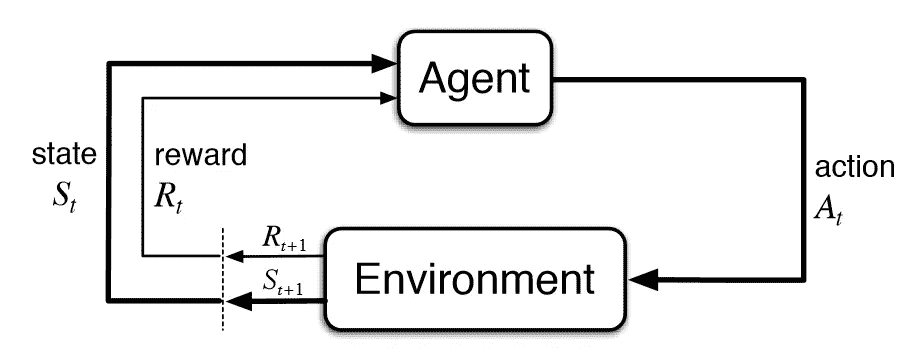

Reinforcement Learning Illustration ([https://i.stack.imgur.com/eoeSq.png](https://i.stack.imgur.com/eoeSq.png))

那么环境是指智能体所作用的对象(例如 Atari 游戏中的游戏本身)，而智能体则代表 RL 算法。该环境首先向代理发送一个状态，然后代理根据它的知识采取行动来响应该状态。之后，环境发送一对下一个状态和奖励给代理。代理将使用环境返回的奖励更新其知识，以评估其最后的动作。循环继续，直到环境发送一个终端状态，结束于 epset。

大多数 RL 算法都遵循这种模式。在下面的段落中，我将简要地谈谈 RL 中使用的一些术语，以便于我们在下一节中进行讨论。

## 定义

1.  动作(A):代理可以采取的所有可能的动作
2.  状态:环境返回的当前情况。
3.  奖励(R):从环境中发送回来的对上次行为进行评估的即时回报。
4.  策略(π):代理用来根据当前状态确定下一步行动的策略。
5.  价值(V):相对于短期回报 R. *Vπ(s)* 贴现的预期长期回报定义为当前状态下的预期长期回报。
6.  Q-value 或 action-value (Q): Q-value 类似于 value，除了它需要一个额外的参数，即当前动作 *a* 。 *Qπ(s，a)* 指长期返回当前状态 *s* ，在策略π下采取行动 *a* 。

## 无模型 vs .基于模型

该模型代表对环境动态的模拟。即，模型学习从当前状态 s *0* 和动作 a 到下一状态 s *1* 的转换概率 *T(s1|(s0，a))* 。如果成功学习了转移概率，代理将知道在给定当前状态和动作的情况下进入特定状态的可能性有多大。然而，随着状态空间和动作空间的增长，基于模型的算法变得不切实际。

另一方面，无模型算法依靠试错法来更新其知识。因此，它不需要空间来存储所有状态和动作的组合。下一节讨论的所有算法都属于这一类。

## 保单与非保单

策略上的代理基于其从当前策略导出的当前动作 a 学习该值，而其策略外的对应部分基于从另一个策略获得的动作 a*学习该值。在 Q-learning 中，这样的策略就是贪婪策略。(我们将在 Q-learning 和 SARSA 中详细讨论这一点)

# 2.各种算法的说明

## 2.1 Q-学习

Q-Learning 是一种基于著名的贝尔曼方程的非策略、无模型 RL 算法:

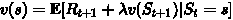

Bellman Equation ([https://zhuanlan.zhihu.com/p/21378532?refer=intelligentunit](https://zhuanlan.zhihu.com/p/21378532?refer=intelligentunit))

上式中的 e 指的是期望值，而ƛ指的是折现因子。我们可以把它改写成 Q 值的形式:

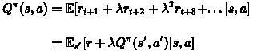

Bellman Equation In Q-value Form ([https://zhuanlan.zhihu.com/p/21378532?refer=intelligentunit](https://zhuanlan.zhihu.com/p/21378532?refer=intelligentunit))

用 Q*表示的最佳 Q 值可以表示为:

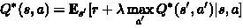

Optimal Q-value ([https://zhuanlan.zhihu.com/p/21378532?refer=intelligentunit](https://zhuanlan.zhihu.com/p/21378532?refer=intelligentunit))

目标是最大化 Q 值。在深入研究优化 Q 值的方法之前，我想先讨论两种与 Q 学习密切相关的值更新方法。

**策略迭代**

策略迭代在策略评估和策略改进之间循环。

Policy Iteration ([http://blog.csdn.net/songrotek/article/details/51378582](http://blog.csdn.net/songrotek/article/details/51378582))

策略评估使用从上次策略改进中获得的贪婪策略来估计值函数 V。另一方面，策略改进用使每个状态的 V 最大化的动作来更新策略。更新方程基于贝尔曼方程。它不断迭代直到收敛。

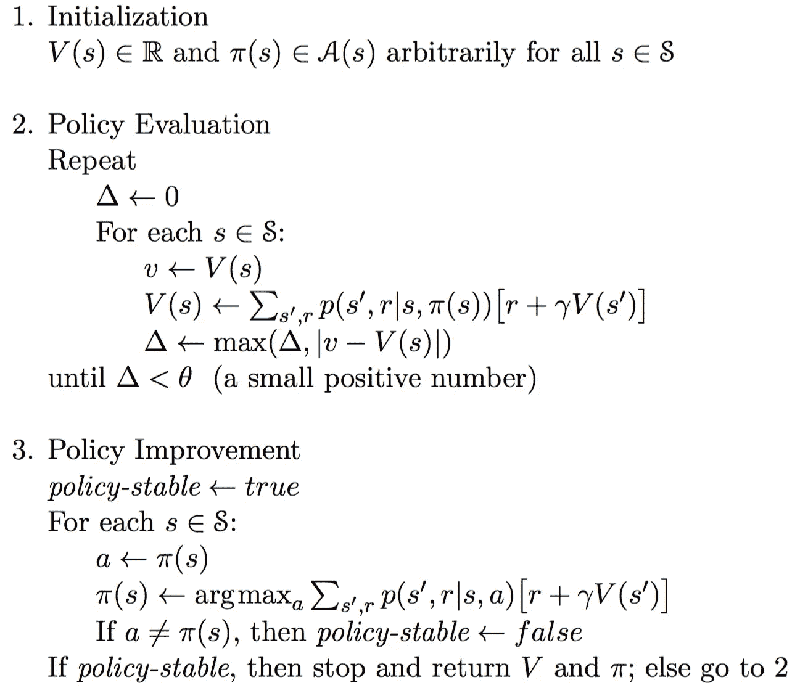

Pseudo Code For Policy Iteration ([http://blog.csdn.net/songrotek/article/details/51378582](http://blog.csdn.net/songrotek/article/details/51378582))

**值迭代**

值迭代只包含一个分量。它基于最佳贝尔曼方程更新值函数 V。

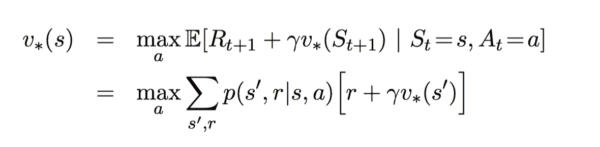

Optimal Bellman Equation ([http://blog.csdn.net/songrotek/article/details/51378582](http://blog.csdn.net/songrotek/article/details/51378582))

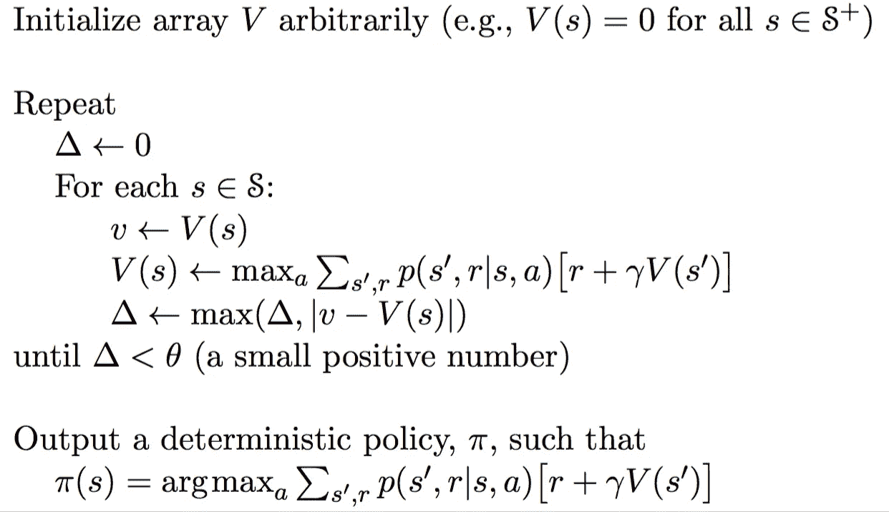

Pseudo Code For Value Iteration ([http://blog.csdn.net/songrotek/article/details/51378582](http://blog.csdn.net/songrotek/article/details/51378582))

在迭代收敛之后，通过对所有状态应用 argument-max 函数，直接导出最优策略。

注意，这两种方法需要转移概率 *p* 的知识，表明它是基于模型的算法。然而，正如我前面提到的，基于模型的算法存在可扩展性问题。那么 Q-learning 是如何解决这个问题的呢？

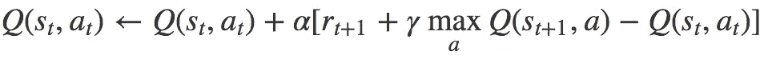

Q-Learning Update Equation ([https://www.quora.com/What-is-the-difference-between-Q-learning-and-SARSA-learning](https://www.quora.com/What-is-the-difference-between-Q-learning-and-SARSA-learning))

α指的是学习率(即我们接近目标的速度)。Q-learning 背后的思想高度依赖于价值迭代。然而，更新等式被替换为上述公式。因此，我们不再需要担心转移概率。

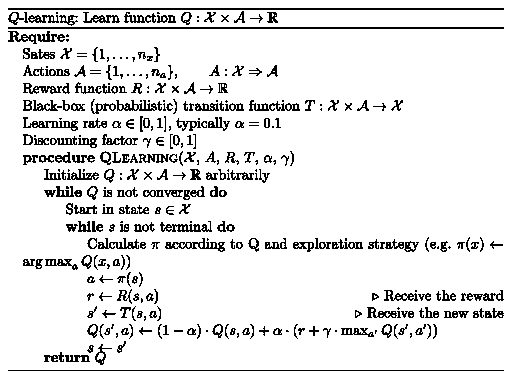

Q-learning Pseudo Code ([https://martin-thoma.com/images/2016/07/q-learning.png](https://martin-thoma.com/images/2016/07/q-learning.png))

注意，选择下一个动作*a’*来最大化下一个状态的 Q 值，而不是遵循当前策略。因此，Q-learning 属于非政策范畴。

## 2.2 国家-行动-奖励-国家-行动

SARSA 非常类似于 Q-learning。SARSA 和 Q-learning 之间的关键区别在于，SARSA 是一种基于策略的算法。这意味着 SARSA 基于由当前策略而不是贪婪策略执行的动作来学习 Q 值。

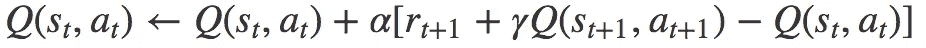

SARSA Update Equation ([https://www.quora.com/What-is-the-difference-between-Q-learning-and-SARSA-learning](https://www.quora.com/What-is-the-difference-between-Q-learning-and-SARSA-learning))

动作 a(t+1)是在当前策略下在下一个状态 s(t+1)中执行的动作。

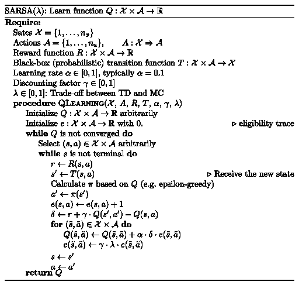

SARSA Pseudo Code ([https://martin-thoma.com/images/2016/07/sarsa-lambda.png](https://martin-thoma.com/images/2016/07/sarsa-lambda.png))

从上面的伪代码中，您可能会注意到执行了两个操作选择，它们总是遵循当前策略。相比之下，Q-learning 对下一个动作没有约束，只要它最大化下一个状态的 Q 值。因此，SARSA 是一个基于策略的算法。

## 2.3 深 Q 网(DQN)

虽然 Q-learning 是一个非常强大的算法，但它的主要缺点是缺乏通用性。如果您将 Q-learning 视为更新二维数组(动作空间*状态空间)中的数字，实际上，它类似于动态编程。这表明对于 Q 学习代理以前没有见过的状态，它不知道采取哪种动作。换句话说，Q-learning agent 不具备估计未知状态值的能力。为了处理这个问题，DQN 通过引入神经网络摆脱了二维数组。

DQN 利用神经网络来估计 Q 值函数。网络的输入是电流，而输出是每个动作的相应 Q 值。

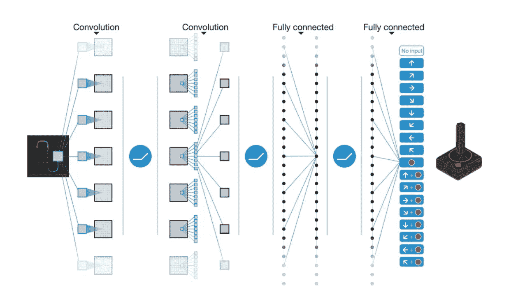

DQN Atari Example ([https://zhuanlan.zhihu.com/p/25239682](https://zhuanlan.zhihu.com/p/25239682))

2013 年，DeepMind 将 DQN 应用于[雅达利游戏](https://arxiv.org/pdf/1312.5602.pdf)，如上图所示。输入是当前游戏情况的原始图像。它经历了几层，包括卷积层以及全连接层。输出是代理可以采取的每个操作的 Q 值。

问题归结为:**我们如何训练网络？**

答案是我们根据 Q 学习更新方程来训练网络。回想一下，Q 学习的目标 Q 值是:

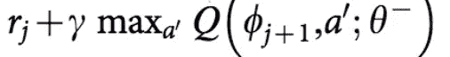

Target Q-value ([https://storage.googleapis.com/deepmind-media/dqn/DQNNaturePaper.pdf](https://storage.googleapis.com/deepmind-media/dqn/DQNNaturePaper.pdf))

ϕ相当于状态 s，而𝜽代表神经网络中的参数，这不在我们讨论的范围内。因此，网络的损失函数被定义为目标 Q 值和从网络输出的 Q 值之间的平方误差。

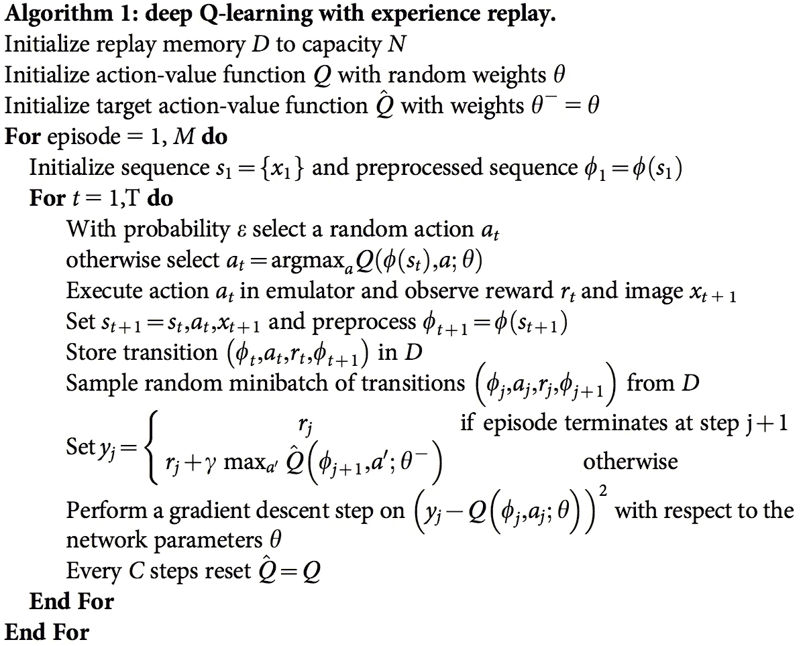

DQN Pseudo Code ([https://storage.googleapis.com/deepmind-media/dqn/DQNNaturePaper.pdf](https://storage.googleapis.com/deepmind-media/dqn/DQNNaturePaper.pdf))

另外两个技巧对训练 DQN 也很重要:

1.  **经验回放**:由于典型 RL 设置中的训练样本高度相关，数据效率较低，这将导致网络更难收敛。解决样本分布问题的一种方法是采用经验回放。本质上，样本转换被存储，然后从“转换池”中随机选择以更新知识。
2.  **分离目标网络**:目标 Q 网络与估值的结构相同。每 C 步，根据上面的伪代码，将目标网络重置为另一个。因此，波动变得不那么剧烈，导致更稳定的训练。

## 2.4 深度确定性政策梯度(DDPG)

虽然 DQN 在更高维度的问题上取得了巨大的成功，比如雅达利游戏，但是动作空间仍然是离散的。然而，许多感兴趣的任务，尤其是物理控制任务，动作空间是连续的。如果你把行动空间划分得太细，你最终会有一个太大的行动空间。例如，假设自由随机系统的程度是 10。对于每个度数，你把空间分成 4 个部分。你最终有 4 个⁰ =1048576 个动作。这么大的行动空间也极难收敛。

DDPG 依靠演员和评论家两个同名元素的演员-评论家架构。参与者用于调整策略功能的参数𝜽，即决定特定状态的最佳动作。

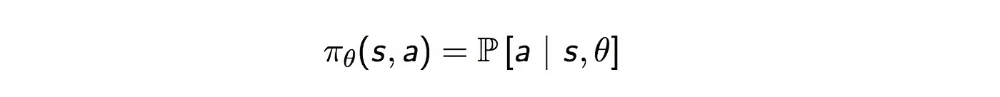

Policy Function ([https://zhuanlan.zhihu.com/p/25239682](https://zhuanlan.zhihu.com/p/25239682))

一个批评家被用来评估由行动者根据时间差异(TD)误差估计的策略函数。

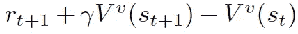

Temporal Difference Error ([http://proceedings.mlr.press/v32/silver14.pdf](http://proceedings.mlr.press/v32/silver14.pdf))

这里，小写的 *v* 表示参与者已经决定的策略。看起来眼熟吗？是啊！它看起来就像 Q 学习更新方程！TD 学习是一种学习如何根据给定状态的未来值来预测值的方法。Q 学习是用于学习 Q 值的 TD 学习的特定类型。

Actor-critic Architecture ([https://arxiv.org/pdf/1509.02971.pdf](https://arxiv.org/pdf/1509.02971.pdf))

DDPG 还借鉴了 DQN **的**经验重演**和**分众目标网**的理念。DDPG 的另一个问题是它很少探索行动。对此的解决方案是在参数空间或动作空间上添加噪声。**

Action Noise (left), Parameter Noise (right) ([https://blog.openai.com/better-exploration-with-parameter-noise/](https://blog.openai.com/better-exploration-with-parameter-noise/))

OpenAI 写的这篇[文章](https://blog.openai.com/better-exploration-with-parameter-noise/)声称在参数空间上加比在动作空间上加好。一种常用的噪声是[奥恩斯坦-乌伦贝克随机过程](http://math.stackexchange.com/questions/1287634/implementing-ornstein-uhlenbeck-in-matlab)。

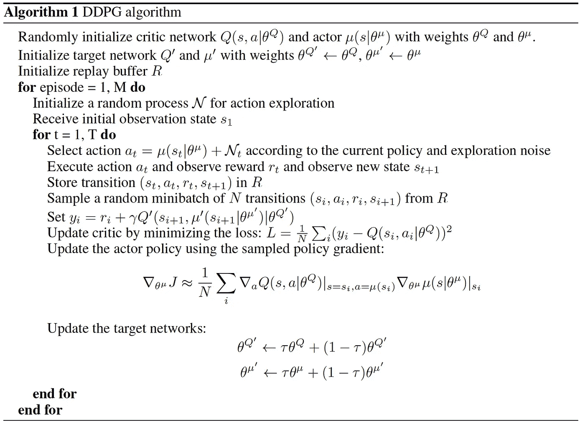

DDPG Pseudo Code ([https://arxiv.org/pdf/1509.02971.pdf](https://arxiv.org/pdf/1509.02971.pdf))

# 3.结论

我已经讨论了 Q-learning、SARSA、DQN 和 DDPG 的一些基本概念。在下一篇文章中，我将继续讨论其他最新的强化学习算法，包括 NAF、A3C 等。最后，我将简单地比较一下我所讨论的每一种算法。如果你对这篇文章有任何问题，请不要犹豫，在下面留下你的评论，或者在 twitter 上关注我。