# 各种强化学习算法介绍。第二部分(TRPO、PPO)

> 原文：<https://towardsdatascience.com/introduction-to-various-reinforcement-learning-algorithms-part-ii-trpo-ppo-87f2c5919bb9?source=collection_archive---------3----------------------->

本系列的第一部分 [*介绍各种强化学习算法。第一部分(Q-Learning，SARSA，DQN，DDPG)*](/introduction-to-various-reinforcement-learning-algorithms-i-q-learning-sarsa-dqn-ddpg-72a5e0cb6287) *，* I 讲述了强化学习(RL)的一些基本概念，并介绍了几种基本的 RL 算法。在本文中，我将继续讨论两种更高级的 RL 算法，这两种算法都是去年刚刚发表的。最后，我将对我所讨论的每种算法做一个简单的比较。

# 1.入门指南

## 定义:

*   优势(A): A(s，a) = Q(s，a)- V(s)

优势是许多高级 RL 算法中常用的术语，如 A3C、NAF 和我将要讨论的算法(也许我会为这两种算法写另一篇博文)。为了以一种更直观的方式来看待它，可以把它想成一个动作与特定状态下的平均动作相比有多好。

但是我们为什么需要优势呢？Q 值不够好吗？

我将用这个[论坛](https://datascience.stackexchange.com/questions/15423/understanding-advantage-functions)中发布的一个例子来说明优势的想法。

你玩过一个叫“接球”的游戏吗？在游戏中，水果会从屏幕上方落下。你需要向左或向右移动篮子来抓住它们。

Catch ([https://datascience.stackexchange.com/questions/15423/understanding-advantage-functions](https://datascience.stackexchange.com/questions/15423/understanding-advantage-functions))

上图是游戏的草图。上面的圆圈代表一种水果，而下面的小矩形是一个篮子。有三个动作，a1、a2 和 a3。显然，最好的动作是 a2，不要动，因为水果会直接掉进篮子里。现在，假设任何行为都没有负回报。在这种情况下，代理人没有选择最优行动的动机，即上面场景中的 a2。为什么？让我们用 Q*(s，a)来表示状态 s 和动作 a 的最佳 Q 值，那么我们将得到:

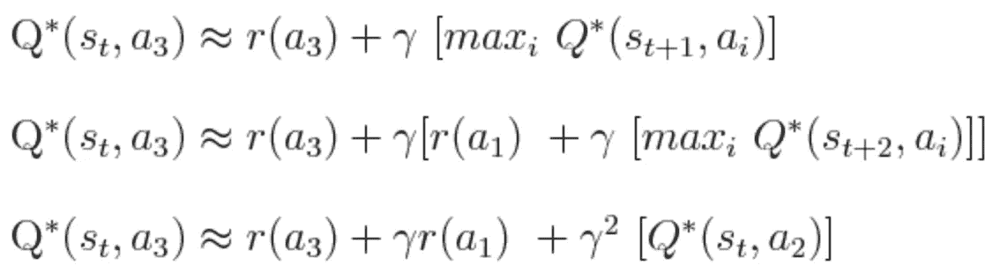

([https://datascience.stackexchange.com/questions/15423/understanding-advantage-functions](https://datascience.stackexchange.com/questions/15423/understanding-advantage-functions))

假设贴现因子𝛾仅略小于 1。我们可以得到

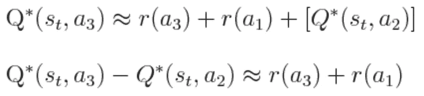

([https://datascience.stackexchange.com/questions/15423/understanding-advantage-functions](https://datascience.stackexchange.com/questions/15423/understanding-advantage-functions))

由于没有负回报，r(a3)和 r(a1)都大于或等于 0，暗示 Q*(s，a3)和 Q*(s，a2)差别不大。因此，在这种情况下，代理人对 a2 比对 a3 只有很小的偏好。

为了解决这个问题，我们可以将每个动作的 Q 值与它们的平均值进行比较，这样我们就可以知道一个动作相对于另一个动作有多好。回想一下上一篇博客，一个州的平均 Q 值被定义为 Value (V)。本质上，我们创造了一个名为 ***advantage*** 的新操作符，它是通过用该状态的值减去每个动作的 Q 值来定义的。

# 2.算法图解

## 2.1 信任区域策略优化(TRPO)

上一篇文章中讨论的深度确定性策略梯度(DDPG)是一个突破，它允许代理在连续空间中执行操作，同时保持下降性能。然而，DDPG 的主要问题是你需要选择一个合适的步长。如果太小，训练进度会极其缓慢。如果它太大，相反，它往往会被噪音淹没，导致悲剧性的表现。回想一下，计算时差(TD)误差的目标如下:

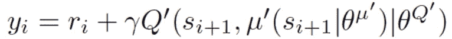

Target for TD error ([https://arxiv.org/pdf/1509.02971.pdf](https://arxiv.org/pdf/1509.02971.pdf))

如果步长选择不当，从网络或函数估计器中导出的目标值 *yi* 将不会很好，导致更差的样本和更差的价值函数估计。

因此，我们需要一种更新参数的方法来保证政策的改进。也就是说，我们希望**预期贴现长期回报η** 总是增加。

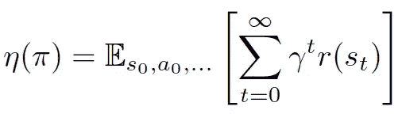

Expected Discounted Long-term Reward ([https://arxiv.org/pdf/1509.02971.pdf](https://arxiv.org/pdf/1509.02971.pdf))

> **警告:**这部分会有无数的数学方程式和公式。如果您对此不满意，可以直接跳到这一部分的末尾。

与 DDPG 类似，TRPO 也属于政策梯度的范畴。它采用了**actor-critical**架构，但是修改了 actor 的策略参数的更新方式。

对于新政策π'，η(π')可以看作是政策π'相对于旧政策π'的优势的期望收益。(由于我在键盘上找不到带曲线的π，我将在以下段落中使用π’)

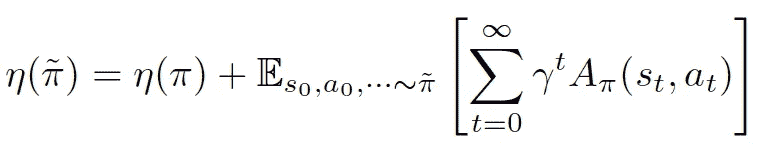

η For New Policy π’ ([https://arxiv.org/pdf/1509.02971.pdf](https://arxiv.org/pdf/1509.02971.pdf))

你可能想知道为什么使用 advantage。直觉上，你可以把它看作是衡量新政策相对于旧政策的平均表现有多好。新政策的η可以改写为以下形式，其中 **⍴** 是**打折的就诊频率**。

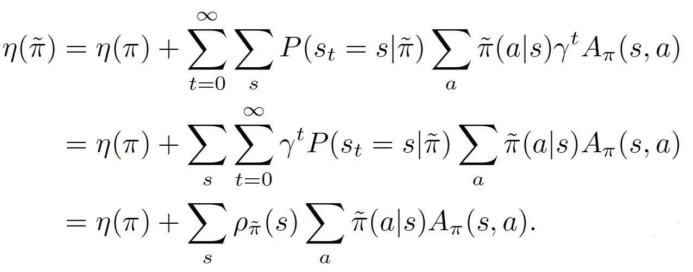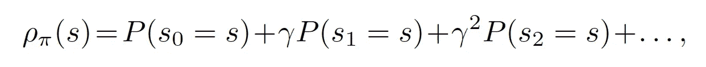

η Rewrite & ⍴ ([https://arxiv.org/pdf/1509.02971.pdf](https://arxiv.org/pdf/1509.02971.pdf))

然而，由于⍴对新政策π'的高度依赖，上述公式很难进行优化。因此，本文介绍了η(π′)，lπ(π′)的一种近似:

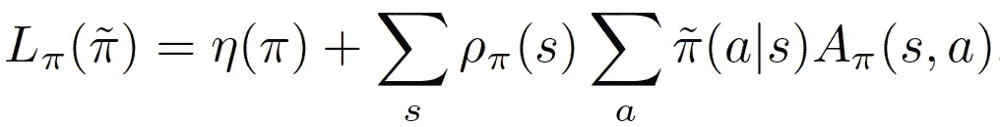

Approximation of η ([https://arxiv.org/pdf/1509.02971.pdf](https://arxiv.org/pdf/1509.02971.pdf))

请注意，我们将⍴π替换为⍴π'，假设新旧政策的州访问频率没有太大差异。有了这个等式，我们可以结合众所周知的策略更新方法:

.

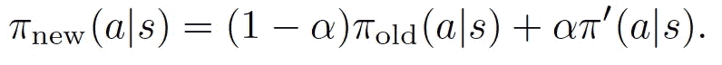

CPI ([https://arxiv.org/pdf/1509.02971.pdf](https://arxiv.org/pdf/1509.02971.pdf))

这里π_{old}是当前策略，而π'是使 L_{πold}最大化的策略的自变量 max。然后我们将得到下面的定理(让我们用定理 1 来表示它)。

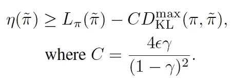

Theorem 1 ([https://arxiv.org/pdf/1509.02971.pdf](https://arxiv.org/pdf/1509.02971.pdf))

c 表示惩罚系数，而 D^{max}_{KL}表示每个状态的两个参数的最大 KL 散度。KL 散度的概念源于信息论，描述了信息的损失。简单来说，你可以把它看成π和π'这两个参数有多大的不同。

上式暗示，只要右手边的项最大化，预期的长期回报η就单调提高。为什么？让我们把不等式的右边定义为 M_{i}。

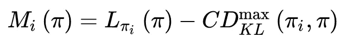

([https://arxiv.org/pdf/1509.02971.pdf](https://arxiv.org/pdf/1509.02971.pdf))

然后我们可以证明下面的不等式。

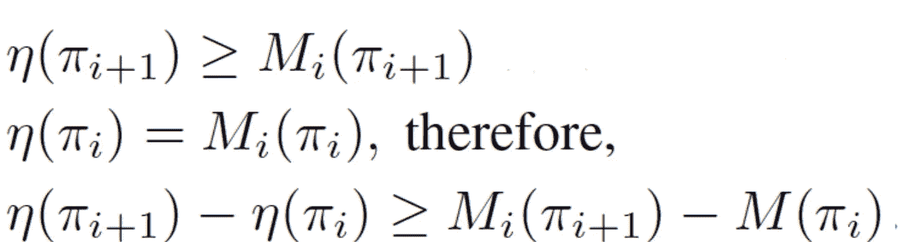

([https://arxiv.org/pdf/1509.02971.pdf](https://arxiv.org/pdf/1509.02971.pdf))

第一行可以简单地把 M_{i}的定义代入定理 1 得到。第二条线成立，因为π_{i}和π_{i}之间的 KL 散度为 0。将第一条线和第二条线结合起来，我们将得到第三条线。这表明，只要 M_{i}在每次迭代中最大化，目标函数η总是在改进的。(我认为第三行末尾的最后一个词应该是 Mi 而不是 m。不确定这是否是论文的打印错误)。因此，我们现在试图解决的复杂问题归结为最大化 Mi。即，

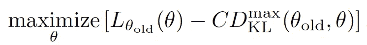

Objective Function 1 ([https://arxiv.org/pdf/1509.02971.pdf](https://arxiv.org/pdf/1509.02971.pdf))

下图直观地说明了η与 L 的近似值:

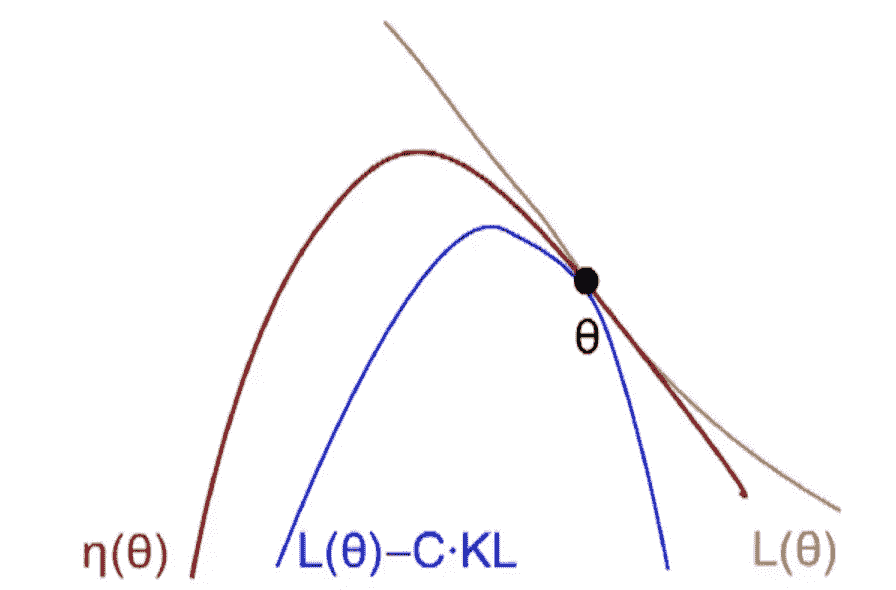

Visual Illustration of The Approximation ([https://www.youtube.com/watch?v=xvRrgxcpaHY&t=363s](https://www.youtube.com/watch?v=xvRrgxcpaHY&t=363s))

在实践中，如果目标函数中包含惩罚系数，步长会很小，导致训练时间很长。因此，对 KL 散度的约束用于允许更大的步长，同时保证稳健的性能。

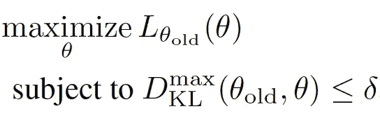

Objective Function 2 ([https://arxiv.org/pdf/1509.02971.pdf](https://arxiv.org/pdf/1509.02971.pdf))

KL 散度约束施加在状态空间中的每个状态上，其最大值应该小于一个小数值𝜹.不幸的是，它是不可解的，因为有无限多的状态。该论文提出了一种解决方案，该解决方案提供了一种启发式近似，该近似具有状态上的预期 KL 散度，而不是找到最大 KL 散度。

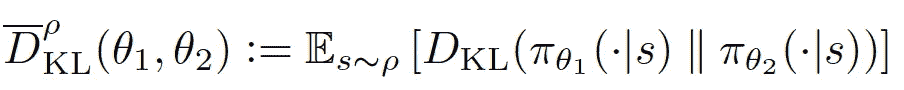

KL Divergence With State Visitation Frequency ⍴ ([https://arxiv.org/pdf/1509.02971.pdf](https://arxiv.org/pdf/1509.02971.pdf))

现在，当我们展开第一行时，目标函数变成如下:

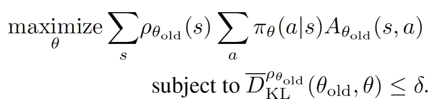

Objective Function 3 ([https://arxiv.org/pdf/1509.02971.pdf](https://arxiv.org/pdf/1509.02971.pdf))

通过用期望代替状态上的σ，用重要抽样估计量代替动作上的σ，如果采用单路径方法，这等同于旧的策略，我们可以将上述重写为:

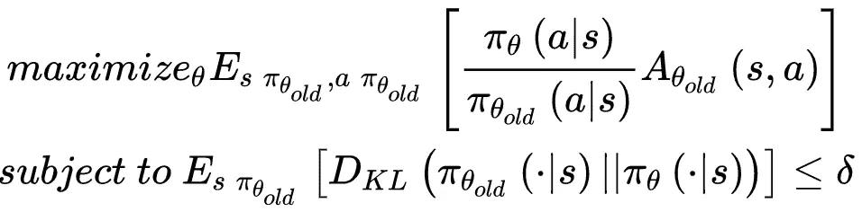

Final Objective Function ([https://arxiv.org/pdf/1509.02971.pdf](https://arxiv.org/pdf/1509.02971.pdf))

目标函数也称为“替代”目标函数，因为它包含当前策略和下一个策略之间的概率比。TPRO 成功地解决了 DDPG 提出的性能不能单调提高的问题。位于约束内的区域子集称为信赖域。只要政策变化相当小，这个近似值与真实的目标函数就不会有太大的不同。通过选择满足 KL 散度约束的最大化期望的新政策参数，保证了期望长期回报η的下界。这也暗示你不需要太担心 TRPO 的步长。

## 2.2 近似策略优化(PPO，OpenAI 版本)

虽然 TRPO 已经取得了巨大且持续的高性能，但是它的计算和实现是极其复杂的。在 TRPO 中，对代理目标函数的约束是新旧策略之间的 KL 差异。

Fisher 信息矩阵是 KL 散度的二阶导数，用于近似 KL 项。这导致计算几个二阶矩阵，这需要大量的计算。在 TRPO 论文中，共轭梯度(CG)算法被用于解决约束优化问题，从而不需要显式计算 Fisher 信息矩阵。然而，CG 使得实现更加复杂。

PPO 消除了由约束优化产生的计算，因为它提出了一个剪裁的代理目标函数。

让 rt(𝜽)表示新旧政策之间的比率。用于近似 TRPO 的长期回报η的替代目标函数变成如下。注下标描述了 TRPO 所基于的保守策略迭代(CPI)方法。

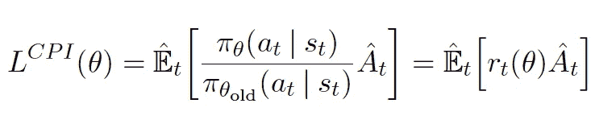

TRPO Objective Function ([https://arxiv.org/pdf/1707.06347.pdf](https://arxiv.org/pdf/1707.06347.pdf))

TRPO 的约束思想是不允许政策改变太多。因此，PPO 没有添加约束，而是稍微修改了 TRPO 的目标函数，并对过大的策略更新进行了惩罚。

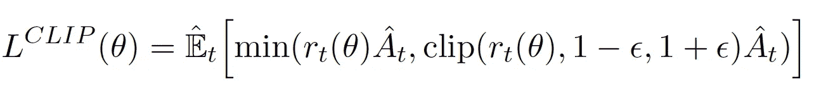

Clipped Objective Function ([https://arxiv.org/pdf/1707.06347.pdf](https://arxiv.org/pdf/1707.06347.pdf))

在右边你可以看到概率比 rt(𝜽)被限制在[1- 𝜖，1+𝜖].这表明，如果 rt(𝜽)导致目标函数增加到一定程度，其有效性将下降(被修剪)。让我们讨论两种不同的情况:

*   情况 1:当优势ȃt 大于 0 时

如果ȃt 大于 0，则意味着该动作优于该状态下所有动作的平均值。因此，应通过增加 rt(𝜽来鼓励该行动，以便该行动有更高的机会被采纳。由于分母 rt(𝜽)不变，旧政策增加 rt(𝜽)也意味着新政策增加π𝜽(a(s)。也就是说，增加在给定状态下采取行动的机会。然而，由于修剪，rt(𝜽)只会增长到和 1+𝜖.一样多

*   情况 2:当优势ȃt 小于 0 时

相比之下，如果ȃt 小于 0，那么这个动作应该被阻止。因此，rt(𝜽)应该减少。同样，由于修剪，rt(𝜽)只会减少到和 1-𝜖.一样少

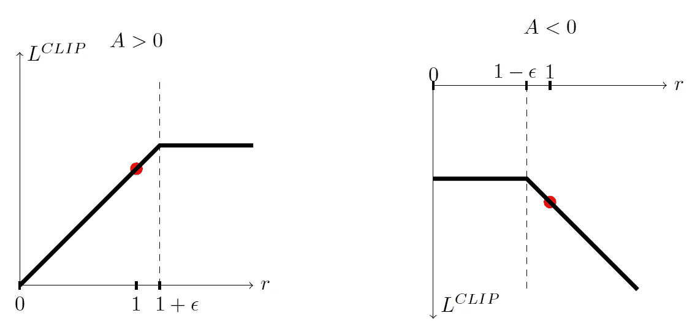

Illustration of The Clip ([https://arxiv.org/pdf/1707.06347.pdf](https://arxiv.org/pdf/1707.06347.pdf))

本质上，它限制了新政策与旧政策的差异范围；因此，消除了概率比 rt(𝜽移出区间的动机。

在实践中，损失函数误差和熵加成也应在实施过程中加以考虑，如下所示。然而，我不打算详细介绍它们，因为最具创新性和最重要的部分仍然是裁剪后的目标函数。

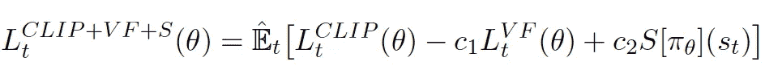

PPO Objective Function ([https://arxiv.org/pdf/1707.06347.pdf](https://arxiv.org/pdf/1707.06347.pdf))

比较 L^{CPI}和 L^{CLIP}的目标函数，我们可以看到 L^{CLIP}实际上是前者的一个下界。它还消除了 KL 发散约束。因此，优化该 PPO 目标函数的计算量比 TRPO 少得多。经验上也证明了 PPO 的表现优于 TRPO。事实上，由于其轻便和易于实现，PPO 已经成为 open ai([https://blog.openai.com/openai-baselines-ppo/](https://blog.openai.com/openai-baselines-ppo/))的默认 RL 算法。

# 3.所讨论算法的比较

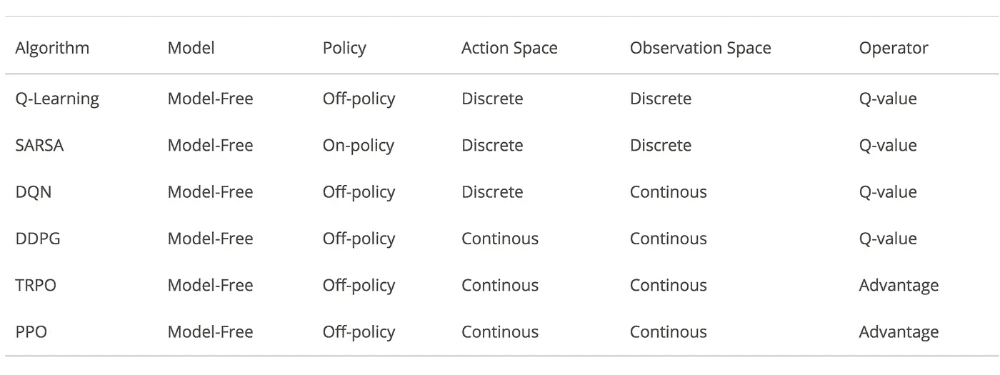

Various RL Algorithms I Have Discussed

所有讨论的 RL 算法都是无模型的。也就是说，他们都没有试图去估计目标函数。相反，他们基于反复试验来更新他们的知识。在所有这些公司中，只有 SARSA 是在政策上，根据其当前的行动学习价值。从离散的观察空间到连续的观察空间，DQN 是一个巨大的进步，允许代理处理看不见的状态。DDPG 是另一个突破，它使智能体能够执行具有策略梯度的连续动作，将 RL 的应用扩展到更多的任务，如控制。TRPO 改进了 DDPG 的性能，因为它引入了代理目标函数和 KL 散度约束，保证了长期回报不减少。PPO 通过修改代理目标函数进一步优化 TRPO，提高了性能，降低了实现和计算的复杂度。

# 结论

总之，我介绍了两种更高级的 RL 算法，并对我讨论过的所有 RL 算法进行了比较。然而，在 TRPO 中，数学公式非常复杂。虽然我已经尽力解释了，但我相信对你们中的一些人来说，这可能仍然是令人困惑的。如果您有任何问题，请随时在下面发表评论，或者在[推特](https://twitter.com/steeve__huang)上关注我。