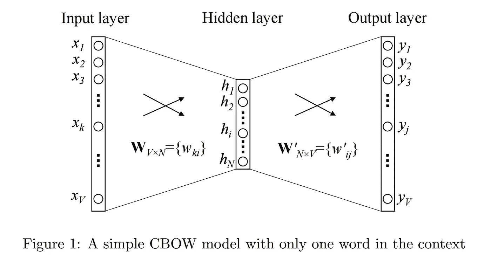
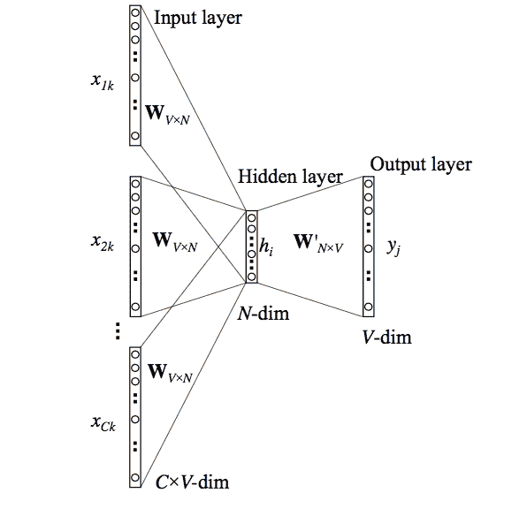
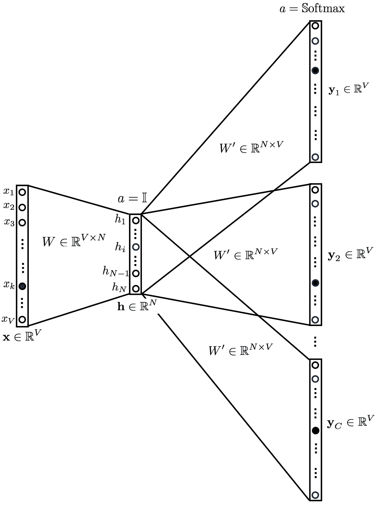

# 单词嵌入和 Word2Vec 简介

> 原文：<https://towardsdatascience.com/introduction-to-word-embedding-and-word2vec-652d0c2060fa?source=collection_archive---------0----------------------->

单词嵌入是最流行的文档词汇表示之一。它能够捕捉文档中单词的上下文、语义和句法相似性、与其他单词的关系等。

到底什么是单词嵌入？不严格地说，它们是特定单词的矢量表示。说到这里，接下来是我们如何生成它们？更重要的是，他们如何捕捉上下文？

Word2Vec 是使用浅层神经网络学习单词嵌入的最流行的技术之一。它是由谷歌的托马斯·米科洛夫于 2013 年开发的。

让我们一部分一部分地解决这个问题。

**我们为什么需要它们？**

考虑下面类似的句子:*过得愉快*和*过得愉快。它们几乎没有什么不同的意思。如果我们构造一个穷举词汇表(姑且称之为 V)，那就有 V = {Have，a，good，great，day}。*

现在，让我们为 V 中的每个单词创建一个独热码编码向量。我们的独热码编码向量的长度将等于 V (=5)的大小。除了索引处代表词汇表中相应单词的元素之外，我们将有一个零向量。这个特殊的元素就是。下面的编码可以更好地解释这一点。

Have = [1，0，0，0，0]`；a=[0，1，0，0，0]`；good=[0，0，1，0，0]`；great=[0，0，0，1，0]`；day=[0，0，0，0，1]`(`代表转置)

如果我们试图将这些编码可视化，我们可以想象一个 5 维空间，其中每个单词占据一个维度，与其余维度无关(没有沿其他维度的投影)。这意味着“好”和“伟大”就像“天”和“有”一样不同，这是不正确的。

我们的目标是让具有相似上下文的单词占据相近的空间位置。从数学上来说，这些向量之间的角度余弦应该接近 1，即角度接近 0。

[Google Images](http://i0.wp.com/techinpink.com/wp-content/uploads/2017/07/cosine.png)

产生*分布式表示*的想法来了。直观地说，我们引入了一个单词对另一个单词的一些*依赖性*。该单词的上下文中的单词将获得这种*依赖性的更大份额。*在一个热编码表示中，所有的字都是彼此独立的**，*如前所述。*

***word 2 vec 是如何工作的？***

*Word2Vec 是一种构建这种嵌入的方法。它可以使用两种方法获得(都涉及神经网络):Skip Gram 和 Common Bag Of Words (CBOW)*

****CBOW 模型:*** 该方法以每个单词的上下文为输入，尝试预测上下文对应的单词。考虑我们的例子:*祝你有美好的一天。**

*让神经网络的输入是单词，*棒极了。*注意，这里我们试图使用单个上下文输入单词*来预测一个目标单词( *d* ay *)* 。*更具体地说，我们使用输入单词的一个热编码，并测量与目标单词的一个热编码相比的输出误差( *d* ay)。在预测目标词的过程中，我们学习目标词的向量表示。*

*让我们更深入地看看实际的架构。*

**

*[CBOW Model](https://i.stack.imgur.com/sAvR9.png)*

*输入或上下文单词是大小为 V 的一个热编码向量。隐藏层包含 N 个神经元，输出也是长度为 V 的向量，其元素是 softmax 值。*

*让我们把图中的术语对了:
*- Wvn 是将输入 x 映射到隐藏层的权重矩阵(V*N 维矩阵)* - *W`nv 是将隐藏层输出映射到最终输出层的权重矩阵(N*V 维矩阵)**

*我不会涉足数学。我们就能知道发生了什么。*

*隐藏层神经元只是将输入的加权和复制到下一层。没有类似乙状结肠、tanh 或 ReLU 的激活。唯一的非线性是输出层中的 softmax 计算。*

*但是，上述模型使用单个上下文单词来预测目标。我们可以使用多个上下文单词来做同样的事情。*

**

*[Google images](http://www.stokastik.in/understanding-word-vectors-and-word2vec/)*

*以上模型取 C 上下文单词。当 *Wvn* 用于计算隐藏层输入时，我们取所有这些 C 上下文单词输入的平均值。*

*因此，我们已经看到了单词表示是如何使用上下文单词生成的。但是我们还有一种方法可以做到。我们可以使用目标单词(我们想要生成它的表示)来预测上下文，在这个过程中，我们产生表示。另一个变体，称为跳过克模型做这个。*

***跳格模型:***

**

*这看起来像是多上下文 CBOW 模型被翻转了。在某种程度上，这是真的。*

*我们把目标词输入网络。模型输出 C 个概率分布。这是什么意思？*

*对于每个上下文位置，我们得到 V 个概率的 C 个概率分布，每个单词一个。*

*在这两种情况下，网络都使用反向传播来学习。详细的数学可以在这里找到*

*谁赢了？*

*两者各有利弊。根据 Mikolov 的说法，Skip Gram 可以很好地处理少量数据，并被发现可以很好地表示罕见的单词。*

*另一方面，CBOW 更快，对更频繁的单词有更好的表示。*

*前方有什么？*

*上面的解释是一个非常基本的解释。它只是让您对什么是单词嵌入以及 Word2Vec 如何工作有一个高层次的概念。*

*还有很多事情要做。例如，为了提高算法的计算效率，使用了分层 Softmax 和 Skip-Gram 负采样等技巧。所有这些都可以在这里找到。*

*感谢阅读！我已经开始了我的个人博客，我不打算在媒体上写更多令人惊叹的文章。订阅[的帮助空间](https://thenlp.space/)，支持我的博客*