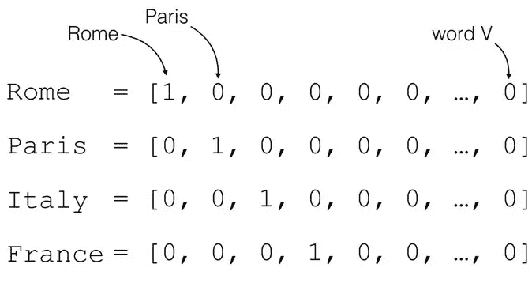
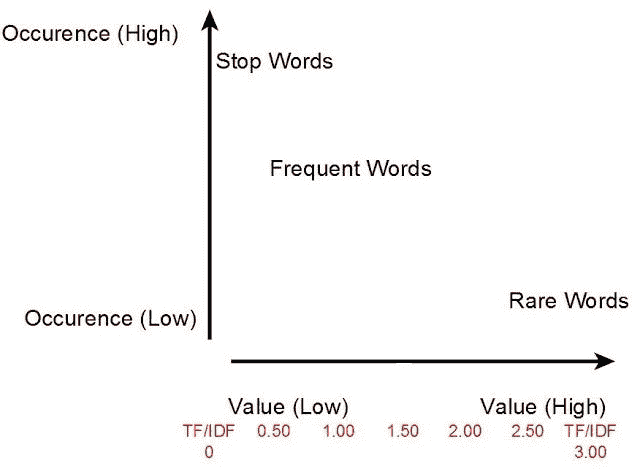
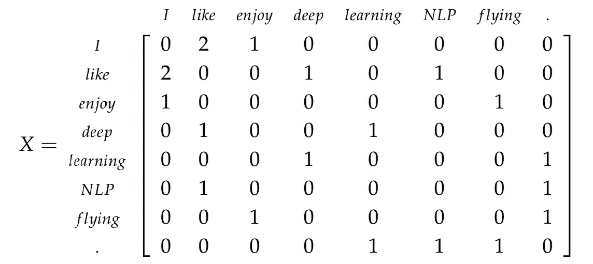
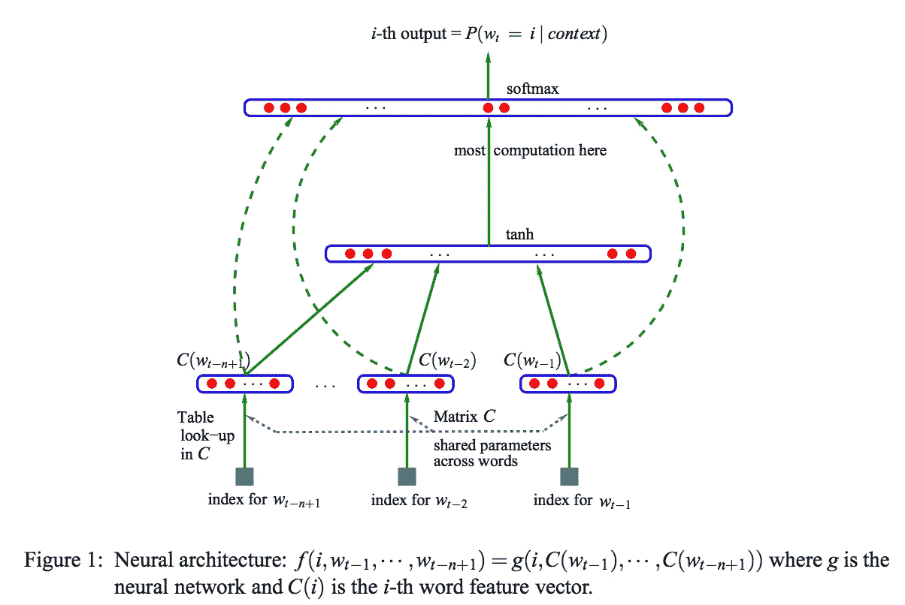
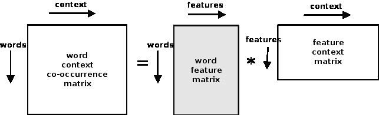
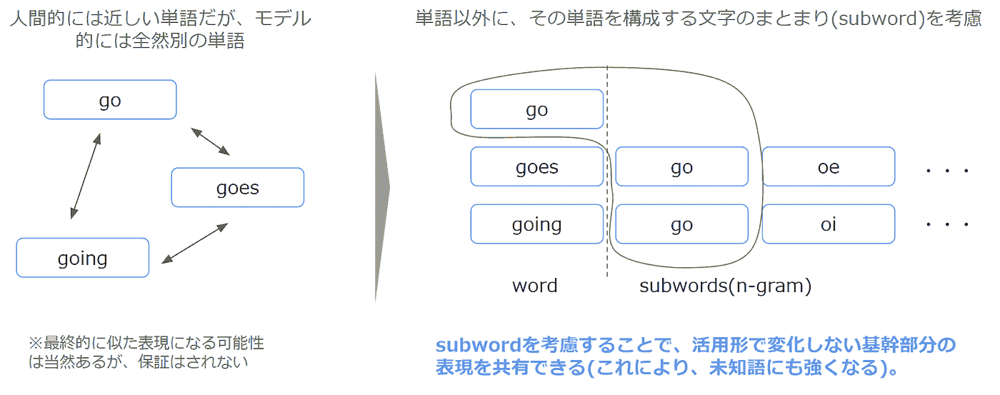
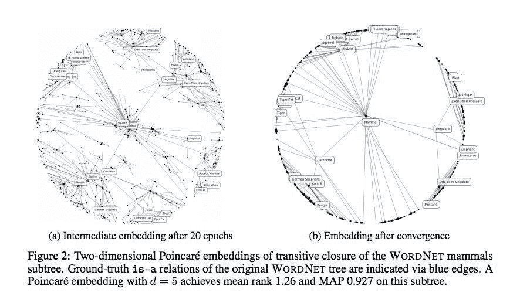
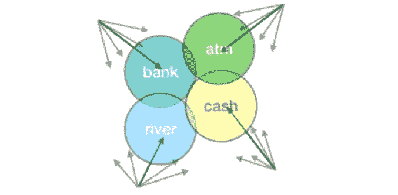

# 单词嵌入简介

> 原文：<https://towardsdatascience.com/introduction-to-word-embeddings-4cf857b12edc?source=collection_archive---------3----------------------->

# 什么是单词嵌入？

单词嵌入的一个非常基本的定义是一个单词的实数向量表示。通常，如今，具有相似意思的单词在嵌入空间中会有接近的向量表示(尽管情况并不总是如此)。

当构建单词嵌入空间时，通常目标是捕获该空间中的某种关系，无论是意义、形态、上下文还是某种其他类型的关系。

通过对密集空间中的单词嵌入进行编码，我们可以用一种方式用数字表示单词，这种方式可以在几十或几百维而不是几百万维的向量中捕获它们(就像一次性编码向量)。

许多单词嵌入都是基于 Zellig Harris 的“分布假设”所引入的概念而产生的，这可以归结为一个简单的想法，即彼此靠近使用的单词通常具有相同的含义。

美妙之处在于，不同的单词嵌入是以不同的方式或使用不同的文本语料库来创建的，以映射这种分布关系，因此最终结果是帮助我们完成 NLP 世界中不同下游任务的单词嵌入。

# 为什么我们使用单词嵌入？

单词不是计算机自然理解的东西。通过将它们编码成数字形式，我们可以应用数学规则并对它们进行矩阵运算。这使得他们在机器学习领域特别令人惊叹。

以深度学习为例。通过以数字形式编码单词，我们可以采用许多深度学习架构，并将它们应用于单词。卷积神经网络已经应用于使用单词嵌入的 NLP 任务，并且已经为许多任务设置了最先进的性能。

更好的是，我们发现我们实际上可以预先训练适用于许多任务的单词嵌入。这是我们将在本文中讨论的许多类型的焦点。因此，人们不必为每个任务、每个语料库学习一组新的嵌入。相反，我们可以学习通用的表示法，然后在不同的任务中使用。

# 单词嵌入的具体例子

现在，简单的介绍结束了，让我们来简单地看看我们可以用数字表示单词的一些不同的方法(稍后，我将对每种方法进行更复杂的分析，以及如何在下游任务中实际使用它们)。

# 一键编码(计数矢量化)

我们可以用数字表示单词的最基本的方法之一是通过一键编码方法(有时也称为[计数矢量化](http://scikit-learn.org/stable/modules/generated/sklearn.feature_extraction.text.CountVectorizer.html))。

想法超级简单。创建一个向量，其维数与你的语料库中唯一的单词数一样多。每个唯一的单词都有一个唯一的维度，在该维度上用 1 表示，在其他维度上用 0 表示。

这样的结果？非常巨大和稀疏的向量，完全没有关系信息。如果你没有其他选择，这可能是有用的。但是如果我们需要语义关系信息，我们还有其他选择。

我现在也有一个关于如何在真实文本数据上使用计数矢量化的帖子！如果你感兴趣，可以在这里查看:[自然语言处理:用 scikit-learn 计算矢量化](http://hunterheidenreich.com/blog/nlp-count-vectorization/)

# TF-IDF 变换

[TF-IDF 矢量](http://scikit-learn.org/stable/modules/generated/sklearn.feature_extraction.text.TfidfVectorizer.html)与独热码编码矢量相关。然而，它们不仅仅以计数为特征，而是以数字表示为特征，其中单词不仅仅在那里或者不在那里。相反，单词由它们的术语频率乘以它们的逆文档频率来表示。

简单来说，经常出现但随处可见的单词应该被赋予很小的权重或重要性。我们可以认为这是英语中类似于`the`或`and`的单词。他们没有提供大量的价值。

然而，如果一个单词出现得很少或很频繁，但只出现在一两个地方，那么这些可能是更重要的单词，应该这样加权。

同样，这也有非常高维度表示的缺点，不能捕捉语义相关性。

# 共生矩阵

同现矩阵就像它听起来的那样:一个和词汇量一样长和一样宽的巨大矩阵。如果单词一起出现，它们被标记为阳性条目。否则，他们有一个 0。它归结为一个数字表示，simple 提出了“单词是一起出现的吗？如果有，那就数这个。”

我们已经看到什么正在成为一个大问题？超大表示！如果我们认为独热编码是高维的，那么同现是高维的平方。内存中要存储大量数据。

# [神经概率模型](http://www.jmlr.org/papers/volume3/bengio03a/bengio03a.pdf)

现在，我们可以开始进入一些神经网络。神经概率模型通过完成一些任务(如建模或分类)来学习嵌入，并且是这些嵌入的其余部分或多或少所基于的。

通常，你清理你的文本，并创建一个热点编码向量。然后，您定义您的表示大小(300 维可能是好的)。从那里，我们初始化嵌入到随机值。这是进入网络的入口点，反向传播用于根据我们的目标任务修改嵌入。

这通常需要大量数据，并且可能非常慢。这里的权衡是，它学习一种嵌入，这种嵌入对于网络被训练的文本数据以及在训练期间共同学习的 NLP 任务是有益的。

# word2vec

[Word2Vec](https://code.google.com/archive/p/word2vec/) 是神经概率模型更好的继承者。我们仍然使用统计计算方法从文本语料库中学习，然而，其训练方法比简单的嵌入训练更有效。这或多或少是现今训练嵌入的标准方法。

这也是第一个演示经典矢量算法来创建类比的方法:

有两种主要的学习方法。

# 连续词袋

该方法通过基于上下文预测当前单词来学习嵌入。上下文由周围的单词决定。

# 连续跳跃图

这种方法通过预测给定上下文的周围单词来学习嵌入。上下文是当前单词。

这两种学习方法都使用本地单词使用上下文(具有相邻单词的定义窗口)。窗口越大，通过嵌入学习到的主题相似性就越多。强迫一个更小的窗口导致更多的语义、句法和功能相似性被学习。

那么，有什么好处呢？嗯，高质量的嵌入可以非常有效地学习，特别是在与神经概率模型进行比较时。这意味着低空间和低时间复杂度来生成丰富的表示。更重要的是，维度越大，在我们的表现中就有越多的特征。但是，我们仍然可以保持比其他方法低得多的维数。它还允许我们有效地生成十亿个单词的语料库，但包含一堆概括性的内容，并保持较小的维度。

# 手套

[GloVe](https://nlp.stanford.edu/projects/glove/) 是 word2vec 的扩展，而且是一个更好的扩展。有一组用于自然语言处理的经典向量模型擅长捕捉语料库的全局统计数据，如 LSA(矩阵分解)。他们非常擅长全球信息，但他们不能很好地捕捉含义，而且肯定没有内置的很酷的类比功能。

GloVe 的贡献是在语言建模任务中添加了全局统计来生成嵌入。本地上下文没有窗口功能。相反，有一个词-上下文/词共现矩阵，它学习整个语料库的统计数据。

结果呢？比简单的 word2vec 学习更好的嵌入。

# 快速文本

现在，有了 [FastText](https://github.com/facebookresearch/fastText) ，我们进入了一个非常酷的新单词嵌入的世界。FastText 所做的是决定合并子词信息。它通过将所有单词拆分成一个 n 元字符包(通常大小为 3-6)来实现这一点。它会将这些子单词加在一起，以创建一个完整的单词作为最终特征。这个功能真正强大的地方是它允许 FastText 自然地支持词汇表之外的单词！

这很重要，因为在其他方法中，如果系统遇到一个它不认识的单词，它只需将它设置为未知单词。使用 FastText，如果我们只知道单词 navigate，我们就可以给单词 circuit navigate 赋予意义，因为我们对单词 navigate 的语义知识至少可以帮助我们提供更多的语义信息来 circuit navigate，即使它不是我们的系统在训练期间学习的单词。

除此之外，FastText 使用负采样的 skip-gram 目标。所有的子词都是正例，然后从语料库中的词典中随机抽取样本作为负例。这些是 FastText 培训中包含的主要内容。

另一件很酷的事情是，脸书在开发 FastText 的过程中，用 294 种不同的语言发布了预先训练好的 FastText 向量。在我看来，这是一件非常棒的事情，因为它允许开发人员以非常低的成本使用通常没有预先训练的单词向量的语言来制作项目(因为训练他们自己的单词嵌入需要大量的计算资源)。

如果你想看所有 FastText 支持的语言，点击这里查看[。](https://github.com/facebookresearch/fastText/blob/master/pretrained-vectors.md)

# 庞加莱嵌入(分层表示)

[庞加莱嵌入](https://radimrehurek.com/gensim/models/poincare.html)非常不同，非常有趣，如果你有雄心壮志，你绝对应该给[看看论文](https://arxiv.org/pdf/1705.08039.pdf)。他们决定使用双曲几何来捕捉单词的等级属性。通过将它们嵌入到双曲空间中，它们可以使用双曲空间的性质来使用距离来编码相似性，并且使用向量的范数来编码等级关系。

最终结果是需要更少的维度来编码层级信息，他们通过用非常低的维度重新创建 WordNet 来证明这一点，尤其是与其他单词嵌入方案相比。他们强调了这种方法对于像 WordNet 或像计算机网络这样等级森严的数据是非常有用的。看看这一潮流会产生什么样的研究(如果有的话)将会很有趣。

# 工程与后勤管理局

ELMo 是我个人的最爱。它们是最先进的上下文单词向量。这些表示是从整个句子的函数中生成的，以创建单词级表示。嵌入是在字符级生成的，因此它们可以利用像 FastText 这样的子词单元，并且不会受到词汇表之外的词的影响。

ELMo 被训练成一个双向、两层的 LSTM 语言模型。一个非常有趣的副作用是，它的最终输出实际上是其内层输出的组合。已经发现的是，最低层适合于像词性标注和其他更多语法和功能任务这样的事情，而较高层适合于像词义消歧和其他更高级、更抽象的任务这样的事情。当我们组合这些层时，我们发现我们实际上在开箱即用的下游任务上获得了令人难以置信的高性能。

我脑子里唯一的问题？我们如何减少维数，并扩展到不太流行的语言上的训练，就像我们对 FastText 的训练一样。

# 概率快速文本

[概率快速文本](https://github.com/benathi/multisense-prob-fasttext)是[最近的一篇论文](https://arxiv.org/pdf/1806.02901.pdf)，它试图更好地处理意思不同但拼写相同的单词的问题。以单词 rock 为例。它可能意味着:

*   摇滚乐
*   一块石头
*   来回移动的动作

我们遇到这个词怎么知道自己在说什么？通常情况下，我们不会。当学习一个嵌入时，我们只是把所有的意思混在一起，然后抱最好的希望。这就是为什么像 ELMo 这样使用整个句子作为上下文的东西，在需要区分不同意思时往往表现得更好。

这也是概率快速文本做得很好的地方。不是将单词表示为向量，而是将单词表示为高斯混合模型。现在，我仍然没有真正理解数学，但许多训练模式仍然类似于 FastText，只是我们不是学习向量，而是学习一些概率性的东西。

我非常好奇这种趋势是否会产生未来的研究，因为我认为远离载体是一种非常好奇的方式。

# 包扎

如果你喜欢读这篇文章，给我留言或者给我的 GoFundMe 捐款来帮助我继续我的 ML 研究！

敬请关注即将推出的更多单词嵌入内容！

*最初发表于*[T5【hunterheidenreich.com】](http://hunterheidenreich.com/blog/intro-to-word-embeddings/)*。*