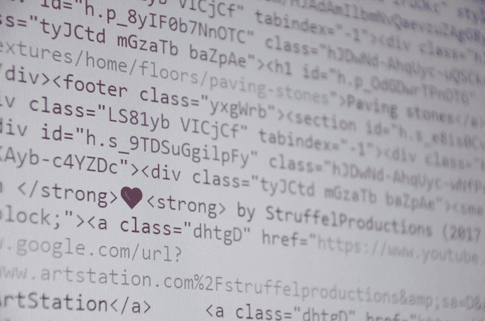

# 人工智能入门指南

> 原文：<https://towardsdatascience.com/introductory-guide-to-artificial-intelligence-11fc04cea042?source=collection_archive---------2----------------------->

本指南的主要目标是为想学习人工智能的人提供关于理论、技术和应用的直觉。它包括简短的描述和解释性文章和讲座的链接。每一部分都包含基本的材料来了解它是如何工作的。在最后一部分，你可以找到额外的书籍，课程，播客和其他材料。你也可以去[游乐场](/watching-modern-ai-methods-in-action-929e106d6a7c)玩互动游戏。让我们开始吧！

## 内容:

1.  起源
2.  先决数学
3.  没有免费的午餐定理
4.  方法和算法
5.  发展
6.  现实世界的应用
7.  额外资源

# 起源

人工智能诞生于模仿人类智能的尝试中。看看它的[简史](https://becominghuman.ai/brief-history-of-artificial-intelligence-2398b2843036)。目前还不清楚是否有可能模仿人类的思维，但我们肯定可以再造它的一些功能。与此同时，[认知科学](https://medium.com/@kennivich/what-is-cognitive-science-bee56f8cbbd)的整个领域受到了广泛的关注。

与此同时，它在社会上引起了很多关注。机器接管世界的问题有些言过其实，但工作岗位的转移现在是一个真正的问题。看一看[人工智能与自然智能](https://becominghuman.ai/artificial-vs-natural-intelligence-626b6c7addb2)来更好地了解计算机在哪些方面优于我们。

从某种意义上说，所有的计算机甚至计算器都代表了一种 AI。正如该领域的创始人之一所说:

> “它一工作，就没人再管它叫 AI 了。” *―* 约翰·麦卡锡

随着计算机变得越来越快，方法越来越先进，人工智能将变得越来越聪明。最近的研究表明，在未来 5-10 年内，多达 50%的工作岗位受到威胁。不管我们能否完全模拟我们的思维，人工智能都将对我们的生活产生重大影响。

# 先决数学

事实上，数学不是严格要求的，但是你需要它来更深入地理解这些方法。我建议在深入之前，至少在每个小节中获得基本的直觉。我假设你已经熟悉了学校代数。如果没有，你可以看看[这本指南](https://betterexplained.com/articles/developing-your-intuition-for-math/)或者在 [openstax](https://cc.openstax.org/subjects/math) 上找到免费的高质量教材。

首先值得注意的是，我们都熟悉的古典逻辑不能代表大多数现代技术。由此，你应该理解[模糊逻辑](https://medium.com/@kennivich/fuzzy-vs-classical-logic-in-ai-1d8c618b2495)的思想。

第二个重要的话题是图表。这个[温和的介绍](https://dev.to/vaidehijoshi/a-gentle-introduction-to-graph-theory)会帮助你理解主要思想。

## 线性代数

线性代数将概念和运算从普通代数扩展到数的集合。它们通常代表输入、输出和操作参数。我推荐从[这本指南](https://betterexplained.com/articles/linear-algebra-guide/)开始。

接下来是张量。张量是标量、向量和矩阵对高维对象的概括。这个视频会给你直观的解释这个概念。

## 可能性

由于我们通常没有关于任何事情的准确信息，我们不得不处理概率。[这篇文章](https://www.mathsisfun.com/data/probability.html)解释了非常基础的东西，而[这个系列](https://betterexplained.com/articles/a-brief-introduction-to-probability-statistics/)会让你对概率、统计和贝叶斯逻辑有更完整的理解。我建议至少看完这个系列的前三部分。

## 目标函数

也称为目标函数、成本函数或损失函数。它们代表了我们方法的主要目的。通常目标函数衡量我们的算法完成工作的好坏。此外，通过优化这个函数，我们可以改进我们的算法。

最重要的是均方误差和交叉熵。你可以在[这篇文章](https://www.benkuhn.net/squared)中找到关于 MSE 和平均绝对误差的描述，在[这篇文章](https://rdipietro.github.io/friendly-intro-to-cross-entropy-loss/)中找到关于交叉熵和 Kullback-Leibler 散度的描述。

有时我们不能直接计算目标函数，需要评估算法的性能。但是这些评估服务于相同的目标。

## 最佳化

在我们建立了目标函数之后，我们需要优化它的参数来提高我们算法的性能。优化的常用方法是梯度下降。你可以在这里找到直觉[，在这里](https://pmirla.github.io/2016/06/05/gradient-explanation.html)找到更详细的描述[。](http://ucanalytics.com/blogs/intuitive-machine-learning-gradient-descent-simplified/)

GD 有很多种。其中之一是随机梯度下降，它只需要训练数据的子集来计算每次迭代的损失和梯度。另一类重要的 GD 算法包括[动量](https://distill.pub/2017/momentum/)，它迫使参数在一个共同的方向上移动。

# 没有免费的午餐定理

我专门用了一个独特的章节来讲述它，因为这个定理传达了一个非常重要的思想:没有普遍有效的人工智能方法。简而言之，这个定理表明，每个问题解决过程对于每个任务都有一些计算成本，并且这些过程中没有一个比其他过程平均更好。虽然这个定理还没有在最一般的情况下得到证明，但实践已经表明了它的重要性。

Some methods may look particularly wonderful, but you still can’t eat them :)

所以，我们必须为每个问题选择合适的方法。

# 常用方法和算法

每种方法的主要目的是为特定问题构建一个良好的输入到输出映射模型。此外，它们的组合导致甚至更好的解决方案。并行搜索、堆叠和提升等技术有助于利用简单模型的混合来构建更好的模型。

虽然搜索方法通常只需要问题规范，但大多数深度学习算法需要大量数据。因此，可用数据在方法选择中起着重要作用。

我将按照发展的大致历史顺序来描述主要的技术类别。

## 经典编程

虽然编程不再被认为是人工智能技术，但这是很多年前的事了。一个单独的程序可以执行简单的输入加法，这看起来不像是一个智力活动。然而，它可能控制机器人的运动并执行复杂的操作。

You heard me right. Even HTML pages are a kind of AI.

这种方法的可解释的和严格的规范允许在一个结构中组合数百甚至数千个不同的程序。然而，这种方法在大多数复杂的现实场景中都失败了。预测复杂系统中所有可能的输入输出组合是极其困难的。

## 基于规则的专家系统

典型的专家系统由一组 if-then 规则的知识库和一个推理机制组成。[这个教程](https://www.tutorialspoint.com/artificial_intelligence/artificial_intelligence_expert_systems.htm)会给你大概的思路。现代知识图一般用于问答和自然语言处理。在这里你可以得到它们[的直观解释。虽然这些方法今天仍在使用，但专家系统的受欢迎程度正在稳步下降。](https://medium.com/p/understanding-knowledge-graphs-5cb05593eb84)

## 搜索

如果你能定义可能的解决方案，搜索将帮助你找到一个好的。这个[演示介绍](https://www.redblobgames.com/pathfinding/a-star/introduction.html)将会给你常见搜索算法背后的直觉，以及它们是如何应用在游戏开发中的。另外，[本教程](https://www.tutorialspoint.com/artificial_intelligence/artificial_intelligence_popular_search_algorithms.htm)会提供更正式的描述。尽管表面上很简单，但如果使用得当，这些方法可以在许多领域取得优异的效果。

## 遗传算法

遗传或进化算法是一种受生物进化启发的搜索。这篇文章将帮助你理解这个想法。

## 机器学习

一般来说，ML 方法也使用一种搜索，通常是梯度下降，来寻找解决方案。换句话说，他们使用训练示例来学习/拟合参数。实际上有几十种 ML 算法，但大多数都依赖于相同的原理。

[回归](https://codingmachinelearning.wordpress.com/2016/12/03/understanding-regression/)、[支持向量机](https://monkeylearn.com/blog/introduction-to-support-vector-machines-svm/)、[朴素贝叶斯](https://www.hackerearth.com/blog/machine-learning/introduction-naive-bayes-algorithm-codes-python-r/)和[决策树](https://becominghuman.ai/understanding-decision-trees-43032111380f)是最受欢迎和使用最广泛的。

剩下的小节将描述机器学习最突出的领域。

## 概率图形模型

这些模型以图表的形式学习变量之间的统计相关性。[这篇文章](https://medium.com/@kennivich/understanding-probabilistic-graphical-models-658b6fa40184)将提供 PGMs 的一般概念。如今，它们在现实世界的应用中被神经网络积极地取代，但对于复杂系统的分析仍然有用。

## 深度学习

简而言之，深度学习是 ML 方法的子集，包括许多层的表示。[本帖](https://becominghuman.ai/what-is-deep-learning-and-its-advantages-16b74bc541a1)提供总体概述。NN 最漂亮的特性之一就是你可以任意组合堆叠不同的层。组成层的高级描述通常称为网络架构。

神经网络的基本类型:

*   [前馈](/deep-learning-feedforward-neural-network-26a6705dbdc7)
*   [经常性](/understanding-recurrent-neural-networks-the-prefered-neural-network-for-time-series-data-7d856c21b759)
*   [卷积](https://adeshpande3.github.io/A-Beginner%27s-Guide-To-Understanding-Convolutional-Neural-Networks/)(以及不同[类型的卷积](/types-of-convolutions-in-deep-learning-717013397f4d)

在更专门化的模块中，[神经注意力机制](https://distill.pub/2016/augmented-rnns/)在许多应用中显示出巨大的成果。其他即插即用模块，如[长短期存储器](https://medium.com/mlreview/understanding-lstm-and-its-diagrams-37e2f46f1714)或[这种用于关系推理的模块](https://becominghuman.ai/relational-reasoning-with-neural-networks-d76c642c3518)在架构设计中提供了很大的灵活性。通过这种方式，你可以很容易地用注意力和其他东西创建循环卷积网络。

受限[波尔兹曼机器](http://rocknrollnerd.github.io/ml/2015/07/18/general-boltzmann-machines.html)是无监督学习网络的一个流行例子。

一些技术旨在改善神经网络和其他 ML 模型的[泛化](/generalization-in-ai-systems-79c5b6347f2c)，这反过来积极地影响准确性。其中最受欢迎的是[辍学](https://www.quora.com/How-does-the-dropout-method-work-in-deep-learning-And-why-is-it-claimed-to-be-an-effective-trick-to-improve-your-network)和[批量正常化](https://gab41.lab41.org/batch-normalization-what-the-hey-d480039a9e3b)。

另一类成功的网络是自动编码器。他们最著名的应用——[word 2 vec](http://mccormickml.com/2016/04/19/word2vec-tutorial-the-skip-gram-model/)。此外，它们还用于创建文档、知识图实体、图像、基因和许多其他事物的表示。

另一个有趣的例子是[生成对抗网络](https://medium.com/@kennivich/understanding-generative-adversarial-networks-dc9f598c33b4)，它可以学习生成令人信服的图像、视频和任何其他类型的数据。

许多其他类型的神经网络在文献中很受欢迎，但实际应用相对较少:自组织映射、波尔兹曼机器、脉冲神经网络、自适应共振网络等。

## 强化学习

RL 背后的直觉受到行为心理学家的启发，他们观察到动物从奖励中学习如何行为。这导致了寻找能带来最大回报的政策的方法的发展。[本帖](https://medium.com/@kennivich/understanding-reinforcement-learning-7a167d40a194)包含强化学习的概述。

在历史的进程中发展了许多 RL 方法。最先进的技术包括[进化策略](https://blog.openai.com/evolution-strategies/)、[深度强化学习](http://neuro.cs.ut.ee/demystifying-deep-reinforcement-learning/)、[异步优势行动者-批评家(A3C)](https://jaromiru.com/2017/02/16/lets-make-an-a3c-theory/) 等等。

# 发展

由于大多数现代系统或多或少使用相同的硬件(GPU 和 TPU)，在这一节中，我将重点介绍软件开发。

## 基础

对于初学者来说，Python 可能是最好的编程语言。对于当前的人工智能方法来说，它是相当通用的，并且与第一种成功的人工智能语言 Lisp 有许多相似之处。Python 有直观的语法和一个巨大的社区，其中有大量的包、教程和培训材料。

我推荐从多伦多大学的这些课程开始:[第一部分](https://www.coursera.org/learn/learn-to-program)和[第二部分](https://www.coursera.org/learn/program-code)。它们涵盖的主题从编程的基础到 Python 的最佳实践。

## 数据科学

因为人工智能方法高度依赖数据，所以你需要能够分析和操纵数据。

这个用 Python 和 Pandas 系列的[数据分析将帮助你更深入地理解数据集，而这个](https://www.youtube.com/playlist?list=PLQVvvaa0QuDc-3szzjeP6N6b0aDrrKyL-)[面向编码人员的数值线性代数](http://www.fast.ai/2017/07/17/num-lin-alg/)课程将帮助你掌握重要的运算。

这些[备忘单](https://startupsventurecapital.com/essential-cheat-sheets-for-machine-learning-and-deep-learning-researchers-efb6a8ebd2e5)包含了流行 Python 库的常用函数的描述。编码的时候有那些很方便。

## 机器学习

我强烈推荐从吴恩达的[机器学习](https://www.coursera.org/learn/machine-learning)课程开始。它涵盖了所有必要的数学和基本方法:线性和逻辑回归，支持向量机，主成分分析，简单的神经网络和其他。本课程中唯一缺少的重要内容是决策树。这个[决策树教程](http://dataaspirant.com/2017/02/01/decision-tree-algorithm-python-with-scikit-learn/)和更高级的[渐变提升树教程](https://jessesw.com/XG-Boost/)将填补这个空白。

现在你可以更深入了。这个[程序员实用深度学习](http://course.fast.ai/)课程教授如何使用最先进的 DL 技术。此外，这个来自伯克利的[深度强化学习](http://rll.berkeley.edu/deeprlcourse/)课程将向你介绍现代 RL 方法。

也有自动设计机器学习模型的方法。但是要得到好的结果，AutoML 需要比手工构建的模型多得多的资源，所以它还没有普及。此外，在进行人工智能项目时，你应该考虑可能的安全问题。

浏览课程和教程是很棒的，但是要真正理解整个过程，你应该获取一些真实世界的数据并使用它。这些资源将帮助您开始:

开源项目

一些有趣的简单例子可供学习:

1.  [数据科学 IPython 笔记本](https://github.com/donnemartin/data-science-ipython-notebooks) —大量收集 DS、ML、DL 和其他示例
2.  [TensforFlow 示例](https://github.com/aymericdamien/TensorFlow-Examples) —针对初学者的带示例的 TF 教程
3.  [Kaggle 内核](https://www.kaggle.com/kernels) —数千台用于 Kaggle 比赛的开放式笔记本

数据集

您可以使用这些开放数据集来训练您使用不同类型数据的技能:

1.  [Kaggle 数据集](https://www.kaggle.com/datasets) — 700 多个开放数据集
2.  [超赞的公共数据集](https://github.com/caesar0301/awesome-public-datasets) — 400 多个开放数据集
3.  [DeepMind 开放数据集](https://deepmind.com/research/open-source/open-source-datasets/)—deep mind 研究中使用的独特数据集

# 现实世界的应用

本节主要是为开发人员提供启发性的演示。你可以看看人工智能系统现在是如何改变世界的，以及在不久的将来哪些方向将特别相关:[医学](https://www.techemergence.com/machine-learning-in-pharma-medicine/)，[军事](https://aitopics.org/class/Industry/Government/Military)，[教育](https://aitopics.org/search?q=education&sort=score%20desc&filters=taxnodes:Industry%7CEducation)，[科学](https://www.oreilly.com/ideas/a-look-at-deep-learning-for-science)，[物理学](https://www.symmetrymagazine.org/article/deep-learning-takes-on-physics)，[经济学](/applications-of-ai-in-economics-trading-and-forecasting-288c4a466af8)以及许多其他领域。

# 额外资源

除非另有说明，下面列出的一切都是免费的。此外，大多数课程为学生和工人提供付费证书，通常费用约为 50-100 美元。

谷歌永远是你最好的助手。此外， [Quora](https://www.quora.com/topic/Artificial-Intelligence) 是一个寻找答案的好地方。例如，[这里的](https://www.quora.com/What-are-the-best-online-materials-and-syllabus-to-start-learning-AI-in-2017)人们已经为 AI 的研究提出了很多材料。

## 书单

1.  [人工智能:现代方法](http://aima.cs.berkeley.edu/index.html)作者斯图尔特·拉塞尔和彼得·诺维格(不免费！)—领先的人工智能教材
2.  大卫·l·普尔和艾伦·k·马克沃斯的《人工智能:计算代理的基础》
3.  [深度学习书籍](http://www.deeplearningbook.org/)([pdf、mobi 和 epub](https://github.com/HFTrader/DeepLearningBook) )作者:伊恩·古德菲勒、约舒阿·本吉奥和亚伦·库维尔——最佳 DL 教材
4.  安德森·霍洛维茨的《人工智能行动手册》——以实践为导向的人工智能书籍
5.  [神经网络和深度学习](http://neuralnetworksanddeeplearning.com/)迈克尔·尼尔森著——专注于神经网络的书
6.  吴恩达的《机器学习向往》——一本关于如何构建一个生产就绪的 ML 项目的书
7.  [马文·明斯基的情感机器](https://www.amazon.com/Emotion-Machine-Commonsense-Artificial-Intelligence/dp/0743276647)(不免费！)—伟大的 AI & CogSci 书籍，由 AI 领域的一位父亲撰写，侧重于理论

你还可以在这个资源库中找到更多关于机器学习的电子书。

## 在线课程

作为人工智能的第一门课程，我会推荐吴恩达的[机器学习](https://www.coursera.org/learn/machine-learning)和安萨夫·萨莱博-奥乌伊西的[人工智能](https://www.edx.org/course/artificial-intelligence-ai-columbiax-csmm-101x-1)。

1.  彼得·诺维格和巴斯蒂安·特龙的《人工智能导论》
2.  [机器学习简介](https://www.udacity.com/course/intro-to-machine-learning--ud120)作者凯蒂·马龙和巴斯蒂安·特龙 Python 中的 ML 算法简介
3.  [深度学习](https://www.coursera.org/specializations/deep-learning)作者吴恩达——神经网络及其在实际项目中应用的 5 门专业课程
4.  Vincent Vanhoucke 和 Arpan Chakraborty 的《深度学习》Python 中的 DL 算法简介
5.  [用于机器学习的神经网络](https://www.coursera.org/learn/neural-networks)作者 Geoffrey hint on——关于神经网络的综合性理论导向课程
6.  [杰瑞米·霍华德程序员实用深度学习](http://course.fast.ai/)—面向实践的 DL 课程
7.  [杰瑞米·霍华德《程序员的前沿深度学习》](http://course.fast.ai/part2.html)—本课程的第二部分，介绍数字图书馆的最新发展
8.  [用于视觉识别的卷积神经网络](https://www.youtube.com/playlist?list=PL3FW7Lu3i5JvHM8ljYj-zLfQRF3EO8sYv)Andrej kar pathy——斯坦福关于卷积网络的讲座(2017 年春季)
9.  [深度自然语言处理](https://github.com/oxford-cs-deepnlp-2017/lectures)，牛津 2017 —自然语言处理深度学习综合课程
10.  深度学习暑期学校，蒙特利尔( [2016](https://www.kadenze.com/courses/creative-applications-of-deep-learning-with-tensorflow/info) ， [2017](http://videolectures.net/deeplearning2017_montreal/) ) —许多深度学习主题的讲座
11.  [Parag Mital 的深度学习与 TensorFlow](https://www.kadenze.com/courses/creative-applications-of-deep-learning-with-tensorflow/info) 的创造性应用——DL 在艺术中的应用课程
12.  [自动驾驶汽车的深度学习](http://selfdrivingcars.mit.edu/)，麻省理工学院 2017-自动驾驶汽车深度学习实践的入门课程

## 博客

1.  [开放 AI 博客](https://blog.openai.com/) —关注 AI 安全问题
2.  [DeepMind 博客](https://deepmind.com/blog/)——*“解决智能。用它让世界变得更美好。”*是 DeepMind 的座右铭
3.  谷歌研究博客——谷歌研究的最新消息
4.  [脸书研究博客](https://research.fb.com/blog/)——脸书研究的最新消息
5.  [微软下一篇博客](https://blogs.microsoft.com/next/) —微软技术和研究的最新消息
6.  [BAIR 博客](http://bair.berkeley.edu/blog/) —伯克利人工智能研究平台
7.  [直觉机器](https://medium.com/intuitionmachine) —深度学习模式、方法论和策略
8.  [LAB41 博客](https://gab41.lab41.org/) —数据分析研究的发现、实验结果和思考
9.  [提炼](http://distill.pub/) —最清晰的机器学习研究期刊

## 频道和播客

1.  [send ex](https://www.youtube.com/user/sentdex)—各种 Python 教程
2.  [深度学习。电视](https://www.youtube.com/channel/UC9OeZkIwhzfv-_Cb7fCikLQ) —简化的深度学习
3.  Siraj Raval——寓教于乐
4.  [两分钟论文](https://www.youtube.com/user/keeroyz)——最新研究的简要概述
5.  人工智能播客——英伟达关于不同主题的播客
6.  [本周在机器学习& AI](https://twimlai.com/) —每周有趣访谈