# 对 L1 和 L2 正则化的直觉

> 原文：<https://towardsdatascience.com/intuitions-on-l1-and-l2-regularisation-235f2db4c261?source=collection_archive---------0----------------------->

Photo by [rawpixel](https://unsplash.com/photos/XFQvdjALGv4?utm_source=unsplash&utm_medium=referral&utm_content=creditCopyText) on [Unsplash](https://unsplash.com/?utm_source=unsplash&utm_medium=referral&utm_content=creditCopyText)

## 解释 L1 和 L2 如何使用梯度下降法

*(右跳* [*此处*](#15c2) *跳过引见。)*

2020 年 3 月 27 日:在 2-norm 和 p-norm 中的术语中添加了 absolute。感谢 [*里卡多 N 桑托斯*](https://medium.com/u/2bd22be5dd60?source=post_page-----235f2db4c261--------------------------------) *指出这一点。*

O **过度拟合**是一种机器学习或统计模型针对特定数据集定制，无法推广到其他数据集时发生的现象。这通常发生在复杂的模型中，比如深度神经网络。

**规则化**是引入额外信息以防止过度拟合的过程。本文的重点是 L1 和 L2 的正规化。

有很多解释，但老实说，它们有点太抽象了，我可能会忘记它们，并最终访问这些页面，结果又忘记了。在这篇文章中，我将与你分享一些直觉，为什么 L1 和 L2 使用**梯度下降**进行解释。梯度下降是一种简单的方法，通过使用梯度值的迭代更新来找到“正确的”系数。(这篇文章展示了如何在简单的线性回归中使用梯度下降。)

## 内容

0) [什么是 L1 和 L2？](#f810)
1) [模型](#2a1f)
2) [损失函数](#1d17)
3) [梯度下降](#461b)
4) [如何防止过拟合？](#15c2)

我们走吧！

## 0)什么是 L1 和 L2？

L1 和 L2 的正规化分别归功于 L1 和 L2 规范的一个向量**、T42、w**。这里有一个关于规范的初级读本:

1-norm (also known as L1 norm)

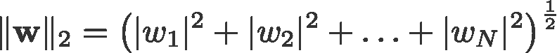

2-norm (also known as L2 norm or Euclidean norm)

*p*-norm

<change log:="" missed="" out="" taking="" the="" absolutes="" for="" and="" p-norm=""></change>

实现 L1 范数正则化的线性回归模型称为**套索回归**，实现(平方)L2 范数正则化的线性回归模型称为**岭回归**。要实现这两个，请注意线性回归模型保持不变:

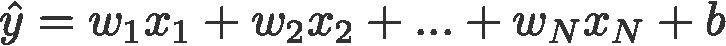

但是损失函数的计算包括这些正则化项:

Loss function with no regularisation

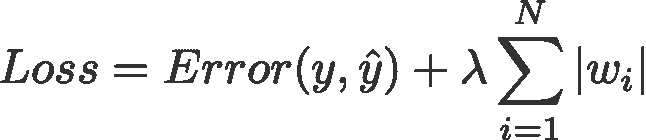

Loss function with L1 regularisation

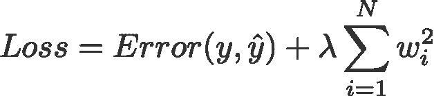

Loss function with L2 regularisation

> *注:严格来说，最后一个方程(岭回归)是一个权重为* ***平方*** *L2 范数的损失函数(注意没有平方根)。(感谢*[*Max Pechyonkin*](https://medium.com/u/38025716cba8?source=post_page-----235f2db4c261--------------------------------)*强调这一点！)*

除了必须最小化真实 *y* 和预测 *ŷ* 之间的误差之外，正则化项是优化算法在最小化损失函数时必须“遵守”的“约束”。

## **1)型号**

让我们定义一个模型来看看 L1 和 L2 是如何工作的。为简单起见，我们定义一个简单的线性回归模型 *ŷ* 与一个独立变量。

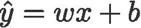

在这里，我使用了深度学习约定 *w* (“权重”)和 *b* (“偏差”)。

> 在实践中，简单的线性回归模型不容易过度拟合。正如引言中所提到的，深度学习模型由于其模型的复杂性，更容易受到此类问题的影响。
> 
> 因此，请注意，本文中使用的表达式很容易扩展到更复杂的模型，而不仅限于线性回归。

## **2)损失函数**

为了证明 L1 和 L2 正则化的效果，让我们使用 3 种不同的损失函数/目标来拟合我们的线性回归模型:

*   L
*   腰神经 2
*   L2

我们的目标是尽量减少这些不同的损失。

## **2.1)无正则化的损失函数**

我们将损失函数 l 定义为平方误差，其中误差是 *y* (真实值)和 *ŷ* (预测值)之差。

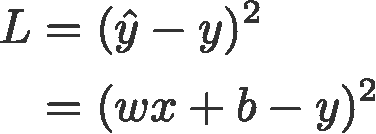

让我们假设使用这个损失函数，我们的模型会过度拟合。

## **2.2)L1 正则化损失函数**

基于上述损失函数，添加一个 L1 正则化项，如下所示:

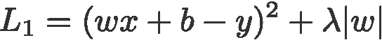

其中调整参数*λ*0 是手动调整的。让我们称这个损失函数为 L1。注意| *w|* 处处可微，除了当 *w* =0 时，如下图。我们以后会需要这个。

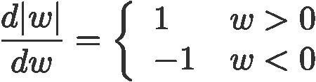

## **2.3)L2 正则化损失函数**

类似地，将 L2 正则化项添加到 L 看起来像这样:

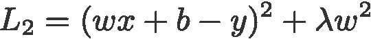

这里又，*λ*0。

## 3)梯度下降

现在，让我们基于上述*定义的 3 个损失函数，使用梯度下降优化求解线性回归模型。*回想一下，在梯度下降中更新参数 *w* 如下:

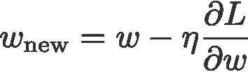

让我们用 L *、* L1 和 L2 w.r.t. *w.* 的梯度来代替上式中的最后一项

l:

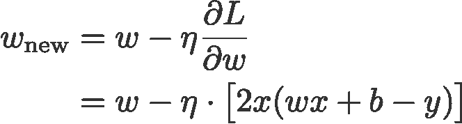

L1:

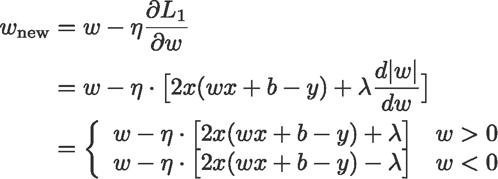

L2:

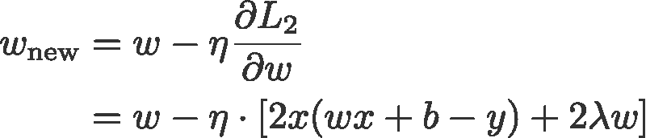

## 4)如何防止过度拟合？

从这里开始，让我们对上面的等式进行以下替换(为了更好的可读性):

*   *η* = 1，
*   *H = 2x* ( *wx+b-y* )

这给了我们

l:

L1:

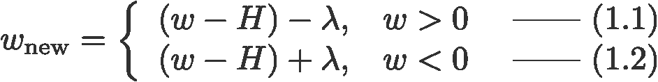

L2:

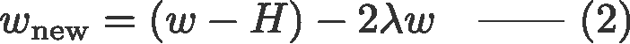

## 4.1)有无正规化

观察有正则化参数 *λ* 和没有正则化参数的重量更新之间的差异。以下是一些直觉。

**直觉 A:**

让我们用等式 0 来说，计算 *w-H* 给出了导致过拟合的 *w* 值。然后，直观地，等式{1.1、1.2 和 2}将减少过拟合的机会，因为引入 *λ* 使我们将*从上一句中导致过拟合问题的 *w* 处移开*。

**直觉 B:**

假设一个过度拟合的模型意味着我们有一个 *w* 值，它对于我们的模型来说是**完美的**。“完美”意味着如果我们将数据( *x* )代入模型，我们的预测 *ŷ* 将非常非常接近真实的 *y* 。当然，这很好，但我们不想要完美。为什么？因为这意味着我们的模型只适用于我们训练的数据集。这意味着我们的模型将产生与其他数据集的真实值相差甚远的预测。因此，我们满足于**不太完美的**，希望我们的模型也能得到与其他数据接近的预测。为此，我们用惩罚项 *λ“玷污”等式 0 中的这个完美的 *w* 。这给了我们等式{1.1，1.2 和 2}。*

**直觉 C:**

注意， *H* (此处定义为)是**依赖于型号( *w* 和 *b* )和数据( *x* 和 *y* )。仅基于模型和等式 0 中的数据更新权重*会导致过度拟合，从而导致泛化能力差。另一方面，在等式{1.1、1.2 和 2}中， *w* 的最终值不仅受模型和数据的影响，而且*还受独立于模型和数据的**的预定义参数 *λ* 的影响。因此，如果我们设置一个合适的值 *λ* ，我们可以防止过拟合，尽管太大的值会导致模型严重欠拟合。******

**直觉 D:**

[Edden Gerber](https://medium.com/u/a0c252a1bf6d?source=post_page-----235f2db4c261--------------------------------) (谢谢！)提供了一个关于我们的解决方案正在转向的*方向*的直觉。在评论里看看:[https://medium . com/@ edden . gerber/thanks-for-the-article-1003 ad 7478 B2](https://medium.com/@edden.gerber/thanks-for-the-article-1003ad7478b2)

## **4.2) L1 对 L2**

我们现在将注意力集中到 L1 和 L2，并通过重新排列它们的 *λ* 和 *H* 项来重写方程{1.1、1.2 和 2},如下所示:

L1:

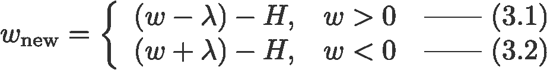

L2:

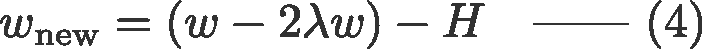

比较上面每个等式的第二项。除了 *H* 之外， *w* 的变化取决于 ***λ* 项**或 **-2 *λ* w 项**，这突出了以下的影响:

1.  电流的符号 *w* (L1，L2)
2.  电流大小 *w* (L2)
3.  正则化参数加倍(L2)

使用 L1 的权重更新受第一点的影响，而来自 L2 的权重更新受所有三个点的影响。虽然我只是基于迭代方程更新进行了比较，但请注意，这并不意味着一个比另一个“更好”。

现在，让我们看看下面如何通过当前的 *w.* 符号获得来自 L1 的正则化效果

## **4.3) L1 效应向 0 推进(稀疏度)**

看看方程 3.1 中的 L1。如果 *w* 为正，正则化参数*λ*0 将通过从 *w* 中减去 *λ* 来推动 *w* 为负。相反地，在等式 3.2 中，如果 *w* 为负，那么 *λ* 将被加到 *w* 上，使其变得更小。因此，这具有将 *w* 推向 0 的效果。

这在一元线性回归模型中当然是无意义的，但将证明它在多元回归模型中“去除”无用变量的能力。你也可以把 L1 想成是减少了模型中特性数量的 T52。这里有一个 L1 试图在多元线性回归模型中“推动”一些变量的任意例子:

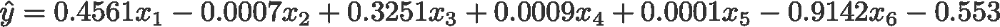

那么，在 L1 正则化中，将 *w* 推向 0 如何帮助过度拟合呢？如上所述，当 *w* 变为零时，我们通过降低变量重要性来减少特征的数量。在上式中，我们看到 *x_2* 、 *x_4* 和 *x_5* 几乎是“无用”的，因为它们的系数很小，因此我们可以将它们从等式中移除。这反过来**降低了模型的复杂性**，使得我们的模型更加简单。更简单的模型可以减少过度拟合的机会。

## **注**

虽然 L1 有将权重推向 0 的*影响力，而 L2 没有，但这并不意味着由于 L2，权重不能接近 0。*

如果你发现文章的任何部分令人困惑，请随意突出显示并留下回复。此外，如果有任何反馈或建议如何改进这篇文章，请在下面留下评论！

## 参考

[常模(数学)](https://en.wikipedia.org/wiki/Norm_(mathematics))(wikipedia.org)

[拉索(统计)](https://en.wikipedia.org/wiki/Lasso_(statistics))(wikipedia.org)

[套索和山脊正规化【medium.com ](https://medium.com/@dk13093/lasso-and-ridge-regularization-7b7b847bce34)

*特别感谢***[*【任杰】*](https://medium.com/@renjietan) *、丹尼尔* [*德里克*](https://medium.com/@derekchia) *对本文的观点、建议和修正。也感谢*[*C Gam*](https://medium.com/u/c3d5b340105?source=post_page-----235f2db4c261--------------------------------)*指出导数中的错误。***

***关注我上*[*Twitter*](https://www.twitter.com/remykarem)*@ remykarem 或者*[*LinkedIn*](http://www.linkedin.com/in/raimibkarim)*。你也可以通过 raimi.bkarim@gmail.com 联系我。欢迎访问我的网站*[*remykarem . github . io*](https://remykarem.github.io/)*。***