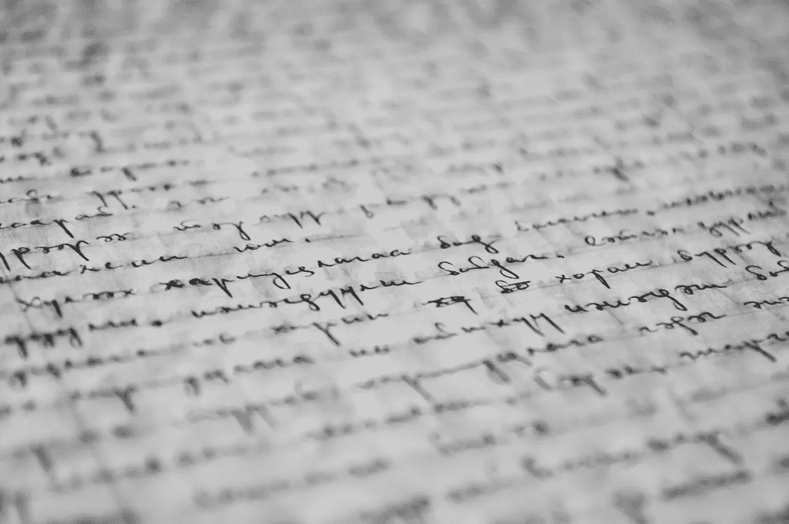
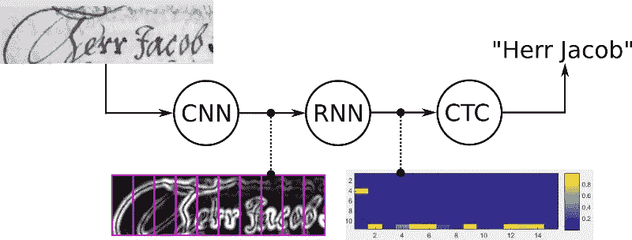
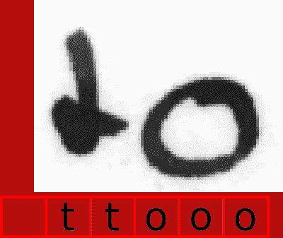
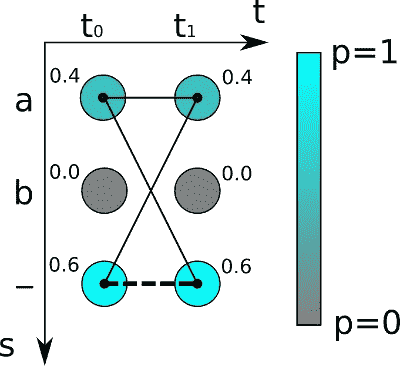
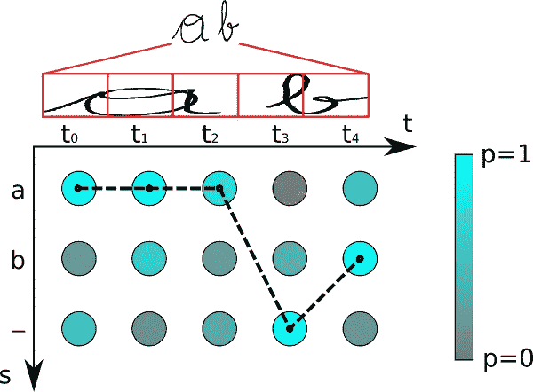

# 联结主义时间分类的直观解释

> 原文：<https://towardsdatascience.com/intuitively-understanding-connectionist-temporal-classification-3797e43a86c?source=collection_archive---------0----------------------->

## **使用连接主义时间分类(CTC)丢失和解码操作的文本识别**

如果你想让计算机识别文本，神经网络(NN)是一个很好的选择，因为它们目前优于所有其他方法。这种用例的神经网络通常由提取特征序列的**卷积层(CNN)** 和通过该序列传播信息的**递归层(RNN)** 组成。它输出每个序列元素的字符分数，简单地用一个矩阵**表示。现在，我们想对这个矩阵做两件事:**

1.  训练:计算损失值来训练神经网络
2.  推断:解码矩阵以获得输入图像中包含的文本

这两项任务都由 **CTC 操作**完成。图 1 示出了手写识别系统的概况。

让我们仔细看看 **CTC 操作**并讨论它是如何工作的，而不隐藏复杂公式背后基于的巧妙想法。最后，如果您感兴趣的话，我将向您介绍可以找到 Python 代码和(不太复杂的)公式的参考资料。

Fig. 1: Overview of a NN for handwriting recognition.

# 为什么我们要使用 CTC

当然，我们可以创建具有文本行图像的数据集，然后为图像的每个水平位置指定相应的字符，如图 2 所示。然后，我们可以训练一个神经网络来输出每个水平位置的字符分数。然而，这种天真的解决方案有两个问题:

1.  在字符级别上注释数据集是非常耗时的(也是令人厌烦的)。
2.  我们只得到字符分数，因此需要一些进一步的处理来从中获得最终的文本。单个字符可以跨越多个水平位置，例如，我们可以得到“ttooo ”,因为“o”是一个宽字符，如图 2 所示。我们必须删除所有重复的“t”和“o”。但是如果识别的文本是“too”呢？那么删除所有重复的“o”会得到错误的结果。这个怎么处理？

Fig. 2: Annotation for each horizontal position of the image.

CTC 为我们解决了这两个问题:

1.  我们只需要告诉 CTC 损失函数图像中出现的文本。因此，我们忽略图像中字符的位置和宽度。
2.  不需要对识别的文本进行进一步处理。

# 反恐委员会如何工作

正如已经讨论过的，我们不想在每个水平位置注释图像(从现在开始我们称之为**时间步长**)。NN 培训将由 CTC 损失职能部门指导。我们只将神经网络的输出矩阵和相应的地面实况(GT)文本馈送给 CTC 损失函数。但是它如何知道每个字符出现在哪里呢？它不知道。相反，它会尝试图像中 GT 文本的所有可能对齐方式，并计算所有得分的总和。这样，如果比对分数的总和具有高值，则 GT 文本的分数高。

## 对文本编码

还有如何对重复字符进行编码的问题(还记得我们说过的“too”这个词吗？).它是通过引入伪字符(称为空白，但不要与“真正的”空白(即空白字符)混淆)来解决的。在下文中，这个特殊字符将被表示为“-”。我们使用一个聪明的编码模式来解决重复字符问题:在对文本进行编码时，我们可以在任何位置插入任意多个空格，在解码时这些空格将被删除。但是，我们必须在重复的字符之间插入一个空格，就像在“he **ll** o”中一样。此外，我们可以随心所欲地重复每个字符。

让我们看一些例子:

*   " to" → " - ttttttooo "，或"-t-o-"，或" to "
*   "太"→ " - ttttto-o "，或者"-t-o-o-"，或者" to-o "，但是**不是**"太"

正如您所看到的，这个模式还允许我们轻松地创建相同文本的不同对齐方式，例如“t-o”和“too”以及“-to”都表示相同的文本(“to”)，但是对图像有不同的对齐方式。训练神经网络以输出编码文本(在神经网络输出矩阵中编码)。

## 损失计算

我们需要计算训练样本(成对的图像和 GT 文本)的损失值来训练神经网络。你已经知道，神经网络输出一个矩阵，其中包含每个字符在每个时间步的分数。图 3 示出了一个极简矩阵:有两个时间步长(t0，t1)和三个字符(“a”、“b”和空白“-”)。对于每个时间步长，字符得分总计为 1。

Fig. 3: Output matrix of NN. The character-probability is color-coded and is also printed next to each matrix entry. Thin lines are paths representing the text “a”, while the thick dashed line is the only path representing the text “”.

此外，您已经知道，损失是通过对 GT 文本的所有可能对齐的所有分数求和来计算的，这样，文本出现在图像中的什么位置并不重要。

一次比对(或文献中通常称之为**路径**)的分数通过将相应的字符分数相乘来计算。在上面显示的示例中，路径“aa”的得分是 0.4±0.4 = 0.16，而“a-”的得分是 0.4±0.6 = 0.24，而“-a”的得分是 0.6±0.4 = 0.24。为了得到给定 GT 文本的分数，我们对与该文本对应的所有路径的分数求和。让我们假设例子中的 GT 文本是“a”:我们必须计算长度为 2 的所有可能路径(因为矩阵有 2 个时间步长)，它们是:“aa”，“a-”和“-a”。我们已经计算了这些路径的分数，所以我们只需对它们求和，得到 0.4 0.4+0.4 0.6+0.6 0.4=0.64。如果假设 GT 文本为“”，我们看到对应的路径只有一条，即“-”，得出的综合得分为 0.6 0.6=0.36。

我们现在能够计算训练样本的 GT 文本的概率，给定由 NN 产生的输出矩阵。目标是训练 NN，使其输出正确分类的高概率(理想值为 1)。因此，我们最大化训练数据集的正确分类概率的乘积。出于技术原因，我们重新表述为一个等价的问题:最小化训练数据集的损失，其中损失是对数概率的负和。如果您需要单个样本的损失值，只需计算概率，取对数，并在结果前面加一个减号。为了训练 NN，损失相对于 NN 参数(例如卷积核的权重)的梯度被计算并用于更新参数。

## 解码

当我们有一个训练好的神经网络时，我们通常想用它来识别以前看不见的图像中的文本。或者用更专业的术语来说:我们希望在给定神经网络输出矩阵的情况下计算最可能的文本。你已经知道了一种计算给定文本分数的方法。但这一次，我们没有得到任何文本，事实上，它正是我们要寻找的文本。如果只有很少的时间步长和字符，尝试每一个可能的文本都是可行的，但是对于实际的用例，这是不可行的。

一个简单且非常快速的算法是由两个步骤组成的**最佳路径解码**:

1.  它通过每个时间步取最可能的字符来计算最佳路径。
2.  它通过首先删除重复字符，然后删除路径中的所有空格来撤消编码。剩下的代表已识别的文本。

图 4 中示出了一个例子。字符为“a”、“b”和“-”(空白)。有 5 个时间步长。让我们将最佳路径解码器应用于这个矩阵:t0 最可能的字符是“a”，这同样适用于 t1 和 t2。空白字符在 t3 时得分最高。最后，“b”最有可能在 t4。这给了我们路径“aaa-b”。我们删除重复的字符，得到“a-b ”,然后我们从剩余的路径中删除任何空白，得到文本“ab ”,我们将它作为识别的文本输出。

Fig. 4: Output matrix of NN. The thick dashed line represents the best path.

当然，最佳路径解码只是一种近似。很容易构造出给出错误结果的例子:如果你解码图 3 中的矩阵，你会得到""作为识别的文本。但是我们已经知道，“”的概率只有 0.36，而“a”的概率是 0.64。然而，近似算法在实际情况下经常给出好的结果。还有更高级的解码器，如波束搜索解码、前缀搜索解码或令牌传递，它们也使用关于语言结构的信息来改善结果。

# 结论和进一步阅读

首先，我们看了一个简单的神经网络解决方案所产生的问题。然后，我们看到反恐委员会如何能够解决这些问题。然后，我们通过查看 CTC 如何编码文本、如何进行损失计算以及如何解码经过 CTC 训练的神经网络的输出，来研究 CTC 是如何工作的。

例如，当您在 TensorFlow 中调用 ctc_loss 或 ctc_greedy_decoder 之类的函数时，这会让您很好地理解幕后发生的事情。但是，当你想自己实现 CTC 的时候，你需要知道更多的一些细节，尤其是要让它快速运行。Graves 等人[1]介绍了 CTC 操作，文中还展示了所有相关的数学。如果你对如何提高解码感兴趣，可以看看关于波束搜索解码的文章[2][3]。我用 Python 和 C++实现了一些解码器和 loss 函数，你可以在 github [4][5]上找到。最后，如果你想更全面地了解如何识别(手写)文本，可以看看我写的关于如何构建手写文本识别系统的文章[6]。

[1] [原纸包含所有数学](https://www.cs.toronto.edu/~graves/icml_2006.pdf)
【2】[香草束搜索解码](/5a889a3d85a7)
【3】[字束搜索解码](/b051d28f3d2e)
【4】[Python 实现的解码器](https://github.com/githubharald/CTCDecoder)
【5】[实现的字束搜索解码](https://github.com/githubharald/CTCWordBeamSearch)
【6】[文本识别系统](/2326a3487cd5)

最后，概述一下我的[其他媒体文章](https://harald-scheidl.medium.com/c4683d776120)。