# 直观理解用于深度学习的卷积

> 原文：<https://towardsdatascience.com/intuitively-understanding-convolutions-for-deep-learning-1f6f42faee1?source=collection_archive---------0----------------------->

## 探索让它们工作的强大的视觉层次

近年来，强大而通用的深度学习框架的出现，使得在深度学习模型中实现卷积层成为可能这是一项极其简单的任务，通常只需一行代码即可实现。

然而，理解卷积，尤其是第一次理解时，常常会感到有点紧张，因为像内核、过滤器、通道等术语都是相互叠加的。然而，卷积作为一个概念是非常强大和高度可扩展的，在这篇文章中，我们将一步一步地分解卷积运算的机制，将其与标准的全连接网络相关联，并探索它们如何建立强大的视觉层次，使它们成为图像的强大特征提取器。

# 2D 卷积:手术

2D 卷积本质上是一个相当简单的操作:你从一个核开始，它只是一个小的权重矩阵。这个内核在 2D 输入数据上“滑动”,对它当前所在的输入部分执行元素级乘法，然后将结果相加到单个输出像素中。

[A standard convolution[1]](https://arxiv.org/abs/1603.07285)

内核对它滑过的每个位置重复这个过程，将 2D 特征矩阵转换成另一个 2D 特征矩阵。输出要素实质上是输入要素的加权和(权重为核本身的值),这些输入要素大致位于输入图层上输出像素的相同位置。

一个输入特性是否属于这个“大致相同的位置”，直接取决于它是否在生成输出的内核区域。这意味着核的大小直接决定了在生成新的输出要素时有多少(或几个)输入要素被组合在一起。

这与完全连接的层形成了鲜明的对比。在上例中，我们有 5×5=25 个输入要素，3×3=9 个输出要素。如果这是一个标准的全连接图层，您将拥有一个 25×9 = 225 个参数的权重矩阵，其中每个输出要素都是每个单个输入要素的*的加权和。卷积允许我们只使用 9 个参数对每个输出特征进行这种变换，而不是“查看”每个输入特征，只“查看”来自大致相同位置的输入特征。请务必记下这一点，因为这对我们以后的讨论至关重要。*

## 一些常用的技术

在我们继续之前，绝对有必要了解卷积层中常见的两种技术:填充和步长。

*   填充:如果您看到上面的动画，请注意在滑动过程中，边缘基本上被“修剪掉”，将 5×5 的特征矩阵转换为 3×3 的特征矩阵。边缘上的像素永远不会在内核的中心，因为内核没有任何东西可以延伸到边缘之外。这并不理想，因为我们经常希望输出的大小等于输入。

[Same padding[1]](https://arxiv.org/abs/1603.07285)

填充做了一些非常聪明的事情来解决这个问题:用额外的“假”像素填充边缘(通常值为 0，因此经常使用术语“零填充”)。这样，滑动时的内核可以允许原始边缘像素位于其中心，同时扩展到边缘以外的伪像素中，产生与输入大小相同的输出。

*   跨越:通常在运行卷积层时，您希望输出比输入小。这在卷积神经网络中是常见的，其中当增加通道数量时，空间维度的大小减小。实现这一点的一种方法是使用池层(例如，取每个 2×2 网格的平均值/最大值，以将每个空间维度减半)。还有一种方法是使用步幅:

[A stride 2 convolution[1]](https://arxiv.org/abs/1603.07285)

stride 的想法是*跳过*内核的一些滑动位置。步长为 1 表示以一个像素为间隔选取幻灯片，因此基本上每一张幻灯片都充当标准卷积。步幅为 2 意味着选取相隔 2 个像素的幻灯片，在此过程中每隔一张幻灯片跳过一次，尺寸缩小大约 2 倍，步幅为 3 意味着每隔 2 张幻灯片跳过一次，尺寸缩小大约 3 倍，以此类推。

更现代的网络，如 ResNet 体系结构，完全放弃了其内部层中的池层，而在需要减少其输出大小时，支持步长卷积。

## 多通道版本

当然，上面的图表只处理图像只有一个输入通道的情况。实际上，大多数输入图像有 3 个通道，这个数字只会随着你进入网络的深度而增加。一般来说，我们很容易把通道看作是图像整体的“视图”,强调某些方面，弱化其他方面。

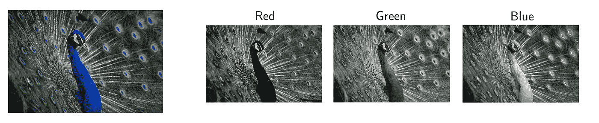

Most of the time, we deal with RGB images with three channels. (Credit: [Andre Mouton](https://unsplash.com/photos/_d3sppFprWI))

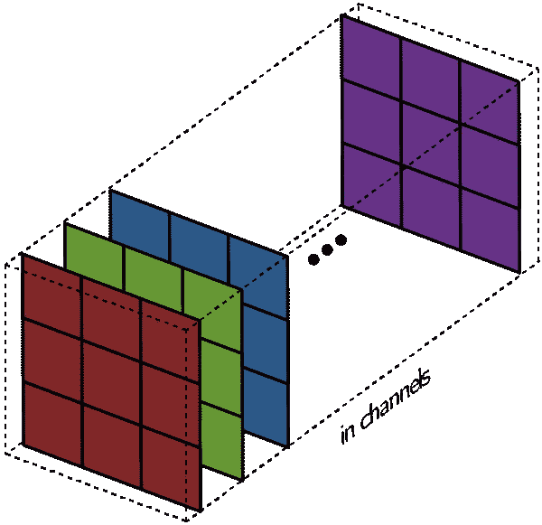

A filter: A collection of kernels

这就是术语之间的关键区别:然而在单通道情况下，术语滤波器和内核是可互换的，在一般情况下，它们实际上是非常不同的。每个滤波器实际上都是内核、*、*的*集合，对于该层的每个输入通道都有一个内核，并且每个内核都是唯一的。*

卷积层中的每个滤波器产生一个且仅一个输出通道，它们的工作方式如下:

滤波器的每个内核在它们各自的输入通道上“滑动”,产生每个内核的处理版本。一些内核可能比其他内核具有更强的权重，以给予某些输入通道比其他通道更多的强调(例如，滤波器可能具有比其他通道具有更强权重的红色内核通道，因此，比其他通道对红色通道特征的差异响应更多)。

每个每通道处理的版本然后被加在一起以形成*一个*通道。滤波器的每个内核产生每个声道的一个版本，并且滤波器作为一个整体产生一个总输出声道。

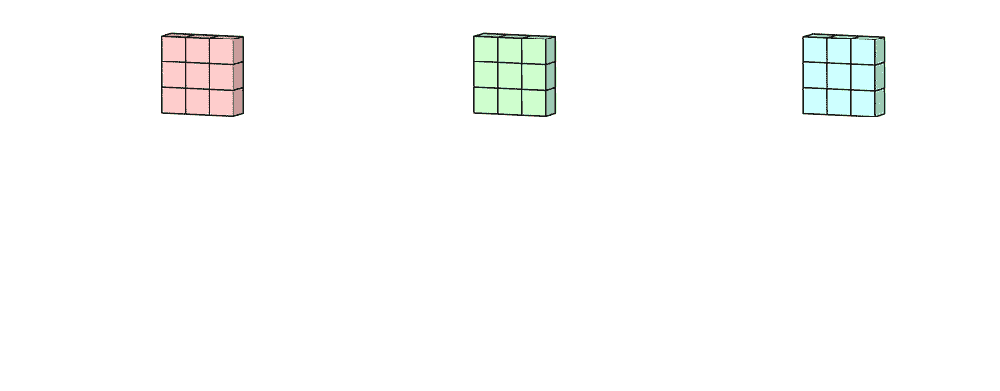

最后，还有偏差项。偏置项的工作原理是，每个输出滤波器都有一个偏置项。到目前为止，偏置被添加到输出通道，以产生最终输出通道。

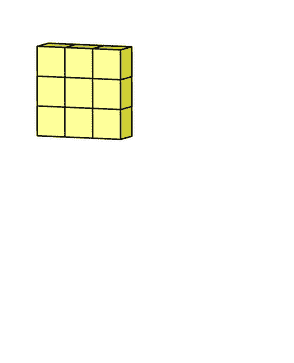

单个滤波器的情况下，任何数量的滤波器的情况都是相同的:每个滤波器使用其自己的不同核集合和标量偏差来处理输入，产生单个输出通道。然后将它们连接在一起，产生总输出，输出通道的数量等于滤波器的数量。然后，通常在将其作为输入传递到另一个卷积层之前应用非线性，然后该卷积层重复该过程。

# 2D 卷积:直觉

## 卷积仍然是线性变换

即使放下卷积层的机制，仍然很难将它与标准的前馈网络联系起来，并且它仍然没有解释为什么卷积可以扩展到图像数据，并且对图像数据的处理更好。

假设我们有一个 4×4 的输入，我们想把它转换成 2×2 的网格。如果我们使用前馈网络，我们会将 4×4 输入整形为长度为 16 的向量，并将其通过具有 16 个输入和 4 个输出的密集连接层。人们可以想象一个层的权重矩阵 **W** :

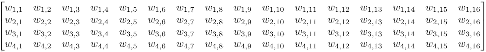

All in all, some 64 parameters

而且虽然卷积核运算乍一看可能有点奇怪，但它仍然是一个线性变换，有一个等价的变换矩阵。如果我们要对整形后的 4×4 输入使用大小为 3 的核 **K** 来获得 2×2 输出，则等效变换矩阵将是:

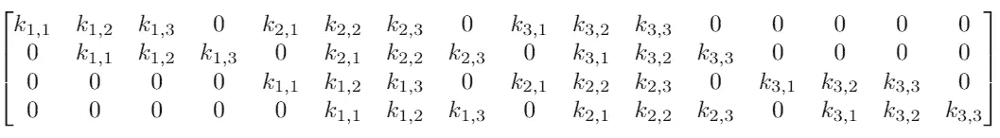

There’s really just 9 parameters here.

(注意:虽然上面的矩阵是一个等价的*变换矩阵，但是实际的操作通常被实现为一个非常不同的[矩阵乘法[2]](http://cs231n.github.io/convolutional-networks/) )*

卷积总体上仍然是线性变换，但同时也是一种截然不同的变换。对于一个有 64 个元素的矩阵，只有 9 个参数可以重复使用几次。每个输出节点只能看到选定数量的输入(内核内部的输入)。没有与任何其他输入的交互，因为它们的权重被设置为 0。

将卷积运算视为权重矩阵上的*硬先验*是很有用的。在这种情况下，我所说的先验是指预定义的网络参数。例如，当您使用预训练模型进行图像分类时，您使用*预训练网络参数*作为您的先验，作为您最终密集连接层的特征提取器。

从这个意义上说，两者为何如此高效(与它们的替代品相比)有着直接的直觉。与随机初始化相比，迁移学习的效率提高了几个数量级，因为您只需要优化最终全连接层的参数，这意味着您可以在每个类只有几十个图像的情况下获得出色的性能。

在这里，您不需要优化所有 64 个参数，因为我们将它们中的大多数设置为零(并且它们将保持这种状态)，其余的我们转换为共享参数，结果只有 9 个实际参数需要优化。这种效率很重要，因为当你从 MNIST 的 784 个输入转到现实世界的 224×224×3 图像时，那就超过了 15 万个输入。试图将输入减半为 75，000 个输入的密集层仍然需要超过 10 *亿*个参数。相比之下，ResNet-50 的*整体*有大约 2500 万个参数。

因此，将一些参数固定为 0，并绑定参数可以提高效率，但与迁移学习的情况不同，在迁移学习的情况下，我们知道先验是好的，因为它对一组大型图像有效，我们如何知道*这个*是好的呢？

答案在于先验引导参数学习的特征组合。

## 位置

在本文前面，我们讨论了:

*   内核仅组合来自小的局部区域的像素来形成输出。也就是说，输出要素仅“看到”小范围局部区域的输入要素。
*   核被全局地应用于整个图像以产生输出矩阵。

因此，随着反向传播从网络的分类节点一路传来，核有了学习权重的有趣任务，以便仅从一组局部输入中产生特征。此外，因为内核本身应用于整个图像，所以内核学习的特征必须足够通用，以来自图像的任何部分。

如果这是任何其他类型的数据，例如应用程序安装的分类数据，这将是一场灾难，因为仅仅因为你的*应用程序安装数量*和*应用程序类型*列相邻，并不意味着它们与*应用程序安装日期*和*使用时间*有任何共同的“本地共享功能”。当然，这四个可能有一个潜在的更高层次的特征(例如，人们最想要的应用程序)，但这让我们没有理由相信前两个的参数与后两个的参数完全相同。这四个可以有任何(一致的)顺序，仍然有效！

然而，像素总是以一致的顺序出现，并且附近的像素会影响一个像素，例如，如果所有附近的像素都是红色的，则该像素很可能也是红色的。如果存在偏差，这是一个有趣的异常，可以转换为一个特征，所有这些都可以通过将一个像素与其邻居以及其位置上的其他像素进行比较来检测。

这种想法正是许多早期计算机视觉特征提取方法的基础。例如，对于边缘检测，可以使用 Sobel 边缘检测滤波器，这是一种具有固定参数的内核，操作方式与标准单通道卷积类似:

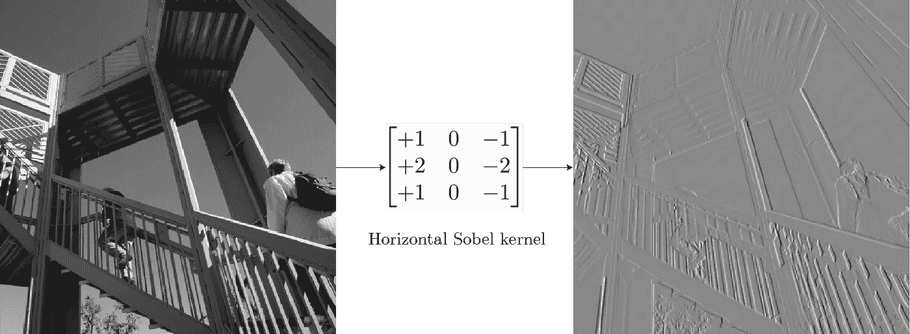

Applying a vertical edge detector kernel

对于不包含边缘的网格(如背景天空)，大多数像素都是相同的值，因此在该点内核的总输出为 0。对于具有垂直边缘的网格，边缘左侧和右侧的像素之间存在差异，内核将该差异计算为非零，从而激活和显示边缘。内核一次只能运行 3×3 个网格，检测局部范围内的异常，但当应用于整个图像时，足以检测全局范围内图像中任何位置的某个特征！

所以我们与深度学习的关键区别是问这个问题:有用的内核能被学习吗？对于在原始像素上操作的早期层，我们可以合理地期待相当低级别特征的特征检测器，如边缘、线等。

深度学习研究有一个完整的分支，专注于使神经网络模型可以解释。由此产生的最强大的工具之一是使用优化[3] 的[特征可视化。核心思想很简单:优化图像(通常用随机噪声初始化)以尽可能强地激活滤镜。这确实有直观的意义:如果优化的图像完全充满了边缘，这就是过滤器本身正在寻找并被激活的有力证据。使用这个，我们可以看到学习过的过滤器，结果是惊人的:](https://distill.pub/2017/feature-visualization/)

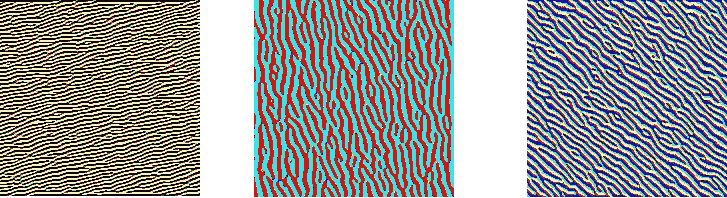

Feature visualization for 3 different channels from the 1st convolution layer of GoogLeNet[3]. Notice that while they detect different types of edges, they’re still low-level edge detectors.

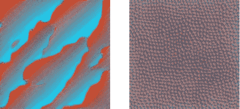

Feature Visualization of channel 12 from the 2nd and 3rd convolutions[3]

这里需要注意的一点是*卷积图像是静止图像。*来自图像左上角的小像素网格的输出仍然在左上角。因此，您可以在另一个卷积层(如左边的两个)上运行另一个卷积层，以提取更深层次的特征，我们将这些特征可视化。

然而，无论我们的特征检测器有多深，如果没有任何进一步的改变，它们仍将在图像的非常小的区域上操作。无论你的探测器有多深，你都无法从一个 3×3 的网格中探测到人脸。这就是感受野概念的由来。

## 感受野

任何 CNN 架构的一个基本设计选择是，从网络的开始到结束，输入大小越来越小，而通道的数量越来越多。如前所述，这通常是通过跨越或合并层来实现的。局部性决定了输出可以看到前一层的哪些输入。感受野决定了整个网络的*原始输入*的哪个区域是输出可以看到的。

步长卷积的思想是我们只处理相隔固定距离的幻灯片，跳过中间的幻灯片。从不同的角度来看，我们只保持输出相隔固定的距离，并删除其余的[1]。

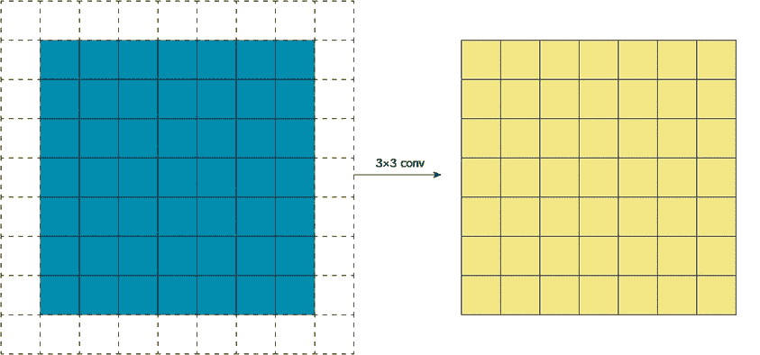

3×3 convolution, stride 2

然后，我们对输出进行非线性处理，通常，在顶部叠加另一个新的卷积层。这就是事情变得有趣的地方。即使我们将具有相同局部面积的相同大小(3×3)的核应用于步长卷积的输出，该核也将具有更大的有效感受野:

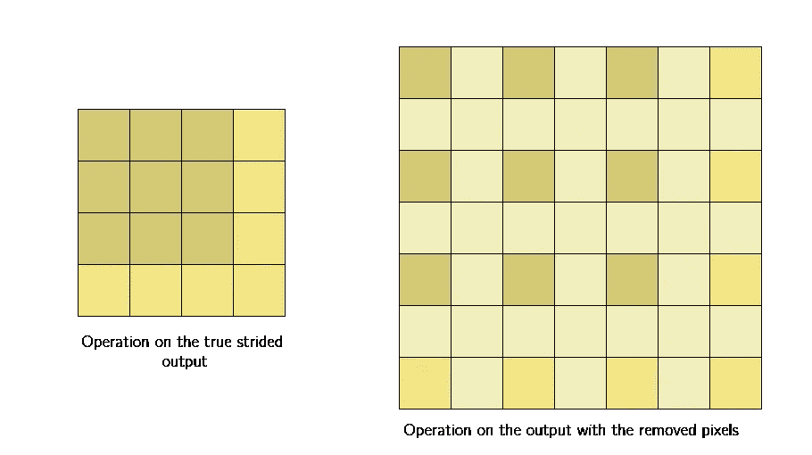

这是因为条纹层的输出仍然表示相同的图像。与其说是裁剪，不如说是调整大小，唯一的问题是输出中的每个像素都是来自原始输入的相同粗略位置的更大区域(其其他像素已被丢弃)的“代表”。因此，当下一层的内核对输出进行操作时，它对从更大区域收集的像素进行操作。

(注意:如果你熟悉扩张回旋，请注意以上是*而不是*扩张回旋。两者都是增加感受野的方法，但是扩张卷积是单层的，而这发生在步长卷积之后的规则卷积上，其间有非线性)

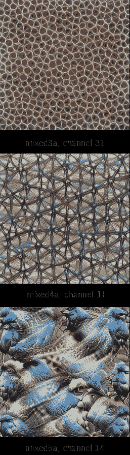

Feature visualization of channels from each of the major collections of convolution blocks, showing a progressive increase in complexity[3]

感受野的这种扩展允许卷积层将低级特征(线、边缘)组合成高级特征(曲线、纹理)，正如我们在 mixed3a 层中看到的。

接着是池化/跨步层，网络继续为更高层次的特征(零件、模式)创建检测器，正如我们在 mixed4a 中看到的。

与 224×224 的输入相比，网络上图像大小的反复减小导致卷积上的第 5 个块的输入大小仅为 7×7。此时，每个*单个*像素代表一个 32×32 像素的网格，规模巨大。

与早期的激活意味着检测边缘的图层相比，在这里，在微小的 7×7 网格上的激活是用于非常高级别的特征，例如鸟类。

网络作为一个整体从检测低级特征的少量过滤器(在 GoogLeNet 的情况下为 64 个)发展到非常大量的过滤器(在最后的卷积中为 1024 个)，每个过滤器寻找一个非常具体的高级特征。接下来是最终的合并层，它将每个 7×7 的网格折叠成一个像素，每个通道都是一个特征检测器，其感受域相当于整个*图像。*

与标准前馈网络相比，这里的输出确实令人惊叹。标准的前馈网络会从图像中每一个像素的组合中产生抽象的特征向量，需要大量的数据来训练。

具有强加于其上的先验的 CNN，通过学习非常低级的特征检测器开始，并且随着其感受域的扩展而跨层，学习将那些低级特征组合成逐渐更高级的特征；不是每一个像素的抽象组合，而是概念的强烈的视觉层次。

通过检测低级别特征，并使用它们来检测更高级别的特征，随着它在视觉层次上的进步，它最终能够检测整个视觉概念，如脸、鸟、树等，这就是为什么它们如此强大，但对图像数据有效。

## 关于对抗性攻击的最后一点说明

根据 CNN 建立的视觉层级，假设他们的视觉系统与人类相似是相当合理的。它们对真实世界的图像非常好，但它们也失败了，这强烈表明它们的视觉系统不完全像人类。最主要的问题:[对抗性例子【4】](https://blog.openai.com/adversarial-example-research/)，经过专门修改来忽悠模型的例子。

To a human, both images are obviously pandas. To the model, not so much.[4]

如果导致模型失败的唯一被篡改的例子是那些甚至人类都会注意到的例子，那么对立的例子就不是问题。问题是，模型很容易受到样本的攻击，这些样本只是被稍微篡改了一下，显然骗不了任何人。这为模型悄无声息地失败打开了大门，这对从无人驾驶汽车到医疗保健的广泛应用来说是非常危险的。

对抗敌对攻击的鲁棒性目前是一个非常活跃的研究领域，是许多论文甚至竞赛的主题，解决方案肯定会改进 CNN 架构，使其变得更安全、更可靠。

# 结论

CNN 是允许计算机视觉从简单应用扩展到复杂产品和服务的模型，从照片库中的人脸检测到更好的医疗诊断。它们可能是计算机视觉向前发展的关键方法，或者其他一些新的突破可能就在眼前。不管怎样，有一件事是肯定的:它们是惊人的，是当今许多创新应用的核心，并且非常值得深入了解。

## 参考

1.  [深度学习卷积算法指南](https://arxiv.org/abs/1603.07285)
2.  [用于视觉识别的 CS231n 卷积神经网络—卷积神经网络](http://cs231n.github.io/convolutional-networks/)
3.  [特征可视化——神经网络如何建立对图像的理解](https://distill.pub/2017/feature-visualization/)(注意:这里的特征可视化是由 [Lucid](https://github.com/tensorflow/lucid) 库产生的，这是这篇期刊文章中技术的开源实现)
4.  [用对立的例子攻击机器学习](https://blog.openai.com/adversarial-example-research/)

## 更多资源

1.  [fast . ai——第三课:改进你的图像分类器](http://course.fast.ai/lessons/lesson3.html)
2.  [Conv 篮网:模块化视角](http://colah.github.io/posts/2014-07-Conv-Nets-Modular/)
3.  [使用非常少的数据构建强大的图像分类模型](https://blog.keras.io/building-powerful-image-classification-models-using-very-little-data.html)

*希望你喜欢这篇文章！如果你想保持联系，你可以在 Twitter* [*这里*](https://twitter.com/irhumshafkat) *找到我。如有疑问，欢迎评论！—我发现它们对我自己的学习过程也很有用。*