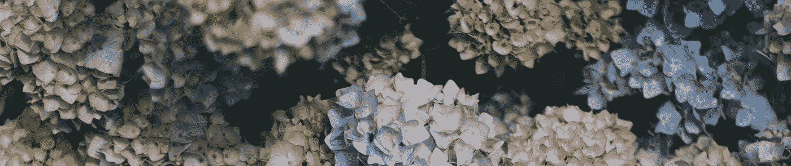
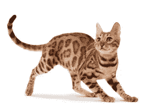
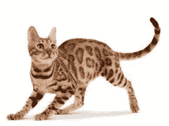
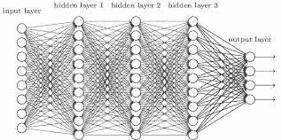

# 利用机器学习监测入侵物种

> 原文：<https://towardsdatascience.com/invasive-species-monitoring-using-machine-learning-9a7b29d565f?source=collection_archive---------4----------------------->

Invasive Species Monitoring using Machine Learning

最近，Kaggle 推出了一项竞赛，ka ggle 人面临的挑战是开发算法，以更准确地识别森林和树叶的图像是否包含入侵的绣球花。因此，简而言之，我们可以看着一幅图像，判断它是否有入侵性绣球(class = 0)或没有入侵性绣球(class = 1)。这告诉我们，这是一个分类问题，因为我们的输入是图像，这将是一个计算机视觉问题。

在这里，我将解释我们使用机器学习来解决这个问题的分步步骤。

# **影像探索**

我们有自己的数据集，我们想做的第一件事是看看我们的图像看起来怎么样。为什么要看图像？因为它将帮助我们识别数据集中各种图像的特征、维数，找出图像是否有眩光以及需要采取什么步骤进行预处理。

在查看图像后，我们发现，如果一个人看到来自数据集的图像，并询问绣球花的存在，他将主要根据花和叶子的类型和颜色做出决定。另一件事，我们发现我们的数据集包含较小尺寸的矩形图像。我们的数据集包含 1400 个入侵物种和 867 个非入侵类的图像。

**根据以上观察，我们得出以下结论:**

1.  我们的数据集很小而且不平衡(3:2)。(当数据集中存在的类不具有相同数量的样本时，该数据集称为不平衡的。)
2.  我们的图像是矩形的；因此，如果我们决定使用卷积神经网络(我们计划使用 CNN)，我们可能需要制作正方形格式的图像。
3.  图像尺寸很小，因此很难识别特征。
4.  数据集中的一些图像对比度较低。

# 预处理数据集

## **对比拉伸**

由于我们的图像对比度越来越低，我们需要找到一种方法来增强图像的对比度。这对我们来说很重要，因为对比度有助于区分图像的不同特征，而这些特征在低对比度图像中可能无法表现出来。为了实现这一点，我们应用了一种简单的图像增强技术，称为对比度拉伸，顾名思义，它试图通过*“拉伸”*图像包含的亮度值范围来跨越所需的值范围，从而提高图像的对比度。

Contrast Stretching

## 数据扩充

我们用于训练模型的样本数量较少，由于缺乏训练数据，我们的模型可能无法为测试集提供良好的预测。为了解决这个问题，我们将使用数据扩充，这基本上意味着从现有的训练数据集人工生成数据。数据扩充中的一种流行技术是变换(这包括移位、缩放、旋转、翻转等。).我们将应用垂直翻转从训练集中生成更多样本，这将有助于加强模型。

Data Augmentation using Vertical Flip

## 填料

我们的图像尺寸很小，如果我们提供它来训练我们的模型，我们可能会失去一些功能。为了解决这个问题，我们需要调整图像的大小。我们的图像是矩形尺寸，因此在图像顶部应用 resize 将导致图像拉伸或扭曲，这将为模型提供错误的特征。最好将图像转换为正方形格式，这可以通过对图像进行切片或在图像周围添加白色或黑色空间(填充)使其成为正方形来实现。切片将导致信息丢失，我们可能会失去一些重要的功能，因此我们将使用填充。

## 调整大小

正如我前面提到的，图像的尺寸很小，我们将使用线性插值来调整图像的大小。这将有助于网络识别尺寸较小但对分类很重要的特征，例如绣球花的存在。

# 模型生成

我们使用的是一个****的 11 层*** 与 ***ReLU*** 的激活函数。*

**

*Convolution Neural Network*

*我喜欢 CNN 在这里的解释方式。
请点击在 [*AlexNet* 上找到论文。](https://papers.nips.cc/paper/4824-imagenet-classification-with-deep-convolutional-neural-networks.pdf)*

# *结果*

*我们生成的模型在测试数据集上提供了 95%的准确率。在 [Github](https://github.com/RAJAT--PALIWAL/Invasive-Species-Prediction) 上找到代码库。*

# ***参考文献***

*对于数据集，请转到 [Kaggle 竞赛](https://www.kaggle.com/c/invasive-species-monitoring/)*

*与杰鲁巴尔·约翰·卢克和[库纳尔·萨卡尔](http://www.linkedin.com/in/kunalsrkr)合作撰写。*