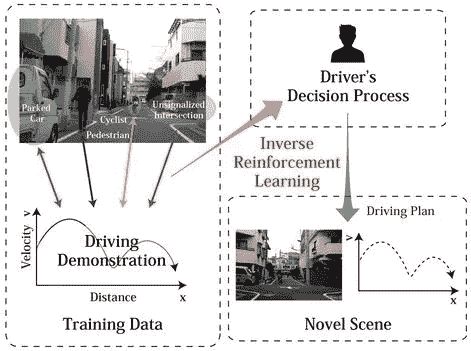
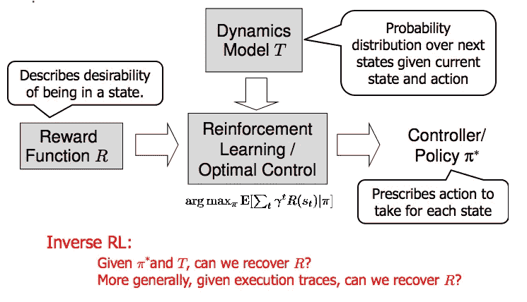
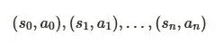
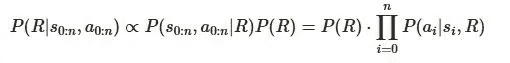
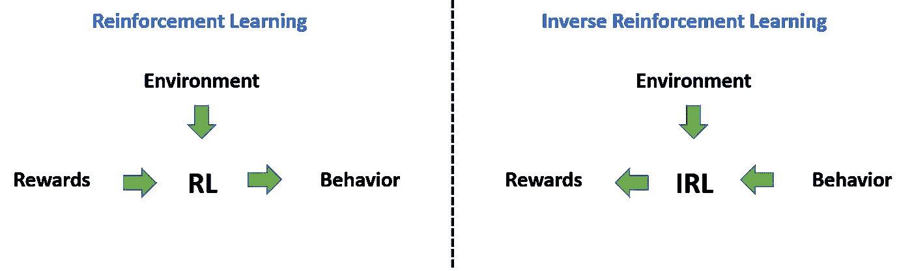

# 逆向强化学习

> 原文：<https://towardsdatascience.com/inverse-reinforcement-learning-6453b7cdc90d?source=collection_archive---------3----------------------->

## 导言和主要问题

**本文根据约翰尼斯·海德克的作品******[**雅各布·斯坦哈特**](https://jsteinhardt.wordpress.com/2017/02/07/model-mis-specification-and-inverse-reinforcement-learning/) [**，奥万·埃文斯**](https://www.lesswrong.com/posts/cnC2RMWEGiGpJv8go/model-mis-specification-and-inverse-reinforcement-learning) [**乔丹·亚历山大**](https://thegradient.pub/learning-from-humans-what-is-inverse-reinforcement-learning/)**[**普拉桑特·奥纳库坦**](https://medium.com/@pomanakuttan9642?source=post_header_lockup) **，我用他们的话来帮助人们理解 IRL。********

****逆强化学习是最近发展起来的一种机器学习框架，可以解决强化学习的逆问题。****

****基本上，IRL 是关于向人类学习的。****

*******逆强化学习* (IRL)** 是通过观察智能体的行为来学习其目标、价值观或奖励的领域。****

****约翰内斯·海德克说:“我们可能会观察人类在某些特定任务中的行为，并了解人类试图实现的环境状态以及具体的目标可能是什么。”([来源](https://thinkingwires.com/posts/2018-02-13-irl-tutorial-1.html))****

> ****“IRL 是一个依赖于马尔可夫决策过程(MDPs)的范例，其中学徒代理的目标是从专家演示中找到一个可以解释专家行为的奖励函数。”比拉尔·皮奥特、马蒂厄·艾斯特和奥利弗·皮特奎因，弥合了模仿学习和逆向强化学习之间的差距****

> ****如果有一天某些人工智能达到了超人的能力，IRL 可能是理解人类想要什么并有望朝着这些目标努力的一种方法。****

# ****奖励函数****

****乔丹·亚历山大说:“我们的目标是学习一种决策过程，以产生最大化某种预先定义的奖励函数的行为。基本上，目标是从代理的观察行为中提取奖励函数。****

****例如，考虑自动驾驶的任务。一种方法是创建一个奖励函数，捕捉驾驶员的期望行为，如红灯停车、避开行人等。然而，这需要一份我们想要考虑的所有行为的详尽清单，以及一份描述每个行为重要性的权重清单。"([来源](https://thegradient.pub/learning-from-humans-what-is-inverse-reinforcement-learning/))****

****人工智能研究员 Prasanth Omanakuttan 表示，“然而，通过 IRL，任务是获取一组人类生成的驾驶数据，并提取人类对该任务的奖励函数的近似值。尽管如此，解决一个问题所需的大部分信息都是在真实回报函数的近似值中获得的。一旦我们有了正确的奖励函数，问题就简化为寻找正确的政策，并且可以用标准的强化学习方法来解决。”([来源](https://medium.com/@pomanakuttan9642/what-is-inverse-reinforcement-learning-e333228af146)****

********

****[Source](http://www.miubiq.cs.titech.ac.jp/modeling-risk-anticipation-and-defensive-driving-on-residential-roads-using-inverse-reinforcement-learning/)****

> ****“将复杂的任务转化为简单的奖励函数的主要问题是**一个给定的政策对于许多不同的奖励函数来说可能是最优的**。也就是说，即使我们有专家的行动，也存在许多不同的奖励函数，专家可能试图最大化这些函数。”乔丹·亚历山大，斯坦福大学，向人类学习:什么是逆向强化学习？****

****比拉尔·皮奥特、马蒂厄·艾斯特和奥利维尔·皮特奎因说过:“换句话说，我们的目标是模拟一个在给定环境中采取行动的主体。因此，我们假设我们有一个**状态空间** S(代理和环境可以处于的状态集合)，一个**动作空间** A(代理可以采取的动作集合)，以及一个**转移函数**T(S′| S，A)，它给出了当采取动作 A 时从状态 S 移动到状态 S′的概率。例如，对于一个学习控制汽车的 AI， 状态空间将是汽车的可能位置和方向，动作空间将是 AI 可以发送给汽车的一组控制信号，转移函数将是汽车的动力学模型。 (s，a，t)的元组称为 MDP∖R，它是一个没有报酬函数的马尔可夫决策过程。(MDP∖R 将有一个已知的地平线或贴现率γ，但为了简单起见，我们将这些略去。)****

********

****[Source](https://jsteinhardt.wordpress.com/2017/02/07/model-mis-specification-and-inverse-reinforcement-learning/)****

****IRL 的推理问题是在给定一个最优策略π∫:s→a 的情况下推理一个奖励函数 r。对于 MDP∖R.，我们从状态的样本(s，a)中学习策略π∫，并根据π∫(可能是随机的)学习相应的动作。通常，这些样本来自一个轨迹，该轨迹记录了单个事件中代理的状态和动作的完整历史:****

********

****在汽车的例子中，这将对应于正在演示期望的驾驶行为的专业人类驾驶员所采取的动作(其中这些动作将被记录为给方向盘、刹车等的信号。).****

****给定 MDP∖R 和观察到的轨迹，目标是推断回报函数 r。在贝叶斯框架中，如果我们指定 r 的先验，我们有:****

********

****似然性 P(ai|si，R)恰好是πR(s)[ai]，其中πR 是奖励函数 R 下的最优策略。注意，在给定奖励的情况下计算最优策略通常是非平凡的；除了在简单的情况下，我们通常使用强化学习来近似策略。由于指定先验、计算最优策略和整合奖励函数的挑战，**IRL 中的大部分工作使用某种近似的贝叶斯目标。"(** [**)来源**](http://www.lifl.fr/~pietquin/pdf/TNNLS_2016_BPMGOP.pdf) **)******

# ****奖励信号****

****约翰内斯·海德克说:“在大多数强化学习任务中，没有奖励信号的自然来源。相反，它必须是手工制作和精心设计的，以准确地代表任务。****

****通常，有必要手动调整 RL 代理的奖励，直到观察到期望的行为。为某些目标找到合适的奖励函数的更好的方法可能是观察执行任务的(人类)专家，以便从这些观察中自动提取相应的奖励。"([来源](https://thinkingwires.com/posts/2018-02-13-irl-tutorial-1.html))****

> ****IRL 的最大动机是为一项任务手动指定一个奖励函数通常非常困难。****

# ****数据中的人类行为****

******Johannes Steinhardt 说“IRL 是一种很有前途的学习人类价值观的方法，部分原因是数据容易获得。**对于监督学习，人类需要产生许多专门用于某项任务的标记实例。相比之下，IRL 是一种无监督/半监督的方法，其中任何人类行为记录都是潜在的数据源。脸书的用户行为日志，YouTube 视频等。提供了许多关于人类行为的数据。****

****然而，虽然有大量关于人类偏好的现有数据，但利用这些数据进行 IRL 在当前技术下是困难的。"([来源](https://jsteinhardt.wordpress.com/2017/02/07/model-mis-specification-and-inverse-reinforcement-learning/))****

# ****精选数据****

****Johannes Steinhardt 提到的另一个因素是关于数据的问题。他说“书籍和视频中的人类行为记录对于 IRL 算法来说很难使用。然而，来自脸书的数据似乎很有希望:我们可以存储状态和每个人类动作(点击和滚动)。****

****虽然这涵盖了广泛的任务，但有明显的局限性。人类的某些偏好似乎很难从计算机的行为中了解。"****

# ****信息和偏见****

****人类的行为取决于他们的偏好和信仰。****

****Owain Evans 和 Johannes Steinhardt 说“信念，就像偏好一样，从来不会被直接观察到。对于狭窄的任务(例如，人们从显示器中选择他们最喜欢的照片)，我们可以模拟人类对状态的完全了解。但是对于大多数现实世界的任务，人类的信息是有限的，并且他们的信息会随着时间而变化。如果 IRL 假设人类拥有全部的信息，那么这个模型就是错误的，概括人类在其他情况下的偏好可能是错误的。以下是一些例子:****

*   ****有人从家来到一家已经打烊的餐馆。如果假设他们有完整的知识，那么 IRL 会推断出另一种偏好(例如去散步)，而不是去吃东西。****
*   ****假设一个 IRL 算法正在从一个人笔记本电脑上的按键推断他的目标。这个人经常忘记他们的登录密码，不得不重新设置。这种行为很难用 POMDP 风格的模型来捕捉:人类会忘记一些字符串，但不会忘记其他字符串。IRL 可能推断这个人*想要*重复重置他们的密码。****

****上述情况源于人类遗忘信息——即使信息只是一小段字符串。这是人类系统地偏离理性贝叶斯代理的一种方式。"([来源](https://www.lesswrong.com/posts/cnC2RMWEGiGpJv8go/model-mis-specification-and-inverse-reinforcement-learning))****

# ****长期计划****

****Owain Evans 和 Johannes Steinhardt 给出的另一个要素是长期计划。事实上，他们说“为了实现一个长期目标，代理人通常会采取一系列长时间的行动，这些行动会在瞬间产生负面效用。出于几个原因，这样的长期计划会使 IRL 变得更加困难。让我们关注两点:****

*   ****IRL 系统可能无法访问正确类型的数据来学习长期目标。****
*   ****需要预测长的动作序列会使算法在面对模型错误设定时更加脆弱。****

****为了根据长期计划做出推论，拥有单个代理人在很长一段时间内的行动的一致数据将是有帮助的。但在实践中，我们可能会有更多的数据，包括大量不同代理的简短快照(因为许多网站或在线服务已经记录了用户交互，但即使一个人离线，也很少有人在很长一段时间内被彻底跟踪和记录)。****

****另一方面，有一些服务确实拥有长期的个人用户的大量数据。然而，这些数据还有另一个问题:它在非常系统的方面是不完整的(因为它只跟踪在线行为)。例如，有人可能大部分时间都在网上阅读课程笔记和维基百科；这是可能被记录的数据。然而，不太可能会有一个人参加期末考试、通过课程、然后根据他们的课堂表现获得实习的记录。当然，这个序列的一些片段可以根据一些人的电子邮件记录等推断出来。，但相对于维基百科的使用记录，它可能在数据中没有得到充分的体现。无论是哪种情况，都需要一定程度的推理来理解这些数据。****

******接下来，我们讨论另一个潜在的问题——模型设定错误的脆弱性。******

****假设有人花了 99 天做一件无聊的事情，在第 100 天完成了一个重要的目标。一个只试图正确预测行动的系统，如果它预测这个人天生喜欢无聊的任务，那么它在 99%的时间里都是正确的。当然，一个理解目标以及任务如何导致目标的系统在 100%的时间里都是正确的，但是即使是理解中的小错误也会使准确率回到 99%以下。****

****基本上，代理人模型的大变化可能只会导致模型预测准确性的小变化，并且实现目标的时间范围越长，这种情况可能越多。这意味着，即使模型中轻微的错误设定也可能使天平向(非常)不正确的奖励函数倾斜。一个解决方案是识别那些看起来与回报函数紧密相关的“重要”预测，并特别关注那些正确的预测。"([来源](https://www.lesswrong.com/posts/cnC2RMWEGiGpJv8go/model-mis-specification-and-inverse-reinforcement-learning))****

> ****即使是轻微的模型不规范,“正确的”模型在典型的度量标准(如预测准确性)下实际上可能表现得更差。因此，可能需要更仔细的方法来构建模型。****

********

****人工智能研究员约翰内斯·海德克(Johannes Heidecke)说:“在 IRL 中，我们被给予一些代理人的政策或行为历史，我们试图找到一个解释给定行为的奖励函数。假设我们的代理人采取最优行动，即总是为其奖励函数选择最佳可能的行动，我们试图估计可能导致这种行为的奖励函数。”([来源](https://thinkingwires.com/posts/2018-02-13-irl-tutorial-1.html)****

# ******IRL 的问题******

*****如何找到一个奖励函数，在这个函数下观察到的行为是最优的。这带来了两个主要问题:*****

*   ****对于大多数行为观察，有许多合适的奖励函数。解集往往包含许多退化解，即给所有状态分配零奖励。****
*   ****IRL 算法假设观察到的行为是最佳的。这是一个强有力的假设，当我们谈到人类的示范时，可以说是太强了。****

******重要的** : IRL 寻找“解释”演示的奖励函数。**不要将此与学徒学习(AL)相混淆，在学徒学习中，主要兴趣是能够产生可见示范的政策**。****

****比拉尔·皮奥特、马蒂厄·艾斯特和奥利弗·皮特奎因认为，“IRL 依赖于这样的假设，即专家的政策对于未知的报酬函数是最优的。在这种情况下，学徒的第一个目标是学习一个奖励函数来解释观察到的专家行为。然后，使用直接强化学习，它根据这个奖励优化它的策略，并希望表现得和专家一样好。学习奖励比立即学习政策有一些优势。首先，可以对奖励进行分析，以便更好地了解专家的行为。第二，它允许适应环境动态的扰动。****

****换句话说，它可以转移到其他环境中。第三，它允许通过真实的交互随着时间的推移而改进，而不需要新的演示。然而，一个主要的问题是必须解决 MDP 以获得关于学习奖励的最优策略。另一个问题是，IRL 问题是不适定的，因为每个政策对于零回报(显然不是人们所寻求的回报)都是最优的。"([来源](http://www.lifl.fr/~pietquin/pdf/TNNLS_2016_BPMGOP.pdf))****

******想了解更多，我推荐这几篇:** -[https://thinking wires . com/posts/2018-02-13-IRL-tutorial-1 . html](https://thinkingwires.com/posts/2018-02-13-irl-tutorial-1.html)
-[https://www . less wrong . com/posts/cn C2 rmwegigpjv 8 go/model-mis-specification-and-inverse-reinforcement-learning](https://www.lesswrong.com/posts/cnC2RMWEGiGpJv8go/model-mis-specification-and-inverse-reinforcement-learning)
-[http://www.lifl.fr/~pietquin/pdf/TNNLS_2016_BPMGOP.pdf](http://www.lifl.fr/~pietquin/pdf/TNNLS_2016_BPMGOP.pdf)
-[https](https://medium.com/@pomanakuttan9642/what-is-inverse-reinforcement-learning-e333228af146)****