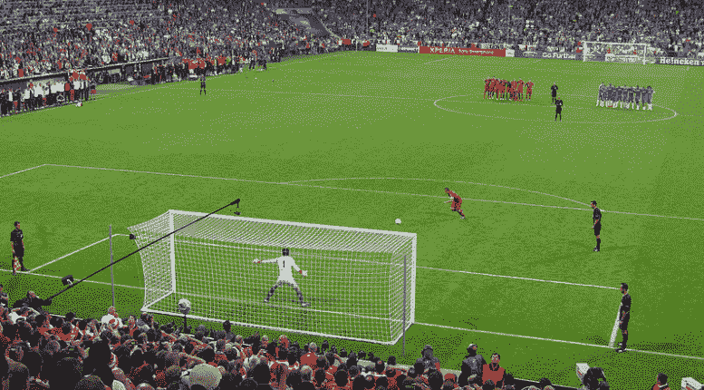
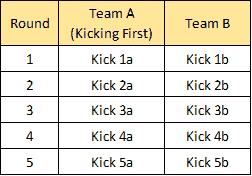
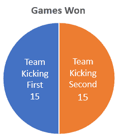
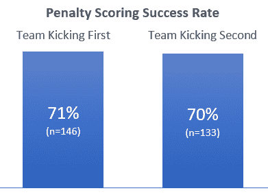
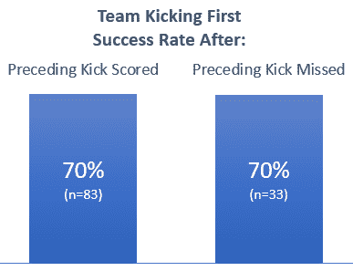
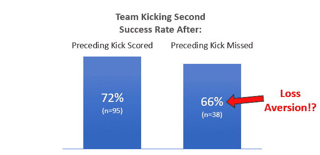
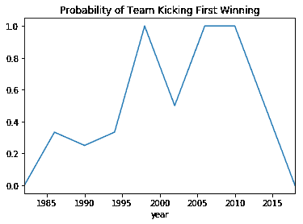

# 世界杯点球大战中损失厌恶的研究

> 原文：<https://towardsdatascience.com/investigating-loss-aversion-in-world-cup-penalty-shoot-outs-8bd2ba48ce86?source=collection_archive---------8----------------------->

From [Markus Unger](https://www.flickr.com/people/14385354@N00)

我最近在读一本名为《思考，快与慢》的书，这本书向我介绍了规避损失的概念。这是一种心理效应，在这种效应下，人们会更加努力地避免感知到的损失，而不是获得同等的收益。例如，你自己的钱损失了 5 英镑，感觉比赚了 5 英镑还要糟糕。

这本书讨论了这在体育运动中的影响，其中有一项关于职业高尔夫的研究[。在一场高尔夫比赛结束时，只有击球总数才算数。然而，这项研究表明，高尔夫球手在标准杆推杆(失误意味着在该洞失去一杆)方面比小鸟(在该洞获得一杆)更好。理论是，正是对损失的厌恶使他们下意识地更加关注标准杆推杆，因此他们在推杆上更加成功。](http://faculty.chicagobooth.edu/devin.pope/research/pdf/Website_Golf.pdf)

随着最近世界杯的举行，英格兰队卷入了与哥伦比亚队的点球大战，我想知道厌恶损失是否会产生影响。

点球决胜用于决定在淘汰赛阶段正常比赛的加时赛后仍然平局的比赛。有五轮比赛，球队轮流射门，如果之后仍然是平局，可能还有额外的几轮“突然死亡”点球。开始时要掷硬币来决定谁先开球。

就像高尔夫球一样，只有你在决赛中的总分才算数，但是由于处罚是在回合中进行的，所以可能会出现锚定数字效应，就像上面的高尔夫球例子一样。鉴于大多数点球都是得分的，在一轮比赛中第一个踢球的球员的“标准杆”就是得分——因为错过很可能意味着该轮比赛的负结果。然而，对于第二个踢球者来说，“par”是可变的。如果第一个踢球者得分，那么“标准杆”对他来说是一样的，但如果第一个踢球者错过了…突然“标准杆”也不见了，得分就是“小鸟球”，因为这将是这一轮的收获。

> 会不会是职业足球运动员肩负着国家的希望，在某些情况下没有尽最大努力？

为了测试这一点，我首先需要一组点球结果的数据。那么，如果厌恶损失有效果，我希望看到以下结果:

*   每一轮中第一次踢腿的得分可能性不受前一次踢腿的影响，因为那是在前一轮中，所以在不同的参考系中。例如，从下面的图表可以看出，kick 2a 不受 1b 的影响，3a 不受 2b 的影响，依此类推。
*   如果一轮中的第一脚踢不中，第二脚踢(“b”脚踢)的得分可能性将会下降。
*   考虑到这种影响，先踢的队更有可能获胜。

Penalties kicking order

# 创建世界杯点球数据集

当我去寻找这方面的数据集时，我很惊讶，我找不到预先存在的数据集。有大量关于处罚事实的文章，但没有一篇包括他们使用的数据。幸运的是，[维基百科有一个表格](https://en.wikipedia.org/wiki/List_of_FIFA_World_Cup_penalty_shoot-outs)记录了 1982 年第一次点球大战的所有结果。

How hard could it be to scrape data already in a [table](https://en.wikipedia.org/wiki/List_of_FIFA_World_Cup_penalty_shoot-outs#Penalty_shoot-outs)?

我听说 80%的数据科学工作是数据清理，但出于某种原因，我不认为这适用于我。数据已经在一个表中了，这能有多难？…男孩，我错了。几乎每个列都需要自己的特殊处理，这占用了这个项目的大部分时间。我也努力将数据重新格式化成每列一个变量的“[整齐数据](https://vita.had.co.nz/papers/tidy-data.pdf)格式。我在最近参加的 Udacity 数据分析师课程中发现了整齐的数据，这将使以后的处理更加容易。

完成的 tidy 数据集是一个 csv 文件，还有我用来创建和分析它的 python 工作簿，[在我的 github](https://github.com/MarkMacArdle/World_Cup_Penalty_Shootouts) 上。它包含了 30 场不同的点球大战和 279 次个人踢球的数据。

# 损失厌恶分析

一旦收集和整理了数据，分析就相对容易了。

## **先踢有优势吗？**

我测量的第一件事是先踢的队获胜的概率。一个[对点球大战的批评是一线队赢的可能性更大](https://en.wikipedia.org/wiki/Penalty_shoot-out_(association_football)#Advantage_to_team_kicking_first?)，但这在数据中看到了吗？

不要！在这个数据中，如果先踢的队会赢，那么就没有优势了。(随着时间的推移，这已经发生了很大的变化，我在最后的一个注释中给出了更多的细节。)看个人点球，一线队的点球成功几率略高。

## 一轮中的第一次踢腿会受到前一次踢腿的影响吗？

他们的成功率没有区别，所以不，前面的踢腿并不影响该队在回合中先踢腿。

因为这是与前一轮的比较，第一轮的踢腿不包括在这个测试中。

## 一轮比赛的第二次踢腿会受到前一次踢腿的影响吗？

**也许！根据第一次踢球的结果，得分的可能性有 6%的差异。即使这些测量显示了差异，重要的问题是:**这是一个显著的差异吗？****

# 对结果显著性的信心

测量的差异实际上可能只是随机噪声，因为可能没有足够的样本来确信差异确实存在。因为这是分类数据，所以我将用卡方检验来检验这一点的独立性。这将输出一个 p 值，如果它低于我选择的显著性水平，只有这样我才能声称有显著性差异。

无效假设是一轮的第一脚踢不影响第二轮的结果，另一个假设是它会影响。

我选择的显著性水平为 0.10，也就是说，有 10%的可能性，我会认为测量的差异是显著的，而实际上不是。我选择了 10%,因为我想相当确定这是有影响的，但我不太担心会出错。如果我错误地指责世界顶级足球运动员不够努力，我肯定不是第一个；我相信他们会克服的。😝

测试的输出是:

> p 值= 0.5107

## **结论:未能拒绝零假设**

**Awww** …仅仅 0.51 的 p 值与所需的 0.1 相差甚远，因此可以确信测得的差异实际上不仅仅是随机噪声。我无法拒绝无效假设，所以结论是一轮比赛的第一次踢腿的结果不会影响第二轮比赛的结果。

那是为了第二轮比赛。对于一轮比赛的第一次踢腿，我根本不需要做测试，因为前一次踢腿得分或失误的结果之间几乎没有可测量的差异。所以我可以总结出点球，无论是一轮比赛中的第一脚还是第二脚，都不会受到前一脚结果的影响(在这个数据集中)。

# 包裹

令人失望的是，我不能证明损失厌恶在起作用，但研究这个很有趣。如果有人想进一步研究这个问题，维基百科页面上有更多关于[欧洲锦标赛](https://en.wikipedia.org/wiki/List_of_UEFA_European_Championship_penalty_shoot-outs)的点球大战数据。这个数据和世界杯点球数据的表格非常相似，所以可能需要对我为其制作的脚本做一些小的修改。

## **关于踢第一优势的注意事项**

我在上面说过，如果第一个踢球的队赢了，那就是五五开。现在这是真的，但随着时间的推移，它已经发生了很大的变化。在 80 年代，90 年代初和 2010 年，踢腿是一个劣势，但从 90 年代中期到 2010 年，成为一个巨大的红利。这一时期很可能是点球大战偏向于球队先踢的观点的来源。

由于这里的样本量较小，每场锦标赛只有几场淘汰赛，所以你可以预期不同的锦标赛之间会有很大的差异。有趣的是这种趋势:在一些比赛中很低，然后很高，然后又很低。

