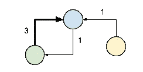
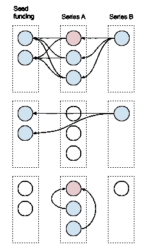
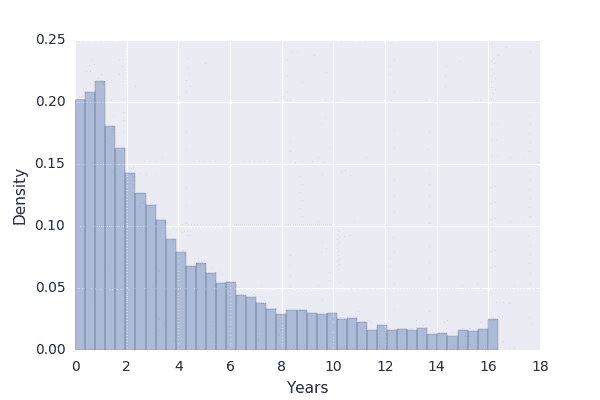

# 投资者影响力网络

> 原文：<https://towardsdatascience.com/investor-network-of-influence-f80f2a1af43f?source=collection_archive---------5----------------------->

通过风险投资生态系统的社会网络分析按影响力对投资者进行排序。

这是在 Crunchbase 数据集上应用机器学习来预测创业公司成功的更大工作的一部分。*投资者影响力*成为模型中最相关的预测因素。

Investor network of influence. Investor **blue** has influenced investor **green** three times and investor **yellow** once. Investor **green** has influenced investor **blue** one time.

为了这个任务，我挑选了可以描述公司发展的数据——我指的是有时间维度的数据——主要是**资助**历史和**状态**从*运营*到*退出*(成功)或*关闭*(失败)的变化。每轮融资记录告知日期、**融资金额**，如果是风险融资，则告知系列信函(如果是风险融资)、参与的**投资者**以及主要投资者(如果有)。

你可以想象，在一家公司的生活中，有如此多的社会、经济和技术变量在发挥作用，数据集超出了预测公司命运的范围。希望我们可以扭曲数据集，以传达投资者的决策:他们在投资一家公司之前确实会分析这些变量。这背后的想法是，由熟练投资者支持的公司有更多的成功机会。

如何确定哪些投资者是熟练的？这个决定再一次代表了投资者的利益。让我重申这个问题:哪些是投资者尊敬的投资者？**投资者影响力**是构建*投资者网络*并使用[卡茨中心性测度](https://en.wikipedia.org/wiki/Katz_centrality)来衡量网络中每个投资者影响力的相对程度的结果。

Modes of influence within a company. An investor influences all investors from posterior funding rounds (upper and middle). Within the same funding round, the lead investor if any, influences the rest of the participants (lower, lead investor in **red**).

该网络是一个*有向图*，其中*节点*是投资者，而*连接*从受影响的投资者(箭头尾部)对着有影响力的投资者(箭头头部)。

每当投资者投资同一家公司时，投资者之间就会建立起一种联系——或者如果这种联系已经存在，这种联系就会得到加强。这种联系是直接的，因为正在考虑事件的因果关系。我认为*投资一家其他人投资过的公司会受到其他人的影响*。当然，这不一定成立，但是联系越紧密，相关性就越强。

The top 500 with additional investor features, out of a total of 25 thousands investors. Aggregated from Q1 2014 to Q1 2017.

[中心性测量](https://en.wikipedia.org/wiki/Centrality)被明确设计为产生一个允许指示最重要节点的排名；一般来说，它们不是用来衡量节点的影响的。

排名仅根据重要性对节点进行排序，它没有量化不同级别排名之间的重要性差异。(正确地)识别给定网络中最重要节点的特征不一定推广到其余节点；对于大多数其他网络节点来说，排名可能没有意义。

# 投资者活动特征时间

在计算投资者影响力时，只考虑投资者最近 3 年的行为。这样，影响不会永远积累，而是随着时间的推移而增加或减少。接下来我解释为什么我选择这个特征时间来分割投资数据。

[半衰期](https://en.wikipedia.org/wiki/Half-life)顾名思义，是一个量减少到初始值一半所需的时间。

我将**投资者活动时间**定义为从投资者进行第一笔投资到最后一笔投资的时间间隔，换句话说，它变得不活跃。我们希望获得中值活动时间:大约一半投资者不活动的时间长度。

Investor activity time of all available investors since year 2001 onwards (normalized histogram).

观察剧情，半衰期约为 **3 年**。这意味着普通投资者在这段时间内收集并投资全部资本。

**源代码**
[https://github.com/matiasbattocchia/crunchbase-ml](https://github.com/matiasbattocchia/crunchbase-ml/blob/master/Investor%20features.ipynb)

**源数据** [Crunchbase 每日 CSV 导出](https://data.crunchbase.com/docs/daily-csv-export) (2017/05/15)