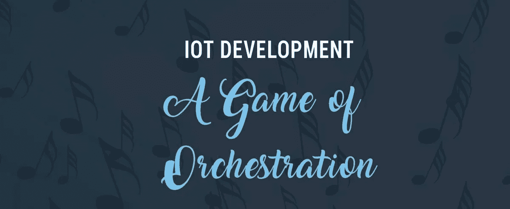

# 物联网开发:编排的游戏

> 原文：<https://towardsdatascience.com/iot-development-a-game-of-orchestration-2ad18d048d61?source=collection_archive---------6----------------------->

想象一个场景，一个在构建传统软件方面有丰富经验的软件工程团队被赋予了处理物联网项目软件的设计和架构的任务。

你认为团队必须提升自身技能才能成功交付项目吗？

答案是肯定的。虽然发展的支柱保持不变，但物联网软件设计的错综复杂程度远远高于电子商务、游戏、社交媒体等传统软件。

一个全功能的物联网软件在其生命周期中有 4 个主要元素——嵌入式、前端、后端、数据科学。

**1。嵌入式**

这形成了任何物联网项目的骨架，因为它形成了设备(也称为“东西”)和互联网之间的第一层交互。以前，在大多数 M2M 应用中，来自硬件的信息是在本地主机上收集、存储和计算的，而有了物联网，信息被转移到云中。除了将数据汇集、排队和发送到互联网，开发人员还需要确保信息始终安全。

因此，该团队必须设计嵌入式软件，使设备能够在保持最高安全级别的情况下连接和传输信息。

**2。后端**

如果说嵌入式构成了骨架，那么后端开发则构成了任何物联网软件项目的“主干”。随着越来越多的设备/事物连接到互联网，系统和设备之间的交互水平成倍增加。当软件被设计成具有与多个微服务、多个客户端和多个设备通信的功能时，物联网项目的价值被最大化。

为了达到期望的动态水平，后端开发团队应该开发软件，以便无缝集成和内部连接成为可能。虽然 HTTP 是传统后端开发中最常用的通信协议，但团队应该训练自己使用特定于物联网的协议，如 MQTT、CoAP 等。

**3。前端**

虽然脊椎骨和骨骼形成了核心，但它是外观，也就是 UI/ UX，是人们购买物联网软件并从中获得价值的基础。因此，前端开发对于创建用户高度参与的软件是至关重要的。大多数行业级物联网应用将与各种现有软件集成，如 SCM、PLM、CRM、ERP 等。取而代之的是，设计前端变得非常重要，这样可以覆盖多个用例，最终用户可以获得“惊喜”因素。用户界面的各种元素，如图形、图表、表格、按钮、导航等。应考虑特定物联网应用将解决的特定业务用例来开发。虽然有些特性可能是通用的，并适用于各种行业，但大多数特性是根据特定公司的使用情况定制的。

实时响应度也是设计过程中需要考虑的一个非常重要的因素。

**4。数据科学**

这构成了物联网应用的大脑。分析模块需要集成到物联网系统中，以便能够处理设备传输的大量高速信息，并将其合成为有用的信息。虽然处理庞大的数据集是任何数据科学模块的核心，但在物联网中，处理需要以最小的延迟“实时”完成。

为了达到上述要求，数据科学家必须了解 Apache Spark、Flex、斯珀等工具。处理时间序列数据。

简而言之，开发一个强大的物联网软件在开始时似乎有点势不可挡，但通过清楚地了解软件的最终目标，并为团队配备所需的技能，开发之旅可以变得顺利。

在 EnrichAI，我们每天都在努力提升自己的技能，为多个行业的客户提供强大的软件服务。

请联系我们的[专家团队](https://www.enrichai.com/)，他们可以帮助您制作一个健壮的应用程序。