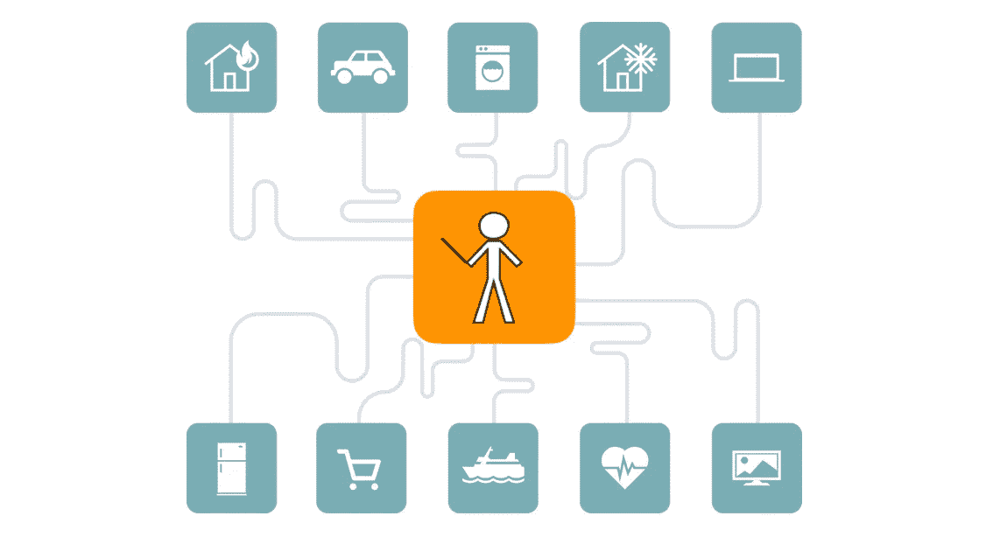
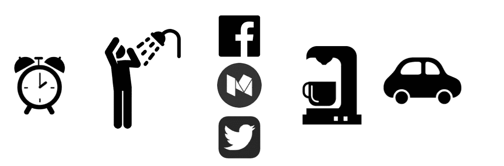
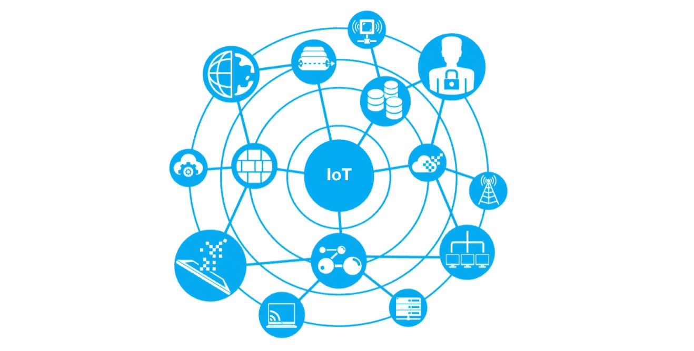
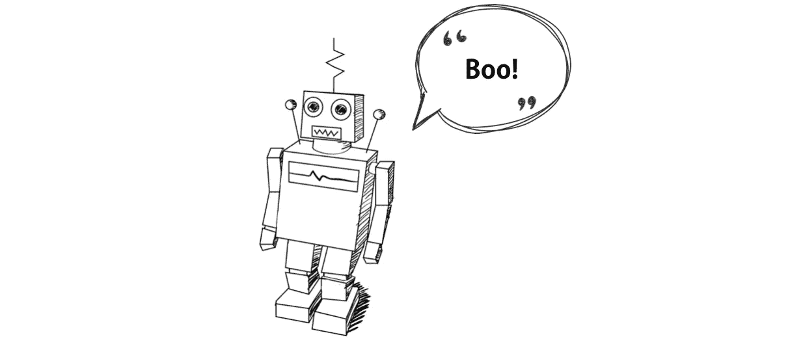

# 物联网+机器学习将改变世界

> 原文：<https://towardsdatascience.com/iot-machine-learning-is-going-to-change-the-world-7c4e0cd7ac32?source=collection_archive---------4----------------------->

## 这将会很棒

物联网正在慢慢渗透到我们生活的方方面面。如果你还没有物联网设备，你肯定[听说过它们](http://iotlineup.com/)。

从智能恒温器到智能咖啡机，物联网设备正在缓慢但稳步地获得[的主流采用](https://www.forbes.com/sites/louiscolumbus/2017/09/29/the-era-of-integrated-iot-has-arrived-in-the-enterprise/#6c0ab6aa4bd2)。此外，虚拟助手*(如 Siri、Cortana 和 Alexa)* 只是让这项技术更容易被采用。

但是，这些设备远非完美。目前，实现最佳功能需要大量的手动输入——内置的*智能*并不多。你必须设置你的闹钟，告诉你的咖啡机什么时候开始煮咖啡，手动设置你的恒温器的时间表，所有这些都是独立而精确的。

这些机器很少相互通信，你只能扮演指挥大师的角色，这是一项劳动密集型的工作。

Your devices talk to you, not each other

这提供了一个巨大的机会。创造出能够学习你的喜好的设备，使用机器智能和相互通信，以最佳的方式增强你周围的世界，这是一种幻想…或者是吗？

## 新范式

让我们考虑一下早上醒来的场景(像我这样的讨厌早晨的人每天都必须经历的一个重复出现的噩梦)。这通常不是一个愉快的过程。让我们看看常规物联网和智能物联网如何帮助改变这种状况:

**场景 1 —没有智能的物联网:**

*   上午 7:30 分:我的闹钟响了，我打了贪睡
*   上午 7:45:闹钟又响了，我醒来后冲了个澡，我的智能咖啡机在设定的时间开始冲我的早餐咖啡
*   上午 8:10:洗完澡，我很快赶完了最重要的隔夜社交媒体通知，试图在出发前不要浪费太多时间
*   上午 8:20:我喝了一杯热咖啡，跳进冰冷的车里，启动它，一边选择合适的播客，一边等待它变得足够热，可以开车了
*   上午 8:30:车里很暖和，我出发了，听着我精心挑选的播客，我的恒温器处于待机状态，以节省电能，直到我晚上回来

好的，*还不错*。然而，与我的精确程序的小偏差会抵消使用自动化的效果。多睡一会儿会让我喝冷咖啡，我很容易迷失在通知中，忘记时间。这些设备的有效性取决于我，但这并不总是行得通的。

但是，让我们看看*智能互联*设备如何让这个系统变得更好。

**场景 2:智能物联网:**

*   我的闹钟响了，我打了个盹
*   上午 7:45 分:闹钟再次响起，我醒来，我的智能淋浴开始运行，在我进去之前预热到完美的温度。我的智能咖啡机知道我刚开始洗澡并开始冲咖啡
*   **上午 8:10**:淋浴完毕。当我刷牙和穿衣服的时候，我的智能镜子会显示一个最重要的通知的高效列表(它从我的浏览模式中理解)。它甚至会根据天气预报推荐一些衣服
*   上午 8 点 15 分:我开始喝一杯非常温暖的咖啡。我的车知道这一点，并在我上车前 5 分钟开始加热
*   **上午 8:20**:从我上车下车的那一刻起，车里就很温暖，我听着精心挑选的播客。我的自动调温器处于待机状态以省电，直到我晚上回来

你听到了吗？有些差异是微妙的，有些是相当明显的。

首先，不管我什么时候起床，我的淋浴和咖啡都准备好了，没有机会浪费水或变冷。内容的智能管理可以防止社交媒体等干扰让我迟到，我的车在我需要的时候很好，很温暖，而不是在之前或之后。以前连续的任务现在可以并行化。

这增加了系统的健壮性，可以防止人为错误。由于时间安排灵活，我的早晨再也不会被我自己的错误破坏了。相互通信的智能设备:

1.  被智能地优化以完成他们特定的 T21 任务
2.  通过互通帮助优化**整个流程**

我觉得这很酷。

## 最好的情况

晨间活动并不是唯一变好的事情。事实上，单人优化只是冰山一角——小组设置是下一步。

想象一下，一家餐厅拥有灵活的照明和音乐选择，经过优化以适应客户的偏好，公共交通也是如此，城市电网通过与自动驾驶汽车对话来优化交通流量。这个清单还在继续。

这项技术将减少我们花在交通上的时间，帮助我们获得更好的睡眠，并最终帮助拯救生命，所有这些都无需任何人工努力。我们正在建设一个更智能、更安全的世界。

这就是智能互联机器的力量。一个不受人为错误影响的世界。

然而，没有什么是完美的。

## 风险

如果我说只有好的一面，那我是在撒谎。

网络安全是一个迷人而广阔的研究领域，但它远非完美。任何连接到互联网的东西在某种程度上都是易受攻击的。以下是全智能物联网世界可能出现的三大问题。

1.  **数据隐私:**随着社交媒体带来的个人数据爆炸式增长，一个越来越热门的话题，防止个人数据滥用的隐私法变得更加重要。然而，物联网数据可能会为个人数据提供全新的粒度。社交媒体只能到此为止；总的来说，这些设备比你自己更了解你。必须采取措施从这些数据中分离出任何唯一的个人标识符，因为它肯定会被用于身份盗窃、欺诈和其他恶意攻击。
2.  **物理攻击:**虽然黑客完全控制你的 Roomba 最糟糕的结果可能是踢你的脚趾，但世界越是一体化，我们就越容易受到更有创意的物理攻击。例如:[你的车](https://www.youtube.com/watch?v=FlCdPQjhlG4)可能会被黑客攻击，让你任由控制它的人摆布。随着越来越强大的网络物理系统被整合，我们就越需要小心。从某种意义上说，卫星、供水服务和发电厂将很快变得比以往任何时候都更加脆弱。
3.  **电网崩溃:**这些设备都需要一样东西——电力。在电源故障的情况下，必须有适当的安全措施来保证这些设备的协调继续进行。从智能交通网络获得指令的公共交通和自动驾驶汽车必须能够在没有智能交通网络的情况下导航。网络必须构建得尽可能健壮，以抵御其他节点的崩溃，甚至是整个网格的崩溃。这种情况不太可能发生，而且对于这个例子来说过于简单了，但是考虑系统范围内故障的故障保护绝对是很重要的。

是的，这些理由看起来很可怕。这些问题需要仔细规划和实施。一个完全连接的世界不会在一夜之间出现，我们将在问题出现时发现并纠正它们。

Don’t be scared

## 结论

有风险吗？当然可以。与任何新技术一样，我们承诺接受主流采用带来的潜在利益和风险。

我乐观地认为，一个智能、互联的世界的好处将远远大于坏处。迟早，我们可能会看到一个虚幻的世界，不仅我们的设备，而且我们周围的实际物理世界都得到优化，为我们带来更安全、更高效的体验。因此，我们可以花时间追求我们真正认为重要的事情，而不是花时间等待淋浴变暖，或者在早上忘记手机。

感谢阅读！

***脚注:*** 回到 2017 年末的 crypto 热潮中，我最喜欢的项目是 [IOTA](https://www.iota.org/) 。简单地说，他们的愿景是，机器最终将相互通信，并将需要一种通用的“货币”进行交换，以便相互借用资源。我一直认为这是一个革命性的概念，并鼓励你去看看。至少，你可能会得到一个鼓舞人心的更智能的世界的图片，有一天它可能会成为现实。