# 物联网变得简单:ESP-MicroPython-MQTT-thing speak

> 原文：<https://towardsdatascience.com/iot-made-easy-esp-micropython-mqtt-thingspeak-ce05eea27814?source=collection_archive---------3----------------------->

使用 MQTT 协议，我们将从传感器获取捕获的数据，并将它们记录到物联网服务 ThingSpeak.com 和移动应用 Thingsview。

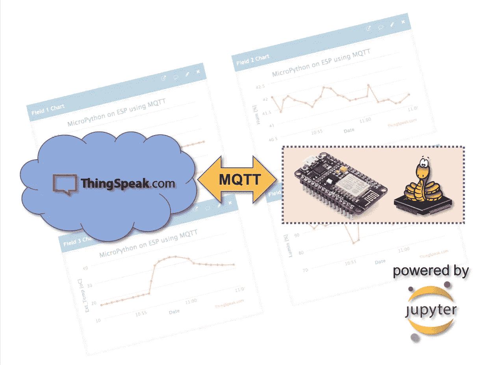

## 1.介绍

在我的上一篇文章[MicroPython on ESP using Jupyter](https://medium.com/@rovai/micropython-on-esp-using-jupyter-6f366ff5ed9)中，我们学习了如何在 ESP 设备上安装和运行 MicroPython。使用 Jupyter Notebook 作为我们的开发环境，我们还学习了如何使用多种通信协议和方法从传感器读取数据(温度、湿度和亮度)，例如:模拟、数字、1 线和 I2C，后者用于在有机发光二极管显示器上显示我们捕获的数据。

现在，在这篇文章中，使用 MQTT 协议，我们将获得所有捕获的数据，将它们发送到物联网服务，【ThingSpeak.com】和移动应用， *Thingsview* ，在那里可以记录和播放它们。

以下是对我们的项目进行重新升级的概述:

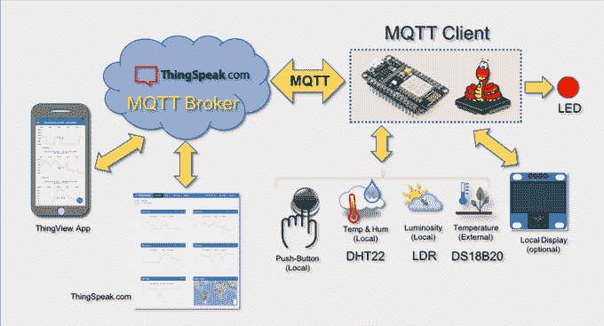

## 2.硬件

将要使用的硬件基本上与之前的项目相同:[使用 Jupyter 的 ESP 上的 Micropython](https://medium.com/@rovai/micropython-on-esp-using-jupyter-6f366ff5ed9)。请参考它的详细硬件解释(例外是伺服，这将不会在这个项目中使用)。

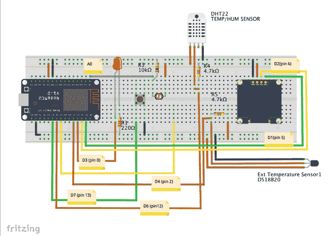

上面你可以看到完整的硬件。如图所示连接设备。

## 3.Micropython，REPL 和 Jupyter 笔记本

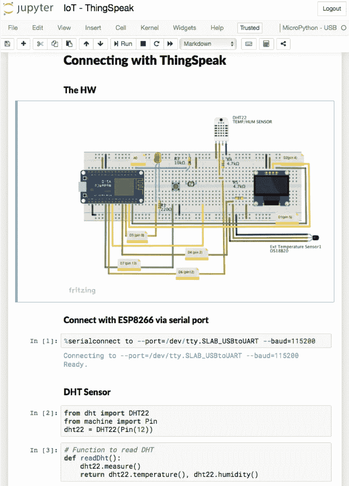

此时，您应该在您的 ESP 设备上加载了一个 Micropython 解释器，因此可以使用任何可用的 ide 对其进行编程，比如:

*   REPL /Ampy
*   Jupyter 笔记本(*)
*   希腊字母表中第十二个字母
*   ESPCut(仅适用于 Windows)
*   …等等

在我的文章[Micropython on ESP Using Jupyter](https://medium.com/@rovai/micropython-on-esp-using-jupyter-6f366ff5ed9)中，我详细介绍了如何下载和安装 Micropython 解释器、ESPTool 来管理 ESP 设备，以及如何使用 Jupyter Notebook 作为*开发环境。*您可以随意使用更舒适的产品。

> (*)我一般都是在 Jupyter Notebook 上做所有开发，一旦得到最终代码，就把它们复制到 Geany，保存为 python 脚本。使用 Ampy 将脚本上传到 ESP 上。我发现这种方法非常容易创建更复杂和专业的项目。

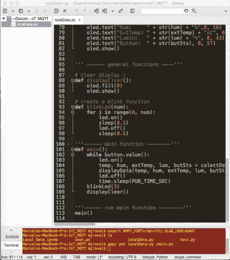

## 4.传感器

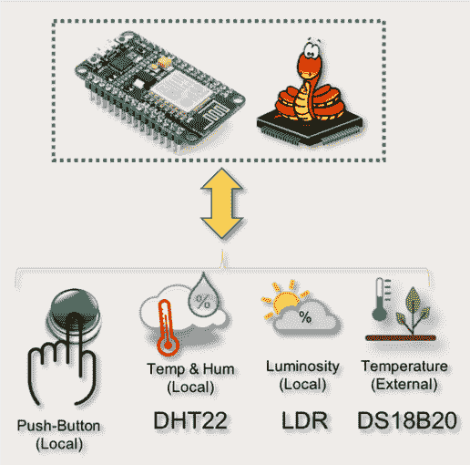

让我们安装库，定义 GPIOs，分别为所有传感器创建对象和函数:

**A. DHT(温度和湿度)**

安装 DHT 库并创建一个对象:

```
from dht import DHT22
from machine import Pin
dht22 = DHT22(Pin(12))
```

创建一个函数来读取 DHT 传感器:

```
def readDht():
    dht22.measure()
    return dht22.temperature(), dht22.humidity()
```

测试 DHT 功能:

```
print (readDht())
```

结果应该是如下所示的元组:

```
(17.7, 43.4)
```

**B. DS18B20(外部温度)**

安装库并创建一个对象:

```
import onewire, ds18x20
import time# Define the pin to be used with 1-wire bus ==> pin 2 (D4)
dat = Pin(2)# create the onewire object
ds = ds18x20.DS18X20(onewire.OneWire(dat))
```

扫描总线上的设备

```
sensors = ds.scan()
print('found devices:', sensors)
```

打印结果并不重要，我们需要的是第一个检测到的传感器:*传感器[0]* 。现在，我们可以构建一个函数来读取传感器数据:

```
def readDs():
    ds.convert_temp()
    time.sleep_ms(750)
    return ds.read_temp(sensors[0])
```

使用创建的函数测试传感器总是很重要的

```
print(readDs())
```

如果你得到一个温度值，你的代码是正确的:

```
17.5
```

**LDR(光度)**

LDR 将使用我们的 ESP 的模拟引脚(在 ESP8266 的情况下只有一个，在 ESP32 中有几个)。

与之前相同:

```
# import library
from machine import ADC# Define object
adc = ADC(0)
```

一个简单的函数: *adc.read()* 可以用来读取 adc 值。但请记住，内部 ADC 会将 0 到 3.3V 之间的电压转换为相应的数字值，范围从 0 到 1023。一旦我们对“光度”感兴趣，我们就会认为最大光是传感器捕捉到的最大值(在我的例子中是 900)，最小光是 40。有了这些值，我们就可以将亮度值从[40 到 900]映射到[0 到 100%]。为此，我们将创建一个新函数:

```
def readLdr():
    lumPerct = (adc.read()-40)*(10/86) 
    return round(lumPerct)
```

你应该使用 *print (readLDR())* 来测试这个函数。结果应该是 0 到 100 之间的整数。

**D .按钮(数字输入)**

这里我们使用一个按钮作为“数字传感器”，但它可能是一个执行器的“回声”(例如，一个开/关的泵)。

```
# define pin 13 as an input and activate an internal Pull-up resistor:
button = Pin(13, Pin.IN, Pin.PULL_UP)# Function to read button state:
def readBut():
    return button.value()
```

您可以使用功能 *print(readBut())* 测试按钮。如果不按，结果应该是“1”。按下按钮，结果应该是“0”。

## 5.捕获并在本地显示所有传感器数据

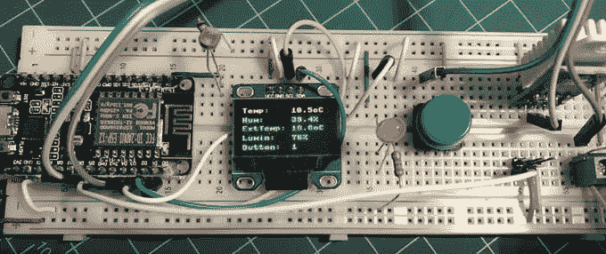

现在我们已经为每个传感器创建了一个函数，让我们创建另一个函数，负责同时读取所有传感器:

```
def colectData():
    temp, hum, = readDht()
    extTemp = readDs()
    lum = readLdr()
    butSts = readBut()
    return temp, hum, extTemp, lum, butSts
```

现在，使用:

```
print(colectData())
```

将产生一个元组，其中包括从传感器捕获的所有数据:

```
(17.4, 45.2, 17.3125, 103, 1)
```

我们还可以选择在本地显示器上显示这些数据:

```
# import library and create object i2c
from machine import I2C
i2c = I2C(scl=Pin(5), sda=Pin(4))# import library and create object oled
import ssd1306
i2c = I2C(scl=Pin(5), sda=Pin(4))
oled = ssd1306.SSD1306_I2C(128, 64, i2c, 0x3c)# create a function:
def displayData(temp, hum, extTemp, lum, butSts):
    oled.fill(0)
    oled.text("Temp:    " + str(temp) + "oC", 0, 4)
    oled.text("Hum:     " + str(hum) + "%",0, 16)
    oled.text("ExtTemp: " + str(extTemp) + "oC", 0, 29)
    oled.text("Lumin:   " + str(lum) + "%", 0, 43)
    oled.text("Button:  " + str(butSts), 0, 57
    oled.show()# display data using the function
displayData(temp, hum, extTemp, lum, butSts)
```

作为一个选项，我们可以使用 LED 在开始读取传感器时打开，在数据显示后关闭。这将有助于确认当我们将 ESP 与 PC 断开连接并自动运行时，该程序正在运行。

所以，“主要功能是:

```
def main():
    led.on()
    temp, hum, extTemp, lum, butSts = colectData()
    displayData(temp, hum, extTemp, lum, butSts)
    led.off()
```

因此，执行 main()，我们将获得显示在有机发光二极管上的传感器数据，如最后一张图片所示。

## 6.在 ESP 启动时运行本地站代码

如果您已经使用 Jupyter Notebook 创建和测试了这些功能，那么现在是时候让我们的 ESP 自动执行到目前为止在单个文件脚本上开发的所有功能了。

让我们打开任何文本编辑器并在上面粘贴所有代码(我喜欢使用 Geany):

```
from machine import Pin
import time# LED
led = Pin(0, Pin.OUT)# DHT
from dht import DHT22
dht22 = DHT22(Pin(12))
def readDht():
    dht22.measure()
    return dht22.temperature(), dht22.humidity()# DS18B20
import onewire, ds18x20
dat = Pin(2)
ds = ds18x20.DS18X20(onewire.OneWire(dat))
sensors = ds.scan()
def readDs():
    ds.convert_temp()
    time.sleep_ms(750)
    return round(ds.read_temp(sensors[0]), 1)# LDR
from machine import ADC
adc = ADC(0)
def readLdr():
    lumPerct = (adc.read()-40)*(10/86)
    return round(lumPerct)# Push Button
button = Pin(13, Pin.IN, Pin.PULL_UP)
def readBut():
    return button.value()# Read all data:
def colectData():
    temp, hum, = readDht()
    extTemp = readDs()
    lum = readLdr()
    butSts = readBut()
    return temp, hum, extTemp, lum, butSts# I2C / OLED
from machine import I2C
import ssd1306
i2c = I2C(scl=Pin(5), sda=Pin(4))
oled = ssd1306.SSD1306_I2C(128, 64, i2c, 0x3c)
def displayData(temp, hum, extTemp, lum, butSts):
    oled.fill(0)
    oled.text("Temp:    " + str(temp) + "oC", 0, 4)
    oled.text("Hum:     " + str(hum) + "%",0, 16)
    oled.text("ExtTemp: " + str(extTemp) + "oC", 0, 29)
    oled.text("Lumin:   " + str(lum) + "%", 0, 43)
    oled.text("Button:  " + str(butSts), 0, 57)
    oled.show()# Main function
def main():
    led.on()
    temp, hum, extTemp, lum, butSts = colectData()
    displayData(temp, hum, extTemp, lum, butSts)
    led.off()'''------ run main function --------'''
main()
```

将其保存，例如保存为 *localData.py.*

要在您的终端上直接运行这段代码，您需要 Ampy。

首先，在终端上，让我们通知 Ampy 我们的串行端口:

```
export AMPY_PORT=/dev/tty.SLAB_USBtoUART
```

现在，我们可以看到 ESP 根目录中的文件:

```
ampy ls
```

作为响应，我们将得到 *boot.py* ，这是将在系统中运行的第一个文件。

现在，让我们使用 Ampy 将 python 脚本 LocalData.py 加载为/main.py，这样我们的脚本将在启动后立即运行:

```
ampy put localData.py /main.py
```

如果我们现在使用命令 *amp ls* ，您将在 ESP 中看到两个文件: *boot.py* 和 *main.py*

重置 ESP 将使程序 localData.py(上传为/main.py)自动运行，并在显示屏上显示传感器数据。

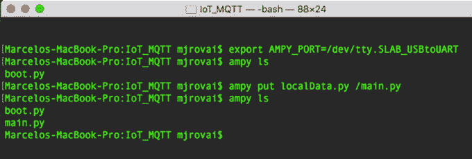

上面的终端打印屏幕显示了我们所做的事情。

使用上面的代码，显示将只显示一次，但是我们可以在 *main()* 函数上定义一个循环，它将在每个定义的时间间隔(PUB_TIME_SEC)显示数据，例如，直到我们按下按钮:

```
# loop getting data until button is pressed
while button.value():
    led.on()
    temp, hum, extTemp, lum, butSts = colectData()
    displayData(temp, hum, extTemp, lum, butSts)
    led.off()
    time.sleep(PUB_TIME_SEC)
```

变量 PUB_TIME_SEC 必须在你想要你的样本的时候声明。

为了增强我们的代码，最好通知我们将退出循环，因为我们将定义 2 个新的通用函数，一个用于清除显示，另一个用于使 LED 闪烁一定次数。

```
# Clear display :
def displayClear():
    oled.fill(0)
    oled.show()# create a blink function
def blinkLed(num):
    for i in range(0, num):
    led.on()
    sleep(0.5)
    led.off()
    sleep(0.5)
```

所以，我们现在可以，重写我们的 main()函数:

```
while button.value():
    led.on()
    temp, hum, extTemp, lum, butSts = colectData()
    displayData(temp, hum, extTemp, lum, butSts)
    led.off()
    time.sleep(PUB_TIME_SEC)
    blinkLed(3)
    displayClear()
```

最终代码可以从我的 GitHub: [localData.py](https://github.com/Mjrovai/Python4DS/blob/master/Micropython/IoT_TS_MQTT/localData.py) 下载，也可以从用于开发完整代码的 Jupyter 笔记本:[Jupyter Local Data development . ipynb](https://github.com/Mjrovai/Python4DS/blob/master/Micropython/IoT_TS_MQTT/LocalData%20Development.ipynb)下载。

## 7:将 ESP 连接到本地 WiFi

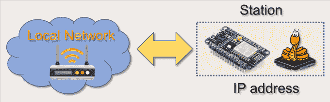

网络模块用于配置 WiFi 连接。有两个 WiFi 接口，一个用于工作站(当 ESP8266 连接到路由器时)，一个用于接入点(供其他设备连接到 ESP8266)。在这里，我们的 ESP 将通过路由器连接到本地网络。让我们调用库并定义我们的网络凭证:

```
import network
WiFi_SSID = "YOUR SSID"
WiFi_PASS = "YOUR PASSWORD"
```

以下功能可用于将 ESP 连接到您的本地网络:

```
def do_connect():
    wlan = network.WLAN(network.STA_IF)
    wlan.active(True)
    if not wlan.isconnected():
        print('connecting to network...')
        wlan.connect(WiFi_SSID, WiFi_SSID)
        while not wlan.isconnected():
            pass
    print('network config:', wlan.ifconfig())
```

运行该函数，您可以获得 IP 地址的结果:

```
do_connect()
```

结果将是:

网络配置:(10.0.1.2、255.255.255.0、10.0.1.1、10.0.1.1)

在我的例子中，10.0.1.2 是 ESP 的 IP 地址。

## 8.说话的东西


至此，我们已经学会了如何从所有传感器获取数据，并将其显示在我们的有机发光二极管上。现在，是时候看看如何将这些数据发送到物联网平台*ThingSpeak.com*了。

> **"ThingSpeak** 是一款[开源](https://en.wikipedia.org/wiki/Open_source) [物联网](https://en.wikipedia.org/wiki/Internet_of_Things) (IoT)应用，使用 REST 和 MQTT APIs 存储和检索物联网数据。ThingSpeak 支持创建传感器日志应用程序、位置跟踪应用程序和带有状态更新的社交网络”

我们开始吧！

首先，你必须在 ThinkSpeak.com 有一个账户。接下来，按照说明创建一个通道，并记下您的**通道 ID** 和**写入 API 密钥。**


上面你可以看到我们的渠道将使用的 5 个领域。

## 9.MQTT 协议和 ThingSpeak 连接

MQTT 是一种发布/订阅架构，主要用于通过无线网络连接带宽和功率受限的设备。它是一个简单的轻量级协议，运行在 TCP/IP 套接字或 web 套接字上。WebSockets 上的 MQTT 可以用 SSL 保护。发布/订阅体系结构使得消息能够被推送到客户端设备，而无需设备持续轮询服务器。

MQTT 代理是通信的中心点，它负责在发送者和合法接收者之间分发所有消息。客户机是连接到代理的任何设备，可以发布或订阅主题以访问信息。主题包含代理的路由信息。每个想要发送消息的客户端将消息发布到某个主题，每个想要接收消息的客户端订阅某个主题。代理将带有匹配主题的所有消息传递给适当的客户端。

ThingSpeak 在 URL*mqtt.thingspeak.com*和端口 1883 有一个 MQTT 代理。ThingSpeak 代理支持 MQTT 发布和 MQTT 订阅。

在我们的例子中，我们将使用: *MQTT Publish。*

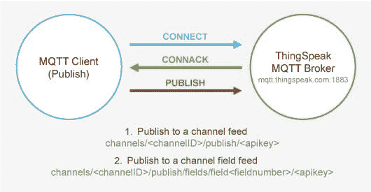

上图描述了主题结构。发布需要写入 API 密钥。代理用 CONNACK 确认正确的连接请求。

Micropython 的内置库中支持 MQTT 协议。该协议可用于通过 WIFI 将数据从您的 ESP8266 发送到免费的云数据库。

我们将使用 *umqtt.simple* 库:

```
from umqtt.simple import MQTTClient
```

知道了我们的服务器 ID，就有可能创建我们的 MQTT 客户机对象:

```
SERVER = "mqtt.thingspeak.com"
client = MQTTClient("umqtt_client", SERVER)
```

现在，准备好你的 ThingSpeak 证书:

```
CHANNEL_ID = "YOUR CHANNEL ID"
WRITE_API_KEY = "YOUR KEY HERE"
```

让我们创建我们的 MQTT“主题”:

```
topic = "channels/" + CHANNEL_ID + "/publish/" + WRITE_API_KEY
```

使用创建的函数获取要发送给 ThingSpeak 物联网服务的数据，并将其响应与特定数据变量相关联:

```
temp, hum, extTemp, lum, butSts = colectData()
```

更新这些变量后，我们可以创建我们的“MQTT 有效负载”:

```
payload "field1="+str(temp)+"&field2="+str(hum)+"&field3="+str(extTemp)+"&field4="+str(lum)+"&field5="+str(butSts)
```

就是这样！我们已经准备好向 ThinsSpeak 发送数据，只需使用下面的 3 行代码:

```
client.connect()
client.publish(topic, payload)
client.disconnect()
```

现在，如果您进入您的渠道页面(如下图所示),您会看到 5 个字段中的每一个都有与您的传感器相关的数据。

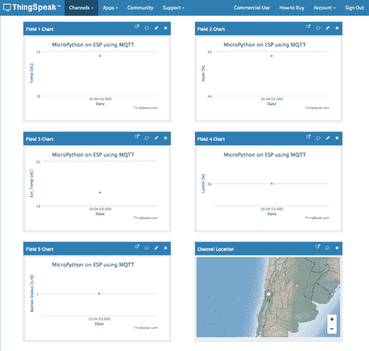

## 10.传感器数据记录器

现在，我们知道只需几行代码就可以将数据上传到物联网服务，让我们创建一个循环函数，以固定的时间间隔自动完成这项工作(类似于我们对“本地数据”所做的工作)。

使用之前声明的相同变量(PUB_TIME_SEC ),可以创建一个简单的 main()函数来连续捕获数据，并将它们记录在我们的通道中:

```
while True:
    temp, hum, extTemp, lum, butSts = colectData()
    payload = "field1="+str(temp)+"&field2="+str(hum)+"&field3="+str(extTemp)+"&field4="+str(lum)+"&field5="+str(butSts)
    client.connect()
    client.publish(topic, payload)
    client.disconnect()
    time.sleep(PUB_TIME_SEC)
```

请注意，只有“有效负载”必须更新，因为“主题”与我们的渠道凭证相关，不会改变。

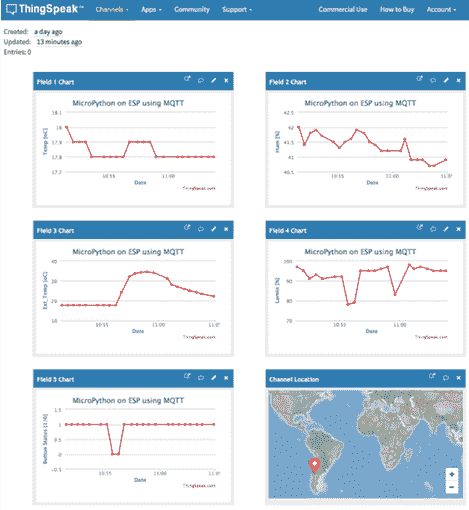

寻找你的 ThingSpeak 频道页面，你会发现数据会不断地加载到每个字段。

> 盖上 LDR，把手放在温度/嗡嗡声传感器上，按下按钮，等等。并查看通道如何自动“记录”这些数据以供将来分析。

通常，对于数据记录，我们应该尽量少用电，因此，我们不会使用 LED 或本地显示器。此外，对于 ESP 设备来说，让它们进入“深度睡眠”是很常见的，在这种情况下，微处理器将保持其最低能量状态，直到捕捉数据并将其发送到物联网平台的时间。

但是，一旦这里的想法是学习，让我们也包括显示器和 LED 像我们以前做的。这样，我们的“日志”功能将是:

```
while button.value():
    led.on()
    temp, hum, extTemp, lum, butSts = colectData()
    displayData(temp, hum, extTemp, lum, butSts)
    led.off()
    payload = "field1="+str(temp)+"&field2="+str(hum)+"&field3="+str(extTemp)+"&field4="+str(lum)+"&field5="+str(butSts)
    client.connect()
    client.publish(topic, payload)
    client.disconnect()
    time.sleep(PUB_TIME_SEC)blinkLed(3)
displayClear()
```

完整的 microPython 脚本可以在这里找到:[Data loggers _ ext . py](https://github.com/Mjrovai/Python4DS/blob/master/Micropython/IoT_TS_MQTT/dataLoggerTS_EXT.py)和用于开发的 Jupyter 笔记本也可以在这里找到:[物联网 ThingSpeak 数据记录器 EXT.ipynb](https://github.com/Mjrovai/Python4DS/blob/master/Micropython/IoT_TS_MQTT/IoT%20-%20ThingSpeak%20-%20Data%20Logger%20EXT.ipynb) 。

要在 ESP 上上传脚本，请在您的终端上使用以下命令:

```
ampy put dataLoggerTS.py /main.py
```

并按下 ESP 复位按钮。

您将让电潜泵捕捉数据并记录在 ThingSpeak.com 上，直到底部被按住(等待 LED 闪烁 3 次，有机发光二极管关闭)。

## 11.ThingView 应用程序

记录的数据可以直接在 ThingSpeak.com 网站上查看，也可以通过应用程序查看，例如 ThingsView！

ThingView 是由 [CINETICA](http://www.cinetica-tech.com/) 开发的一款应用程序，它使你能够以一种简单的方式可视化你的 ThingSpeak 频道，只需输入频道 ID，你就可以开始了。

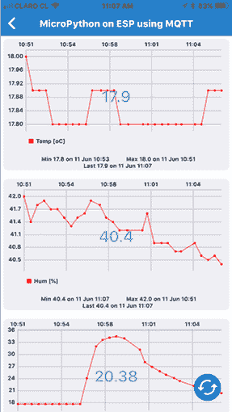

对于公共频道，应用程序将尊重您的 windows 设置:颜色，时间刻度，图表类型和结果的数量。当前版本支持折线图和柱形图，样条图显示为折线图。

对于私有通道，数据将使用默认设置显示，因为无法仅使用 API 键读取私有窗口设置。

ThingView 应用可以为[安卓](https://play.google.com/store/apps/details?id=com.cinetica_tech.thingview&hl=en)和 [IPHONE](https://itunes.apple.com/us/app/thingview/id1284878579?mt=8) 下载。

## 12:结论


一如既往，我希望这个项目可以帮助其他人找到进入令人兴奋的电子世界的方法！

详情和最终代码请访问我的 GitHub 仓库: [IoT_TS_MQTT](https://github.com/Mjrovai/Python4DS/tree/master/Micropython/IoT_TS_MQTT)

更多项目，请访问我的博客:[MJRoBot.org](https://mjrobot.org/)

来自世界南部的 Saludos！

我的下一篇文章再见！

谢谢你，

马塞洛