# 鸢尾属分类|DeepCognition| Azure ML studio

> 原文：<https://towardsdatascience.com/iris-genus-classification-deepcognition-azure-ml-studio-4b930f54435a?source=collection_archive---------6----------------------->

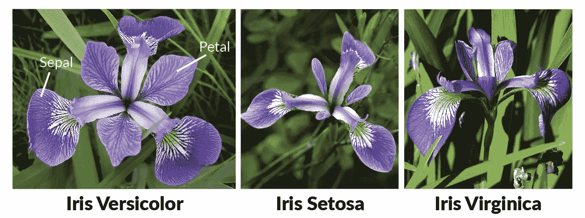

source : Google

界:[植物界](https://en.wikipedia.org/wiki/Plant) *分支* : [被子植物](https://en.wikipedia.org/wiki/Flowering_plant)目:[天冬目](https://en.wikipedia.org/wiki/Asparagales)科:[鸢尾科](https://en.wikipedia.org/wiki/Iridaceae)亚科:[环烯醚萜族](https://en.wikipedia.org/wiki/Iridoideae)族:[鸢尾科](https://en.wikipedia.org/wiki/Irideae)属: ***鸢尾属***

***鸢尾*** 是[开花植物](https://en.wikipedia.org/wiki/Flowering_plant)的[属](https://en.wikipedia.org/wiki/Genus)260-300 个[种](https://en.wikipedia.org/wiki/Species)的一种，花艳丽。它的名字来自希腊语中的[一词，意为](https://en.wikipedia.org/wiki/Greek_language)[彩虹](https://en.wikipedia.org/wiki/Rainbow)，也是希腊彩虹女神 [Iris](https://en.wikipedia.org/wiki/Iris_(mythology)) 的名字。

在本文中，我们将讨论如何使用 Deepcognition.ai 和微软 Azure Machine Learning Studio 将**鸢尾属**分为 3 类( **Versicolor** 、 **Sestosa** 、 **Viginica** )。[来源:谷歌]

# **使用 Deepcognition.ai**

> **创建新项目 IRIS**

进入项目，点击“ **+** ”按钮，给你的项目命名，然后继续。

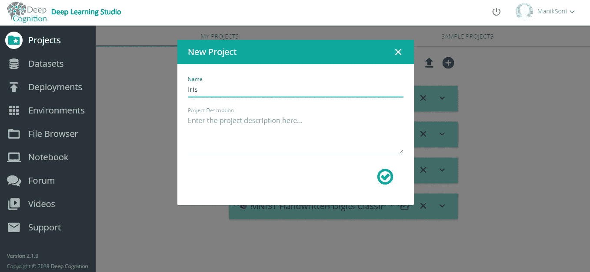

> **导入数据**

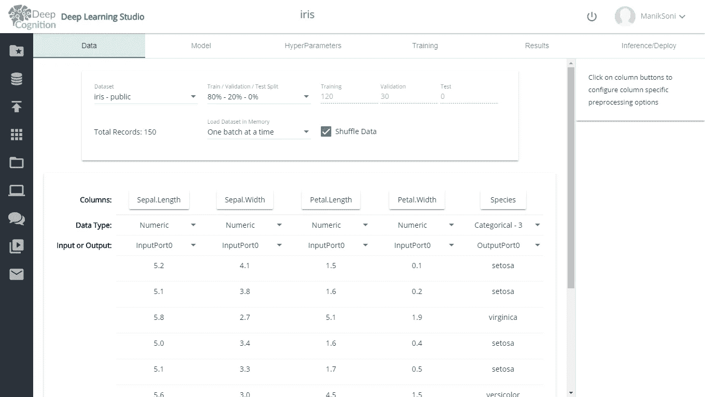

Data Tab

虹膜数据集在 Deepcognition 上公开。从数据集选项卡中选择' **iris-public** '数据集。这个数据集有 150 行。**列的行**显示每一列的名称及其下的值。要将每列指定为输入/输出，请分别选择 InputPort/OutputPort。OutputPort 指定已训练模型的输出。

> **模型的架构**

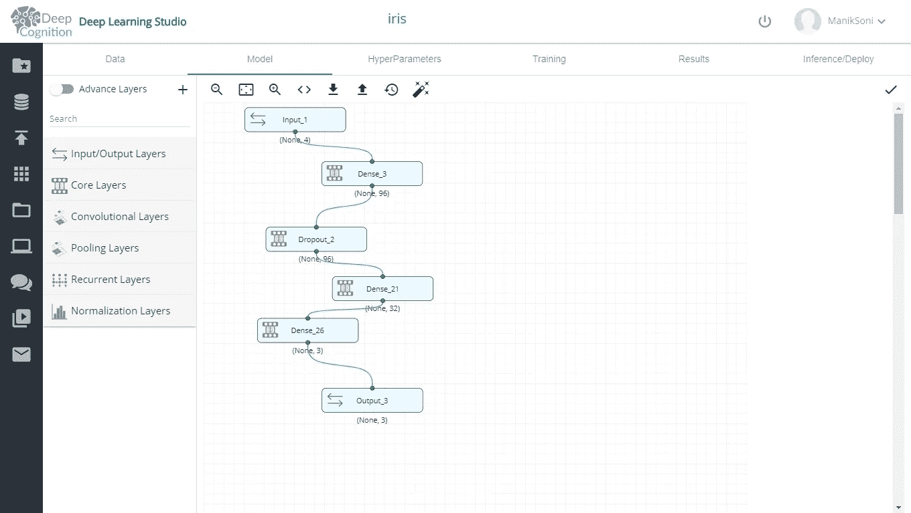

您可以通过在主板上拖放来使用这些层。核心层中存在致密层。

所用各类型层的描述:

Input_1:指定**输入数据**及其**尺寸。**

Dense_3:密集连接层或隐藏层指定激活单元的数量。您可以通过单击该层来选择激活功能。这里我选择了**‘96’隐藏单元**和 **relu** 作为激活函数。

脱落:脱落层用于**防止模型**过拟合。它**随机切换**一些**隐藏单元开/关**，迫使神经网络找到不同的输出路径，从而防止过拟合。

Dense_21:另一个隐藏层，有 **32 个隐藏单元**。

Dense_26:最终隐藏层，其隐藏单元数等于要传递给输出层的类别数。

Output_3: **模型的最终输出**。

您可以尝试不同的模型架构，找出最适合的。

**超参数**:

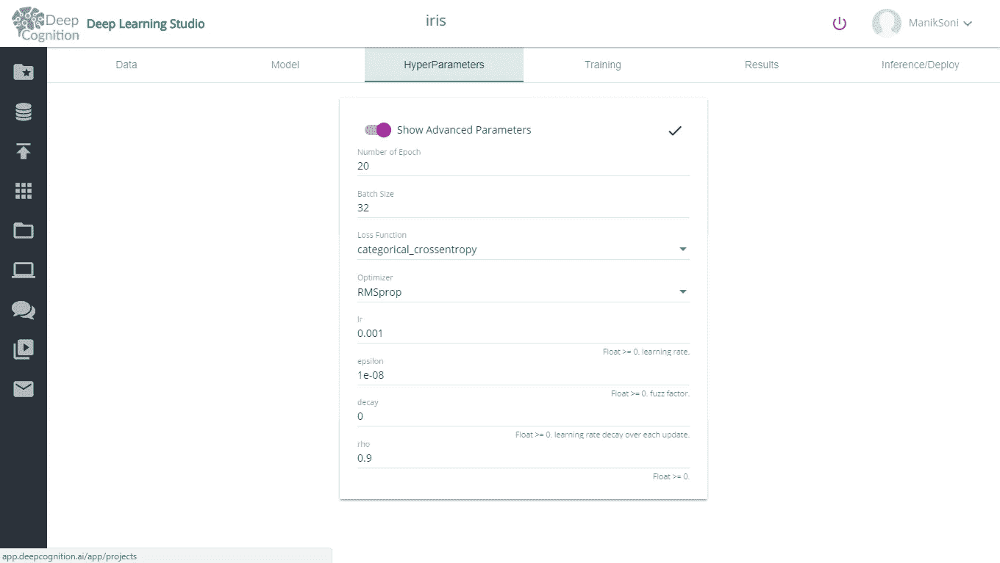

该选项卡用于为我们的模型选择超参数。我们有不同的超参数，例如:

1.  损失函数(类别交叉熵)
2.  学习率(最重要)(0.001)
3.  优化器
4.  批量大小和时期数..(32,20)
5.  不同优化器的不同参数，例如 RMSprop 的ε和ρ。

只需调整其中任何一个并开始训练，以检查哪些超参数效果最好。该选项卡非常有用，因为它节省了大量处理超参数的时间。尝试不同的参数！

> **训练**

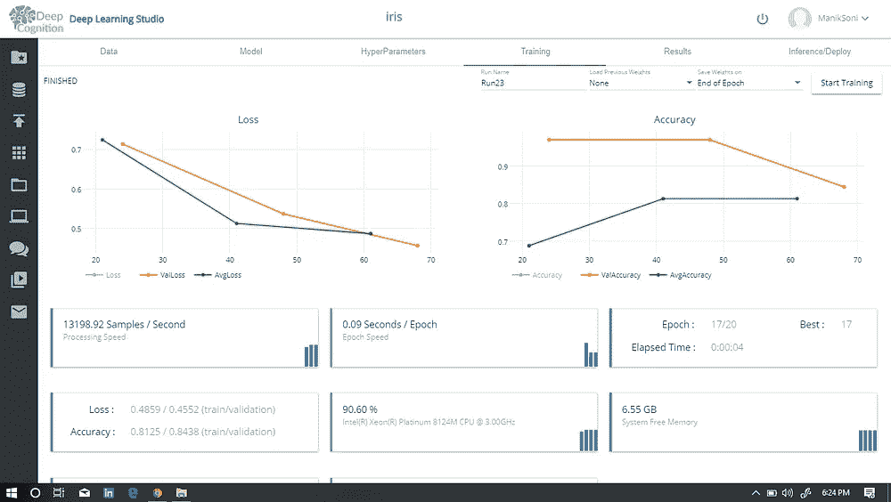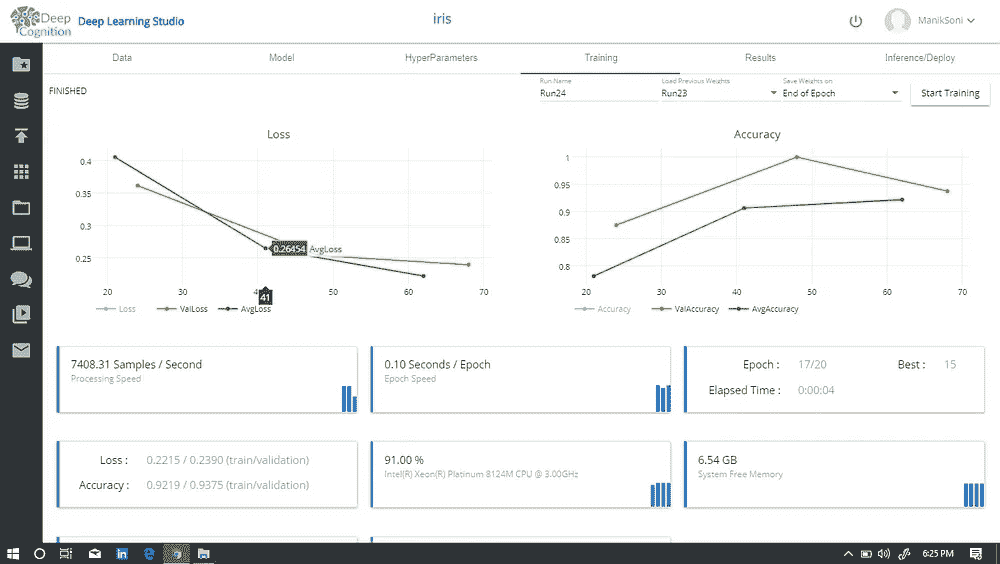

difference after using ‘load previous weights’ 84% to 93.75% accuracy

要开始训练，按下“**开始训练**按钮，您的模型将开始使用提供的数据进行训练。我们可以看到，我们的模型获得了 93.75% 的**验证准确率。如图所示，我们的最佳精确度是在第 15 纪元。**

损失曲线用于确定我们的损失是否随着时间的推移而减少。如果损失没有减少，你可能需要降低学习率(在上面的**超参数**中讨论)。

准确度曲线显示当前准确度(图像中禁用)、验证准确度和平均准确度。尝试不同的超参数以获得最佳精度。

运行名称用于为每个已训练的模型命名，以保存其权重和结构，从而可以选择最佳模型，也可以用于恢复模型。

加载之前的重量非常有用。从以前的模型加载重量后，精确度**从 84%更改为 93.75%** 。

> **结果**

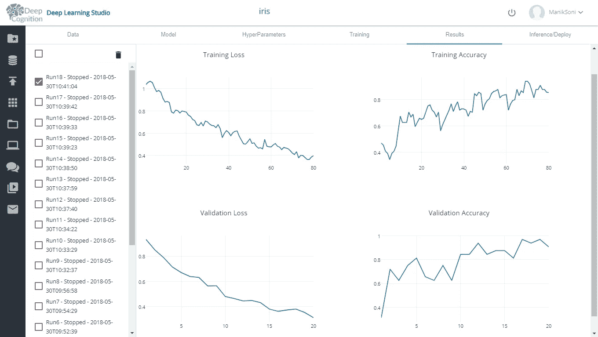

Loss and accuracy for each time when model was trained.

由此，您可以看到哪个模型执行得最好，并可以开始改进它。您可以从**模型**部分恢复任何保存的模型的架构和权重。

> **部署模型**

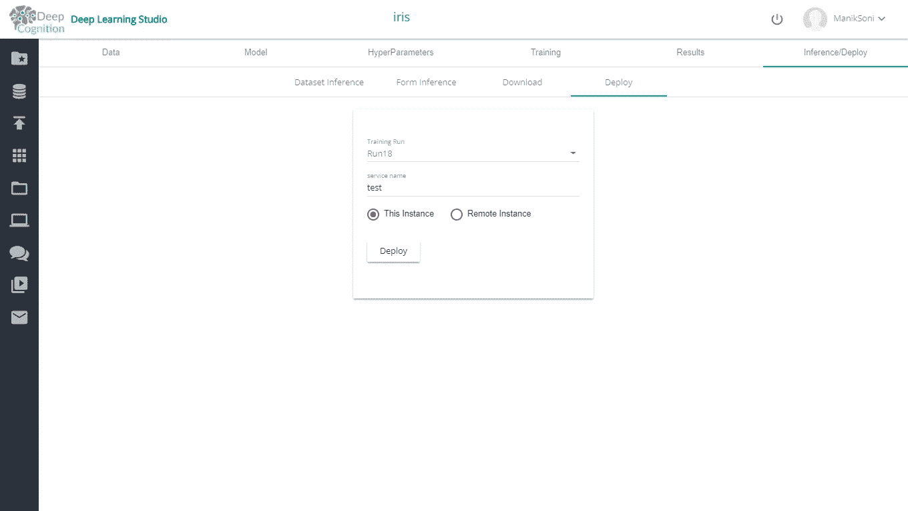

这是您可以为真实世界部署模型的地方。单击“部署”将生成一个 url，即一个 webApp！您可以用它来传递用户数据以获得如下所示的输出。

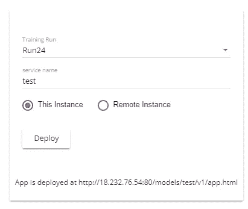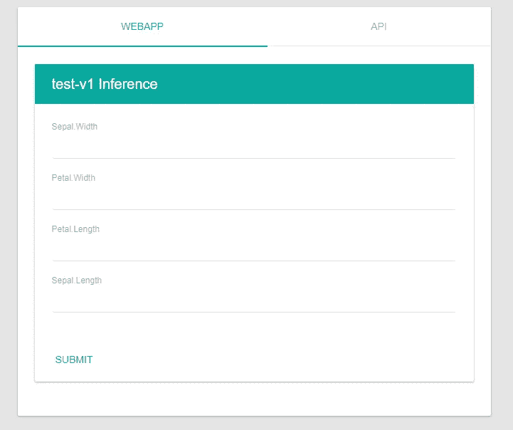

Generated App url! and web App

> **形成推论**

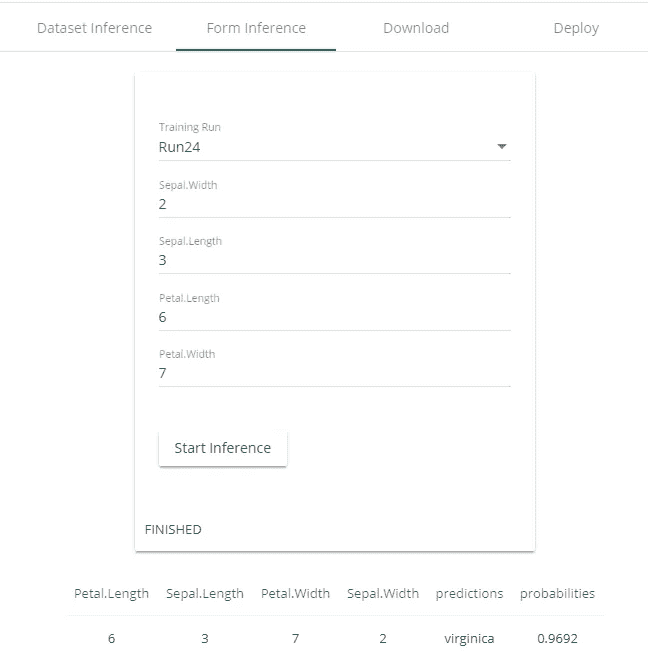

for the given values, it is a **iris virginica** plant.

在形式推理部分，您可以传递萼片宽度、萼片高度、花瓣宽度和花瓣高度的任何有效值。点击“开始推断”将生成它属于特定类别的概率。

> **下载你的模型**

要下载您的模型，请选择模型名称(训练跑步),然后单击下载。

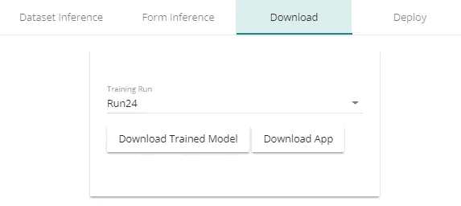

> **数据集推断**

数据集推断用于查看我们的训练数据的模型输出。图像中只有 2 行可见(其余部分被裁剪)。

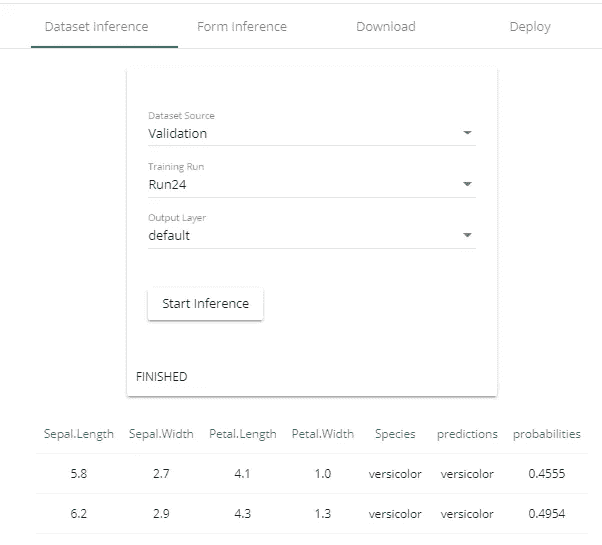

哟！我们学会了创建和部署我们的 IRIS webAPP，而无需编写任何代码！

> **让我们看看使用 Azure ML Studio 进行虹膜分类**

> **创建实验**

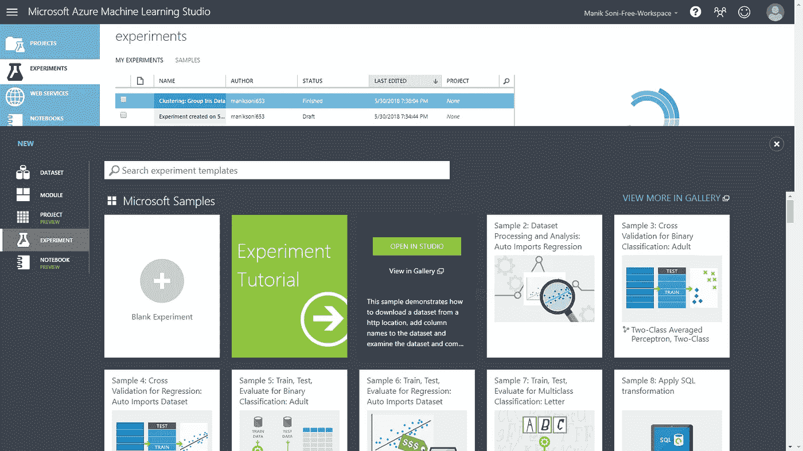

点击**空白实验**创建一个新实验，将出现一个对话框，给出实验的名称。

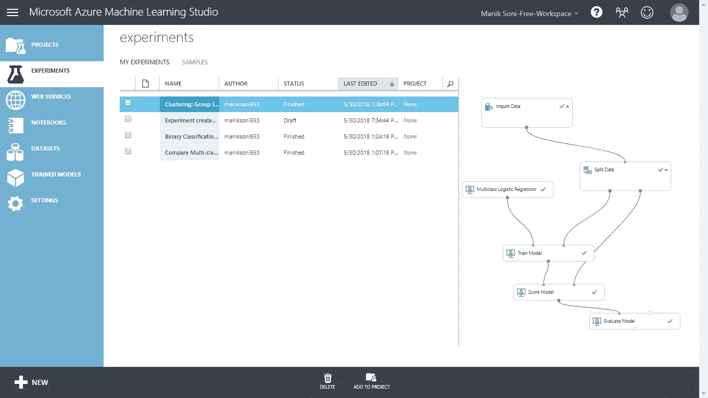

从**实验**选项卡打开您的实验。

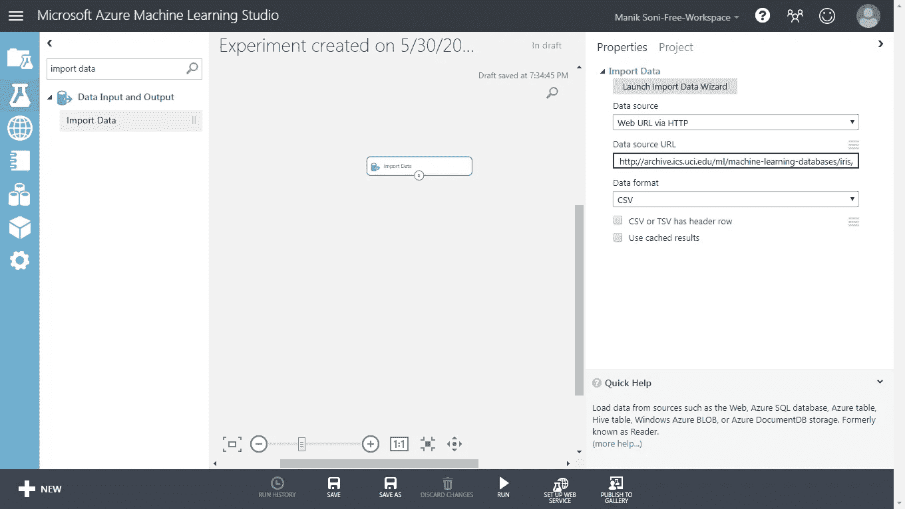

第一步是导入虹膜数据。我们将让 Azure 从网站下载数据。在搜索栏中搜索“导入数据”,然后在工作区中拖动该层。现在点击它并传递数据源 url。

[http://archive . ics . UCI . edu/ml/机器学习数据库/iris/iris.data](http://archive.ics.uci.edu/ml/machine-learning-databases/iris/iris.data)

> **模型架构**

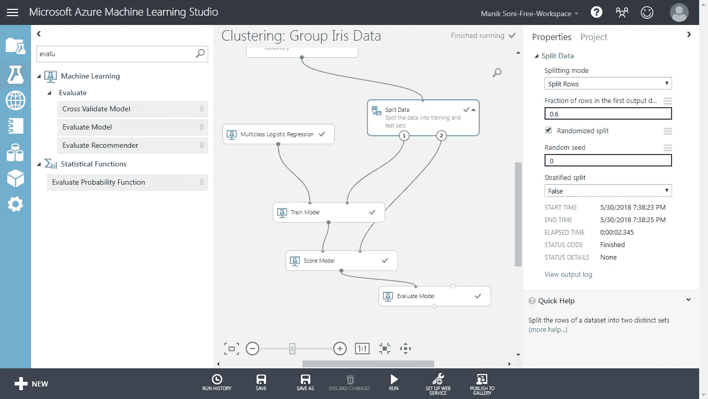

类似于拖动导入数据层，可以在搜索框中找到所有层。要在两层之间建立连接，请将一层的连接点拖向另一层。

**拆分数据:**该层用于将数据拆分为测试集和训练集，其比率作为参数传递(见右窗格)。

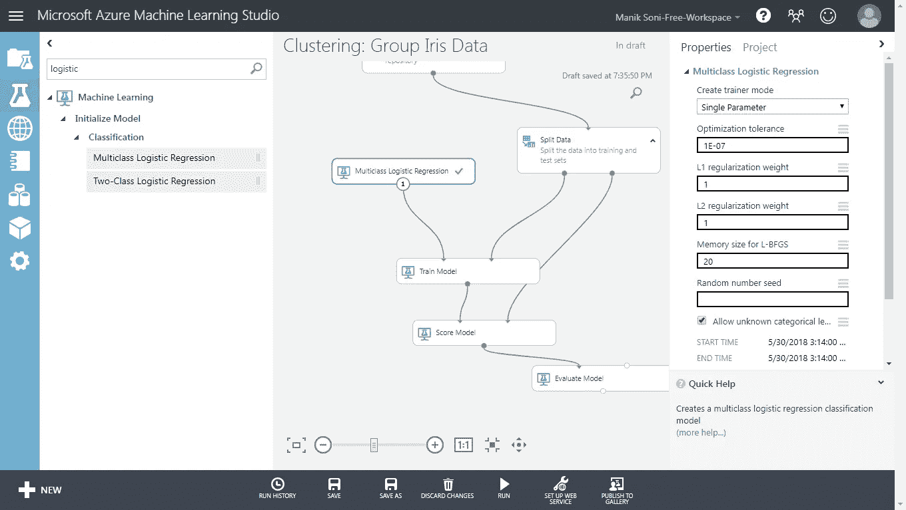

这里我选择了多类逻辑回归模型来对数据进行分类。

**训练模型:**这一层负责启动模型的训练。要开始训练模型，点击**运行**按钮。在您的模型完成训练后，您最终可以可视化结果。

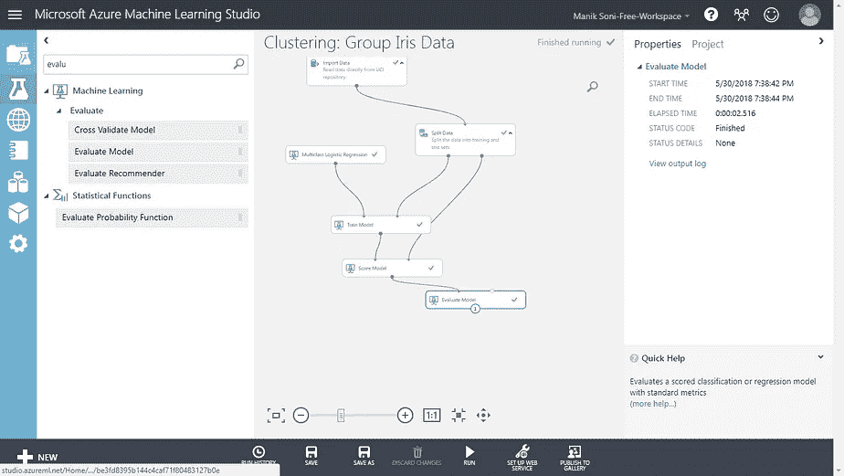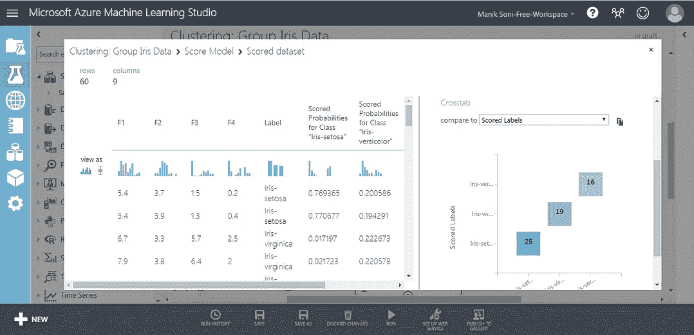

Evaluate model layer and its results

要可视化结果，右键单击评估层并选择评估结果->可视化数据，您将看到类似右图的内容。

甚至混淆矩阵也是为我们的数据自动创建的。

在对结果进行评估后，我们的模型最终获得了 93.3%的准确率。几乎和我们用 deepcognition.ai 得到的一样

**所以耶！您最终学会了如何使用 Deepcognition.ai 和 Microsoft Azure ML Studio 找到给定的鸢尾植物，而无需编写任何代码。**

感谢阅读。

**机器学习快乐！**