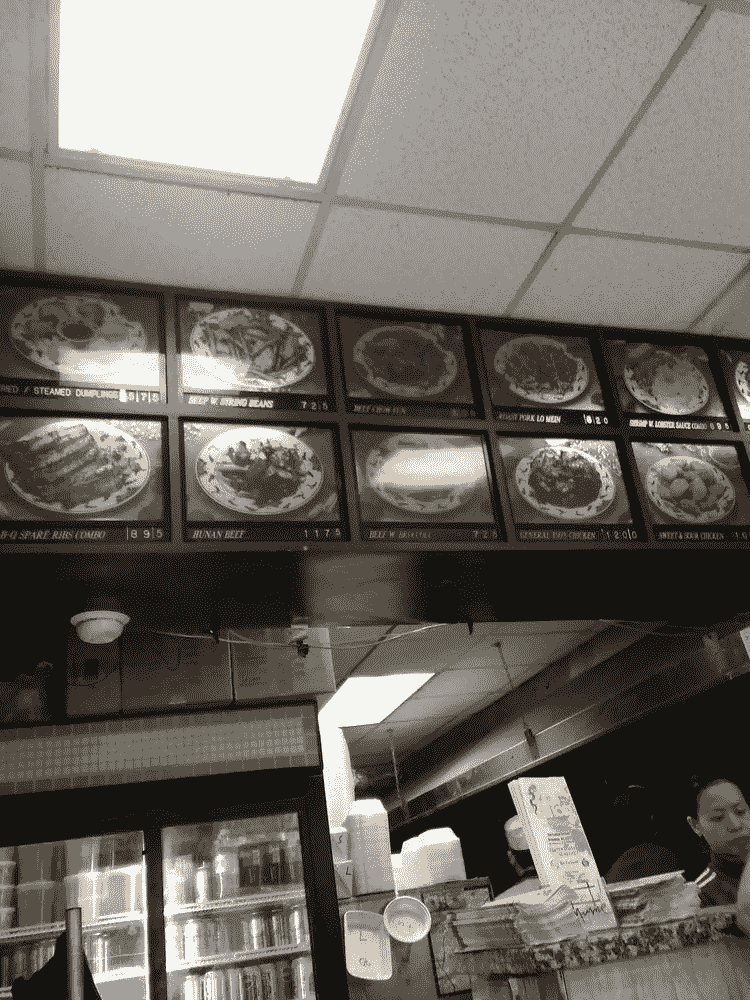

# 一家中国餐馆的名字能预示它的质量吗？

> 原文：<https://towardsdatascience.com/is-a-chinese-restaurants-name-predictive-of-its-quality-594d9f0cc0f2?source=collection_archive---------13----------------------->

我经常路过一家叫华龙的中国餐馆。这就是华龙的样子。

住在纽约，我们都知道这家餐厅。过于复杂的菜单。看起来像是在 70 年代拍摄的普通食物照片。但对我来说，我可以通过*这个名字来感受一下。“*华龙”就是听起来不好。因此，自然而然地，我决定建立一个快速模型，看看一家中国餐馆的名字能否预测它的质量。

我用 Yelp 的 API 抓取了纽约 1000 家中餐馆的数据(一些报道称纽约总共有 [~6000 家中餐馆](https://newyork.cbslocal.com/2011/01/19/grubb-snub-new-survey-poo-poos-nyc-chinese-food/))。为了简单起见，我们来定义一个“好”的餐馆，它有超过 10 个评论和至少 4 星的评级。使用这个定义，我们数据集中大约 40%的餐馆是“好”的。

## 用的最多的词是什么？

纽约中餐馆名称中最常见的单词是:

> *餐厅:194
> 中餐:145
> 厨房:100
> 新:71
> 花园:69*

在我们的数据集中，近 20%的中国餐馆直接在标题中包含“餐馆”一词。如果说中国人有什么不同的话，那就是他们说到点子上了。其他一些熟悉的词也在这里，像“花园”和“黄金”。

让我们也来看看最热门的两个单词短语(如果你喜欢，也可以称之为*双字母组合*):

> *中餐厅:79
> 中厨房:17
> 港:16
> xi 安:13
> 名吃:13*

这个数据稍微稀疏一点，而且也在挑选知名品牌，比如西安名吃。为了简单起见，我们不会在模型中包含二元模型。

## 训练模型

我们现在有了训练预测模型所需的组件:*目标*(如果一家餐馆是“好”的，即二进制分类)和*特征*(一个单词在餐馆名称中的出现)。作为最后一个转换步骤，我们将对名称应用一个 [tf-idf 转换](https://en.wikipedia.org/wiki/Tf%E2%80%93idf)。这增加了一点权重，应该有助于提高性能，特别是通过降低总出现次数很多的单词的等级。最后，我们将在数据上拟合一个[支持向量机(SVM)](https://www.youtube.com/watch?v=1NxnPkZM9bc) ，一个文本分类问题的标准模型。

Python 的`sklearn`库中方便的`Pipeline`类使这变得非常简单:

`X_train, X_test, y_train, y_test = train_test_split(data.name, data.is_good, test_size=0.2, random_state=42)
clf = Pipeline([
(‘vect’, CountVectorizer()),
(‘tfidf’, TfidfTransformer()),
(‘clf’, SGDClassifier(random_state=42))
])
clf.fit(X_train, y_train)`

评估预测模型有效性的常用指标是 [AUC 得分](https://developers.google.com/machine-learning/crash-course/classification/roc-and-auc)。该模型的 AUC 值为 0.60，这并不惊人，但也不可怕。这意味着，如果模型按照从最差到最差的顺序排列所有餐馆，那么一家真正好的餐馆往往会排在一家真正差的餐馆之前。

## 有哪些具体的词具有预测性？

像 SVM 这样的线性模型的好处在于它们是可以解释的。我们可以检查模型应用于每个单词的权重，以感受每个单词的“预测”程度。

“好”中餐馆最具预测性的词汇(过滤掉出现过的词汇<10 times) are:

> *美食
> 饺子
> 孔
> 亚洲
> 炒锅*

最消极的预测词是:

> g *olden
> wah
> 餐厅
> 北京
> lee*

我想“烹饪”比“餐馆”更有品位。我知道“黄金”是垃圾！

## 什么是好名字？

最后，为了好玩，我构建了一个小脚本，它随机生成中国餐馆名称(使用我们在训练集中构建的词汇)，并返回模型预测的第一个好餐馆名称。剧本找到的我的最爱？

> *超级卡西
> 黄门
> 周大叔
> 大胖子*

哪天带我去 *Great Fatt* 。

回到华龙，我经常路过的餐馆…它在 Yelp 上有 3.5 的评分和 20 条评论。模特是怎么想的？

`>> model.predict(model_vect.transform(['hua long']))[0]
False`

#mlforthewin

笔记本在 [github](https://github.com/kning/blog_posts/blob/master/chinese_restaurants/name-prediction.ipynb) 上。