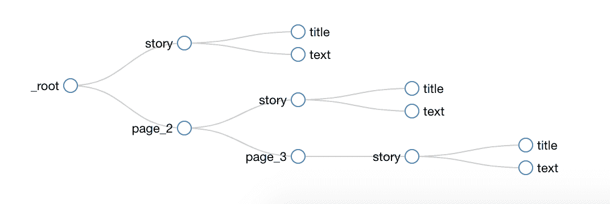
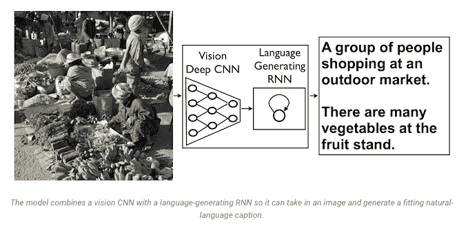
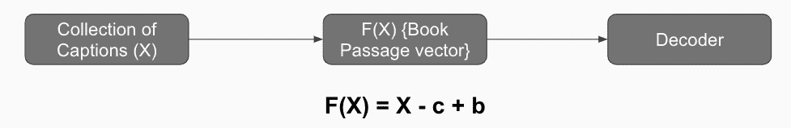
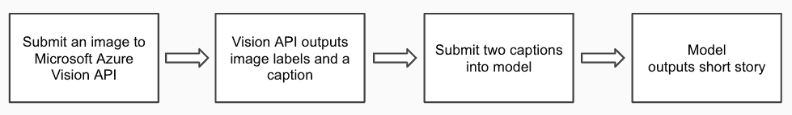
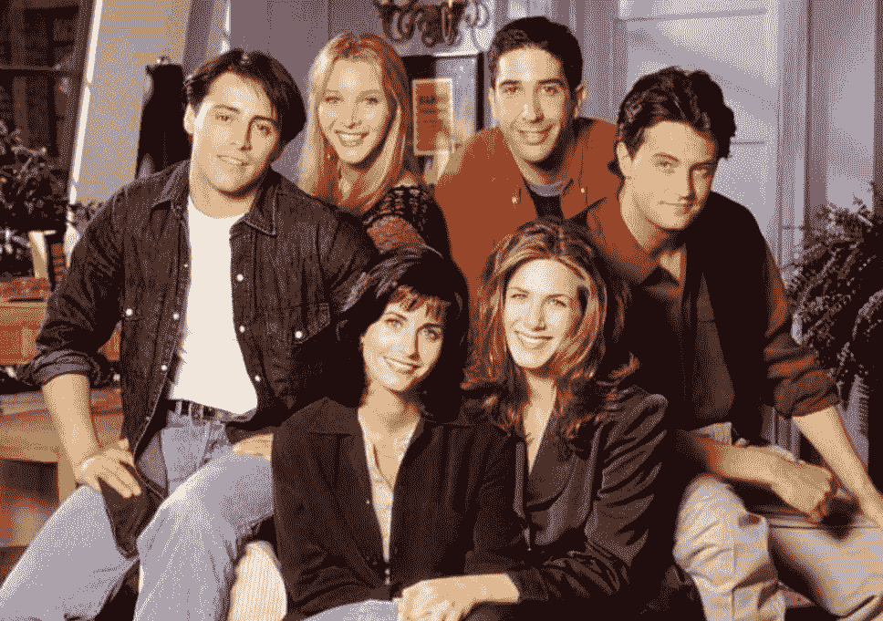
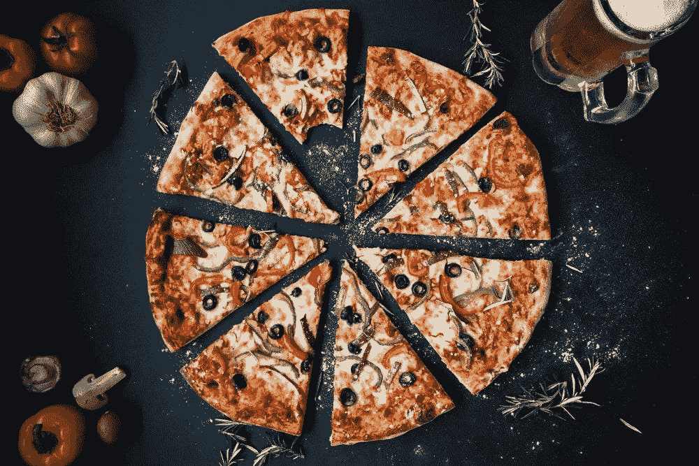

# 一张图抵得上千言万语吗？

> 原文：<https://towardsdatascience.com/is-a-picture-worth-a-thousand-words-d640425c0029?source=collection_archive---------18----------------------->

Source: [Dark Reading](https://img.deusm.com/darkreading/1331840_Slideshow/Slide1CoverArt.jpg)

# **背景**

我们的项目受到杰米·瑞安·基罗斯的启发，他创建了一个经过 1400 万段浪漫故事训练的模型，为单个图像输入生成一个简短的浪漫故事。同样，我们项目的最终目标是为孩子们输出一个小故事。

> “神经说书人是一个循环神经网络，产生关于图像的小故事”——杰米·瑞安·基罗斯

参考:【https://github.com/ryankiros/neural-storyteller 

# **项目目标**

1.  将代码从 Python 2 更新到 Python 3+
2.  重建原来的项目，这是对浪漫小说的训练
3.  拼凑儿童故事
4.  通过 RNN 对儿童故事训练跳跃思维解码器，以创建风格偏差数据
5.  从 Microsoft Azure Vision API 收集图像标签和标题
6.  基于单个图像的输入为儿童输出一个小故事
7.  比较浪漫和儿童故事类型的输出

# **数据采集**

最初的计划是从 [SmashWords](https://www.smashwords.com/) 中抓取儿童书籍(PDF 格式)(正如 Jamie 所推荐的)，但是我们面临着让 Python 库 textract 和 PyPDF2 从给定的 PDF 中提取所有单词的挑战。相反，我们专注于抓取那些有 HTML 文本格式的现成故事的网站。通过 Google Chrome 使用 [Web Scraper 扩展](https://www.webscraper.io/),我们能够从多个来源搜集儿童故事。这里有一个我们用来浏览网站网页的选择器图形的例子:

**Example**: Web Scraper selector graph

一旦我们将数据聚合到一个文件中，我们就用 nltk 将数据解析成句子。这种方法将我们的数据集规模增加到近 45，000 个句子。以下网站是我们数据收集过程的一部分:

*   **童话故事**:[https://www.storyberries.com/category/10-min-stories/](https://www.storyberries.com/category/10-min-stories/)
*   **美国文学**:[https://americanliterature.com/short-stories-for-children](https://americanliterature.com/short-stories-for-children)
*   英国学生:[https://www.studentuk.com/category/bedtime-stories/](https://www.studentuk.com/category/bedtime-stories/)
*   **今晚的睡前故事**:【http://www.tonightsbedtimestory.com/stories/】T2

# **资源**

我们能够通过遵循 Amulya Aankul 的[教程](/running-jupyter-notebook-in-google-cloud-platform-in-15-min-61e16da34d52)来设置 Jupyter Notebook 的谷歌云实例。

**注意**:在 10 GB 磁盘出现内存泄漏后，我们将磁盘映像大小增加到了 100GB。

# **型号设置**

为了使新模型输出儿童短篇故事，我们根据儿童故事训练了递归神经网络(RNN)解码器。与杰米的模型略有不同的是，每个句子都被映射到一个跳过思维向量，然后这个向量生成几个句子，RNN 根据跳过思维向量对这些句子进行了调整。在杰米的爱情小说训练模型中，她使用了段落，但鉴于我们的数据集非常小，我们将段落分解成句子，以增加我们的数据集。

Source: [Google Blog](https://ai.googleblog.com/2014/11/a-picture-is-worth-thousand-coherent.html)

在模型设置期间，我们在训练[上下文中的通用对象(COCO)](http://cocodataset.org/) 图像和标题时面临挑战。上图详细描述了 Vision Deep CNN 如何在最终图层中使用语言生成 RNN 来生成字幕。鉴于我们对这个项目的时间限制，我们决定使用[微软 Azure 的 Vision API](https://azure.microsoft.com/en-us/services/cognitive-services/computer-vision/) ，它生成了几个图像标签和一个标题。然后，我们将图像标签连接成一个标题，这样我们就可以输入两个标题。我们在这篇文章的后面提供了两个例子。在 Jamie 的模型中，COCO 数据集提供了五个标题。我们假设标题数量的差异影响了我们的模型为儿童故事开发更好的语法和更合适的风格的能力。

上面引用的函数允许我们将来自 Vision API 的标题连接到模型生成的短篇故事。该公式是使用三种不同的向量构建的:

*   **X** =图像标题
*   **C** =“标题样式”向量
*   **B** =《书风》矢

正如杰米在她的项目中所详述的，跳过思维向量对以下因素敏感:

*   长度——在我们的例子中，我们的短句(与段落相比)影响了短篇故事的长度。一般来说，儿童故事输出的字数大约是一个生成的浪漫故事的三分之一。
*   **标点符号** —我们注意到标点符号(对于两种模型)仅限于句号、逗号和问号。这可能是不同数据集如何被解析成段落/句子的巧合。
*   **词汇**——我们假设，考虑到爱情故事和儿童故事的目标受众非常不同，词汇会有明显的差异。在下面的例子中，很明显浪漫故事中使用的词汇更加成熟
*   **句法风格**——类似地，句法风格很大程度上基于用于训练模型的段落/句子。在我们的测试中，爱情故事和儿童故事在风格上没有任何明显的区别。

# **工作流程**

最后，我们能够将所有组件打包到一个模型中。

1.  **向微软 Azure Vision API 提交图像**
2.  **Microsoft Azure Vision API 输出图像标签和标题**:在这一步，我们将图像标签连接起来，这样它们将作为标题呈现给模型
3.  **将图像标签&标题提交到模型:**有两个标题，一个由 Vision API 提供，另一个由图像标签连接，我们将它们与样式(或本项目中的故事类型)一起提交到模型
4.  **模型输出短篇故事**

# **结果**

总的来说，浪漫故事(由模型生成)的内容量比儿童短篇小说多得多。《老友记》演员和比萨饼的图片作为我们测试的一部分被提交。请参见下面的输出:

Source: [The Independent](https://static.independent.co.uk/s3fs-public/thumbnails/image/2018/03/22/13/why-monicas-apartment-on-friends-was-purple.jpg?w968h681)

## **好友:串联图片标签&标题**

[‘人人团摆姿势合影’站在窗前的女人男人拿着西装蛋糕美食桌’，‘马特·勒布朗，丽莎·库卓，柯特妮·考克斯，大卫·史温默，詹妮弗·安妮斯顿摆姿势合影’]

## **老友记:浪漫故事**

杰斯在想这永远不会是我的错，她笑了笑，让凯特再次触摸她的情绪，然后她转过头，让他走进浴室，她让他一碰她，安娜很快就把她的注意力转回到我身上，知道他可能是一次之前，她走进我的顶楼套房，让丽芙再次脸红。我要想多少次我妈为什么要嫁给他？不要因为她是我最喜欢的珠宝而激动。照片照片相册很完美，但感觉很完美。她用食指指着我，用食指指着我的嘴唇。不要换我的西装。我见过的唯一一个女人和婚礼上的另外两个男性成员一样性感。还有我的母亲，纳特，梅尔·米勒，她似乎相信自己选择了一个完美的黑发女人。

## **朋友:儿童故事**

*但是，如果我曾经告诉她的母亲告诉他真相，如果她失去了理智，这个年轻人，他从来没有照顾过她的父亲，他有义务照顾她的父亲，为了她的父亲，他有义务照顾她的父亲，我永远不会看到她吃了她的眼睛，为了国王的女儿，她有义务照顾她的父亲，谁没有离开她的脾气，*

Source: [Expert Photography](https://2dhnizrxqvv1awj231eodql1-wpengine.netdna-ssl.com/wp-content/uploads/2018/11/pizza-photography-overhead.jpg)

## **披萨:串联图片标签&标题**

['照片披萨食物不同的坐盒桌子黑色情侣盘各种肉类配料放在平底锅上紫色'，'坐在平底锅上的披萨']

## **披萨:浪漫故事**

披萨一杯酒下肚，我发现自己抱得有点太紧了，根本不在乎我认为该轮到我把自己拼起来，就像她天生就该穿一样。黑色的头发落在一只眼睛上，让我觉得更恶心。我坐在一张放在枕头上的桌子旁，把它整齐地叠放在床头柜上。有了戏剧性的变化，我根本没打算露面。我不会成为一对非常可爱的年轻夫妇。我当时只有九个月大，我讨厌承认这一点。与此同时，我拿着平底锅把它放在枕头上，然后用它指着平躺在我床头柜上的可爱小猫。我们再也看不懂对方，很快我就咬下嘴唇。

## **披萨:儿童故事**

*有几分钟，我不得不坐在木头上，给了他一把剪刀，让他用我的床做饮料，我会给你一点水，让你用壶做饮料，还有一点酒，我不得不吃了一片面包，所以我要吃她的嘴唇，*

# **挑战**

*   找到合适的训练数据量。回想起来，我们应该选择一个有大量数据的故事类型
*   整理数据(删除空行、编码等。)
*   设置 Google 云实例
*   从几个来源寻找和搜集儿童故事
*   匹配数据集的编码
*   用较新的版本重新创建原始项目
*   设置 Google 云实例
*   训练模型
*   原始项目使用 COCO 图像字幕来生成图像的字幕

# **外卖**

*   在确定一个流派之前，探索数据来源。在我们的案例中，我们认为我们能够找到重要的数据来训练儿童故事的模型，但是只有这么多免费的网站可以收集
*   数据越多越好(模型)。杰米的原始模型是在 1400 万篇文章上训练的，而我们的模型依赖于 48k 个句子。
*   GPU 超过 CPU。我们花了大量的时间在本地机器上设置我们的模型，而在项目的早期我们可以从 Google Cloud 实例开始。

# **未来工作**

经过思考，我们讨论了几种改进模型的可能性。首先，我们的教授 Alex Dimakis 博士提出了一个有趣的补充，即确保作为输入(在标题中)的每个单词都将包含在生成的短篇故事中。另一个需要考虑的是模型训练的顺序。假设最初的模型是根据浪漫故事训练的，首先，我们假设如果我们最后训练浪漫故事，那么短篇故事输出的语法和风格将更接近儿童故事。这也可能是因为数据集大小的巨大差异。如前所述，浪漫小说数据集包含超过 1400 万篇文章，而我们的儿童故事数据集有 48，000 个句子。同时，为更好的字幕寻找另一个来源也是值得的。

我们当前的模型将图像标签连接起来作为输入的标题，但是我们发现这种方法会影响短篇故事输出的语法和样式。我们相信这是事实，因为我们的连接标题只是一组名词。总的来说，我们喜欢学习原始项目并完成我们的项目目标。你可以在这里找到我们的代码库。

# **参考文献**

没有互联网的伟大人们，我们不可能完成这个项目。请为您的下一个数据科学项目查阅以下资源:

*   [https://ai . Google blog . com/2014/11/a-picture-is-worth-仟-coherent.html](https://ai.googleblog.com/2014/11/a-picture-is-worth-thousand-coherent.html)
*   [https://towards data science . com/running-jupyter-notebook-in-Google-cloud-platform-in-15-min-61e 16 da 34d 52](/running-jupyter-notebook-in-google-cloud-platform-in-15-min-61e16da34d52)
*   [https://medium . freecodecamp . org/building-an-image-caption-generator-with-deep-learning-in-tensor flow-a 142722 e 9 B1 f](https://medium.freecodecamp.org/building-an-image-caption-generator-with-deep-learning-in-tensorflow-a142722e9b1f)
*   [https://www . aaai . org/OCS/index . PHP/AAAI/aaai 16/paper/download/11966/12271](https://www.aaai.org/ocs/index.php/AAAI/AAAI16/paper/download/11966/12271)
*   [https://github.com/ryankiros/neural-storyteller](https://github.com/ryankiros/neural-storyteller)
*   [https://arxiv.org/abs/1508.06576](https://arxiv.org/abs/1508.06576)

由[阿布希拉莎·卡尼特卡](https://www.linkedin.com/in/abhilasha-kanitkar/)、[阿努加·斯里瓦斯塔瓦](https://www.linkedin.com/in/anuja-srivastava/)和[穆罕默德·恩多耶](https://www.linkedin.com/in/mouhamedndoye/)拍摄