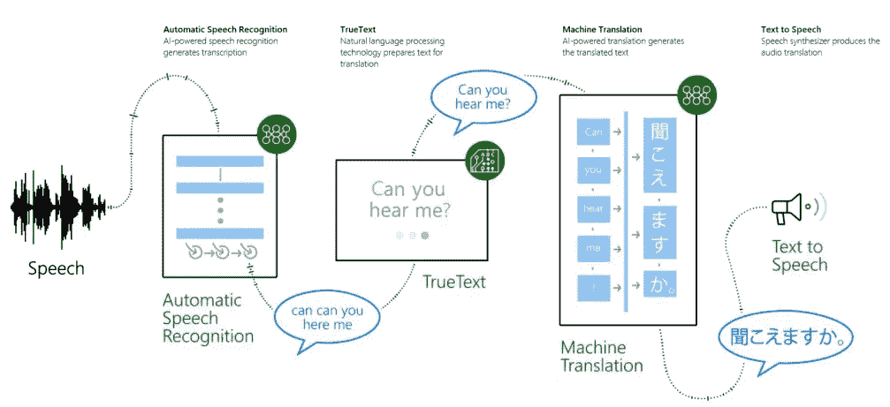

# AI 在这里是取代人类老师还是老师的助手？

> 原文：<https://towardsdatascience.com/is-ai-here-to-replace-human-teachers-or-is-it-a-teachers-assistant-2db6bd624a45?source=collection_archive---------6----------------------->

三年前，联合国教科文组织通过了《2030 年可持续发展议程》,其中一个关键目标是确保全球平等获得优质教育。但是快节奏的技术发展重塑了教师向年轻一代传授知识的角色。许多人担心人工智能机器人将很快完全取代人类教师。那么，这有什么根据吗？

# **人工智能黄金时代的教师角色**

正如亚马逊首席执行官杰夫·贝索斯所说，我们正在见证人工智能技术的复兴。如果不触及问题的核心，机器在很大程度上接管人类的任务可能看起来令人担忧。人工智能已经减少了对从事日常工作的工人的需求，提高了离职标准，并使人类能够解决复杂的医疗保健、物流和安全任务，这些任务需要做出明智的决策。那就更好了。

人工智能不是潘多拉的盒子。相反，[预计创造的就业机会将超过它将要消除的](http://www.itpro.co.uk/automation/30463/gartner-by-2020-ai-will-create-more-jobs-than-it-eliminates)。但是许多职业，比如教师，无疑需要人类的头脑，而不是人造的。因此，思想领袖、知识分子和受过人机交流训练的精明专业人士将成为最受欢迎的专家。

# **当老师需要 AI 助手**

老师的工作量经常超出合理水平。一个好的充满激情的老师应该在一个教室里管理多达 30 名学生，让他们认真学习，停止咯咯笑和玩小玩意，监督学生的学习成绩，批改作业，准备教案等等。这些挑战令人望而生畏，更不用说教师的工资了。教师职业太累，而且报酬往往太低，因此越来越不受欢迎，这导致了世界范围内的教师短缺。然而，正如我们今天所知，技术革命正在改变教学和学习。

AI 的使命是在计划、个性化、可视化和促进学习过程方面提供帮助。让我们深入研究以下人工智能驱动的创新，这些创新不仅可以帮助教师让学生更聪明，还可以让学习过程更智能。

**推动课堂限制**

传统的教室、黑板和手册已经成为对学习过程逆向理解的一部分。利用技术，教师和学生可以超越以前看似可能的边界。希望不久以后，教育领域剩下的唯一限制将是一个人或另一个人对自我发展的渴望。

使用人工智能驱动的工具能够创造全球教室。它为有视觉或听觉障碍的学生和讲其他语言的人带来了新的学习机会，允许教师考虑不同的学习风格(使视觉、听觉学习者等更容易)。)并尽可能个性化学习，提高学习成绩。

举个例子，一个免费的 PowerPoint 插件[演示翻译器](https://educationblog.microsoft.com/2018/03/artificial-intelligence-in-the-classroom/)以实时模式创建字幕。Azure 认知服务、人工智能语音识别和翻译等技术允许学生以最方便的方式跟随老师。

[Source](https://educationblog.microsoft.com/2018/03/artificial-intelligence-in-the-classroom/)

1.人工智能推动自动语音识别，自然语言处理生成脚本。

2.机器翻译为说不同语言的学习者改编文本。

3.学生可以听或读老师屏幕上显示的文本，或者通过个人设备加入对话。

这个解决方案提供的能力不能被夸大，因为最终的个性化学习及其全球可访问性是每个人都渴望的。

**没有孤立学习的机器人**

全世界有如此多的学生由于长期患病而无法上学。但人工智能是为了实现智能远程学习机会。机器人可以在教室里代替学生，确保实时在场，即使这在物理上是不可能的，并消除学生与同学和老师的隔离。这项技术允许学生离开病床，使用平板电脑控制周围发生的事情。这种机器人与微软 Azure 物联网中心连接，为学生提供所有视频和音频连接，并允许参与课堂讨论。

[教育机器人市场正在增长](https://www.prnewswire.com/news-releases/global-educational-robots-market-2018-2023-increasing-expenditure-in-the-field-of-research-and-development-and-growing-popularity-300658029.html)，其目标是提供负担得起的教育硬件和软件解决方案。然而，对这项技术的需求受到限制，因为这在很大程度上取决于教师是否愿意将机器人纳入学习过程。

**教师助理**

作为数字化转型的一部分，日常活动的自动化是当今的趋势。教育领域也不例外。老师花多少时间批改作业和准备报告？数量惊人。他们会重新计划他们的时间来利用新的机会并把他们的学生带到新的高度吗？当然，如果他们有机会把需要很少智力资源的任务委托给别人就好了。

利用微软 Azure 和机器学习，像 [Gradescope](https://www.gradescope.com/) 这样的[教育软件](https://ocsico.com/verticals/education/)可以帮助给学生作品或提交的作品评分，生成并分享详细的分析。人工智能助手可以帮助教师根据不同学生的需求量身定制学习计划。例如，[世纪科技](https://www.besa.org.uk/news/artificially-intelligent-platform-learns-every-brain-learn/)收集每个学生的学习进度数据。通过分析每个学生的微粒数据，人工智能考虑到了人类教师可能注意不到或收集不到的细节。人工智能能够提供基于数据的对学生成功或失败的预测，识别知识差距，突出优势和弱点，并建议额外辅导会有所帮助。全知是人工智能的真正力量。

今天的学生将在人工智能将成为日常现实的未来生活和工作。纸质手册和黑板的时代已经过去了:是时候让学生接触已经在学校的尖端技术了。现代学习过程需要更多的交互性和个性化，以使知识在世界各地更容易获取，而不管一个人的居住地、语言、健康障碍或学习能力如何。

人工智能可以很容易地成为学生和老师的最好的朋友，在需要的时候提供个性化的辅导和帮助。但 AI 做不到的是成为学习的灵感来源，不像人类老师。同理心在学习过程中的重要性比看起来要高。这是人工智能驱动的教育解决方案的主要缺点，也是人工智能不可能完全取代人类教师的原因。

***喜欢这篇文章吗？在这里找到更多故事:***[***https://indatalabs.com/blog***](https://indatalabs.com/blog)

***挖掘数据科学的力量！***