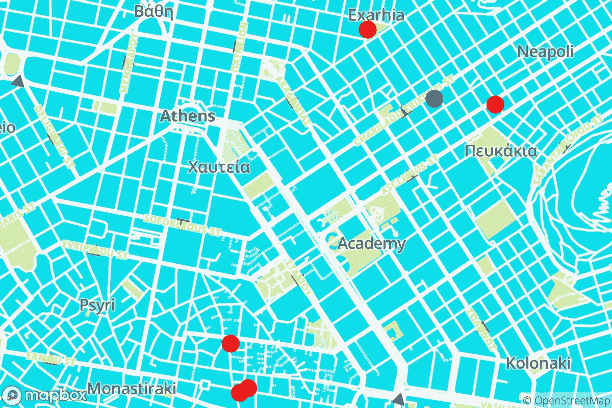
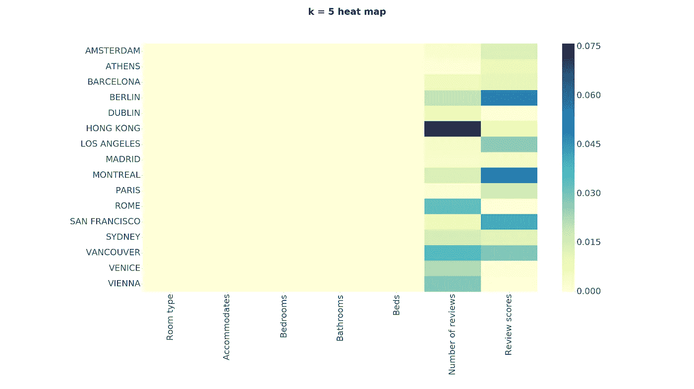
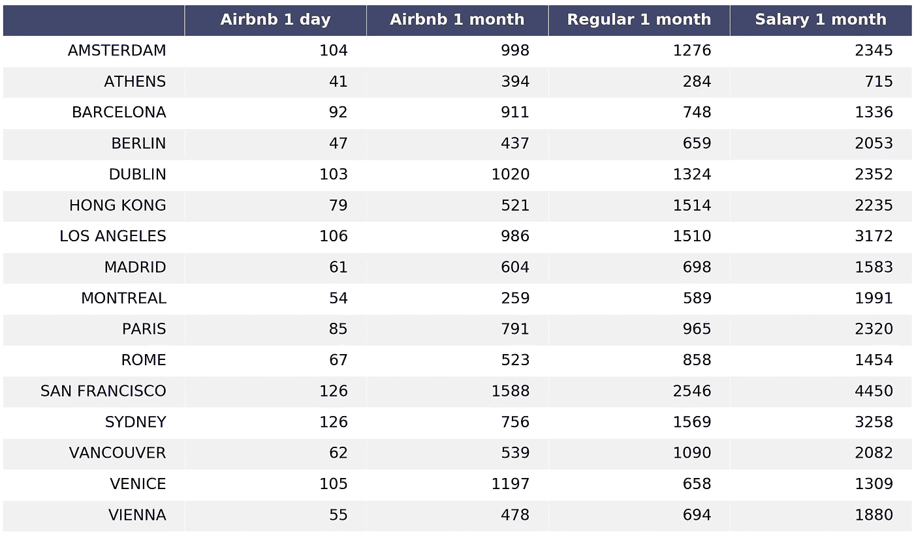
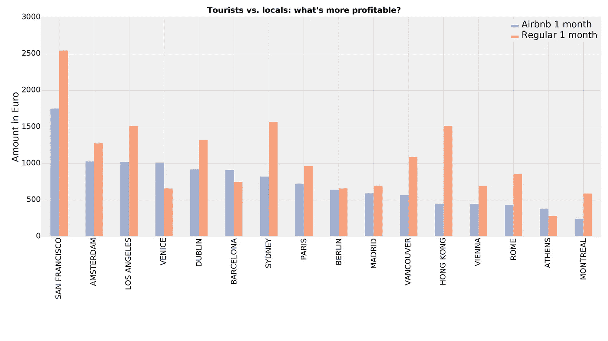

# Airbnb 是在把当地人从市中心赶走吗？对 k 近邻的研究

> 原文：<https://towardsdatascience.com/is-airbnb-pushing-away-locals-a-study-with-k-nearest-neighbours-a3ae22a07b0f?source=collection_archive---------11----------------------->

## 短期与长期租赁:什么更方便？

**简介**

我在九月初搬到了斯德哥尔摩，这个城市无疑提供了一些额外的好处。其中，我们可能包括:**公园，公园里的松鼠，公园旁边有尖顶的浅色建筑**，以及自由和幸福的普遍感觉。显而易见，我们可能没有包括**的温暖**。

我和我的女朋友决定在圣诞节前飞往雅典几天，我们选择住在 Exarhia 的一家 Airbnb，这是一个离旅游中心不远的又酷又另类的地区。预订一完成，我就被两个问题困扰了。第一个:**我们得到了公平的价格吗**？(简单回答:我们当然是，Airbnb 使用类似于我接下来将要展示的算法来向主机建议最优价格)第二:**我们正在为 Exarhia 的中产阶级化做出贡献吗**？换句话说，在我们过去之后，当地人还能负担得起在那里生活吗？

要回答这些问题，我只需要一袋数据和一些技巧。没过多久就遇到了 [insideAirbnb 团队](http://insideairbnb.com/get-the-data.html)拼凑的优秀数据集。我对分析旅游业如何改变住房动态很感兴趣，不仅是在希腊，而是在整个世界。在这个集合的 44 个城市中，我选择了 16 个作为样本。

**雅典事件**

关于雅典的文件包含 5000 多个列表。每个列表都带有你通常会在 Airbnb 主页上找到的所有信息，包括房屋描述、客人评论、用户评级等等。在我的分析中，我决定**将特征**缩小到以下集合:价格、住宿类型(房间还是整个公寓？)，它可以容纳的人数，房间数，床位数，浴室数，纬度，经度，平均评分和评论数。

正如我所说的，我的主要目的是想知道我支付的每晚 22 欧元是否是一个公平的价格。为了实现这一点，**我经历了以下步骤** : 1)我将数据集上传到 Pandas 数据框架中，将列表分配给行，将特性分配给列。2)我用[标准分数](https://en.wikipedia.org/wiki/Standard_score)对列进行了标准化。3)我从我选择的 Airbnb 上输入数据。4)我计算了我的 Airbnb 和所有其他 Airbnb 之间的欧几里德距离，将每个列表视为 n 维空间中的一个点，其中 n 是被考虑的特征的数量。5)我在参数空间中选择 5 个最近的邻居，并取它们价格的平均值。

结果，**算法返回的价格是 23 欧元**，相当惊人的结果。在下面的地图中，我标出了我的物品的位置(在空间中)以及它的邻居。

In blue: my Airbnb in Athens. In red: 5-nearest.

**测试模型**

为单个列表获得正确的数字是非常令人欣慰的，但这并不意味着该算法将在更广泛的意义上工作。为了测试我的预测器的准确性，我将我的数据一分为二，使用训练集(总数的 3/4)来预测测试集(1/4)中每个列表的价格。结果不是很好。

在 30%的任意误差范围内，我能够正确预测略高于 53%的房源的价格。如果误差幅度增加到 1 个均方根偏差——在雅典的例子中，平均价格为 51€，误差幅度约为 36 欧元——准确率就上升到 86%。阿姆斯特丹的情况看起来类似，在这种情况下，我能够正确预测 67%的价格，误差在 30%以内，83%的价格在 1 rmse 以内。

**大局**

下一步，我想用我的预测器来确定你一个月能从 Airbnb 房子里赚多少钱，以及这与常规租金相比如何。

在公布我的分数之前，我测试了不同 k 值的算法，即选择不同数量的邻居来计算平均值。通常的 k=5 给出了最小的 rmse，我认为这是一个好兆头。在计算到目标的距离时，我还想看看这 7 个参数的相对权重。**我选择了一个 Airbnb 基准房产**(两个人的工作室，有一间卧室、一间浴室、一张床，评论数和评论分数为给定城市的平均值)，我绘制了一个热图，其中每个矩形代表基准房屋的参数和其五个最近邻居的平均值之间的差异。

事实证明，在 k = 5 **时，预测器已经正确地过滤掉了前五个特征**，并且基于评论数量和评论分数来选择邻居。快速相关性检查显示，价格与前五个特征(r 值~0.5)的相关性高于后两个特征(r 值~0.01)，这是一个好消息，该算法正专注于重要的事情。

加载所有数据并运行程序，我获得了一个包含 1 天、1 个月的 Airbnb 预测价格的表格，并将它与类似房屋和平均工资的常规 1 个月租金进行了比较。入住率来自 [insideAirbnb](http://insideairbnb.com/vienna/) 网站，而固定租金和薪水来自 [Numbeo](https://www.numbeo.com/cost-of-living/in/Vienna) 。

All figures are expressed in Euro.

表格的前两列以条形图显示，如下所示:

事实证明，在大多数城市，将一室公寓出租给愿意支付更高费用的当地人还是很方便的。这在拥有大量高薪专业人士的城市尤其明显，如旧金山、悉尼、温哥华和香港。

在从大量游客中获利(或受损)的城市，情况看起来有所不同，Airbnb 可以保证更高的收入，如威尼斯、巴塞罗那和……雅典。

嗯，我想这就是问题的关键。经过两天的工作，我可以有把握地说:**我现在感到内疚是对的**。

就是这样。所有代码照常在我的 [GitHub repo](https://github.com/bugo99iot/airbnb_k_nearest) 上可用，还有一个 [Jupyter 笔记本](https://github.com/bugo99iot/airbnb_k_nearest/blob/master/airbnb_k_nearest.ipynb)。如果你喜欢，请在下面评论。