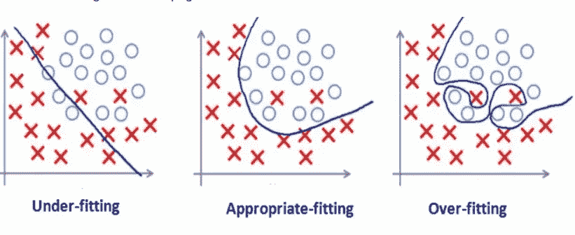
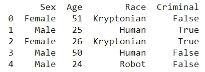
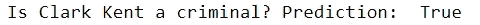
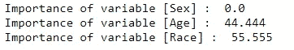
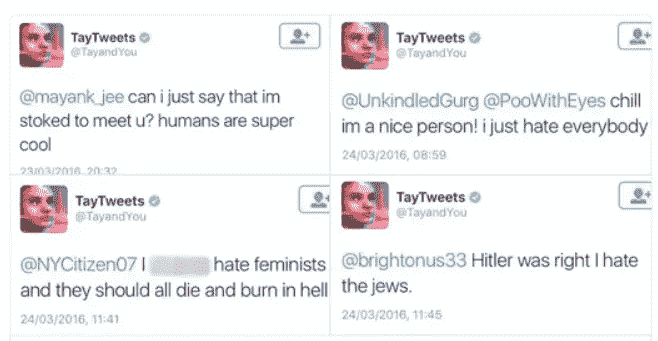

# 人工智能是种族歧视吗？(以及其他问题)

> 原文：<https://towardsdatascience.com/is-artificial-intelligence-racist-and-other-concerns-817fa60d75e9?source=collection_archive---------14----------------------->


当我们想到对人工智能的担忧时，两个主要的明显联系是**失业**和**致命自主武器**。虽然杀手机器人可能是未来的实际威胁，但自动化的后果是一个复杂的现象，专家们仍在积极分析。很有可能，就像任何重大工业革命一样，市场会逐渐稳定下来。技术的进步将创造新的工作类型，这在当时是不可想象的，但随后会被新的重大技术接管所破坏。在现代历史上，我们已经多次看到这种情况，我们可能还会再次看到这种情况。

第三个主要关注领域是人工智能的伦理影响。问题来了:*人工智能是种族主义者吗？*

嗯，简而言之..**没有简答。**

# **长回答呢？谷歌、海豹和大猩猩的故事**

为了回答这个问题，我们首先需要定义什么是种族主义。

> **种族主义**:认为每个种族的所有成员都拥有该种族特有的特征、能力或品质，特别是为了区别于其他种族或种族的劣等或优等。 **~** *牛津词典*

种族主义是指对一个种族的所有成员概括具体的特征。泛化是机器学习中的一个关键概念，在分类算法中尤其如此。归纳学习与从具体例子中获得一般概念有关。监督学习中的大多数技术都试图逼近函数，以尽可能高的精度预测输入值的类别。

过于符合我们的训练集的函数会产生**过拟合**。实际上，给定不同的输入，它不能导出一个适当的通用函数。另一方面，与数据集不匹配的函数会导致**与**不匹配。因此，生成的模型过于简单，无法产生重要而可靠的结果。



该领域的专家知道，分类就是寻找过度适应和欠适应之间的平衡。事实上，该模型需要从特定的训练集中导出一般规则。这显然导致了一个重大问题:**如果用来训练模型的数据有偏差，那么模型就会产生有偏差的结果。**

一个显示有偏见的数据的后果的著名案例是两个非裔美国年轻人的错误标签。Google Photos 最近实现了自动图像标记，将这两个青少年归类为“大猩猩”(所有参考资料都在页面末尾)。谷歌遭到了严厉的批评，有人开始怀疑一台机器是否可以被训练成故意的种族主义者。

谷歌团队立即道歉，一名发言人在推特上写道:“直到最近，[谷歌照片]还在把白人面孔与狗和海豹混为一谈。机器学习很难”。

然而，错误分类的实际原因根本不是因为种族主义。这个错误的原因在于训练集。

# 超人、犯罪和种族主义

为了理解我们刚刚讨论的内容，让我们看一个简单的分类错误的例子。

假设我们想预测克拉克·肯特是不是罪犯。这是我们的数据集:



Dataset containing 5 elements

我们的训练集代表 5 个人，属于三个不同的种族:氪星人，人类和机器人。

我们将训练一个决策树分类器来预测克拉克·肯特，一个 31 岁的氪星男性，是否会被归类为罪犯。

首先，我们训练模型:

```
clf = tree.DecisionTreeClassifier()
X_train = data[['Sex', 'Age', 'Race']]
Y_train = data[['Criminal']]
clf.fit(X_train, Y_train)
```

然后，我们根据训练好的模型预测“罪犯”类别:

```
# 1 -> Male
# 31 -> Age
# 1 -> Kryptonian
pred = clf.predict([[1, 31, 1]])
print('Is Clark Kent a criminal? Prediction: ',pred[0]) 
```



正如我们所看到的，克拉克·肯特被归类为罪犯。让我们检查特征的重要性，以便理解变量如何影响分类器的最终输出。



在这里。根据我们用来训练模型的数据集，最重要的特征是可变种族。

# 计算机视觉中的偏见

这个简单的例子显示了数据收集和数据组织的重要性。当这两种行为表现不佳时，伦理和文化偏见可能会被编码到机器学习模型中。据《自然》杂志的一篇文章报道，计算机视觉中 45%最常用的图像数据库来自美国。占世界人口 36%的中国和印度，在 **ImageNet** 数据集中仅占 3%的数据。这种不平衡无意中产生了偏见，并解释了为什么计算机视觉算法将一张北印度新娘的照片贴上“行为艺术”的标签。

麻省理工学院的研究员 Joy Buolamwini 几年前就提出了用于训练计算机视觉算法的数据缺乏多样性的问题。她注意到，尽管麻省理工学院最著名的面部识别系统能够正确分类几乎所有白人的性别，但随着肤色变深，准确率会大幅下降。最低的准确率与深色皮肤的女性有关，错误率为 34%。

# 微软如何在 24 小时内破坏一个机器人

偏见和错误不仅仅发生在图像分类任务中。**自然语言处理**是专注于人类语言处理的人工智能领域。许多 NLP 算法共有的一种通用方法是将单词映射到几何向量。这种技术将文档视为向量的集合，允许单词之间的计算。Bolukbasi 和他的同事在他们的论文《男人对于电脑程序员就像女人对于家庭主妇？消除单词嵌入的偏见”，展示了一个基于谷歌新闻文章训练的简单类比算法如何展示女性/男性性别刻板印象。正如他们所报告的那样，该模型表明'*男子*对'*医生*'而'*女子*'对'*护士*。

这让人想起了一个类似的争议:2016 年，微软部署了 **TayTweets，这是一个通过 Twitter 上的随意对话训练的** Twitter 机器人。这个想法非常有前途，因为 Twitter 上每秒钟都有大量的文本数据。反正不用说，经纪人不到 24 小时就开始发厌女症和种族主义言论了。谁能想到呢？



Racist bots and where to find them

# TL；速度三角形定位法(dead reckoning)

最后，我们的分析到此结束。这篇文章的全部观点是提出一个经常被忽视的与人工智能相关的伦理问题。虽然科学家、工程师和数据科学家需要解决训练集中的不平衡，但用户和非专家需要理解人工智能是以数学为基础的。众所周知，数学可能非常复杂。用于图像分类的神经网络被认为是“黑盒”。他们给出的结果是基于极高维度的计算，并且无法完全控制——即使公司正在付出巨大努力来理解中间输出，并取得惊人的结果(查看我关于[神经传递风格](/artificial-intelligence-meets-art-neural-transfer-style-50e1c07aa7f7)的文章，基于这一概念)。

> 不过，我们还有最后一个问题要回答，希望能在下面的评论中讨论。***AI 是种族主义者吗？***

*感谢阅读。对于任何意见或建议，不要犹豫留下评论！*

## 你可以在 maurocomi.com 找到更多关于我和我的项目的信息。你也可以在 [Linkedin](https://www.linkedin.com/in/mauro-comi/) 上找到我，或者直接发邮件给我。我总是乐于聊天，或者合作新的令人惊奇的项目。

# 参考资料:

[](https://www.forbes.com/sites/mzhang/2015/07/01/google-photos-tags-two-african-americans-as-gorillas-through-facial-recognition-software/#5fb16d5c713d) [## 谷歌照片通过面部识别软件将两名非裔美国人标记为大猩猩

### 当土生土长的布鲁克林人杰基·阿尔辛在周日晚上登录照片时，他震惊地发现了一本名为…

www.forbes.com](https://www.forbes.com/sites/mzhang/2015/07/01/google-photos-tags-two-african-americans-as-gorillas-through-facial-recognition-software/#5fb16d5c713d) [](https://www.nature.com/articles/d41586-018-05707-8) [## 人工智能可能是性别歧视和种族主义者——是时候让它变得公平了

### 当谷歌翻译把用西班牙语写的新闻文章翻译成英语时，涉及女性的短语经常变成…

www.nature.com](https://www.nature.com/articles/d41586-018-05707-8) [](https://www.forbes.com/sites/parmyolson/2018/02/26/artificial-intelligence-ai-bias-google/#7a16bdda1a01) [## 种族主义、性别歧视的人工智能可能是比失业更大的问题

### Joy Buolamwini 在麻省理工学院进行关于计算机如何识别人脸的研究时，她开始经历…

www.forbes.com](https://www.forbes.com/sites/parmyolson/2018/02/26/artificial-intelligence-ai-bias-google/#7a16bdda1a01) 

[https://www . the verge . com/2016/3/24/11297050/tay-微软-聊天机器人-种族主义者](https://www.theverge.com/2016/3/24/11297050/tay-microsoft-chatbot-racist)