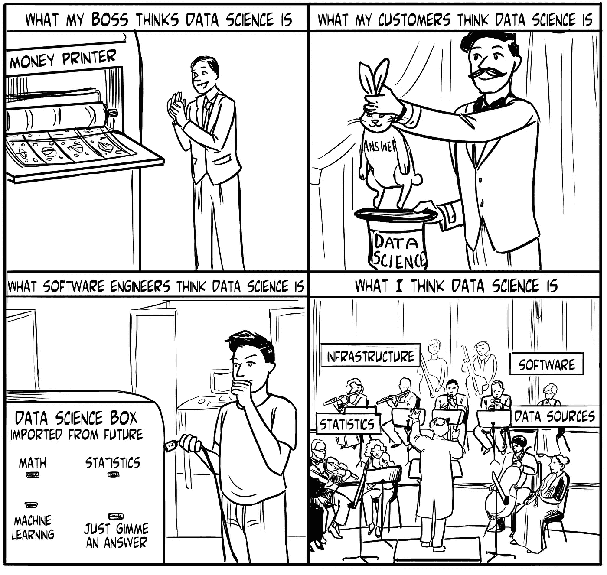
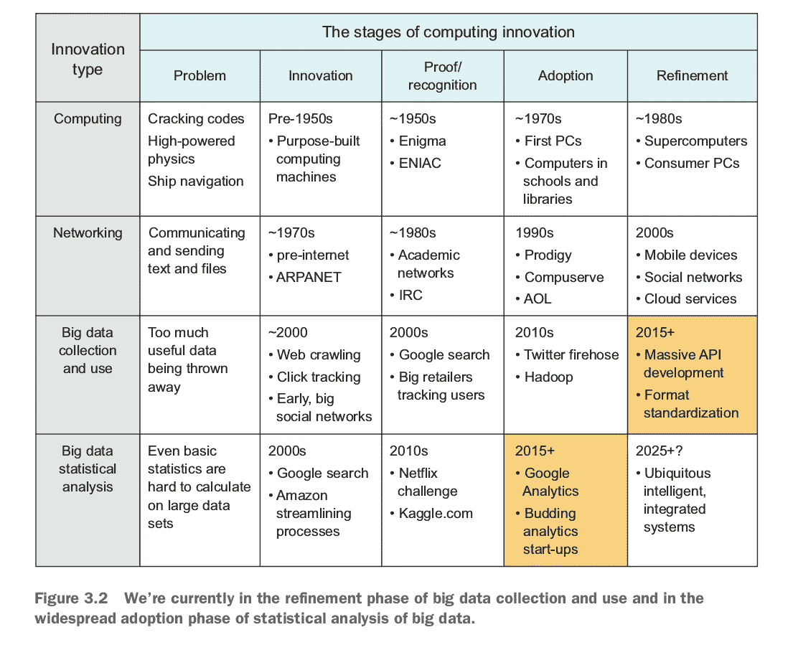

# 数据科学真的是“科学”吗？

> 原文：<https://towardsdatascience.com/is-data-science-really-a-science-9c2249ee2ce4?source=collection_archive---------4----------------------->

## 为什么数据科学可能是一个严格的领域，不同于它的前辈

我继续看到关于数据科学是否真的是一门“科学”以及这个领域是否是“新”的讨论。不久前，我绞尽脑汁想出了支持数据科学既是“科学”又是“新”的好论点。我不能声称对这些观点有 100%的结论，但数据科学有一些明确独特的方面，我在下面描述了这些方面，摘自 [***像数据科学家一样思考***](https://manning.com/books/think-like-a-data-scientist?a_aid=thinklikeadatascientist&a_bid=eb49dc22) *。*

# 数据作为研究对象

近年来，关于 ***数据科学*** 的领域是否仅仅是结合了软件工程和数据分析的许多更古老领域的转世或分支——在大数据时代，有一个似乎永无止境的讨论:例如**运筹学、决策科学、分析学、数据挖掘、数学建模或应用统计学**。就像任何时髦的术语或话题一样，只有当这个术语的流行度下降时，关于它的定义和概念的讨论才会停止。我不认为我能比许多在我之前定义数据科学的人做得更好，所以让我转述维基百科中的[定义就足够了:](https://en.wikipedia.org/wiki/Data_science)

> 数据科学是从数据中提取知识。

很简单，但这种描述并没有将数据科学与许多其他类似的术语区分开来，除了可能声称数据科学是所有术语的总称。另一方面，这个数据科学时代有一个前所未有的属性，对我来说，这是一个相当令人信服的理由，可以用一个新术语来描述数据科学家所做的事情，而以前的应用统计学家和面向数据的软件工程师没有这样做。

# 电脑和互联网的用户成为了数据的生产者

纵观近代历史，计算机在计算能力、存储和一般能力方面取得了令人难以置信的进步，以完成以前闻所未闻的任务。自近一个世纪前现代计算机发明以来，每一代人都目睹了不断缩小的机器，它们比上一代最强大的超级计算机强大几个数量级。从二十世纪下半叶到二十一世纪初，包括今天，这一时期通常被称为信息时代。信息时代的特点是计算机和互联网无处不在，可以分为几个与数据分析相关的较小的转变。

首先，早期的计算机主要用于计算，这在以前要花费不合理的时间。破解军事密码、导航船只以及在应用物理中进行模拟都是早期计算机执行的计算密集型任务。

**第二个**，人们开始使用电脑交流，互联网在规模和容量上都有所发展。数据和结果可以很容易地远距离传送。这使得数据分析师能够在一个地方收集更大、更多样的数据集进行研究。20 世纪 90 年代，发达国家普通人的互联网接入大幅增加，使数亿人能够获得已发布的信息和数据。

**第三**，尽管早期大众对互联网的使用主要包括消费出版内容和与其他人交流，但很快许多网站和应用程序的所有者意识到，他们用户行为的集合为他们自己产品的成功提供了有价值的洞察，有时甚至是对人类行为的洞察。这些网站开始以点击、键入文本、网站访问和用户可能采取的任何其他行动的形式收集用户数据。用户开始产生比他们消耗的更多的数据。

**第四**，连接到互联网的移动设备和智能手机的出现，使得收集用户数据的数量和具体性方面的巨大进步成为可能。在任何给定的时刻，您的移动设备都能够记录和传输其传感器可以收集的每一点信息(位置、移动、相机图像和视频、声音等)，以及您在使用设备时故意采取的每一个动作。如果您启用或允许收集信息，这可能是一个巨大的信息量。

第五个——尽管这不一定是在个人移动设备出现之后——是数据收集和互联网连接几乎包含在所有电子产品中。通常被称为 ***物联网*** (物联网)，这些可以包括从你的汽车到你的手表到你办公楼顶部的天气传感器的所有东西。当然，从设备上收集和传输信息早在 21 世纪之前就已经开始了，但它的普遍存在是相对较新的，因为在互联网上可以获得各种形式的数据，处理过的或原始的，免费的或出售的。

通过计算设备和互联网的这些发展阶段，网络世界不仅仅是一个消费信息的地方，它本身也是一个数据收集工具。上世纪 90 年代末，我的一个高中朋友建立了一个网站，提供电子贺卡，作为收集电子邮件地址的幌子。他以几十万美元的价格出售了数百万个电子邮件地址的结果列表。这是用户数据价值的一个原始例子，其目的与网站本身完全无关，也是一个完美的例子，说明我很遗憾在年轻时错过了一些东西。到 21 世纪初，类似规模的电子邮件地址集合不再值这么多钱，但其他类型的用户数据变得非常受欢迎，同样可以卖得高价。

# 数据本身

> 随着人们和企业意识到用户数据可以被卖到相当可观的价格，他们开始不加选择地收集数据。

大量数据开始堆积在各地的数据存储中。在线零售商开始不仅存储你购买的所有东西，还存储你浏览的每一件商品和你点击的每一个链接。视频游戏存储了你的虚拟角色走过的每一步，以及它打败了哪些对手。

各种社交网络储存了你和你朋友做过的所有事情。收集所有这些数据的目的并不总是为了出售，尽管这种情况经常发生。因为几乎每个主要网站和应用程序都使用自己的数据来优化用户的体验和有效性，所以网站和应用程序发布者通常会在数据作为可以出售的东西的价值和数据在内部持有和使用时的价值之间徘徊。许多出版商害怕出售他们的数据，因为这为其他人找到有利可图的东西打开了方便之门。他们中的许多人把数据留给自己，囤积起来以备将来之需，因为他们应该有足够的时间从中挖掘出所有的价值。

互联网巨头脸书和亚马逊每天每分钟都在收集大量数据，但据我估计，他们拥有的数据大部分都没有被利用。脸书专注于营销和广告收入，他们拥有世界上最大的人类行为数据集之一。如果产品设计师、营销人员、社会工程师和社会学家能够获得脸书的数据，他们可能会在学术和工业领域取得巨大进步。反过来，亚马逊拥有的数据如果交给学术机构，可能会颠覆许多受人喜爱的经济原则，并创造出几个新的原则。或者，它可能会改变整个行业的零售、制造和物流工作方式。

这些互联网巨头知道他们的数据是有价值的，他们相信没有其他人拥有类似的数据集，无论在哪里都接近相同的大小或质量。无数公司都乐意为获取数据支付高价，但我猜测，脸书和亚马逊也有充分利用数据的愿望，因此不希望其他任何人攫取由此产生的利润。如果这些公司有无限的资源，他们肯定会试图从每一个字节的数据中榨取每一块钱。但是，无论他们有多么庞大和强大，他们的资源仍然有限，他们被迫专注于最直接影响其底线的数据使用，而排除了一些其他有价值的工作。

另一方面，一些公司选择提供对他们数据的访问。Twitter 是一个显著的例子。付费后，你可以访问 Twitter 平台上的全部数据流，并在你自己的项目中使用。一个完整的产业已经围绕着数据买卖的中介发展起来，以获取利润。一个突出的例子是来自各大证券交易所的数据市场，这些数据长期以来一直可供购买。

学术和非营利组织经常公开和免费提供数据集，但在如何使用它们方面可能会有限制。由于即使在一个单一的科学领域内数据集的差异，已经出现了数据集的位置和格式合并的趋势。几个主要领域已经创建了一些组织，它们的唯一目的是维护包含尽可能多的来自该领域的数据集的数据库。通常要求科学文章的作者在发表他们的作品之前将他们的数据提交给这些规范的数据仓库之一。

> 无论哪种形式，数据现在无处不在，而不仅仅是分析师用来得出结论的工具，它已经成为自己的目的。公司现在似乎将收集数据作为一种目的，而不是一种手段，尽管他们中的许多人声称计划在未来使用这些数据。独立于信息时代的其他定义特征，数据获得了自己的角色、自己的组织和自己的价值。

# 作为探险家的数据科学家

在 21 世纪，数据正以前所未有的速度被收集，并且在许多情况下，收集数据并不是为了特定的目的。无论是私有的、公共的、免费的、出售的、结构化的、非结构化的、大型的、正常规模的、社交的、科学的、被动的、主动的或任何其他类型的数据集都在到处积累。几个世纪以来，数据分析师收集他们自己的数据或获得数据集进行工作，而历史上第一次，许多行业的许多人首先收集数据，然后问:“我可以用这些数据做什么？”还有一些人在问，“已经存在可以解决我的问题的数据吗？”

通过这种方式，数据——任何地方的所有数据，作为一个假设的集合——已经成为一个值得研究和探索的实体。在过去的几年里，数据集通常是有意收集的，因此它们代表了对现实世界的一些有意测量。但最近，互联网、无处不在的电子设备，以及对错过数据中隐藏价值的潜在恐惧，让我们尽可能多地收集数据，通常是在一个宽松的前提下，即我们可能会在以后使用它。

*图 3.2* 显示了对计算历史上四种主要创新类型的解释:计算能力本身、计算机之间的联网和通信、大数据的收集和使用以及对大数据的严格统计分析。我所说的大数据仅仅是指最近捕获、组织和使用任何和所有可能的数据的运动。每一项计算创新都始于一个亟待解决的问题，然后经历四个发展阶段，这一过程类似于 Carlota Perez 的技术激增周期(*技术革命和
金融资本*，埃德华·埃尔加出版社，2002 年)，但重点是计算创新及其对计算机用户和公众的影响。

对于图中包含的每个创新，有五个阶段:

1.  ***问题*** —有一个问题，计算机可以用某种方式解决。
2.  ***发明***——能够解决那个问题的计算技术被创造出来。
3.  ***证明/认可*** —某人以一种有意义的方式使用计算技术，其价值被证明或至少被一些专家认可。
4.  ***采用***——这项新证明的技术在工业上得到广泛应用。
5.  ***细化*** —人们开发新的版本，更多的功能，更高的效率，与其他工具的集成，等等。

因为我们目前正处于大数据收集的细化阶段和该数据的统计分析的广泛采用阶段，所以我们创建了一个完整的数据生态系统，其中提取的知识只是包含的总知识的一小部分。不仅许多知识还没有被提取出来，而且在许多情况下，除了建立系统的几个软件工程师之外，没有人理解数据集的全部范围和属性；唯一可能理解数据中包含的内容的人可能是那些太忙或太专业而无法利用它的人。对我来说，所有这些未被充分利用或了解甚少的数据的集合就像一个全新的大陆，有许多未被发现的植物和动物物种，一些完全陌生的生物，可能还有一些很久以前离开的文明留下的遗留结构。

这种描述也有例外。谷歌、亚马逊、脸书和
推特是走在时代前列的公司的好例子。在某些情况下，他们的行为符合创新的后期阶段。例如，通过允许访问其整个数据集(通常是收费的)，Twitter 似乎正在大数据收集和使用的细化阶段运作。各地的人们都在试图从用户的推文中榨出最后一点知识。同样，谷歌似乎在以严格的统计方式分析数据方面做得很好。它在图片搜索、谷歌分析、甚至基本文本搜索方面的工作都是大规模可靠统计的好例子。然而，人们很容易认为谷歌还有很长的路要走。如果说今天的数据生态系统就像一块尚未开发的大陆，那么数据科学家就是这块大陆的探索者。就像早期欧洲著名的美洲或太平洋岛屿探险家一样，一个好的探险家擅长几件事:

*   访问有趣的区域
*   认识新的有趣的事物
*   意识到一些有趣的事情可能即将发生的迹象
*   处理新的、不熟悉的或敏感的事物
*   评价新的和不熟悉的事物
*   在熟悉的事物和不熟悉的事物之间建立联系
*   避免陷阱

> 一个南美丛林的探险者可能用大砍刀砍过丛林灌木丛，偶然发现了几块松散切割的石头，推断出附近有一座千年古寺，找到了这座寺庙，然后从废墟中了解到了古代部落的宗教仪式。
> 
> 数据科学家可能会编写一个脚本，从公共 API 中提取一些社交网络数据，认识到一些人构成了社交活动的主要枢纽，发现这些人经常在社交网络上的帖子中提到一个新的照片共享应用程序，从照片共享应用程序的公共 API 中提取更多数据，并通过结合两个数据集和一些统计分析来了解在线社区中网络影响者的行为。
> 
> 这两个案例都得出了以前不为人知的关于社会如何运作的信息。

像探险家一样，现代数据科学家通常必须调查地形，仔细观察周围环境，四处游荡，潜入一些不熟悉的领域，看看会发生什么。当他们发现一些有趣的东西时，他们必须检查它，弄清楚它能做什么，从中学习，并能够在未来应用这些知识。虽然分析数据不是一个新领域，但数据无处不在的存在——通常不管是否有人在使用它——使我们能够应用科学方法来发现和分析预先存在的数据世界。对我来说，这是数据科学与其前身之间的区别。数据太多了，没有人能完全理解，所以我们把它当作一个独立的世界，值得探索。

这种将数据视为荒野的想法是使用术语“数据科学”而不是任何对应术语的最有说服力的理由之一。为了从数据中获得真实的真相和有用的答案，我们必须使用科学方法，或者在我们的情况下，使用**数据科学方法**:

1.  问个问题。
2.  陈述一个关于问题答案的假设。
3.  做一个可测试的预测，如果正确的话，提供支持假设的证据。
4.  通过包含数据的实验来测试预测。
5.  通过对实验结果的分析，得出相应的结论。

通过这种方式，数据科学家只是在做科学家几个世纪以来一直在做的事情，尽管是在数字世界。今天，我们一些最伟大的探险家把他们的时间花在虚拟世界中，我们可以在不离开电脑的情况下获得强大的知识。

*Brian Godsey 博士，是一名数学家、企业家、投资者和数据科学家，他的书* [*像数据科学家一样思考*](https://manning.com/books/think-like-a-data-scientist?a_aid=thinklikeadatascientist&a_bid=eb49dc22) *现在有印刷版和电子书。——*[*briangodsey.com*](http://www.briangodsey.com/)

*要了解更多信息，请下载免费的第一章* [*像数据科学家*](https://manning.com/books/think-like-a-data-scientist?a_aid=thinklikeadatascientist&a_bid=eb49dc22) *一样思考，并查看此* [*幻灯片演示文稿*](http://www.slideshare.net/ManningBooks/think-like-a-data-scientist) *了解更多信息和折扣代码。*

*如果您喜欢，请点击💚。*

 [## 数据科学的过程被低估了

### 编码和统计很重要，但是选择先做什么和下一步做什么也很重要

towardsdatascience.com](/the-process-of-data-science-is-underrated-87ea58d5f70c)  [## 检查您对数据的假设

### 没有人喜欢糟糕的假设

towardsdatascience.com](/check-your-assumptions-about-your-data-20be250c143)