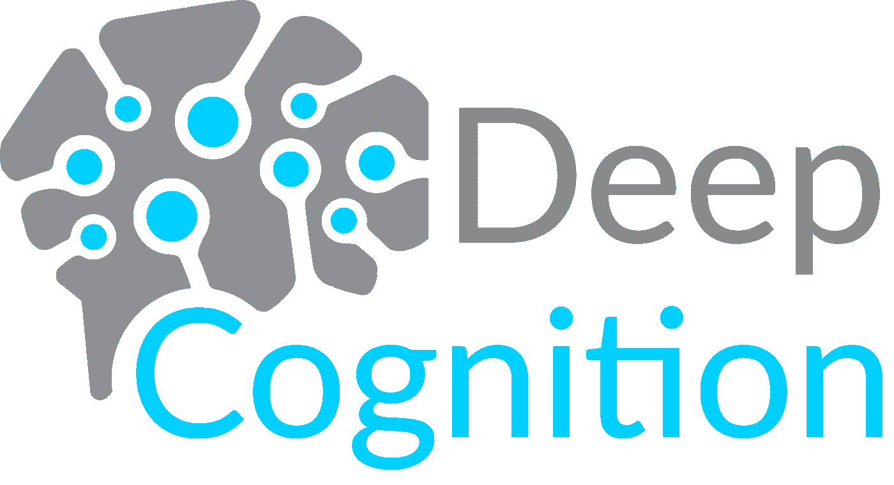
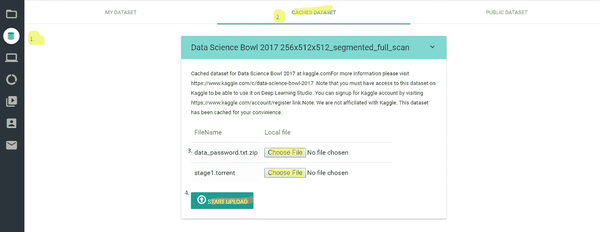
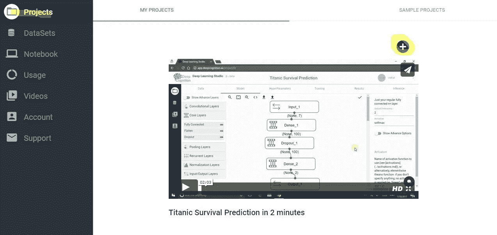
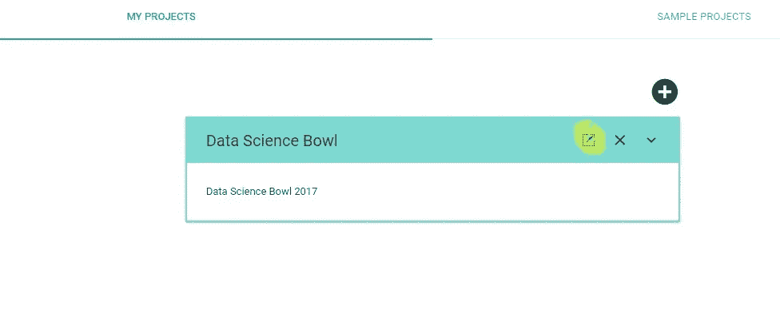
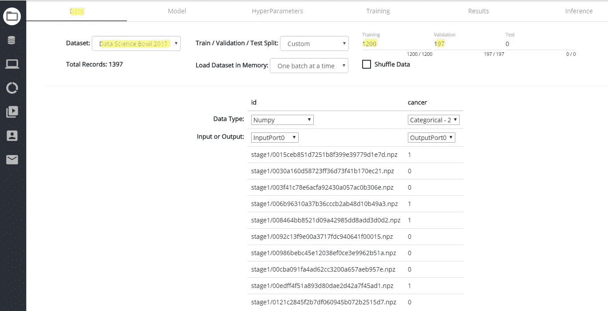
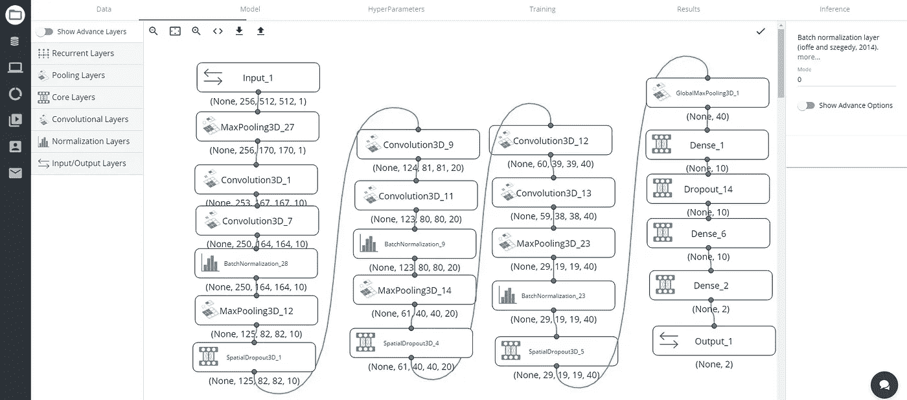
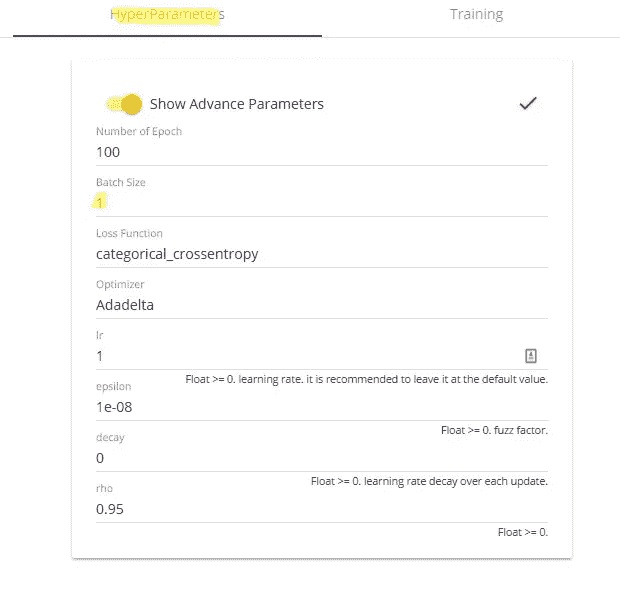
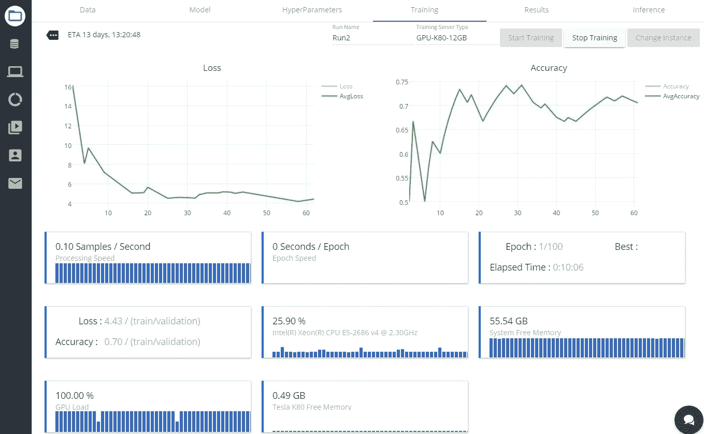

# 没有编程的深度学习可能吗？

> 原文：<https://towardsdatascience.com/is-deep-learning-without-programming-possible-be1312df9b4a?source=collection_archive---------4----------------------->

我知道这一定是你看完标题的第一反应。

但是，当你阅读这篇文章时，我的开发人员、从业人员和爱好者的 AI 社区，你将体验到一种新的设计、部署和训练深度学习模型的方法，无需编程，通过一个免费的软件平台，免费的，免费的！！！！(是的，你没看错)

自从我开始在深度学习领域的旅程以来，我曾经在 [Quora](https://www.quora.com/) 上看到过很多问题，比如“如果我不是一名优秀的程序员，我是否仍然可以开始深度学习或找到复杂问题的解决方案”，或者“我是否可以学习 AI(人工智能)，没有编程的深度学习”，大多数时候答案都以一个大粗体“ **NO** ”结束。我知道如果有人问我同样的问题，我的答案是"**是的**"这可能通过最简单的深度学习平台" [**深度学习工作室**](http://deepcognition.ai/) "由一家名为 [**深度认知**](http://deepcognition.ai/company/about-us/) **的公司创建。**



Deep Learning Studio 是自 2017 年 1 月开始生产的第一个稳健的深度学习平台，有两个版本(云和桌面)，具有可视化界面。该平台为数据接收、模型开发、培训、部署和管理提供了全面的解决方案。通过使用 Deep Learning Studio，从开发人员到工程师或研究人员，任何人都将通过与 TensorFlow、MXNet 和 Keras 的强大集成，获得快速开发和部署深度学习解决方案的能力。

好了，现在在向大家介绍了深度学习工作室之后，是时候展示这个软件平台实际上是如何工作的了。正如人们所说的“你应该实践你所说的”,所以出于同样的目的，Deep Cognition，Inc .的首席执行官和联合创始人 Mandeep Kumar,通过 [Kaggle](https://www.kaggle.com/) 帖子展示了使用 Deep Learning Studio 在 CT 扫描数据集上应用 3d 卷积神经网络的实践，其一步一步的实现如下所示。

# 步骤 1:获取访问权限

注册并访问深度学习工作室，网址为

[](http://deepcognition.ai/) [## 深度认知——今天就成为一个人工智能驱动的组织

### 无需编码即可设计、训练和部署深度学习模型。深度学习工作室简化并加速了…

deepcognition.ai](http://deepcognition.ai/) 

[ **超级重要的一点**:一旦你在 Deep Cognition 网站注册了一个免费账户，你还将获得 2 小时的**免费 NVIDIA GPU** 培训时间，这就是我所说的非常迷人。]

# 步骤 2:启用缓存数据集

然后，他通过上传从他 Kaggle 帐户下载的两个小文件，在他的帐户中启用缓存的数据集，上传这些文件确保他可以访问 Kaggle 数据集(遵循标记 1 到 4)



Figure 1

# 步骤 3:创建并打开一个新项目

然后，他创建了一个新项目，方法是转到左边的项目菜单，点击+按钮。



Figure 2

他给自己的项目起了一个名字和描述，然后点击项目栏上的方框+箭头图标打开项目。



Figure 3

# 步骤 4:选择数据集并进行训练/验证集划分

他用 1200 个样本进行了训练，并用 197 个样本进行了验证。



Figure 4

# 步骤 5:构建模型

选择数据集后，他点击“模型”标签，并开始建立如下所示的模型，从左侧菜单栏拖动层到画布上，并连接这些层块。



Figure 5

下面显示的代码块反映了由[**Mandeep Kumar**](https://www.linkedin.com/in/mandeep1/)**使用深度学习工作室构建的整个模型的实际生成的源代码，可以在图 5 **中看到。****

```
def get_model():
    Input_1 = Input(shape=(256, 512, 512, 1))
    MaxPooling3D_27 = MaxPooling3D(pool_size= (1,3,3))(Input_1)
    Convolution3D_1 = Convolution3D(kernel_dim1= 4,nb_filter= 10,activation= 'relu' ,kernel_dim3= 4,kernel_dim2= 4)(MaxPooling3D_27)
    Convolution3D_7 = Convolution3D(kernel_dim1= 4,nb_filter= 10,activation= 'relu' ,kernel_dim3= 4,kernel_dim2= 4)(Convolution3D_1)
    BatchNormalization_28 = BatchNormalization()(Convolution3D_7)
    MaxPooling3D_12 = MaxPooling3D(pool_size= (2,2,2))(BatchNormalization_28)
    SpatialDropout3D_1 = SpatialDropout3D(p= 0.5)(MaxPooling3D_12)
    Convolution3D_9 = Convolution3D(kernel_dim1= 2,nb_filter= 20,activation= 'relu' ,kernel_dim3= 2,kernel_dim2= 2)(SpatialDropout3D_1)
    Convolution3D_11 = Convolution3D(kernel_dim1= 2,nb_filter= 20,activation= 'relu' ,kernel_dim3= 2,kernel_dim2= 2)(Convolution3D_9)
    BatchNormalization_9 = BatchNormalization()(Convolution3D_11)
    MaxPooling3D_14 = MaxPooling3D(pool_size= (2,2,2))(BatchNormalization_9)
    SpatialDropout3D_4 = SpatialDropout3D(p= 0.5)(MaxPooling3D_14)
    Convolution3D_12 = Convolution3D(kernel_dim1= 2,nb_filter= 40,activation= 'relu' ,kernel_dim3= 2,kernel_dim2= 2)(SpatialDropout3D_4)
    Convolution3D_13 = Convolution3D(kernel_dim1= 2,nb_filter= 40,activation= 'relu' ,kernel_dim3= 2,kernel_dim2= 2)(Convolution3D_12)
    MaxPooling3D_23 = MaxPooling3D(pool_size= (2,2,2))(Convolution3D_13)
    BatchNormalization_23 = BatchNormalization()(MaxPooling3D_23)
    SpatialDropout3D_5 = SpatialDropout3D(p= 0.5)(BatchNormalization_23)
    GlobalMaxPooling3D_1 = GlobalMaxPooling3D()(SpatialDropout3D_5)
    Dense_1 = Dense(activation= 'relu' ,output_dim= 10)(GlobalMaxPooling3D_1)
    Dropout_14 = Dropout(p= 0.3)(Dense_1)
    Dense_6 = Dense(activation= 'relu' ,output_dim= 10)(Dropout_14)
    Dense_2 = Dense(activation= 'softmax' ,output_dim= 2)(Dense_6)

    return Model([Input_1],[Dense_2])
```

> **因此，我的读者朋友们，现在你明白了如何在 Deep Learning Studio 软件平台中使用简单的拖放 GUI，你也可以在没有编程的情况下构建一个模型，嗯，这并不是所有的“超参数”的培训和调整都可以在没有编程的情况下完成，只需看看下面的后续步骤，并用你自己的眼睛感到惊讶。**

# **第六步:培训和结果**

**然后，他点击“超参数”选项卡，并确保批量设置为 1。这一点很重要，因为任何更大的东西都不适合 GPU 内存，训练也会失败。**

****

**Figure 6**

**最后他转到了“**培训**”选项卡。选择 GPU-K80 作为实例，点击“**启动实例**”。一旦实例启动，他就点击**开始训练**。请注意，由于数据集的庞大规模和所需的计算，训练将会非常缓慢。**

**在尝试了 2 个时期之后，他能够在验证集上得到大约 0.58 的损失。**

****

**Figure 7**

**在制作模型之前，他还对 CT 扫描数据集做了一些预处理，因此关于他建立的模型的直觉和关于他采取的预处理步骤的全部信息可以在[这里](https://www.kaggle.com/deepman/3d-convolutional-neural-network-w-o-programming)找到。**

****

**因此，这标志着我让你们了解市场上这种新软件平台的旅程的结束，这种平台通过拖放 GUI 简化并加速了深度学习的过程，并允许你们所有人设计、训练和部署深度学习模型，而不涉及编码。但是不要忘了看一下参考资料部分，里面有其他令人兴奋的资源供您参考。**

**参考资料:**

1.  **为了了解更多关于深度学习的知识，可以查看[这里](https://en.wikipedia.org/wiki/Deep_learning)。**
2.  **如果你想看一下由 Deep Cognition，Inc .主办的网络研讨会“深度学习简介”，他们邀请了[法维奥·巴斯克斯](https://medium.com/u/e8ec6fa4d7d4?source=post_page-----be1312df9b4a--------------------------------)做一次演讲，你可以点击这里查看[。](http://deepcognition.ai/resources/webinars/)**
3.  **如果你想阅读其他基于使用深度学习工作室建立深度学习模型的文章，你可以在这里查看。**
4.  **最后但同样重要的是，你可以在这里查看使用深度学习工作室[开发不同模型的 YouTube 视频。](https://www.youtube.com/channel/UCOLUuxs9q6q25Z63VQt00lQ)**

****

****感谢您的关注****

**你用*你的*时间来阅读*我的*工作对我来说意味着一切。我完全是这个意思。**

**如果你喜欢这个故事，疯狂鼓掌吧👏 **)** 按钮！这将有助于其他人找到我的工作。**

**还有，**跟我上** [**中**](https://medium.com/@naveenmanwani)**[**Linkedin**](https://www.linkedin.com/in/naveen-manwani-65491678/)**如果你想！我很乐意。******