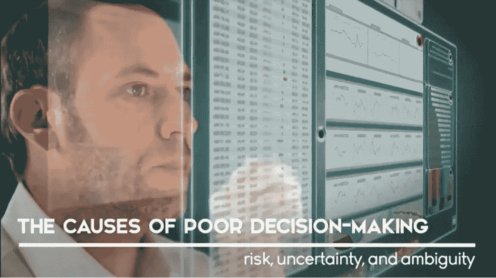
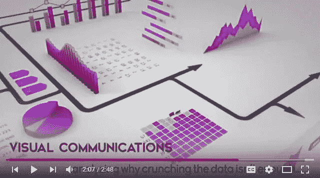
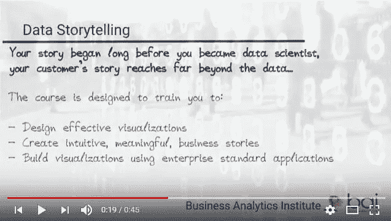

# 数字讲故事是数据科学的未来吗…

> 原文：<https://towardsdatascience.com/is-digital-storytelling-the-future-of-data-science-af55e26c23e3?source=collection_archive---------11----------------------->

..或者仅仅是商业交流中的一时风尚？

视频技术的最新发展在很大程度上推动了大数据的兴起——到今年年底，在线视频将占全球互联网流量的 80%。在我们关于数字转型的课程中，我们强调视频图像在数据科学的现在和未来中的重要性。我们一直在使用在线视频创作平台 Moovly 来帮助我们的学生和教师实践我们在介绍他们的案例研究、课程和项目时所宣扬的内容。让我们花一些时间来探讨数字讲故事的概念，视频的细节，我们自己对 Moovly 的使用，以及我们对为什么视频在未来几个月将在企业数字战略中占据越来越大的位置的看法。

数字故事讲述是围绕数据集构建故事的实践，有助于以强有力和引人注目的方式传达数据的含义。正如 iRobot 数据科学主管安吉拉巴萨(Angela Bassa)所指出的那样，“数据科学的很大一部分是在试图[传达]分析结果时进行沟通或说服”。很久以前，Claude Lévi-Strauss 和 Vladimir Propp 等人类学家证明了我们讲述的故事的结构的重要性——故事的意义来自于故事是如何组织起来的，而不是数据本身。最近对传统和商业故事的研究证明了这些叙事结构的普遍性。[iii] *人类的交流既受到我们如何处理经验的制约，也受到冷酷无情的事实的制约。*

[BAI Summer School on Data Science for Management](https://youtu.be/jkxPcIyx_Bg)

摄像是指在电子媒体上捕捉活动图像的制作过程。它在许多方面不同于传统的电影制作。首先，数字技术的进步塑造了这个领域:今天许多摄像师完全在电脑、平板电脑或电话上制作他们的作品，从来没有涉及到成像设备。专为社交媒体渠道设计的视频迎合了特定的消费模式。从商业角度来看，公司越来越依赖数字财产来获取和影响用户体验。他们认为需要制作越来越多的视频，因此青睐低成本、灵活和接近实时的视频制作流程。这表明该行业仍处于起步阶段，因为对数据叙事有效性的担忧仍是例外，而非普遍现象。

出于所有这些原因，Moovly 已经被证明是我们教学方法的一个极好的选择。由布兰登·格鲁内瓦尔德和吉尔特·科彭斯创建的 [Moovly](http://moovly.com/) 是一个基于云的数字媒体和内容创作平台，它极大地促进了动画视频和演示文稿的创作。在课堂内外，我们的学生和教师一直在使用该软件制作视频案例研究、课程简历和项目描述。该应用程序的界面提供了一个实时编辑工作室，该工作室在多媒体混搭的制作中得到了很好的应用，用于构建预告、动画序列和信息叠加。由于有大量的模板、模型和示例，学习曲线被证明是非常短的。Moovly 的直观性使我们能够将大部分课堂时间集中在启发式、格式塔原则、数据故事和视觉交流的讨论上。

“[Un problème de communication](https://youtu.be/dMf2qWlasrA)”

为什么在数据科学的研究中包括摄像？*改善决策所需的数据不仅仅在屏幕后面，还存在于你的客户和同事的头脑和经历中。*视觉传达解决了我们如何处理数据的更大问题。从生物学上来说，大脑皮层中的梭形面部区域是人类视觉系统的一部分，它允许我们将我们看到的数据与我们自己的经历联系起来。视觉和听觉线索通过增加信任和接近的感觉，给每个故事增加了人情味。非语言交流在很大程度上是普遍的——快乐、愤怒、惊讶和期待的表达在不同的文化中都是一样的。移动增加观众的注意力，摄像机移动有助于增强每个场景:增加戏剧性，跟随动作，引导观众的注意力，揭示关键细节。

“[BAI Data Storytelling Syllabus](https://youtu.be/kV7It9hJhOg)”

视频是否将商业数据带入生活？根据 Mayer 和 Anderson 的研究，观众视觉和听觉的刺激增加了他们对研究主题 74%的理解。马特·杨认为，观众在观看视频时能记住 95%的信息，相比之下，在阅读文本时只能记住 10%。商务视频在网络上越来越受欢迎；《福布斯洞察》显示，75%的企业高管每周至少观看一次与工作相关的视频。最后，Troy Anderson 认为，视频在社交媒体营销中的使用将社交媒体访问者购买产品、服务或想法的可能性提高了 64%。[【VI】](#_edn5)*数据科学团队的成功不是由他们的技术悟性来衡量，而是由他们影响管理决策的能力来衡量。*

将数据转化为有效的行动是商业分析研究所的核心和灵魂。我们 2018 年的 [**白暑期项目**](http://baisummer.com/) 将探索利用数据科学提高管理决策的关键技能。这个独特的夏季会议将为来自五大洲的四十多名参与者提供对使用分析实践的坚实理解，包括如何评估手头的数据，如何将适当的方法应用于特定类型的个人和专业挑战，以及如何利用数据改善管理决策。

Lee Schlenker 是商业分析和数字化转型教授，也是 http://baieurope.com[商业分析研究所](http://baieurope.com)的负责人。他的 LinkedIn 个人资料可以在[www.linkedin.com/in/leeschlenker](http://www.linkedin.com/in/leeschlenker)查看。你可以在 https://twitter.com/DSign4Analytics 的推特上关注我们

[【我】](#_ednref1)思科，(2017) [思科视觉联网指数](https://www.cisco.com/c/en/us/solutions/collateral/service-provider/visual-networking-index-vni/complete-white-paper-c11-481360.html)

[【ii】](#_ednref2)s woyer，S. (2017)，[通过大量数据讲述故事，加深理解](https://tdwi.org/articles/2017/03/09/enable-deeper-understanding-with-great-data-storytelling.aspx)

[【iii】](#_ednref3)例如，见 Hogan，P.C. (2003 年)。心灵和它的。故事:叙事共性和人类情感。纽约:剑桥大学

[【iv】](#_ednref4)【福布斯洞察】(2010 年)[高管们拥抱非文本网络](https://images.forbes.com/forbesinsights/StudyPDFs/Video_in_the_CSuite.pdf)

[【v】](#_ednref4)Young，m .(2016)，[看事实——为什么视频内容留存率最高](https://www.popvideo.com/blog/looking-at-the-facts-why-video-content-has-the-highest-retention-rate)

[【VI】](#_ednref5)t . Anderson，(2016)，[什么使得视频营销策略值得拥有？](http://www.autodemo.com/2016/08/makes-video-marketing-strategy-worth/)