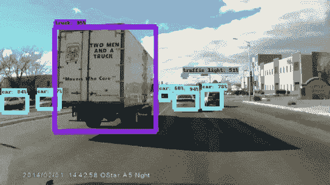
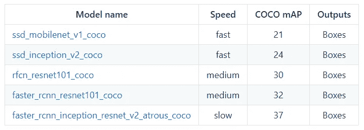
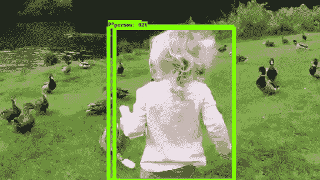

# Google Tensorflow 物体检测 API 是实现图像识别最简单的方法吗？

> 原文：<https://towardsdatascience.com/is-google-tensorflow-object-detection-api-the-easiest-way-to-implement-image-recognition-a8bd1f500ea0?source=collection_archive---------1----------------------->

*用数据做酷事！*

有许多不同的方法来进行图像识别。谷歌最近发布了一个新的 Tensorflow 对象检测 API，以推动计算机视觉无处不在。谷歌提供的任何服务都不能掉以轻心，所以我决定尝试一下这个新的 API，并在 you tube 的视频上使用它:)参见下面的结果:

Object Detection from Tensorflow API

你可以在我的 [Github repo](https://github.com/priya-dwivedi/Deep-Learning/blob/master/Object_Detection_Tensorflow_API.ipynb) 上找到完整的代码

我为这个项目添加了第二个阶段，在这个阶段，我在自定义数据集上使用 Tensorflow 对象检测 API 来构建我自己的*玩具飞机*检测器。你可以查看我的文章

[https://medium . com/@ Priya . DWI vedi/building-a-toy-detector-with-tensor flow-object-detection-API-63c 0 fdf 2 AC 95](https://medium.com/@priya.dwivedi/building-a-toy-detector-with-tensorflow-object-detection-api-63c0fdf2ac95)

那么这种体验是什么样的呢？首先让我们理解 API。

# **了解 API**

API 已经在 [COCO 数据集](http://mscoco.org/)(上下文中的公共对象)上进行了训练。这是一个包含 90 个最常见物体的 30 万张图片的数据集。对象的示例包括:

Some of the object categories in COCO datset

该 API 提供了 5 种不同的模型，这些模型在执行速度和放置边界框的准确性之间提供了一种平衡。请参见下表:

这里 mAP(平均精度)是检测包围盒的精度和召回率的乘积。这是一个很好的综合措施，可以衡量网络对感兴趣的对象有多敏感，以及它如何避免错误警报。mAP 得分越高，网络越精确，但这是以执行速度为代价的。

您可以通过此[链接](https://github.com/tensorflow/models/blob/477ed41e7e4e8a8443bc633846eb01e2182dc68a/object_detection/g3doc/detection_model_zoo.md)获得关于这些型号的更多信息

# 使用 API

我决定试试最轻量级的型号(ssd_mobilenet)。主要步骤是:

1.  下载冻结模型(。pb — [protobuf](https://developers.google.com/protocol-buffers/) )并将其加载到内存中
2.  使用内置的帮助器代码来加载标签、类别、可视化工具等。
3.  打开一个新会话，并在映像上运行模型

总的来说，这是一套相当简单的步骤。API 文档还提供了一个方便的 [Jupyter 笔记本](https://github.com/tensorflow/models/blob/master/object_detection/object_detection_tutorial.ipynb)来完成主要步骤。

该模型在样本图像上具有相当好的性能(见下文):

**在视频上跑步**

接下来我决定在一些**视频上尝试这个 API。为了做到这一点，我使用了 Python [moviepy](http://zulko.github.io/moviepy/) 库。主要步骤是:**

*   使用 VideoFileClip 功能从视频中提取图像
*   fl_image 函数是一个很棒的函数，它可以获取一个图像并用修改后的图像替换它。我用这个对从视频中提取的每张图像进行物体检测
*   最后将所有修改后的剪辑图像组合成一个新的视频

对于一个 3-4 秒的片段，这段代码需要一点时间来运行(大约 1 分钟)。但由于我们使用的是加载到内存中的冻结模型，所有这些都可以在没有 GPU 的计算机上完成。

印象非常深刻！只需一点点代码，您就可以在大量常见的对象上以相当高的精度检测并绘制边界框。

在有些情况下，我觉得表演还可以更好。参见下面的例子。这段视频中根本没有检测到鸟类。

# 后续步骤

关于进一步探索这个 API 的一些额外想法

*   尝试更精确但开销大的模型，看看它们能带来多大的不同
*   找出加速 API 的方法，以便它可以用于移动设备上的实时对象检测
*   Google 还提供了使用这些模型进行迁移学习的能力，即加载冻结的模型并添加另一个具有不同图像类别的输出层

给我一个❤️，如果你喜欢这个职位:)希望你拉代码，并尝试自己。

我有自己的深度学习咨询公司，喜欢研究有趣的问题。我已经帮助许多初创公司部署了基于人工智能的创新解决方案。请到 http://deeplearninganalytics.org/的[来看看我们吧。](http://deeplearninganalytics.org/)

你也可以在[https://medium.com/@priya.dwivedi](https://medium.com/@priya.dwivedi)看到我的其他作品

如果你有一个我们可以合作的项目，请通过我的网站或 info@deeplearninganalytics.org 联系我

**参考文献:**

*   [Google Tensorflow 物体检测 Github](https://github.com/tensorflow/models/tree/master/object_detection)
*   [COCO 数据集](http://mscoco.org/home/)