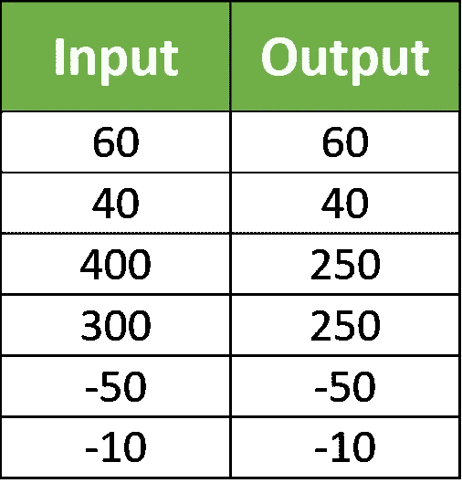
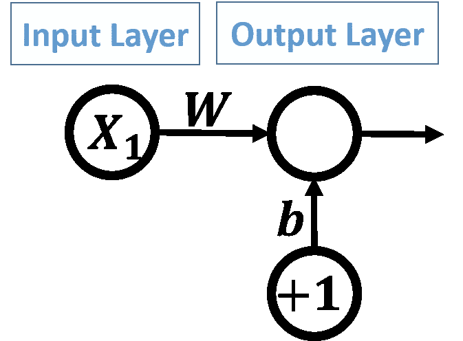
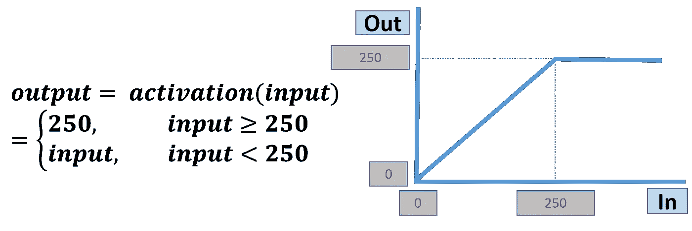
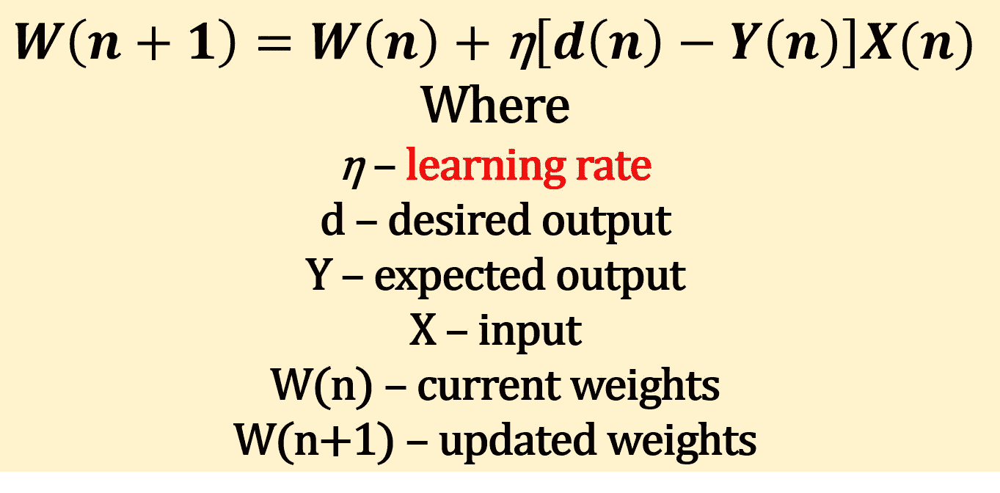
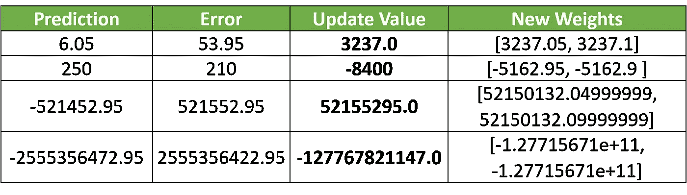
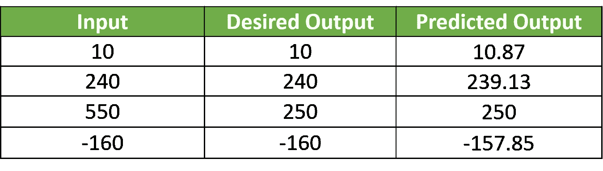

# 学习率在人工神经网络中有用吗？

> 原文：<https://towardsdatascience.com/is-learning-rate-useful-in-artificial-neural-networks-84ee5b6976d6?source=collection_archive---------2----------------------->

本文将帮助您理解为什么我们需要学习率，以及它对于训练人工神经网络是否有用。对单层感知器使用一个非常简单的 Python 代码，学习率值将被改变以捕捉它的想法。


# **简介**

人工神经网络新手的一个障碍是学习速度。有人多次问我，在人工神经网络(ann)的训练中，学习速度的作用是什么。为什么我们使用学习率？学习率的最佳值是多少？在本文中，我将通过提供一个例子来说明学习率对于训练一个人工神经网络是多么有用，从而使事情变得简单。在处理学习率之前，我将首先用 Python 代码解释我们的例子。

# **举例**

一个非常非常简单的例子是用来让我们摆脱复杂性，让我们只关注学习率。单个数字输入将被应用到单层感知器。如果输入等于或小于 250，其值将作为网络的输出返回。如果输入大于 250，那么它将被裁剪为 250。图 1 显示了用于训练的 6 个样本的表格。



**Figure 1\. Training samples.**

# **安架构**

所用人工神经网络的架构如图 2 所示。只有输入层和输出层。输入层只有一个神经元用于我们的单一输入。输出层只有一个神经元来产生输出。输出层神经元负责将输入映射到正确的输出。还有一个偏置应用于输出层神经元，权重 ***b*** ，值 ***+1*** 。还有一个用于输入的权重 ***W*** 。



**Figure 2\. Network architecture.**

# **激活功能**

本例中使用的激活函数的方程和图形如图 3 所示。当输入小于或等于 250 时，输出将与输入相同。否则会被剪辑到 250。



**Figure 3\. Activation function.**

# **用 Python 实现**

实现整个网络的 Python 代码如下所示。我们将讨论所有这一切，直到尽可能使它变得简单，然后集中于改变学习率，找出它如何影响网络训练。

```
1\. import numpy  
2\.   
3\. def activation_function(inpt):  
4\.     if(inpt > 250):  
5\.         return 250 # clip the result to 250  
6\.     else:  
7\.         return inpt # just return the input  
8\.   
9\. def prediction_error(desired, expected):  
10\.     return numpy.abs(numpy.mean(desired-expected)) # absolute error  
11\.   
12\. def update_weights(weights, predicted, idx):  
13\.     weights = weights + .00001*(desired_output[idx] - predicted)*inputs[idx] # updating weights  
14\.     return weights # new updated weights  
15\.   
16\. weights = numpy.array([0.05, .1]) #bias & weight of input  
17\. inputs = numpy.array([60, 40, 100, 300, -50, 310]) # training inputs  
18\. desired_output = numpy.array([60, 40, 150, 250, -50, 250]) # training outputs  
19\.   
20\. def training_loop(inpt, weights):  
21\.     error = 1  
22\.     idx = 0 # start by the first training sample  
23\.     iteration = 0 #loop iteration variable  
24\.     while(iteration < 2000 or error >= 0.01): #while(error >= 0.1):  
25\.         predicted = activation_function(weights[0]*1+weights[1]*inputs[idx])  
26\.         error = prediction_error(desired_output[idx], predicted)  
27\.         weights = update_weights(weights, predicted, idx)  
28\.         idx = idx + 1 # go to the next sample  
29\.         idx = idx % inputs.shape[0] # restricts the index to the range of our samples  
30\.         iteration = iteration + 1 # next iteration  
31\.     return error, weights  
32\.   
33\. error, new_weights = training_loop(inputs, weights)  
34\. print('--------------Final Results----------------')  
35\. print('Learned Weights : ', new_weights)  
36\. new_inputs = numpy.array([10, 240, 550, -160])  
37\. new_outputs = numpy.array([10, 240, 250, -160])  
38\. for i in range(new_inputs.shape[0]):  
39\.     print('Sample ', i+1, '. Expected = ', new_outputs[i], ' , Predicted = ', activation_function(new_weights[0]*1+new_weights[1]*new_inputs[i]))
```

第 17 行和第 18 行负责创建两个数组(inputs 和 desired_output ),用于保存上表中给出的训练输入和输出数据。根据所使用的激活功能，每个输入将有一个输出。

第 16 行创建了一个网络权重数组。只有两个权重:一个用于输入，另一个用于偏差。它们被随机初始化为 0.05 的偏置和 0.1 的输入。

第 3 行到第 7 行使用 activation_function(inpt)方法实现激活函数本身。它接受作为输入的单个参数，并返回作为预期输出的单个值。

因为预测中可能存在误差，所以我们需要测量该误差，以知道我们离正确的预测有多远。出于这个原因，第 9 行到第 10 行实现了一个名为 prediction_error(desired，expected)的方法，该方法接受两个输入:期望的输出和期望的输出。该方法只是计算每个期望输出和期望输出之间的绝对差值。任何误差的最佳值肯定是 0。这是最佳值。

如果有预测误差呢？在这种情况下，我们必须对网络进行更改。但是到底要改变什么呢？这是网络权重。为了更新网络权重，在第 13 行到第 14 行定义了一个名为 update_weights(weights，predicted，idx)的方法。它接受三个输入:旧权重、预测输出和具有错误预测的输入的索引。用于更新权重的等式如图 4 所示。



**Figure 4\. Weights update equation using learning rate.**

该等式使用当前步骤(n)的权重来生成下一步骤(n+1)的权重。这个等式是我们用来了解学习速度如何影响学习过程的。

最后，我们需要将所有这些连接在一起，使网络能够学习。这是使用从第 20 行到第 31 行定义的 training_loop(inpt，weights)方法完成的。它进入一个训练循环。该循环用于以最小的可能预测误差将输入映射到它们的输出。

该循环执行三项操作:

1.  产量预测。
2.  错误计算。
3.  更新权重。

了解了这个例子及其 Python 代码之后，让我们开始展示学习率对于获得最佳结果是如何有用的。

# **学习率**

在前面讨论的例子中，第 13 行有权重更新等式，其中使用了学习率。首先，我们假设我们没有完全使用学习率。该等式将如下:

```
weights = weights + (desired_output[idx] — predicted)*inputs[idx]
```

让我们看看去掉学习率的效果。在训练循环的迭代中，网络具有以下输入(b=0.05，W=0.1，输入=60，期望输出= 60)。

第 25 行中激活函数的预期输出将是 activation _ function(0.05(+1)+0.1(60))。预测产量将为 6.05。

在第 26 行，预测误差将通过得到期望输出和预测输出之间的差来计算。误差将是 ABS(60–6.05)= 53.95。

然后，在第 27 行，权重将根据上面的等式进行更新。新的权重将是[0.05，0.1] + (53.95)*60 = [0.05，0.1] + 3237 = [3237.05，3237.1]。

似乎新的权重与以前的权重相差太大。每个重量增加了 3237 磅，这太大了。但是让我们继续做下一个预测。

在下一次迭代中，网络将应用这些输入:(b=3237.05，W=3237.1，输入=40，期望输出= 40)。预期输出将是 activation _ function((3237.05+3237.1(40))= 250。预测误差将为 ABS(40–250)= 210。误差非常大。它比前一个误差大。因此，我们必须再次更新权重。根据上面的等式，新的权重将是[3237.05，3237.1] + (-210)*40 = [3237.05，3237.1] + -8400 = [-5162.95，-5162.9]。

图 5 中的表格总结了前三次迭代的结果。



**Figure 5\. Summary of results of the first three iterations.**

随着我们进行更多的迭代，结果会变得更糟。权重的大小变化很快，有时还会改变符号。它们正从很大的正值变为很大的负值。我们怎样才能阻止这种巨大而突然的重量变化呢？如何缩小权重更新的值？

如果我们从上表中查看重量的变化值，该值似乎非常大。这意味着网络以很大的速度改变它的权重。这就像一个人在很短的时间内做了很大的动作。曾经，这个人在远东，过了很短的时间，这个人将在遥远的西方。我们只需要让它慢下来。

如果我们能够缩小这个值，让它变得更小，那么一切都会好的。但是怎么做呢？

回到生成该值的代码部分，看起来是更新等式生成了该值。特别是这部分:

```
(desired_output[idx] — predicted)*inputs[idx]
```

我们可以通过将其乘以一个小值(如 0.1)来缩放该部分。因此，在第一次迭代中，不是生成 3237.0 作为更新值，而是减少到 323.7。我们甚至可以通过将比例值减小到 0.001 来将该值缩小。使用 0.001，该值将仅为 3.327。

我们现在可以抓住它了。这个比例值就是学习率。为学习率选择小的值使得权重更新的速率更小，并且避免突然的变化。值越大，变化越快，结果越差。

# 但是学习率的最佳值是多少呢？

我们不能说这是学习率的最佳值。学习率是一个超参数。超参数的值由实验确定。我们尝试不同的值，并使用给出最佳结果的值。有一些方法可以帮助你选择超参数的值。

# **检测网**

对于我们的问题，我推断值 0.00001 就可以了。用那个学习率训练完网络，就可以做个测试了。图 6 中的表格显示了 4 个新测试样本的预测结果。使用学习率后，现在的结果似乎好了很多。



**Figure 6\. Test samples prediction results.**

原文可在 LinkedIn 在此链接:[https://www . LinkedIn . com/pulse/learning-rate-useful-artificial-neural-networks-Ahmed-gad/](https://www.linkedin.com/pulse/learning-rate-useful-artificial-neural-networks-ahmed-gad/)

在本页面 KDnuggets 也有分享:[https://www . kdnugges . com/2018/01/learning-rate-useful-neural-network . html](https://www.kdnuggets.com/2018/01/learning-rate-useful-neural-network.html)

这篇文章于 2018 年 6 月 28 日在 TDS 上再次分享。

# 联系作者

**艾哈迈德·法齐·加德**

**LinkedIn**:[https://linkedin.com/in/ahmedfgad](https://linkedin.com/in/ahmedfgad)

**电子邮件**:ahmed.f.gad@gmail.com