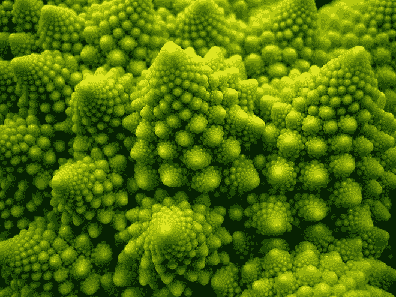

# 机器学习是开放式的吗？

> 原文：<https://towardsdatascience.com/is-machine-learning-open-ended-75128deaf6af?source=collection_archive---------4----------------------->

Fractal patterns are open-ended because they can be calculated infinitely many times upon zooming in, although their approximations in nature are finite like this romanesco cabbage.

# 近年来，机器学习取得了一些令人难以置信的成就，特别是通过利用人工神经网络的技术(*例如* [Go](http://b.	https://deepmind.com/research/alphago/) )。此外，尽管神经网络技术[是出了名的喜怒无常](http://f.	http://www.turingfinance.com/misconceptions-about-neural-networks/)，但人们对连接主义范式将继续取得胜利充满信心。然而，人工智能社区中有一种越来越强的声音，质疑当前技术的力量，以在一系列任务中引领类似人类一般智能的目标。[渐进式神经网络](http://b.	https://arxiv.org/pdf/1606.04671.pdf)可能会对这个问题有所启发，但仍处于起步阶段。在这里，我认为只有一种算法是已知的，可以导致广义智能所必需的那种开放性——自然选择。为了问机器学习是否是开放式的，我因此比较了自然选择和机器学习的逻辑，以开发有助于磨练未来研究的洞察力。

***开放式进化的基础***

在生物学理论中，只有一种创造性的“力量”能够产生无限进化——自然选择(NS)。(如果你对这种说法的来源感兴趣，我已经在别处[充实了这一观点背后的论点。)尽管](http://a.	https://medium.com/@philmadgwick/how-to-solve-a-problem-or-the-foundations-of-evolutionary-epistemology-6b42e41bbb81)[达尔文最初对 ns 的描述](https://en.wikipedia.org/wiki/Natural_selection)明确提到了现代生物学的特征，如有机体、世代、性别等等，但是[普遍达尔文主义](https://en.wikipedia.org/wiki/Universal_Darwinism)已经开始将 NS 视为底物中性(*例如* Dawkins 1976，Dennett 1995 等)。因此，NS 可以被认为是一种性能优化算法。

这样，用于描述 NS 的数学可以等效地模拟真实的学习(Plotkin 1995)。虽然 NS 通常被用来指发生在代与代之间的基因进化变化，但选择也可以描述发生在个体内部模因中的学习过程。这里有三个限定性的陈述:I)模因不一定是复制体，因为它们的存在可以被限制在一个单一的头脑中(*例如* Munz 1994)，ii)模因可能很少像基因，但这并不改变 NS 的适用性(*例如* Barkow 等人 1992)，以及 iii)并不是所有的行为变化都是学习，因为指令可塑性可以简化为潜在基因的反应规范(*例如*棘手点所以[见](http://4.	https://medium.com/@philmadgwick/the-biology-of-problem-solving-a-universal-darwinism-or-lamarckism-d3bba8b84aa4))。只有迷因提供了通往真正学习的途径，因为它们是独立的遗传对象。因此，通常被认为是迷因遗传的生物仅限于人类、特选的类人猿，或许还有一些其他分布的鸦类和鲸类物种。

这些年来，人们一直在激烈辩论 NS 的品质，这些品质使它能够导致基因或迷因的开放式进化。根本的问题是 [NS 同样适用于化学进化，就像它适用于生物](http://originoflife.net/takeover/)一样，所以生物对象必须有一些特殊的特征，允许它们的 NS 具有开放的可能性(*例如* Cairns-Smith 1985)。换句话说，在 NS 的算法中没有找到开放式进化的基础。进化生物学界已经认识到这个问题，现在[正在重大转变框架](http://b.	http://devosoft.org/whats-holding-artificial-life-back-from-open-ended-evolution/)的指导下进行研究。

主要转变框架可以被认为是解决生物复杂性问题的一种尝试。当 Williams (1966)和 Dawkins (1976)引入自私基因理论时，他们强调了生物组织是多么荒谬。如果每个基因都是自私的，为什么它们会生活在基因组中基因的社会里？基因预计会遇到合作问题，如[囚徒困境](https://en.wikipedia.org/wiki/Prisoner%27s_dilemma)，这使得基因社会容易受到内部冲突的破坏，导致公地悲剧。然而，梅纳德·史密斯和 Szathmary 指出，生物组织似乎完全是不可逆的。他们提出，基因社会的扩张是通过少数重大转变事件来实现的，这些转变事件克服了合作问题，并为逆转创造了障碍。结果是一个类似棘轮的过程，增加了生物的复杂性。

因此，进化理论将开放式进化与生物物体经历重大转变的能力联系起来。重大转变仍然是一个热门的研究领域，这个问题还没有达成一致的答案。我以前曾试图将主要转变的过程解释为 NS 的主体和客体之间的反身进化过程。主体就像有机体一样是适应性最大化的代理，而客体就像基因一样是遗传的单位。主体产生于客体的集体行为，这意味着主体是相互冲突的自私利益的妥协。反过来，主体与环境相互作用，以使其对象恢复健康。然而，主体的任务是模糊的，因为它可能与其他主体共享对象，因此与其他人共享共同感兴趣的程度。

关键问题是，一个主体如何知道如何回报利益给它的客体？由于其他主体可能包含与自身相同的对象，纯粹的利己主义将失败，因为它将导致通过其他主体损害其对象健康的行为。与此同时，纯粹的利他主义也会失败，因为这会助长他人的利己行为。形成明确的组通常是一个好主意，因为这将问题限制在一小部分人身上，他们可以更容易地对共享对象做出决定。当强制群体形成的好处(*例如*劳动分工)超过在群体之外的代价变得太不利时，正是这个群体可以经历重大转变。结果是主体扩展为群体，因此，每个主体的对象数量和交互的复杂性增加。

虽然我的描述必然是不完整的，需要进一步的阐释，但关键的信息是，主要的转变取决于主体和客体之间的分裂。这如何转化为机器学习算法？

***机器学习有主体和客体吗？***

如果我们要描述网络中主体和客体之间的划分概念，我们可以把单个节点描述为客体，把主体描述为网络中相对不同的模块。一个主体会有许多强有力的内部连接，有少量的节点连接到网络的其他部分。然而，尽管这种解释很直观，但当使用选择性算法而不是机器学习算法时，它将非常有意义。逻辑可以归结为四点:

*1。原则上，NS 和许多机器学习算法没有什么不同*

NS 和许多机器学习算法都是优化技术。给定一个恒定的环境，两者都经历了向某种最佳状态的变化。一些进化生物学家和计算机科学家认为，群体优化方法是 NS 启发的算法所独有的。在我看来，我看不出为什么人口的统计特性不能以一种去除人口成分的方式来建模。事实上，有 NS 的进化模型就是这样做的。因此，我认为更重要的是认识到 NS 和优化之间没有什么真正的不同。但是，它们的实现方式可能会有所不同。

*2。在 NS 下，对象适应度最大化，但是节点没有最大化任何东西*

在一个有机体中，一个基因可以说是自私的，因为它被选择来最大化其适应性，即使它是通过与其他基因相互作用而获得这种适应性的。这可能导致基因与基因组中的其他基因发生冲突，但这种冲突表现为基因组中特定基因座的等位基因之间的竞争。可以说，位点是基因组中的一个座位，能改变的只是谁坐在这个座位上。例如，当第一个基因座的突变基因进化时，为了自己的私利而损害了基因组的其余部分(例如，一个绿胡子)，这就选择了另一个基因座的修饰等位基因，以抑制这种变化。预计第一个基因座的基因库不会针对该基因座进行选择。通过这种方式，一个基因网络被一只看不见的手组织起来，基因按照自己的利益行事，并附带地有益于基因组的其他部分。

人工神经网络不是通过一只看不见的手来运作的。没有理由认为一个节点可以最大化任何东西。相反，网络作为一个整体最大化其任务性能。问题不在于节点的属性是由整个网络如何与环境(即游戏等)交互决定的，因为这也是主体在自然界中所做的，而是节点是固定架构的一部分。在自然界中，如果有害的突变被 ns 所偏爱，一个基因座可能变得无功能，但是在人工神经网络中这不会发生。事实上，有一整套选择网络约束的艺术，包括节点的数量、层中节点的排列等等，都需要预先考虑。这与盲目的选择过程完全不同。

*3。机器学习网络中的节点对对象进行编码，但本身不是对象*

网络对物体进行编码的想法很复杂。让我们考虑一下基因。基因由位于线性字符串上的 DNA 编码，但它们通过复杂的表达网络相互作用来创建功能，这些表达网络不映射到线性编码结构上。同样，网络不一定要映射到学习的对象上。这个问题在新兴的迷因科学中遇到过，迷因的物理基础由某人大脑中一组特殊的神经连接来表示。这些神经连结，以及许多其他的神经连结组态，编码了迷因对象。同样，机器学习网络中的节点不是对象，而是对对象进行编码。

*4。机器学习网络是低效的对象编码器*

在目前处于起步阶段的[渐进式神经网络](https://arxiv.org/abs/1606.04671)中，单个网络可以从玩一个游戏中获得“直觉”，然后将这种直觉应用于另一个游戏，以提高性能优化的速度。然而，网络以一种可塑性的形式做到了这一点，因为在学习玩新游戏的过程中，现有的任务表现受到了损害。这是值得关注的，因为这意味着网络中的对象非常少，因此玩新游戏必然意味着覆盖为先前任务选择的对象。这种重写显然与类人的一般智力非常不同，在类人的一般智力中，玩家可以独立地在多个游戏中保持能力。此外，在不发生这种重写的情况下，整个过程被“硬编码”以避免“遗忘”。这里还有很长的路要走。

***开放式机器学习？***

作为一名进化生物学家，我对当前机器学习技术可能达到的极限感到担忧。显然，采取更受 NS 启发的方法是否有益取决于你的目标。如果你想让一台机器很好地播放 Atari，我认为 DeepMind 已经非常明确地展示了超人的能力。然而，如果你想要一台具有某种生物“通用”智能的机器，那么我认为明智的做法是考虑 I)许多生物“智能”对于它们特定的小生境是多么有限，以及 ii)开放式学习的罕见情况的显著特征(在开放式进化普遍性的更广泛背景下)。对于未来的研究，我有两个试探性的建议。首先，放宽技术以允许网络体系结构更加灵活可能会使网络更具创造性；移除层结构以允许节点之间的任何类型的连接，允许节点的创建/消失，并允许内部选择网络常数。第二，如果节点被制成在选择性环境中最大化某些东西的明确对象，这可能会改善网络功能。是否会是这样，我还不确定，但不管怎样，它会让我们更有信心，技术正在走向开放式学习，因为 NS 在本质上已经实现了开放式学习。此外，有大量关于看不见的手的自组织特性的经济学、物理学和生物学文献，这些文献有助于描述在“黑匣子”中发现的结构的特征，从而可能解释它们。

感谢阅读！如果你有任何意见，我将很高兴听到他们，因为这是一个问题，我觉得不得不写下没有任何明确的答案。我认为很难说机器学习是否能够进行开放式学习(如定义的那样)，但我怀疑现有的方法是不够的。开放式技术的挑战似乎开始被重视，而不是被假设，导致了一些 T2 式的创新方法。总的来说，未来看起来令人兴奋！