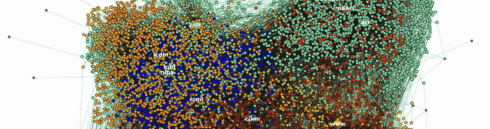

# 机器学习准备好规模化了吗？

> 原文：<https://towardsdatascience.com/is-machine-learning-ready-to-scale-8548f5b06c4a?source=collection_archive---------5----------------------->

我们的大脑中有一个动态的世界模型，帮助我们在识别出一些相似的特征后，识别出熟悉的模式。“我们假设**大脑将世界建模为动力系统的层级或级联，这些动力系统在感觉中枢**中编码因果结构。感知等同于这些内部模型的优化或反演，以解释感官数据。”几年前，分析脑成像数据以及大脑如何工作的计算模型的技术先驱卡尔·弗里斯顿和斯蒂芬·基贝尔[在他们的开创性论文](http://rstb.royalsocietypublishing.org/content/364/1521/1211)中写道。

这意味着当我们看着一只猫时，我们实际上并没有看到真实世界中的猫。我们看到一个由我们大脑的神经网络生成的猫的模型，它基于通过感官输入传递给我们大脑的真实猫的一些猫的特定细节。我们不需要处理来自真实世界的猫的完整图像来将它归类为猫并生成它的模型，因为我们的大脑可以概括。它有一个存储在内存中的猫的通用模型——一种模板，每当它在感官输入中识别出猫的模式时，它就可以将它上传到它的动态世界模型中。

随着我们的大脑不断接收关于现实世界中的猫的更多信息的感官输入，它会继续自动将通过输入获得的新信息与生成的模型进行比较。如果新的输入符合模型的模式，或者换句话说，根据模型，这是非常可能的，大脑将其归类为猫的另一个特征，并使我们的猫的模型更加详细。这种持续的模式丰富是我们大脑的背景活动，不会改变我们大脑的处理负荷。这实际上不是一个学习过程。这是模型的微调。

我们不断扫描现实世界的主要原因是寻找意外事件和低概率输入。如果你看到另一匹马，对大脑来说就不那么重要了。马可以有不同的颜色或大小，但它仍然只是一匹马。你的大脑会定期接受特定特征的输入，并将它们添加到你正在看的真实世界的马的动态生成模型中。你的大脑已经知道哪一匹马的颜色和尺寸最有可能，因为它已经在记忆中保存了类似马的模板(或广义模型)的东西。

然而，如果你突然看到马的前额有一只角，你的大脑活动会发生巨大的变化。你的大脑会对这一事件的处理负荷做出夸张的反应，你的大脑会立即意识到这是极不可能的。大脑活动的增加将持续下去，直到大脑选择了一个犀牛、独角兽或者只是一匹长着假角的马的模型。如果我们的大脑面对全新的和意想不到的东西，因此非常不可能，可能需要生成一个全新的模板(广义模型)。

我们需要世界模型及其模板来更好地压缩我们收到的数据，因为数据是神圣的——我们不能失去它，但我们的记忆不是无限的。它们还帮助我们缩短对现实世界情况的反应时间，这些情况可能需要对我们的生存至关重要的立即行动。

如果你的大脑必须在它的内存中筛选数百万张图片来识别一匹与你在现实世界中看到的棕色马相似的棕色马的图片，这可能需要几个小时或几年，取决于存储的数据量，因为我们的大脑处理数据的速度比现代计算机芯片慢得多。

人类通过搜索最不可能的数据来学习。这扩展了我们的概括能力。已经有[理论假设](http://rstb.royalsocietypublishing.org/content/364/1521/1211)和[实践证明](https://www.nature.com/articles/srep19741)当我们对抗难以预测的刺激时，我们大脑的处理负荷会增加。

机器通过搜索最可能的数据来学习。这缩小了他们归纳的能力。此外，他们不能实时调整现实世界物体的模型。正如谷歌 DeepMind [的研究人员所说](https://deepmind.com/blog/enabling-continual-learning-in-neural-networks/)**如今，计算机程序无法自适应地实时学习数据**最有前途的人工智能技术——深度神经网络(DNNs)——最近在封闭领域(非常狭窄的特定小生境)的许多识别和分类任务中展示了出色的结果。这使得许多研究人员认为成功的 DNNs 模型可以推广。然而，这个问题仍然没有答案。

由麻省理工学院的张领导的一组研究人员[最近认为](https://arxiv.org/pdf/1611.03530.pdf)成功的 DNNs 只是记忆了整个训练数据集，可以在没有任何泛化的情况下做出准确的分类。“我们进行的实验强调，几个成功的神经网络架构的有效容量足够大，足以粉碎训练数据。因此，这些模型在原则上足够丰富，可以记忆训练数据……我们的实验得出的另一个结论是，即使得到的模型不能一般化，根据经验**优化仍然很容易。”**

来自华盛顿大学[电气工程系网络安全实验室的 Hossein Hosseini 和 Radha Poovendran 在他们的论文](https://arxiv.org/pdf/1703.06857.pdf)中显示，“尽管 DNNs 在常规数据上的表现令人印象深刻，但它们在负面图像上的准确性处于随机分类的水平。这个观察表明，简单地在原始数据上训练的 dnn 不能识别对象的语义，并且可能仅仅记住输入。无法识别转换后的输入显示了当前训练方法的缺点，即学习模型无法进行语义概括。”

正如研究人员所说，“已经证明，神经网络的有效容量足以记忆整个训练数据集。结果，DNN 分类器通常以非常高的置信度正确地分类训练样本。此外，网络损失函数在输入样本周围平滑变化，即随机扰动样本很可能与常规样本归为同一类。此外，由于测试样本通常是从与训练样本相同的分布中收集的，因此测试数据点大多出现在训练点附近。因此，随着大型数据集的可用性，网络很可能可以将每个测试样本与来自同一类的一个或几个训练样本相关联，从而实现高测试准确度。

然而，由于转换后的样本可能远离原始样本，网络无法正确地对其进行分类。然而，对于特定的转换，我们也可以在转换后的数据上训练 DNN，以获得高精度，依靠大型和多样化的数据集，涵盖测试数据中可能的新奇事物的所有方面，似乎**对机器学习系统提出了一个基本问题**。这导致模型需要大量数据来理解每一个特性**，这显然不适合真实世界的应用**。"

特别是，Hosseini 和 Poovendran 在他们的实验中表明，经过良好训练以识别路标的 DNN 根本不能识别负面路标，即与训练时相同但亮度相反的路标。

与此同时，百度硅谷人工智能实验室系统研究主管格雷格·迪亚莫斯[在福布斯](https://www.forbes.com/forbes/welcome/?toURL=https://www.forbes.com/sites/ciocentral/2017/06/21/we-need-next-generation-algorithms-to-harness-the-power-of-todays-ai-chips/&refURL=&referrer=#50cf7f7e47a0)上撰文称，“为了实现人工智能的又一次重大突破，我们需要改变我们的软件。”这篇文章是由百度前首席科学家吴恩达在脸书和推特上分享的，他评论了 Greg 思想的重要性。

迪亚莫斯提出的突破是调整现有的人工智能算法，使它们更好地利用局部性。事实上，正如丹尼尔·格林菲尔德[在他 2010 年的论文](https://www.cl.cam.ac.uk/~swm11/research/dd-daniel-greenfield.pdf)中所说:“自从微处理器诞生以来，晶体管变得越来越便宜、越来越快、越来越节能，而全球的线路几乎没有变化。与此同时，我们正朝着在一个芯片上集成数千个处理内核的方向发展，软件分布在这些内核上。这个以通信为主导的计算新时代的标志是，内核上的本地计算很便宜，但内核间的全局通信和外部存储器很贵。因此，软件的物理空间位置开始变得重要。事实上，**已经证明，除非利用通信中的物理位置，否则随着技术的发展，成本变得难以承受**

因此，当对已经定型的技术进行规模化推广时，本地化就变得至关重要。如果你的自动驾驶汽车不能识别亮度相反的让路或停车标志，这会是一个根本性的问题吗？当前的机器学习系统准备好进行扩展了吗？还是仍然有一个根本问题使它们不可扩展？下注吧。