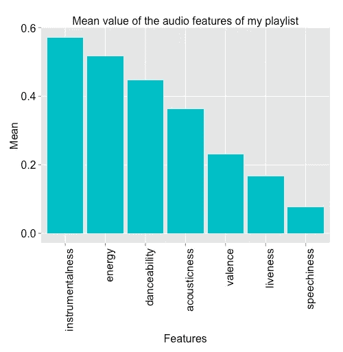
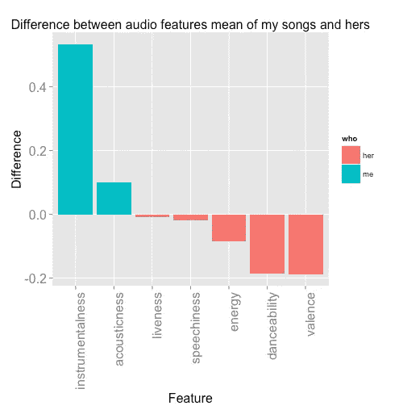
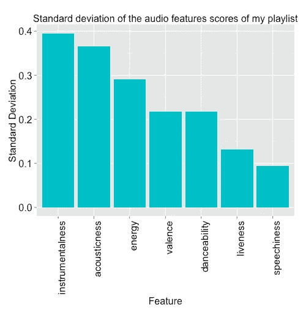
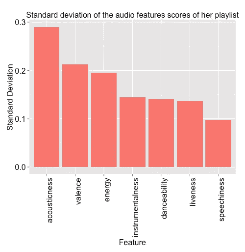
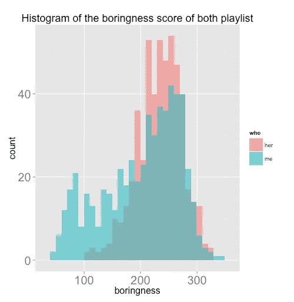
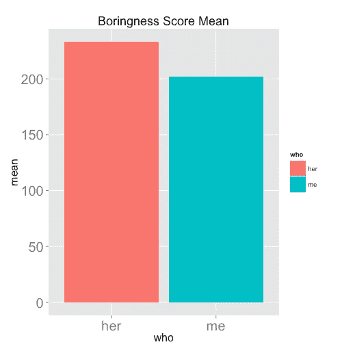

# 我的 Spotify 音乐很无聊吗？涉及音乐、数据和机器学习的分析

> 原文：<https://towardsdatascience.com/is-my-spotify-music-boring-an-analysis-involving-music-data-and-machine-learning-47550ae931de?source=collection_archive---------1----------------------->

几天前，我一边听着 Spotify 保存的歌曲，一边和一个朋友聊天。唱了几首歌后，她打断了谈话告诉我:“你的音乐品味很有趣……你的播放列表里有很多**综艺**、**器乐**歌曲，其中一些是**无聊**”。

我对这个评论一笑置之，因为这已经不是我第一次听到了。我承认我的音乐品味可能有点奇怪——例如，我可以以听肯德里克·拉马尔的音乐开始新的一天，然后转到《盗梦空间》的配乐，接着是西班牙萨尔萨舞曲。

然而，她的评论给了我一个好主意:让我们看看数据是怎么说的。

因此，我做了一个实验。

在这篇文章中，我将分享这个实验的发现，在这个实验中，我分析了我的 Spotify 歌曲，看看它们是否确实多样化、工具化和无聊。而且，为了让问题更有意思，我把这三个特点都和我朋友的歌做了对比。最后，我训练了一个机器学习模型，目的是预测一首歌是否更适合我或她的播放列表。

## **工具**

这个项目中使用的主要工具是 Spotify API 服务的*音频功能*组件。这些音频特征代表了一首歌曲的特征，例如声音有多强，T21 有多响。稍后我会对这些特性进行更详细的解释。

[Python](https://www.python.org/) 用于使用库 [Spotipy](https://github.com/plamere/spotipy) 获取数据，使用 [scikit-learn](http://scikit-learn.org/stable/) 训练机器学习模型。数据分析在 [R](https://cran.r-project.org/) 中完成。

## **数据**

音乐数据是使用我编写的 Python 脚本获取的，该脚本获取用户的所有播放列表，以及特定播放列表中的所有歌曲。一旦我有了歌曲的基本信息，包括它们的 Spotify ID，我就能够使用相同的脚本获得它们的音频特征。

产生的数据集由 15 列和 1074 首歌曲组成，其中 563 首来自我的播放列表，511 首来自她的(从现在起我将称我的朋友为*她*或*她的*)。

在数据集的所有 15 列中，仅使用了与音频特征相关的那些列。在下面的列表中，我将介绍它们，并解释它们的含义(在某些情况下，我只是从 Spotify 复制/粘贴描述)。注意:所有特性的值都在 0.0 -1.0 的范围内。

*   乐器性:这个值代表歌曲中的声音量。越接近 1.0，歌曲的器乐性越强。
*   声学:这个值描述了一首歌曲的声学程度。1.0 分意味着这首歌最有可能是一首原声歌曲。
*   Liveness:这个值描述了歌曲被现场观众录制的概率。根据官方文档"*，高于 0.8 的值表示该曲目很有可能是直播的"*。
*   语速:*语速检测音轨中是否存在口语单词*。如果一首歌曲的语音度高于 0.66，它可能是由口语词组成的，0.33 到 0.66 之间的分数是一首可能同时包含音乐和词的歌曲，而低于 0.33 的分数意味着这首歌曲没有任何语音。
*   能量:“*(能量)代表强度和活动的感知测量。通常，充满活力的曲目让人感觉快速、响亮、嘈杂。*
*   可跳舞性:"*可跳舞性描述了一首曲目在音乐元素组合的基础上适合跳舞的程度，包括速度、节奏稳定性、节拍强度和整体规律性。值 0.0 最不适合跳舞，1.0 最适合跳舞*。
*   效价:"*从 0.0 到 1.0 的量度，描述音轨所传达的音乐积极性。高价的音轨听起来更积极(例如，快乐、愉悦、欣快)，而低价的音轨听起来更消极(例如，悲伤、沮丧、愤怒)。*

# **数据分析**

这篇报道的前提或者说假设是——据一个朋友说——我的歌是多种多样的，器乐化的，无聊的。所以，我调查了这三个属性，来测试她是否正确。在这一部分，我将描述我的发现。

我将首先展示两个播放列表的所有音频特征的平均值的两个图，这样我们可以了解每个数据集的主要特征，并熟悉它。



第一个图显示了我的播放列表的普遍特征是**乐器性**，代表她的播放列表的第二个图显示了**可跳舞性**是她的。但是，这些数值的差别有多大呢？下面的图表是从我的特征中减去她的每个特征的平均值后的结果。



我们可以清楚地看到**乐器性**和**一致性**(蓝色条)是我的播放列表的显著特征，相差 **0.53** 和 **0.1。**在她这边， **danceability** 和 **valence** ，这两个特征都以 **0.19** 的数值高居榜首。

这个结局可以这样解读。

*   我的歌好像少了些人声，多了些器乐。
*   她的歌曲更生动。

所以，看到这些结果后，我们都同意“*我的播放列表有用吗？”*是确定的**是**。

## 多样化

我要回答的下一个问题是:*我的播放列表有多多样？*

为了回答这个问题，我调查了每个播放列表中的歌曲有多相似或不相似。例如，非常多样的播放列表意味着用户有许多来自不同流派的歌曲。与此相反，低变化播放列表是一个几乎所有歌曲都属于同一流派的列表。

我用来检查我们的播放列表有多不同的技术，是简单地查看音频特征的**标准偏差**。以下是情节。



通过查看图表，很难确定哪个播放列表的变化更大，但是如果将所有值相加，并计算平均值，我们会发现我的播放列表的所有标准偏差的平均值是 **0.244** ，而所有单个值的总和是 **1.713** 。关于她的播放列表，分别是 **0.174** ，和 **1.218** 。

这意味着什么？高标准偏差表示我的歌曲的音频特征的分数不是那么相似，这意味着，例如，我可能有许多乐器性值非常高的歌曲，同时也有相同值非常低的歌曲。

结论:我的播放列表至少比她的更多样。

## 乏味的

寻找问题*“我的播放列表有多无聊？”*是这部作品中最有趣的部分之一，因为，到底是一首无聊的歌。对我来说无聊的事情对你们中的一些人来说可能是最好的事情。所以我解决这个问题的方法是想象自己在一个派对上，并思考我想在派对上听到什么样的音乐。所以我想出了一个简单的等式，它包括**能量**，和**可跳舞性**特征，加上我还没有介绍的两个特征:**速度**，和**响度**。我之所以选择这些，是因为在派对上，我喜欢响亮的音乐，节奏优美，能激发我(和其他人)的能量，让我有心情跳舞。

这是等式:

```
boringness = loudness + tempo + (energy*100) + (danceability*100)
```

而且按照它的说法，分数越低的歌越无聊，分数越高的歌越好玩。此外，请注意，能量和可跳舞性乘以 100，因为响度和速度值不在 0.0-1.0 的范围内，我想让一切或多或少地保持在同一范围内。

这些是结果:



上面的图像是一个直方图，它显示了无聊分数在每个数据集之间的分布情况。人们可能注意到的第一件事是，代表她的播放列表的粉红色区域的峰值高于蓝色区域，这意味着在该范围内有许多值。此外，与蓝色区域相比，粉红色区域在右侧更密集(这被称为**左偏**)，这意味着她的播放列表的大多数无聊值都比我的大。

为了补充这个直方图，计算了无聊度的平均值，我的值是 **201.735** ，她是 **233.284** 。下面的情节说明了这一点。



因此，我们可以得出结论，根据我自己的等式，**我的播放列表比她的更无聊**，我讨厌在聚会上听到我自己的音乐。

## 这首歌是她的还是我的？机器学习方法

这个实验的最后一个目标是研究是否有可能使用机器学习来预测一首歌是属于我的播放列表还是她的播放列表。

对于那些完全不知道什么是机器学习的人，我将给出一个非常简单的解释，这基本上是从我的另一份工作中复制/粘贴的。

我喜欢将机器学习，特别是监督学习的子领域(我将在这里应用)定义为使用系统来学习数据集模式的任务。在这个学习过程中，该算法寻找一个最佳的数学函数，或者一种能够解释数据特征(即音频特征)之间关系的*方式*、*、*，以及被称为数据的*标签*或*类别*的东西(即播放列表的所有者，我或她)。因此，当系统已经学习了数据时，它应该能够使用它在学习步骤期间学习的知识来推断或预测一组新特征的类别。

在这项工作的情况下，这意味着我们将有一个用上一部分中使用的数据集训练的机器学习系统。所述系统应该能够确定一组新的音频特征是否用于更可能出现在我或她的播放列表中的歌曲。

在所有现有的机器学习模型中，我使用了一种叫做*逻辑回归*的模型。为了保持这篇文章简单友好，我不会解释逻辑回归是如何工作的。相反，我只想说这是一个数学等式，其中目标变量，称为*因变量*，或*我们想要预测的东西*(在这种情况下，它是播放列表的所有者)，*取决于一个或几个自变量*(音频特性)，加上一些魔法。大概是这样的:

```
dependent_variable = magic(independent_variable_1 + independent_variable_2 + …)
```

因变量的值是一个介于 0 和 1 之间的数字，在这种情况下，该值表示一首歌属于我的播放列表或她的播放列表的概率——如果该值小于某个阈值 X，则这首歌属于我，否则它属于她。

在展示结果之前，我想为对该主题有所了解的读者描述一下培训设置。使用 [*网格搜索*和*交叉验证*](http://scikit-learn.org/stable/modules/generated/sklearn.model_selection.GridSearchCV.html#sklearn.model_selection.GridSearchCV) 获得模型参数 *alpha* 和*迭代次数*。找到的最佳配置如下:

*   处罚:*弹力网*，
*   阿尔法值:0.001
*   迭代次数:50

以下代码片段(Python)是用于训练模型的代码。

```
parameters = {‘alpha’: (0.001, 0.0001, 0.00001, 0.000001),‘penalty’: (‘l2’, ‘elasticnet’,),‘n_iter’: (10, 50, 100),‘loss’: (‘log’,)}# Perform a grid search with cross validation to search for the best parameters.grid_search = GridSearchCV(SGDClassifier(), parameters, n_jobs=-1, verbose=1, cv=5, scoring=’accuracy’)grid_search.fit(data, labels)
```

结果出奇的好！在几个训练和测试部分中，平均准确率为 **82%** ，换句话说，模型能够预测这首歌属于谁的播放列表的次数为 **10 次**中的 **8 次**。

一旦模型被训练，它就用两首在训练中没有遇到的歌曲进行测试。第一首歌名为*一个更好的开始*，来自视频游戏 Mass Effect Andromeda，预测是“我”，而蕾哈娜的第二首歌 *Love On The Brain* 是“她”。相当准确。

# 结论

在这篇文章中，我展示了一个关于我的音乐的愚蠢的评论或观点是如何变成一个实验的。通过使用 Spotify 的 audio features API 组件，我能够发现，正如我的朋友所说，我的播放列表是多种多样的，充满了器乐，而且有些无聊。为了补充这种分析，训练了机器学习模型逻辑回归，目的是根据歌曲的音频特征预测歌曲是否更适合我或她的播放列表。该模型的准确率为 82%，相当不错。

所有用到的代码都可以在[https://github . com/Juan des/Spotify-audio-features-data-experiment](https://github.com/juandes/spotify-audio-features-data-experiment)获得。这包括用于获取数据和训练机器学习模型的 Python 脚本，以及用于分析的 R 脚本。

关于 Spotify 音频功能的更多信息，请查看 https://developer.spotify.com/web-api/get-audio-features/的[官方文档，关于逻辑回归的介绍，我推荐以下文章:](https://developer.spotify.com/web-api/get-audio-features/)[机器学习的逻辑回归](http://machinelearningmastery.com/logistic-regression-for-machine-learning/)

如果任何人发现任何打字错误，不一致，或想问或说些什么，请做评论:)

感谢阅读。