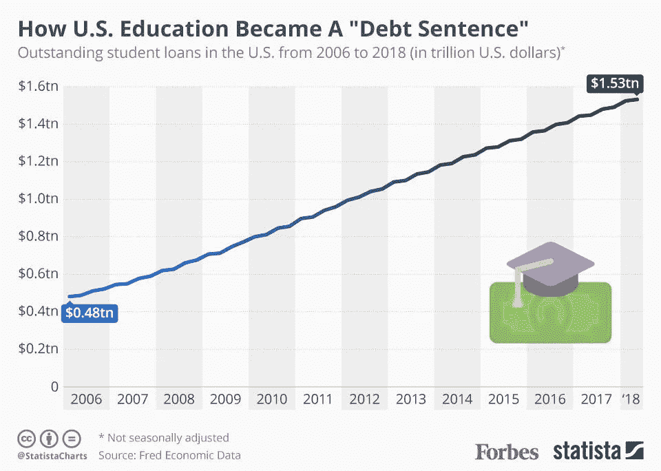
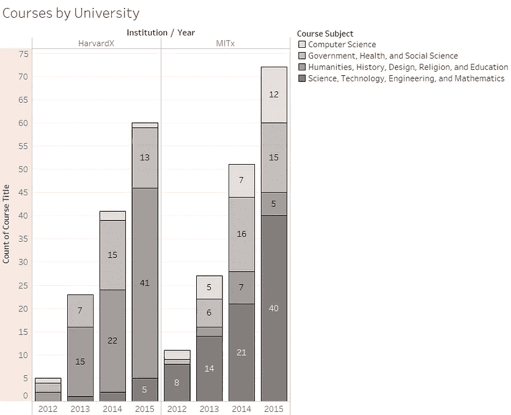
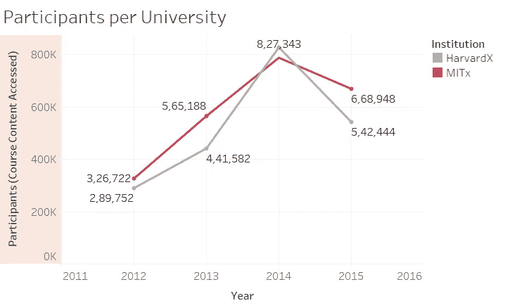
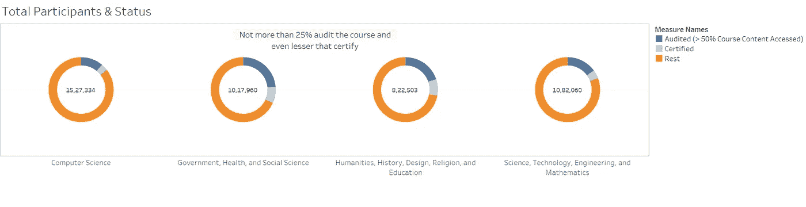
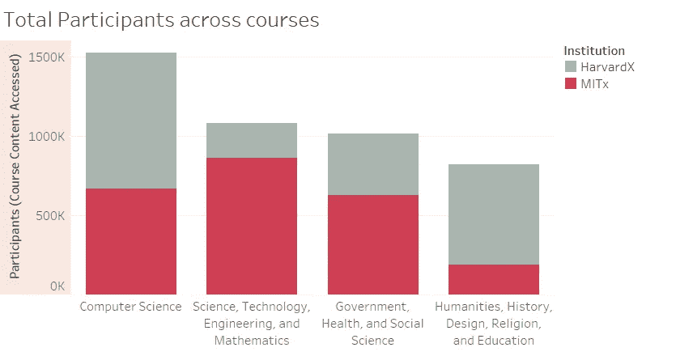
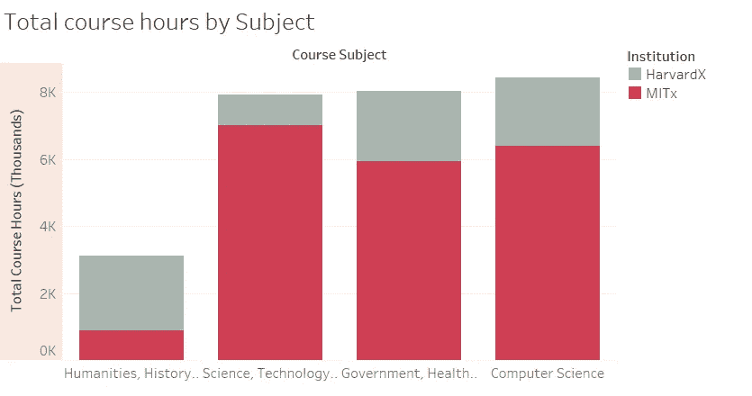
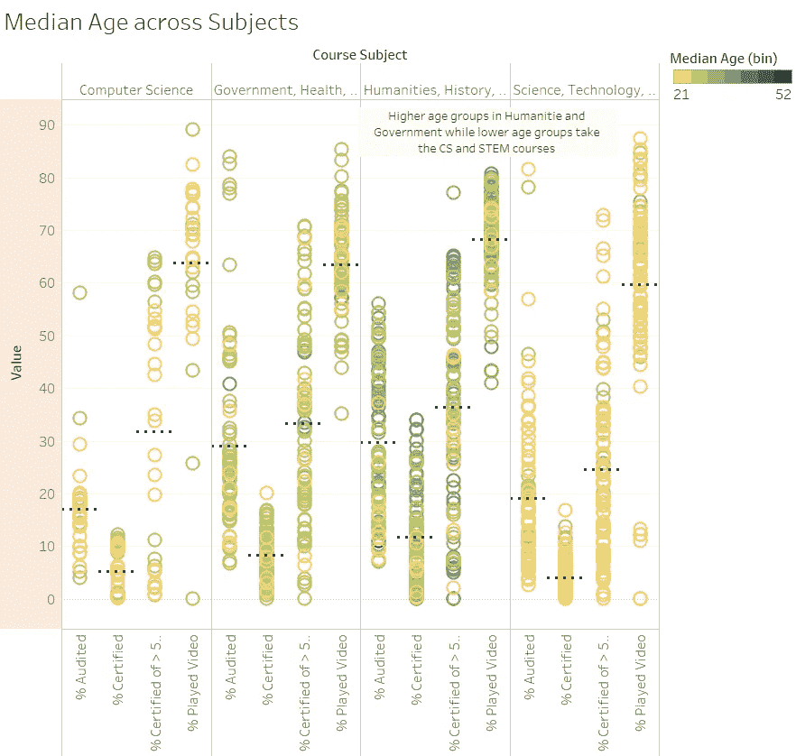
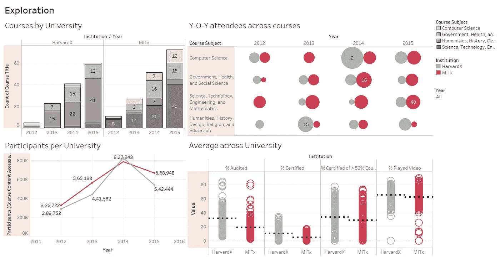
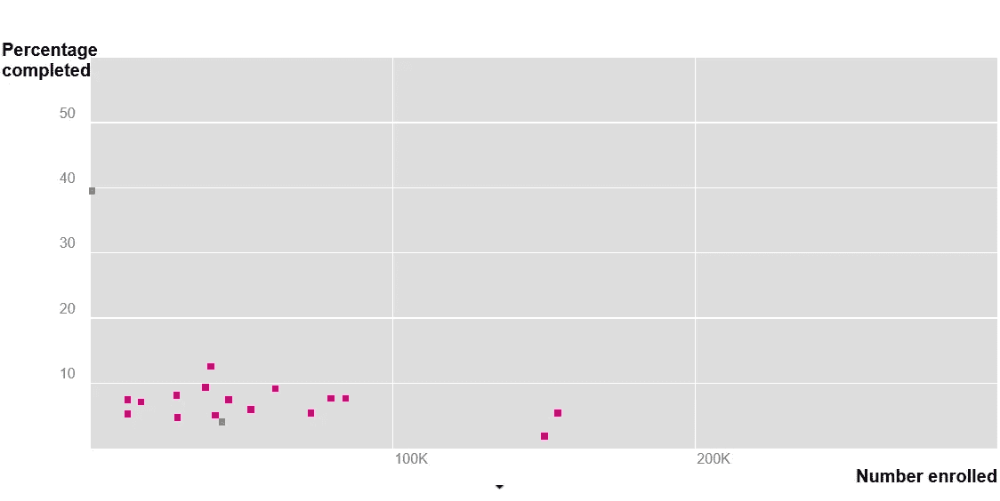

# 在线教育是未来的发展方向吗？

> 原文：<https://towardsdatascience.com/is-online-education-the-way-forward-a91ed4bb204c?source=collection_archive---------19----------------------->

## 由于教育成本不断上升，与传统教学方法相比，世界正朝着 MOOCs 的方向发展。他们能成为合适的替代者吗？(第一部分)

今年早些时候，我偶然看到一篇关于美国教育债务危机的文章，这促使我看一看替代方案，在线教育似乎已经成为试图解决这一问题的一颗新星。但这真的是前进的方向吗？

Infographic Credits: Niall McCarthy

我很难相信它们能成为合适的替代品。那么，这只是一种时尚吗？还是有帮助？让我们来了解一下！

我拿起一个[数据集](https://www.kaggle.com/edx/course-study)，它给出了两个领先机构——麻省理工学院和哈佛大学——提供的 MOOC 数据。(2012–2016)

# 探索:

>被审核的 v/s 认证参与者的百分比是多少？
>性别、年龄统计数据
>可能的挑战和有趣的见解
>MOOC 的参与和认证总数是如何随着时间的推移而增长的？
>MOOC 用户中有百分之多少的人获得证书？

# 一些有趣的见解:

## MOOCs 的发展和随后的学生参与

Number of courses as well students have gradually been rising over the years

毫无疑问，它从一开始就很受欢迎，每年增长近 2 倍。绘制过去四年的“总参与者”图显示，仅去年*的注册人数有所下降，从 160 万下降到 120 万。我将 Harvardx/MITx 课程在第四年的平均参与者/课程和总注册人数中的下降归因于 MOOC [平台](https://www.forbes.com/sites/susanadams/2018/04/16/how-a-millennial-entrepreneur-built-a-learning-platform-with-a-134m-valuation/#4f3aadebf2b9)、选项和更简单的课程形式的更多竞争。Harvardx/MITx 趋势可能不代表整体趋势，因此，这并不意味着在线学习的下降。*

然而，在这四年中，有 240 万独立用户参加了一门或多门 MITx 或 HarvardX 开放式在线课程，245，000 名学员在成功完成一门课程后获得了证书，这使得我们的完成率接近 10%,并且在四年中平均每天有 1，554 名新的独立参与者注册。

我认为，如果来自其他 mooc 的数据附加到这个 Harvardx/MITx 数据集，我们可能会看到 mooc 的受欢迎程度有所增长，而不是下降。

## 向“技术”的转变

Computer Science seems to be leading the pack in terms of student participation

*   计算机科学课程是最大的(例如，在科学、历史、健康和其他学科中)，并且将更多的参与者引导到其他学科领域，而不是他们所接受的领域。
*   我们注意到，2014 年麻省理工学院参与者的下降是因为哈佛大学的两门计算机科学课程变得流行。除此之外，参与率稳步上升，而认证在下半年有所放缓。这可以归功于 2016 年初停止的免费认证的取消。
*   此外，对课程的细分显示，CS 课程最受欢迎，CS 课程在
    视频时间方面最密集，这主要归功于 MITx(著名的编程入门课程！)

## MOOC“课堂”的参与者背景和意图各不相同。

*   一门典型的课程认证 500 名学员，其中 7，900 名学员在注册后可访问部分课程内容，约 1，500 名学员选择探索一半或更多的课程内容。
*   值得注意的人口统计数据包括 29 岁的中位学习者年龄，2 比 1 的男女比例(67%的男性，33%的女性)，以及来自其他国家的学习者的大量参与(71%来自国际，29%来自美国)。

> 整个 viz 可以在[这里](https://public.tableau.com/views/AreMOOCsreallythefutureofeducation/Front?:embed=y&:display_count=yes&publish=yes&:showVizHome=no)找到——很乐意[听到](http://www.suhasmotwani.com)你的反馈！

***如果要考虑完成率..***

Credits: [http://www.katyjordan.com/MOOCproject.html](http://www.katyjordan.com/MOOCproject.html)

HarvardX 和 MITx 最近[报告](http://blog.edx.org/study-moocs-offers-insights-online-learner-engagement-behavior)称，只有 5.5%注册了他们的开放在线课程的人获得了证书。如果从广义上看，这些数字接近 15%,但这似乎是唯一等待解决的挑战。

虽然这一初步探索确实令人兴奋，但我希望在第 2 部分中更深入地挖掘——敬请期待！

接下来是什么？

## 探索:

>了解行为模式(群组 v/s 自定进度)

>我想做什么？与运行各种代码学校的人交谈，了解什么是秘方和前进的道路(所以如果你们中的任何人能够[将](http://www.linkedin.com/in/suhasmotwani)我连接到相关的人，那将是令人敬畏的！)

>发现数据支持的成功案例

如果你对改变[在线教育](http://www.learnpmwith.me)的未来有一点点兴趣和/或想抓住一些(虚拟！)咖啡，[打我一下](http://www.suhasmotwani.com)！

 [## your product guy(@ MotwaniSuhas)| Twitter

### yourproductguy 的最新推文(@MotwaniSuhas)。# just keep experimenting | Ed-tech/CPG | Hmu 如果我能帮忙…

twitter.com](https://twitter.com/MotwaniSuhas)