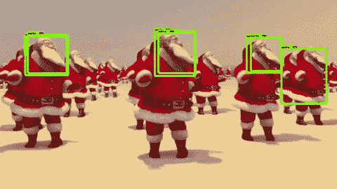
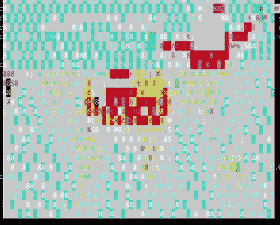
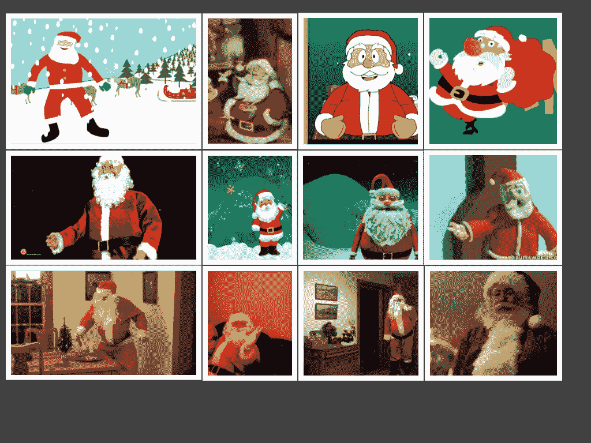
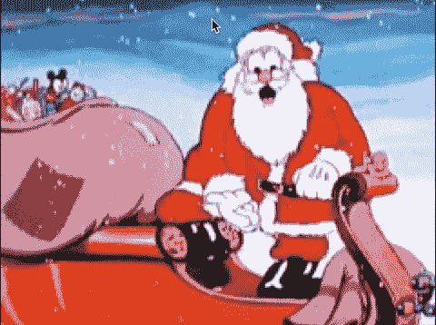
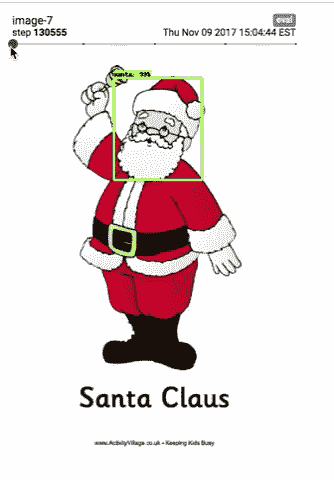
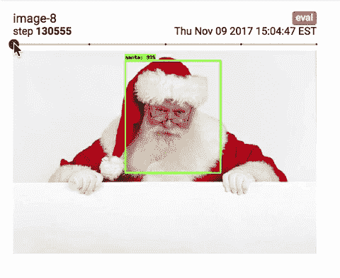
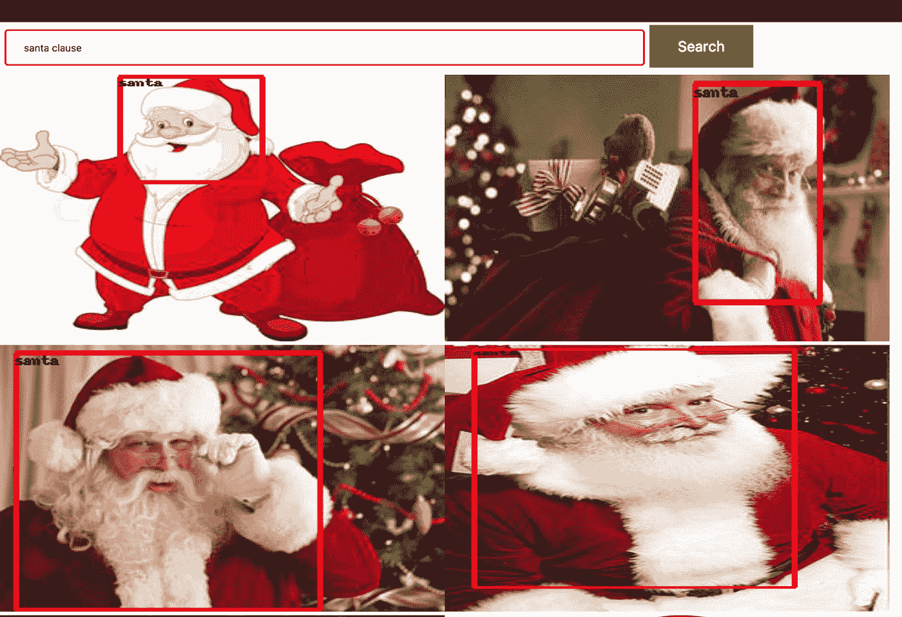
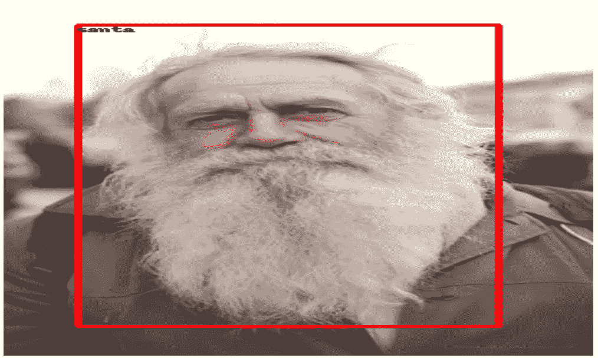

# 圣诞老人是真的吗？

> 原文：<https://towardsdatascience.com/is-santa-claus-real-9b7b9839776c?source=collection_archive---------1----------------------->

我的团队非常重视圣诞节和我们收到的礼物。所以，我们想追踪圣诞老人，知道他什么时候给我们送礼物。我们决定在烟囱里放一个摄像头，找到他。最近我们看到了这个[帖子](https://medium.com/towards-data-science/how-to-train-your-own-object-detector-with-tensorflows-object-detector-api-bec72ecfe1d9)关于如何为你自己的数据集训练 Tensorflow 的对象检测 API，这说服我们把我们的手放在这个很酷的东西上，并试图找到圣诞老人。

代码可在这个 [github repo](https://github.com/turnerlabs/character-finder) 获得。从这段代码生成的模型可以扩展到寻找其他角色，无论是动画还是现实生活中的角色。

这是圣诞老人发现者的行动。🎅🏻



# **收集数据**

和任何机器学习模型一样，最重要的方面是数据。因为我们想找到不同类型的圣诞老人、动画、泥塑、装扮成圣诞老人的人，所以我们的训练数据必须多样化。为了收集数据，我们编写了一个流处理器，它使用 VLC 从任何在线来源传输视频并从中捕获帧。流处理器捕获视频中的帧，而不必等待视频加载，即，如果当前播放的视频在 2 秒标记处，则流处理器将从 4 或 5 秒标记处捕获帧。作为奖励，你可以用 ASCII 码观看视频，这是最酷的观看视频的方式🤓。使用流处理器的指令可在[这里](https://github.com/turnerlabs/stream-processor)获得。



Video of Santa Claus surfing in ASCII

这里是我们收集的不同类型的圣诞老人图像的一个小集合。所有这些图片都是从 YouTube 上收集的。如你所见，这里有不同种类的动画和真人圣诞老人的图像。



Different type of Santas

# **标注数据**

下一步是标记数据，即围绕圣诞老人的脸画一个边框。标记图像的一个常见选择是使用 labelimg 工具，但是我们使用了一个从这篇[文章](https://medium.com/alex-attia-blog/the-simpsons-characters-recognition-and-detection-part-2-c44f9d5abf37)引用的自定义脚本。

要给图像加标签，先点击人物脸部的左上角，然后点击其脸部的右下角。如果图像中没有字符，双击同一点删除图像。该脚本的代码可从[这里](https://github.com/turnerlabs/character-finder/blob/master/detect_labels.py)获得。



# **创建张量流记录文件**

将边界框信息存储在 csv 文件中后，下一步是将 csv 文件和图像转换为 TF 记录文件，这是 tensorflow 的对象检测 API 使用的文件格式。将 csv 文件转换成 TF 记录的脚本可以在[这里](https://github.com/turnerlabs/character-finder/blob/master/object_detection/create_characters_tf_record.py)找到。

还需要一个 protobuf 文本文件，用于将标签名转换为数字 id。对于我们来说，它只是一个类。

```
item {
id: 1
Name: santa
}
```

# **创建配置文件**

为了训练，我们使用 faster_rcnn_inception_resnet 配置文件作为基础。我们将配置文件中的类的数量参数更改为 1，因为我们只有一个类——“Santa”，并将输入路径参数更改为指向我们在上一步中创建的 TFrecord。我们使用了 faster _ rcnn _ inception _ resnet 的预训练检查点。我们使用这个模型是因为模型精度比模型训练速度更重要。还有其他模型提供不同的训练速度和准确性，可以在这里找到。

# **训练**

训练代码在我们的本地机器上运行，以检查一切是否正常，一旦正常，它就被部署到谷歌云平台的 [ML 引擎](https://cloud.google.com/ml-engine/)。该模型被训练了超过 100，000 步。



Animation

该模型在动画和现实生活中表现都很好。



Real Life

# 导出模型

训练完成后，模型被导出，用于在不同的图像上进行测试。为了导出模型，我们选择了从训练作业中获得的最新检查点，并将其导出到冻结的推理图中。将检查点转换为冻结推理图的脚本可以在[这里](https://github.com/turnerlabs/character-finder/blob/master/object_detection/export_inference_graph.py)找到。

我们还为我们的模型构建了一个网页，它从 google 搜索中提取图像，并试图在返回的图像中找到圣诞老人。该网页上的结果被过滤以显示置信度超过 60%的边界框。这是网页的快照。



We Found Santa Claus!!

# 后续步骤

当训练作业运行时，我们注意到 TotalLoss 很快下降到 1 以下，这意味着模型在寻找圣诞老人方面做得很好。


TotalLoss

我们知道我们的模型不会完美。虽然模型在相当准确地找到圣诞老人方面做得很好，但我们也有假阳性。在这种情况下，假阳性是没有圣诞老人的图像，但模型预测有。



False Positive

在使预测更加准确和减少假阳性的数量方面，还有很大的改进空间。

接下来的步骤是了解更多关于配置文件中不同参数的信息，并更好地了解它们如何影响模型的定型及其预测。

# 结论

我们希望您现在可以为自己的数据集训练对象检测器。在这一点上，我要感谢希瓦吉·什罗夫和 T2·乔希·库尔茨，他们在项目建设中发挥了同等的作用。

感谢你的阅读，希望你喜欢这篇文章。如果您有任何问题或建议，请随时通过 LinkedIn 联系我们，地址是 [Varun Vohra](https://www.linkedin.com/in/varunvohra94/) 和 [Shivangi Shroff](https://www.linkedin.com/in/shivangishroff/) 。我们非常乐意收到任何反馈。