# 国家的财富或教育支出与其学生在 PISA 中的表现有关系吗？

> 原文：<https://towardsdatascience.com/is-there-a-relationship-between-countries-wealth-or-spending-on-schooling-and-its-students-a9feb669be8c?source=collection_archive---------2----------------------->


Photo by [Vasily Koloda](https://unsplash.com/@napr0tiv?utm_source=medium&utm_medium=referral) on [Unsplash](https://unsplash.com?utm_source=medium&utm_medium=referral)

# 介绍

公立学校在古代就已为人所知，许多社会发展了多年，最终在 19 世纪形成了强制性的公共机构。世界各地的社区都很重视教育年轻一代，为他们提供更好的未来，因为教育不仅对相关的个人，而且对整个社会都有很多好处。国家之间的竞争也不是一个新概念，教育只是进行跨国比较时要考虑的众多因素之一。尽管如此，现在人们似乎不仅在本地，而且在国际上比以往任何时候都更激烈地竞争工作，教育是获得优势的最重要的手段之一。想知道什么能帮助学生为进一步的学习、职业和生活做好准备，可能有许多因素应该被考虑进去。我们可能会问的一个问题是，我们能说出国家财富或教育支出与学生表现之间的关系吗？我们试着用一些开放的数据集，Python 语言，回归分析来回答这个问题。对于那些喜欢 Jupyter 笔记本形式的人，这里有一个到我的 github 的链接，里面有一个完整的项目库。

# PISA 是什么？

你首先需要问自己的是如何衡量表现，也就是说如何判断一个国家总体上比另一个国家做得更好？经济合作与发展组织(OECD)投入了大量的资源来设计一个合适的比较方法。从 2000 年开始，他们每三年进行一次复杂的研究。国际学生评估项目(PISA)评估 15 岁学生在义务教育结束时获得的全面参与现代社会所必需的关键知识和技能的程度。评估的重点是学校的核心科目科学、阅读和数学。评估不仅仅是确定学生是否能够复制知识；它还考察了学生如何从他们所学的知识中进行推断，并在学校内外的陌生环境中应用这些知识。这种方法反映了这样一个事实，即现代经济奖励个人的不是他们所知道的，而是他们能用他们所知道的做什么。PISA 的调查结果使世界各地的政策制定者能够将本国学生的知识和技能与其他国家的学生进行比较，根据其他教育系统实现的可衡量目标制定政策目标，并学习其他地方的政策和做法。

最新的 2015 年报告中最有趣的发现是:

*   新加坡在科学领域的表现优于所有其他参与国家/经济体。日本、爱沙尼亚、芬兰和加拿大是经合组织中表现最好的四个国家。
*   平均而言，经合组织国家近 20%的学生没有达到阅读能力的基线水平。自 2009 年以来，这一比例一直保持稳定[1，第 3-4 页]。

# 提取 PISA 数据集

现在，我们对性能度量有了更好的理解，我们可以开始提取 PISA 数据集了。该分析基于熊猫的数据框架。 [Pandas](https://pandas.pydata.org/pandas-docs/stable/) 是一个 Python 包，提供快速灵活的方法来进行实际的、真实的数据分析。

让我们首先为整个项目导入必要的库。

接下来，我们将读入包含 2000 年至 2015 年测试结果的 [csv 文件](https://github.com/mklajnerok/PISA/tree/master/pisa_basic/data_files)。我们看到有 3 个独立的文件，分别是科学、阅读和数学成绩，这是它们在 [OECD 数据库](https://data.oecd.org/pisa/reading-performance-pisa.htm#indicator-chart)中的显示方式。为了一次了解所有文件的含义，我们将把它们作为一个字典来读取，字典中有考试名称的关键字和包含结果的数据帧的值。

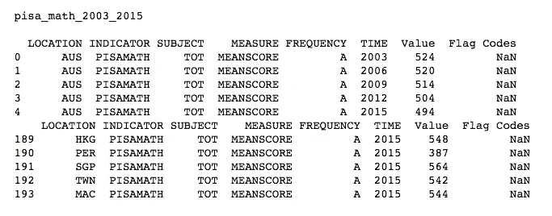

我们看到原始数据帧由许多不相关的要素组成，因此让我们通过删除一些列并重命名现有列来执行必要的清理。

最新的 PISA 结果是在 2015 年收集的，因此我们可以使用过滤器来提取这些行。下一步我们将摆脱字典形式，因为我们大大减少了数据量。我们现在可以将所有的数据框合并成一个，这样我们就可以在一行中得到每个国家的数学、阅读和科学的结果。

```
all_pisa_2015.head()
```

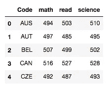

当查看此数据框时，每个国家的名称并不总是显而易见的，因此为了提高清晰度，让我们在表中包括国家的名称。要构建从国家字母 3 代码到国家名称的转换图，你可以使用 [pycountry 库](https://pypi.python.org/pypi/pycountry)。该字典需要一些调整，以便与分析中稍后使用的其他数据源兼容。事实证明，不同数据库中国家的官方名称差异很大。顺便问一下，你听说过[捷克](https://www.forbes.com/sites/francistapon/2017/05/22/czechia-has-won-the-czech-republic-name-debate/#a49f1d17d664)吗？

```
#add column with country name
name_code_dict = create_name_code_dict()
code_name_dict = reverse_dict(name_code_dict)
add_country_name(all_pisa_2015, code_name_dict)all_pisa_2015.head()
```

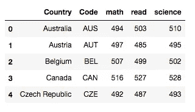

很高兴看到不同测试对象之间的所有数据分布，但对于基本分析来说，计算每个国家的平均结果似乎是正确的。包含每个考试部分之间的关系可能会导致过度绘制和不必要地扩展回归分析。

# 提取 GDP 数据集

现在我们有了 PISA 结果，我们可以进入下一步，提取 GDP 数据。多年来，我们接受 GDP 作为衡量一个国家整体经济表现的诚实标准，因此我们将使用人均 GDP 指标来回答一个问题——在评估中，较富裕的国家表现更好吗？

首先，让我们为有测试结果的国家生成一个代码列表。我们将在下一个函数中使用它作为参数。

然后，由于世界银行 API 和 Python [wbdata](http://wbdata.readthedocs.io/en/latest/) wrapper，我们可以轻松地将所需数据直接加载到 Python shell 中，知道我们对哪些指标感兴趣。要了解这个有用工具的更多信息，请访问这个[博客帖子](https://blogs.worldbank.org/opendata/accessing-world-bank-data-apis-python-r-ruby-stata)。

使用一个国家的国内生产总值指标，你会发现它有很多版本，你必须决定哪一个适合你的目的。我决定以人均 GDP[购买力平价](https://en.wikipedia.org/wiki/Purchasing_power_parity)为基础，因为它能更好地比较国家间的财富。如果你不熟悉名义 GDP 和购买力平价 GDP 的区别，我建议你阅读这篇文章。

同样，我们的数据框架需要一些争论。让我们首先过滤与 PISA 结果相同年份的所有行，即 2015 年。如你所见，GDP 数据是一个多指数数据框架。我们可以将索引重置为简单的整数，并使用列标签来执行各种操作。最后，我们将添加一个带有国家代码的列，以便稍后进行合并。

# PISA 平均成绩与人均 GDP 的回归分析

回归分析应该能够产生一个方程，该方程将使用一个或多个自变量(人均国内生产总值)来预测因变量(平均 PISA 结果)。仅仅使用一个独立变量似乎不足以解释因变量的所有可变性，但是我们仍然可以试图理解它本身如何影响结果。运行回归时，您试图发现自变量上的系数是否真的与 0 不同(因此自变量对因变量有真正的影响)，或者与 0 的任何明显差异是否只是随机的。零(默认)假设总是每个独立变量绝对没有影响(系数为 0)，你正在寻找拒绝这一理论的理由[6]。我们将使用普通最小二乘法( [OLS](https://en.wikipedia.org/wiki/Ordinary_least_squares) )建立 PISA 结果和人均 GDP 之间的关系模型。

在执行回归之前，我们需要快速查看一下我们清理过的数据，以便预先检查关系。让我们使用 alpha3 代码值合并两个数据帧，然后查看散点图。

我们可以看到，图中的点不一定形成一条直线，这提醒我们应该采用 GDP 数据的对数来进行线性回归分析。这有助于使我们的分布不那么偏斜。

现在我们的数据形成了类似直线的东西，但仍然有一个点似乎是线性模型的异常值——它是卢森堡。这个国家最近很多年都被认为是世界上第二富裕的国家。卢森堡是一个人均收入相对较高的地方，根据 Business Insider 的报告，这是因为有大量的人在这个小国工作，而生活在周围的法国、德国和比利时(甚至可能是整个人口的四分之一，这些人没有包括在 GDP 计算中[7])。将卢森堡排除在回归之外似乎是一个好主意，这就是为什么我们将在两个版本中执行分析以比较结果。

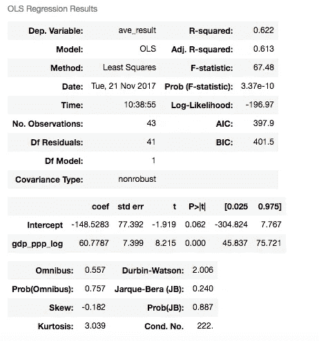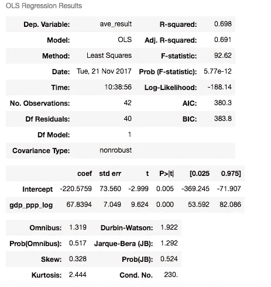

在第一个版本中，R 平方值表明人均国内生产总值和 PISA 平均测试结果之间有 0.62 的相关性。当我们将卢森堡排除在数据集之外时，由线性模型解释的变量的百分比增加到 0.70，这仍然是适中的。

解释我们的模型系数，我们可以说，人均 GDP 增加 1%后，PISA 的平均结果应该上升 0.68 点。回归输出的其他重要特征是:

*   标准误差，是对系数的标准偏差的估计，它在不同情况下的变化量，
*   p 值，有助于确定结果的显著性。通过将变量的 t 统计量(系数除以其标准误差)与学生的 t 分布中的值进行比较，可以得到该值
*   置信区间，它告诉我们大多数变量分布在哪里

我们的标准误差在+/- 7 点左右波动。我们有一个非常小的 p 值，这表明反对零假设的有力证据。这意味着我们可以拒绝零假设，即人均 GDP 对 PISA 结果没有任何影响。换句话说，假设您的模型被正确地指定，您可以 100%正确地说变量正在产生一些影响。考察置信区间，我们看到可以 95%确信“真实”人均 GDP 系数在 0.53 到 0.82 点之间。

让我们看看使用回归系数拟合到数据中的曲线。

总结第一部分，我们可以非常肯定地说，国家的人均 GDP 对 PISA 测试的平均结果有一定的影响。不幸的是，即使相关率高于 70%，也无法证实这种关系是因果关系，这意味着仍然很难说，国家的财富是学生在评估中表现优异的原因，还是相反。

# 提取每个学生的政府教育费用

分析的前一部分表明，有理由相信较富裕国家的学生在评估中得分较高，这意味着他们为全面参与社会做了更好的准备。影响结果的因素可能有很多，但让我们更深入地看看另一个因素——政府的教育支出。我们可以问一个问题，更高的公共开支对考试成绩有正面影响吗？

让我们假设，在每个学生 15 岁参加 PISA 测试之前，他或她可能已经花了 12 年时间在各种形式和机构中学习。从幼儿园开始，我们可以根据另一个假设计算每个学生的费用，即每个学生在学前教育机构度过 3 年，在小学度过 6 年，然后在初中度过 3 年。这样，我们将在评估之前计算每个学生的教育总成本。让我们首先使用两个指标来计算每个教育层次上每个学生的年支出:

*   来自联合国教科文组织数据库的政府教育支出(按购买力平价计算)
*   官方年龄人口(男女)来自世界银行 API

```
gov_edu_expenses.head()
```

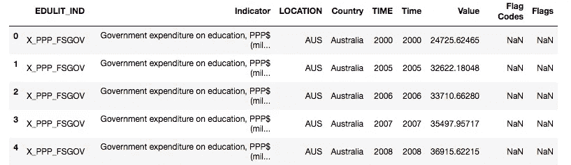

让我们打扫卫生吧。首先，我们需要只过滤我们感兴趣的 3 个教育水平的费用行。然后我们将删除几个不相关的列。

```
basic_edu_exp.head()
```

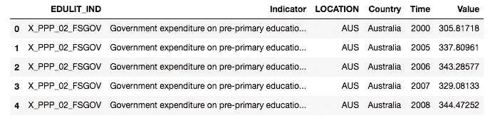

为了获得带有每个教育水平标签的列，我们将旋转表格。我们得到了一个附带多索引的数据框，但是我们可以在下一步中轻松地重置索引。最后，我们将重新安排栏目顺序，并添加带有国家代码的新栏目，以提高可读性。

```
basic_edu_exp.head()
```

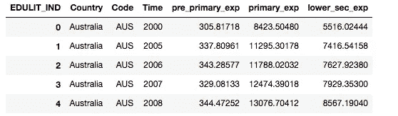

一旦我们有了全球的教育支出，让我们来看看某一年各个层次的学生人数。我们将使用人口这一官方年龄指标，因为它告诉我们在给定的一年里有多少孩子适合每一级的教育。这只是入学学生真实人数的近似值，但由于缺乏其他数据，它仍然具有很大的信息量。

```
basic_student_pop.head()
```

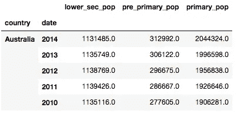

同样，我们需要执行一些小的清理，比如重置多索引或统一标签。

```
basic_student_pop.head()
```

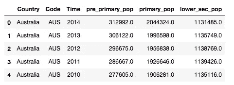

为了最终获得每个学生的政府开支，我们需要转换“时间”列数据类型，以便进一步合并。我们将使用“正确”的方法合并框架，因为我们希望只保留 2003 年至 2014 年的数据。

```
edu_data_joined.head()
```

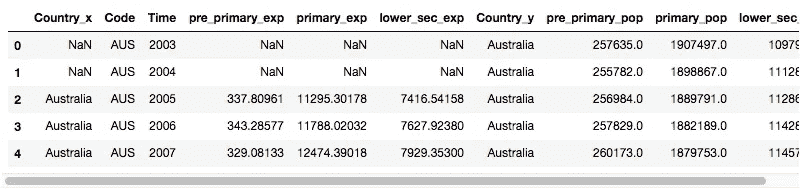

之后，我们做除法，清理我们的数据框架。

```
edu_data_per_student.head()
```

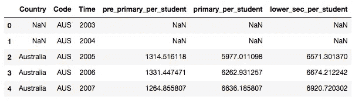

正如我们看到的，NaN 值开始出现和使用。isnull()方法，我们可以检查在整个数据框中是否有更多的。有几种方法可以解决这些不足，但是在这种情况下，使用 Python 内置的函数 [interpolate](https://pandas.pydata.org/pandas-docs/stable/generated/pandas.DataFrame.interpolate.html#pandas.DataFrame.interpolate) 似乎是合理的。为了不填补空白，当我们没有足够的信息时，让我们做一个假设。对于数据集中的每个国家，首先检查我们感兴趣的给定时间段内的 NaN 数量，例如 2003-2005 年的学前教育。如果出现任何缺失，检查给定教育水平的整个列。如果 NaN 的比率低于 50%，我们将对整个列进行插值，在其他情况下，我们将删除该国家。

由于我们的假设，我们不得不从原始数据集中去掉 10 个国家。

# PISA 平均成绩与政府人均教育支出的回归分析

我们的最后一步是回归分析，以检查两个变量之间是否存在相关关系。让我们先合并数据帧并检查散点图。

正如我们看到的，我们将需要我们以前的技巧，使数据更加“线性回归友好”。让我们首先记录费用值，并绘制另一个图表。

这一次，除了卢森堡之外，似乎还有一个例外——那就是巴西。对于一个教育支出如此巨大的国家来说，它的 PISA 成绩相对较低。这可能是教育系统效率低下的一个迹象，但我们不要过分解读。

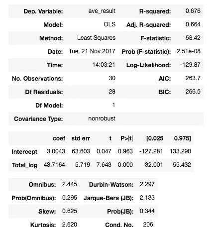

数据中的所有调整再次导致相关值增加——从 0.31 增加到 0.68 点。解释我们的模型系数，我们可以说，在每个学生的政府支出增加 1%后，PISA 的平均成绩应该上升 0.68 分。

我们看到，在排除了一些国家之后，我们的数据非常符合计算结果。关于这个图还有另一个具体的事情，似乎我们有一组国家集中在这个点周围，有 500 个 PISA 点和 11.5 英镑的支出，而其他支出较少的国家形成一条线。这就提出了一个问题，有没有可能在达到每个学生的费用的某个点后，我们看不到评估分数有太大的差异？

# 摘要

总结所有的结论，我们可以说，PISA 成绩和国家人均国内生产总值之间存在适度的正相关关系。这不仅仅是一个潜在的 matmat mater，因为分析真实的教育支出给了我们同样的结论。即使较富裕的国家和那些在教育上分配更多资源的国家得分较高，仍然不可能说明这种关系的方向。这可能是国家的财富是高分的原因，也可能是这种情况，一个有效的教育系统产生了聪明的人，他们追求增加他们的国家收入。文中分析的样本也不够大，不足以对这种关系得出强有力的结论。教育有效性本身可以用不同的方式来衡量。

这个分析留给我们的问题多于答案，这也是我决定写第二部分的原因之一。在 PISA 的表现中，可能有许多因素值得分析。我们可以尝试一些使用聚类方法的无监督学习来识别其他关系，这可能看起来不那么明显。我们可以检查它们中许多的相关强度，并只选择最相关的。然后，我们可以尝试拟合不同次数的多项式，并对它们进行交叉验证，以检查测试模型的预测能力。我希望你喜欢我的工作，我期待着尽快描述结果！

Github 项目库:[https://github.com/mklajnerok/PISA/tree/master/pisa_basic](https://github.com/mklajnerok/PISA/tree/master/pisa_basic)

Jupyter 笔记本来源:[https://github . com/mklajnerok/PISA/blob/master/PISA _ basic/notebooks/PISA _ project _ part 1 . ipynb](https://github.com/mklajnerok/PISA/blob/master/pisa_basic/notebooks/pisa_project_part1.ipynb)

# 来源:

*   [1]http://www.oecd.org/pisa/pisa-2015-results-in-focus.pdf
*   [2][https://data . OECD . org/pisa/Reading-performance-PISA . htm # indicator-chart](https://data.oecd.org/pisa/reading-performance-pisa.htm#indicator-chart)OECD(2017)，阅读表现(PISA)(指标)。doi: 10.1787/79913c69-en(于 2017 年 9 月 11 日获取)
*   [3][https://data . OECD . org/pisa/Mathematics-performance-PISA . htm # indicator-chart](https://data.oecd.org/pisa/mathematics-performance-pisa.htm#indicator-chart)OECD(2017)，数学成绩(PISA)(指标)。doi: 10.1787/04711c74-en(于 2017 年 9 月 11 日获取)
*   [4][https://data . OECD . org/PISA/Science-performance-PISA . htm # indicator-chart](https://data.oecd.org/pisa/science-performance-pisa.htm#indicator-chart)OECD(2017)，Science performance (PISA)(指标)。doi: 10.1787/91952204-en(于 2017 年 9 月 11 日获取)
*   [5][https://data help desk . world bank . org/knowledge base/articles/889392-API-documentation](https://datahelpdesk.worldbank.org/knowledgebase/articles/889392-api-documentation)
*   [6][http://DSS . Princeton . edu/online _ help/analysis/interpreting _ regression . htm](http://dss.princeton.edu/online_help/analysis/interpreting_regression.htm)
*   [7][http://www . business insider . com/the-23-世界上最富有的国家-2015-7？IR=T](http://www.businessinsider.com/the-23-richest-countries-in-the-world-2015-7?IR=T)
*   [http://data.uis.unesco.org/](http://data.uis.unesco.org/)