# 这是玉米卷吗？自定义视觉的机器学习实验

> 原文：<https://towardsdatascience.com/is-this-a-taco-a-machine-learning-experiment-with-custom-vision-d33291a36b9c?source=collection_archive---------9----------------------->

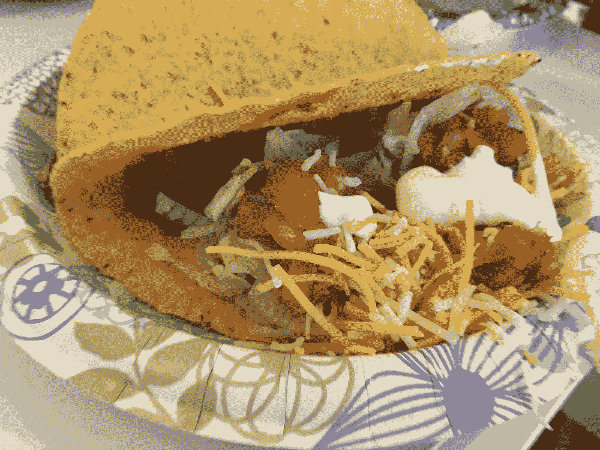

Can machine see this as a taco?

想知道如何获得机器学习(ML)吗？那么，现在你可以通过云端提供的机器学习服务，称为功能即服务(FaaS)。

在我研究机器学习是怎么一回事的时候，我有机会了解了[自定义视觉](http://customvision.ai/)。

Custom Vision 是一种基于云的机器学习服务，允许用户提供自定义图像集来训练算法识别图像的某些特征。

# FaaS 可以让曼梯·里更接近我们

过去，我玩过一些应用程序，这些应用程序对我上传的图片提供反馈，比如面部表情的情绪。

虽然这些应用程序提供了某些商业价值，但是现成的解决方案可能无法满足特定的需求。

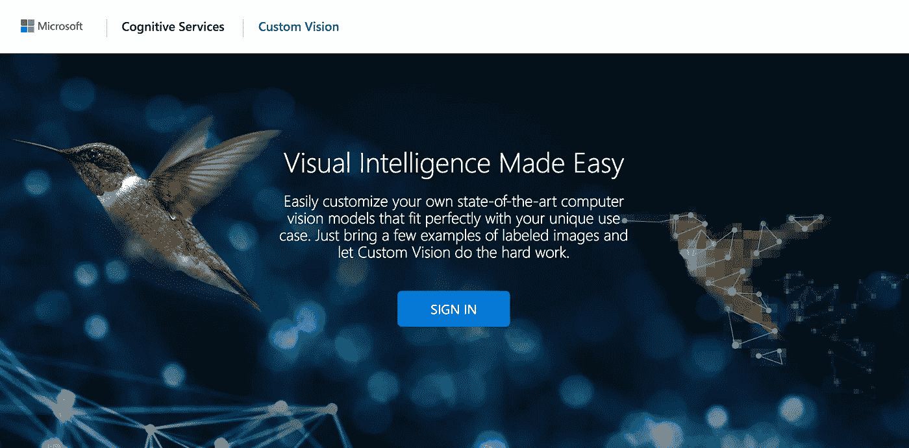

Custom Vision by Microsoft

所以当我了解到我可以控制识别什么的自定义视觉时，我很兴奋。

我绝不是数据科学方面的专家，我更愿意走一条简单的路去体验机器学习的世界。

使用自定义视觉，我只需上传训练集并相应地标记它们，我就可以根据我的测试图像集快速测试算法。

没有比和他们一起玩更简单的了。

# 训练集

当我们在办公室吃墨西哥玉米卷作为午餐时，我决定对手工制作的玉米卷的照片进行自定义视觉测试。

测试是这样的:

1.上传并标记六张按照我们人类标准“正确”的玉米卷照片，并将它们标记为“玉米卷”和“食物”
2。上传了五张办公室周围不是玉米卷的食物的照片，并将它们标记为“食物”。运行培训流程
4。通过上传玉米饼和其他食物的照片来测试算法

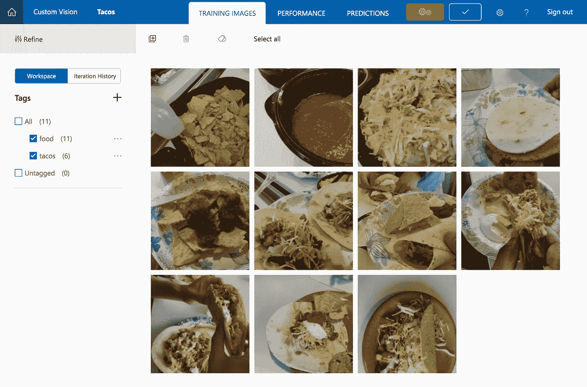

Uploaded images with associated tags

正如你所看到的，训练数据集是最小的，他们是快速和肮脏的，无论我能在 15 分钟内抓住什么。

它与数据科学相去甚远，但请不要离开我，我们将在下面测试该算法并评估其性能。

# 测试集

我们先从一个我们知道肯定不是玉米卷的图像开始。

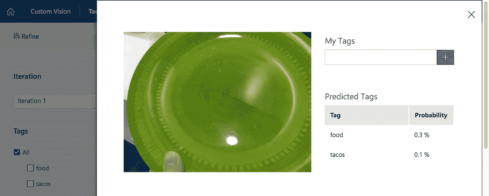

Neither food nor taco

好吧，我们继续，先吃带壳的玉米卷怎么样？

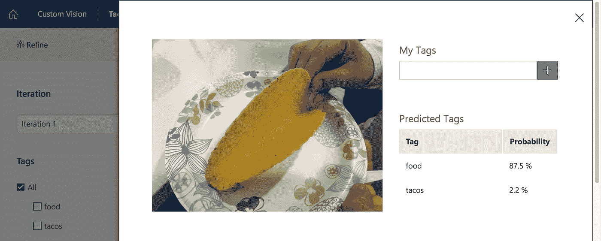

A food but not a taco

有趣的是，在 *87.5%* 的预测中，它确实将玉米卷壳识别为一种食物，但它并不完全符合玉米卷的标准。

让我们继续下一个，我们在贝壳里放一些牛肉怎么样？

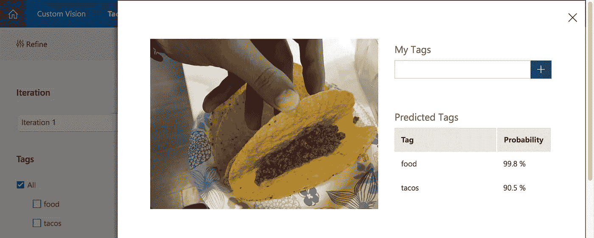

A food and a taco

现在，我们有相当高的信心，这是一个玉米卷在 90.5% 预测。

这很有趣，因为训练集并没有必要把牛肉放在它出现的最前面。

记住这一点，让我们跳到完成的玉米卷。

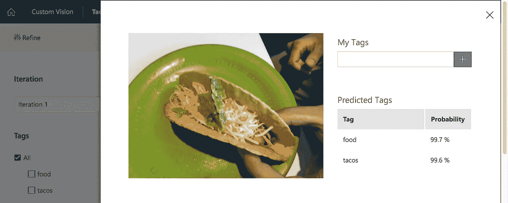

A food and a taco

这张玉米卷的照片明显类似于一个完整的玉米卷，算法也同样拾取了它。

在图片中，牛肉甚至不可见，所以它可能是在看形状而不是色调。

让我们用去结构化的玉米卷来测试，从某种意义上来说，配料在每个玉米卷的外面。

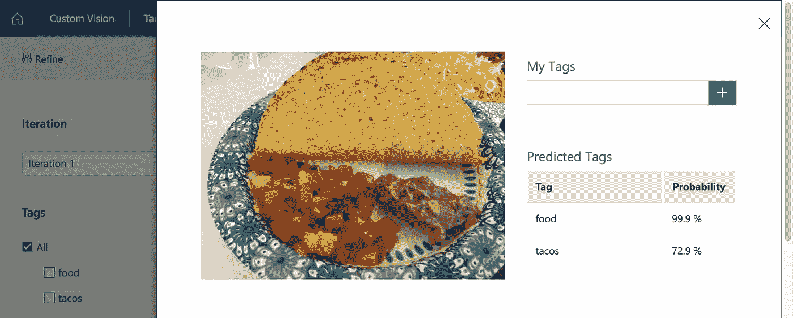

Pretty close to be a taco

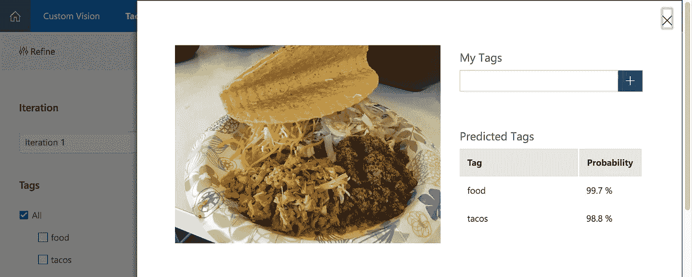

Definitely a taco

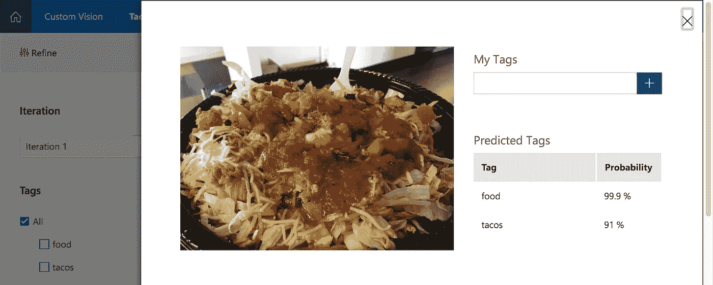

Definitely a taco

正如你在上面的结果中所看到的，看起来仅仅是玉米卷的形状可能也不是决定性因素。

同样，一组位置相近的配料是否能达到墨西哥玉米卷的质量也是有争议的。

我们扔一些看起来像墨西哥玉米卷的临时演员怎么样

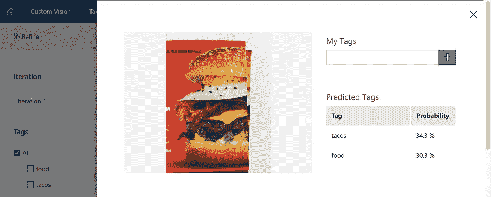

Some similarity to a taco

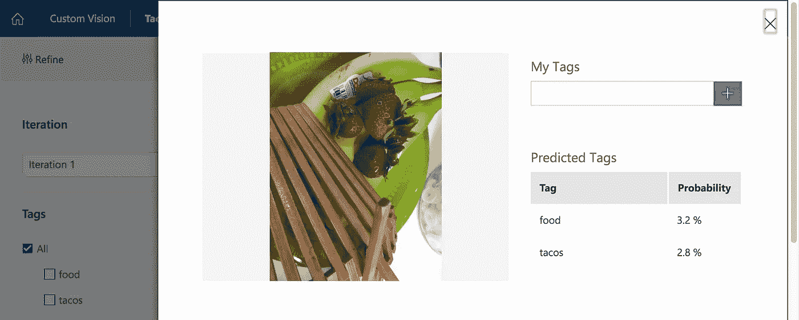

Definitely not a taco

上面的测试可能会给我们一个提示，质地可能在决定玉米卷中发挥更大的作用。

# 我们对预测有多少把握？

说一张照片是 *99%* taco 是一回事，但是我们对这个预测本身有多少信心呢？

毕竟，我只提供了 11 张照片来判断什么是玉米卷。

在“性能”选项卡中，Custom Vision 确实为您提供了精确度和召回率的测量方法。

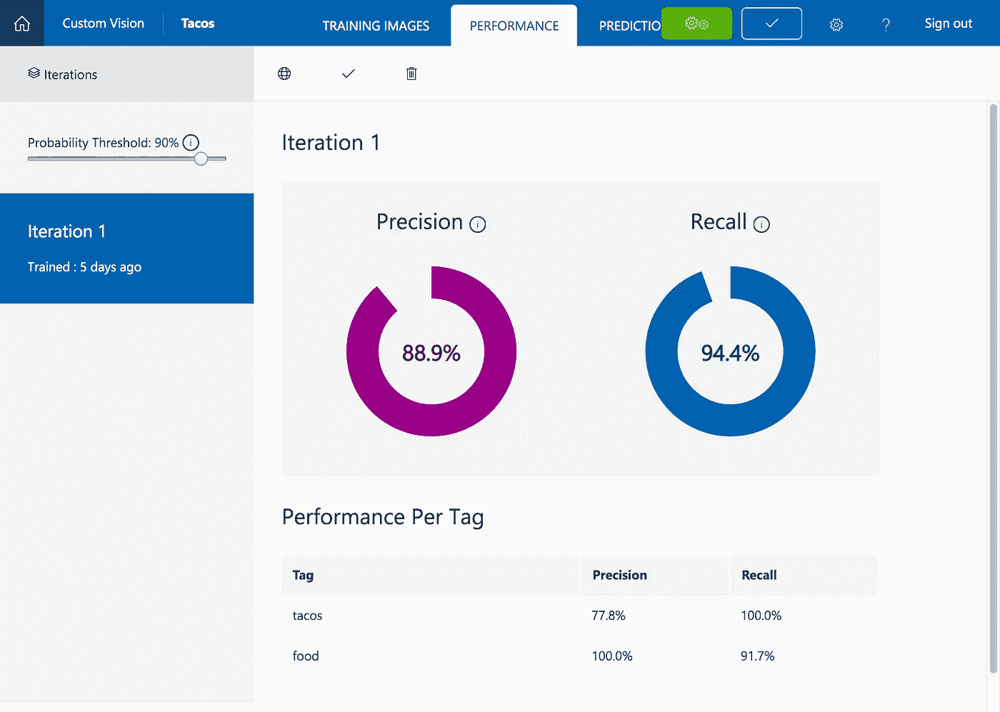

一般来说，更高的精确度和召回率将导致对该服务更准确的预测。

在这种情况下，这种精确度对于墨西哥卷饼来说是可靠的，但并不总是可信的。

# 我们如何利用测试之外的服务？

Custom Vision 和类似的工具提供了 API 端点，您可以在这里发布一个图像，以使用用户输入训练数据集或获得给定图像的预测。

这就是为什么它们被称为功能即服务，它只是你的应用程序可以利用的云中的一个功能，而不是扩展现有的后端功能。

如果你想了解更多关于[定制视觉](https://customvision.ai/)的信息，去他们的网站开始测试吧。

# 裁决

像 Custom Vision 这样的基于云的服务使机器学习更接近我们这些不是数据科学家的人。

虽然仍然需要数据科学家的知识和批判性思维技能来判断算法的准确性，但这可能是一种与应用程序集成的绝佳方式。

*我是 Fresh Consulting 的前端开发主管。我写有影响力的技术领导(***)和最新的技术实验。**

**跟我上* [*中*](https://medium.com/@elishaterada) *和* [*推特*](https://twitter.com/elishaterada)*