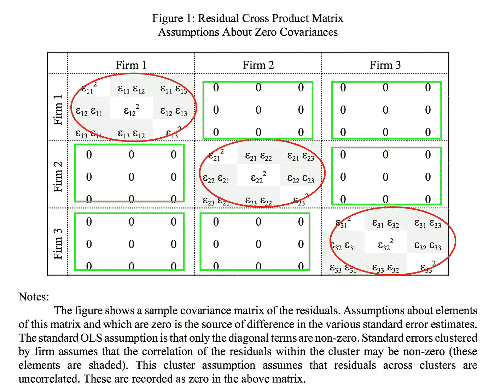
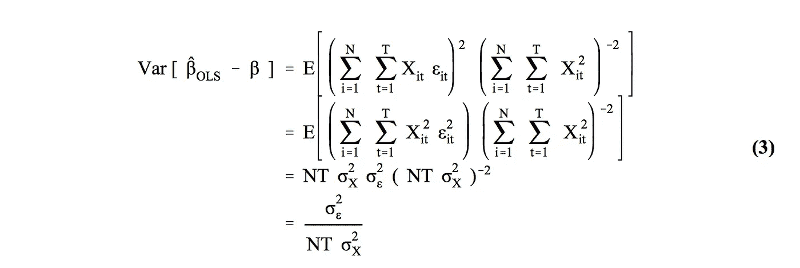
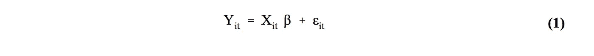
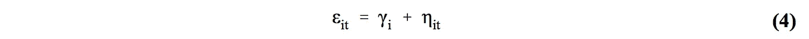
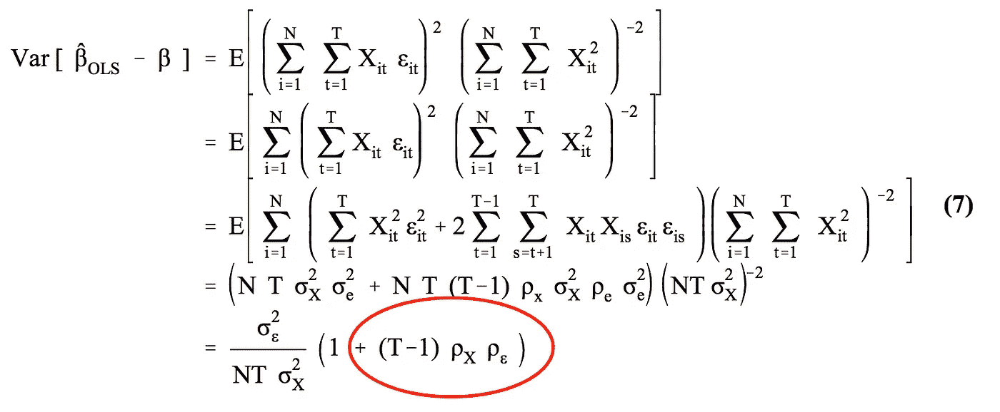
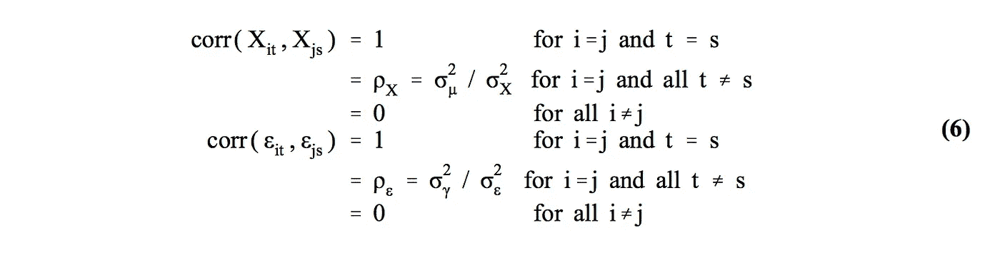
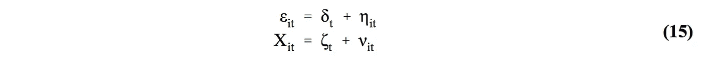
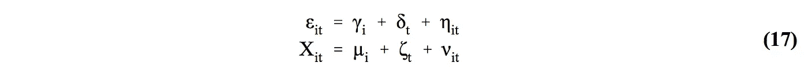

# 你的标准误差稳健吗？

> 原文：<https://towardsdatascience.com/is-your-standard-error-robust-ae9376c0a882?source=collection_archive---------6----------------------->

选择正确规格的实用指南

# 行动纲要

*   **问题:**Stata、R 和 Python 报告的默认标准误差(SE)只有在非常有限的情况下才是正确的。具体来说，这些程序假设你的回归误差是独立同分布的。实际上，情况并非如此——这会导致假设检验中出现严重的第一类和第二类错误。
*   **治疗 1:** 如果你在管理 OLS，你必须在两个维度上对系统工程师进行聚类:个人年度。
*   **治疗 2:** 如果你在运行 FE(固定效果)，你必须只在一个维度上聚集 SE:个体。
*   **代码:** [这里的](https://www.kellogg.northwestern.edu/faculty/petersen/htm/papers/se/se_programming.htm)是实现 SE 集群的 Stata、R、SAS 代码的链接。

如果你对这个问题感到好奇，请继续读下去。不然下次再见:)

# 为一天做计划

在这篇文章中，我将把一篇关于稳健标准误差的 69 页论文合并成一张备忘单。[这篇由米切尔·彼得森教授于 2009 年发表的论文](https://www.jstor.org/stable/40056916)，截至今日已累计被引用超过 7879 次。它仍然是选择正确鲁棒标准误差的圣经。

# 问题是

## 惯例

在任何 Stats 101 课程中，你的教授可能已经教过你在 Stata 或 R 中键入“reg Y X ”:

Where i denote an individual; t denote timestamp t

你继续用报告的点估计值和标准误差来检验你的假设。但是 99%的情况下，这是错误的。

## 陷阱

为了让 OLS 给出无偏且一致的估计，我们需要误差项ε独立且同分布:

独立意味着不允许序列或交叉相关:

*   **序列相关:**对于同一个体，不同时间段的残差是相关的；
*   **交叉相关:**不同的个体残差在周期内和/或跨周期相关。

相同意味着所有残差具有相同的方差(也称为同方差)。

## 将问题可视化

让我们用方差-协方差矩阵来形象化独立同分布假设。

*   **无序列相关性:**红色气泡中的所有非对角线条目需要为 0；
*   **无互相关:**所有对角线上的条目需要相同——绿色矩形中的所有条目需要为 0；
*   **同方差:**对角线上的条目需要是相同的常数。

## 如果使用默认 se 而没有 I.I.D .错误，会有什么问题？

推导 SE 表达式:

默认标准误差是(3)中的最后一行。但是为了让我们从第一行到最后一行，我们需要做额外的假设:

*   我们需要独立性假设将我们从(3)中的第一行移到第二行。从视觉上看，绿色矩形中的所有条目和红色气泡中的所有非对角线条目都为 0。
*   我们需要同分布假设将我们从第二行移到第三行。从视觉上看，所有对角线上的条目完全相同。

> 默认 SE 在非常有限的情况下是对的！

## 犯错的代价

我们不知道报告的 SE 是否会高估或低估真实 SE。因此，我们最终可能会得到:

*   当实际上没有影响时，统计上的显著结果。结果，软件和产品团队可能不得不在一些对公司底线没有任何影响的原型上花费时间。
*   统计上无关紧要的结果，实际上却有重大影响。这对你来说可能是个好机会。错失良机。可惜:(

**现实中，假阳性的可能性更大。**不乏新手机器学习学生宣称他们已经找到了击败市场的一些模式/信号。然而，一旦部署，他们的模型表现灾难性。部分原因是他们从未考虑过残差的序列或互相关。

> 当这种情况发生时，默认的标准误差可能比真实的标准误差小 11 倍，从而导致信号的统计显著性被严重高估。

## 稳健的标准误差来拯救！

一个正确指定的稳健标准误差将消除偏差，或者至少改善偏差。有了稳健的标准误差，您就可以安全地进入推理阶段。

> 存在许多稳健的标准误差。选择错误的补救措施可能会加剧问题！

# 我应该使用哪种稳健的标准误差？

这取决于方差-协方差结构。问问你自己，你的残差是互相关、序列相关还是两者都有？回想一下:

*   **交叉相关:**在同一时间段内，不同的个体残差可能相关；
*   **序列相关:**对于同一个人，不同时间段的残差可能是相关的。

## 情况 1:误差项具有单独的特定成分

假设这是世界的真实状态:

假设个体之间是独立的，正确的标准误差是:

与(3)相比，我们有额外的术语，用红色圈出。所报告的 OLS 标准误差是超过还是低估了真实的标准误差，取决于相关系数的符号，其随后被时间段 t 的数量放大

## 实用指南在哪里？

基于更多的理论和模拟结果，Petersen 表明:

**你不应该用:**

*   **Fama-MacBeth 标准误差:**它是为了处理序列相关性而设计的，而不是单个公司之间的交叉相关性。
*   **纽威-韦斯特标准误差:**它是为了说明单一时间序列的残差中未知形式的序列相关性而设计的。

**你应该用:**

*   **聚类标准误差:**具体来说，你应该对公司的标准误差进行聚类。代码请参考博客文章的结尾。

## 情况 2:误差项具有特定于时间的分量

假设这是世界的真实状态:

正确的标准误差本质上和(7)一样，一旦你把 N 和 t 互换。

**你应该用:**

*   标准错误:因为这就是它的构造目的。有关 Stata 代码，请参阅博客文章的结尾。

## 案例 3:误差项具有固定和时间效应

假设这是世界的真实状态:

**你应该用:**

*   **聚类标准误差:**聚类应在两个维度上进行——按年度确定。请注意，这不是真正的标准误差，它只是产生更少偏差的标准误差。当一个维度上只有少数几个簇时，这种偏差就更加明显。

# 编码

Petersen 详细的 Stata、R 和 SAS 指令和测试数据可以在[这里](https://www.kellogg.northwestern.edu/faculty/petersen/htm/papers/se/se_programming.htm)找到。为了我自己的记录，我在这里编译 Stata 代码列表:

## 案例 1:一维聚类

> 回归因变量自变量稳健聚类(聚类变量)

## 案例二:法玛-麦克白

> tsset firm_identifier 时间标识符
> 
> 因变量自变量，byfm(by 变量)

## 案例 3:二维聚类

> cluster2 因变量自变量，f cluster(cluster _ variable _ one)t cluster(cluster _ variable _ two)

## 案例四:固定效应+聚类

> xtreg 因变量独立变量，健壮群集(cluster_variable_one)

# 享受你新发现的强健世界吧！

Photo Credit: Good News Philippines

直到下次:)